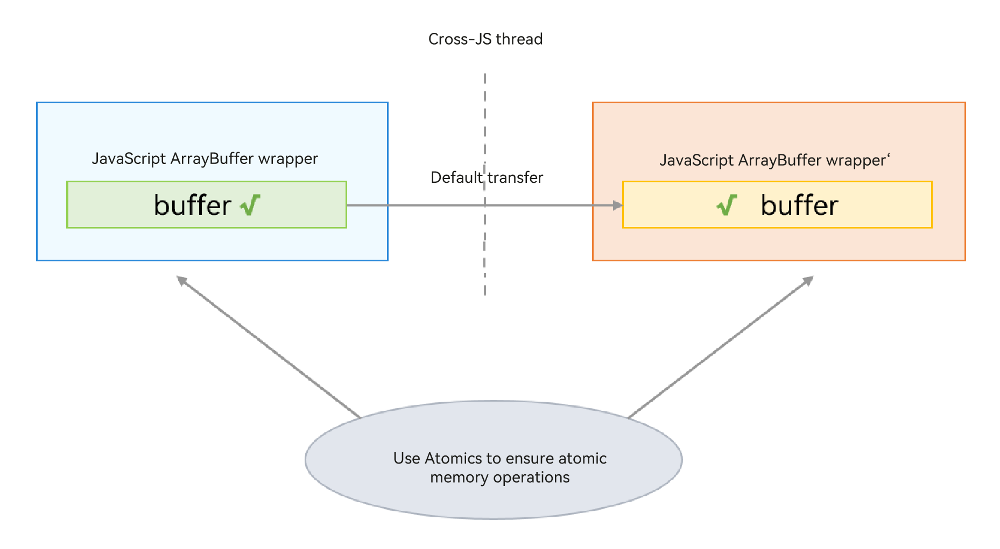

# SharedArrayBuffer Object

SharedArrayBuffer contains a native memory block, which can be shared across concurrent instances. However, the Atomics class must be used for access and modification to prevent data competition. SharedArrayBuffer can be used for state sharing or data sharing between multiple concurrent instances. The following figure shows the communication process.




## Samples

The following is a simple example of using TaskPool to transfer an Int32Array object:

```ts
import { taskpool } from '@kit.ArkTS';

@Concurrent
function transferAtomics(arg1: Int32Array) {
  console.info("wait begin::");
  // Use Atomics to perform operations.
  let res = Atomics.wait(arg1, 0, 0, 3000);
  return res;
}

// Define an object that can be shared.
let sab: SharedArrayBuffer = new SharedArrayBuffer(20);
let int32 = new Int32Array(sab);
let task: taskpool.Task = new taskpool.Task(transferAtomics, int32);
taskpool.execute(task).then((res) => {
  console.info("this res is: " + res);
});
setTimeout(() => {
  Atomics.notify(int32, 0, 1);
}, 1000);
```
