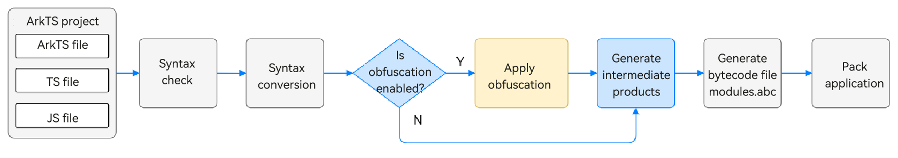
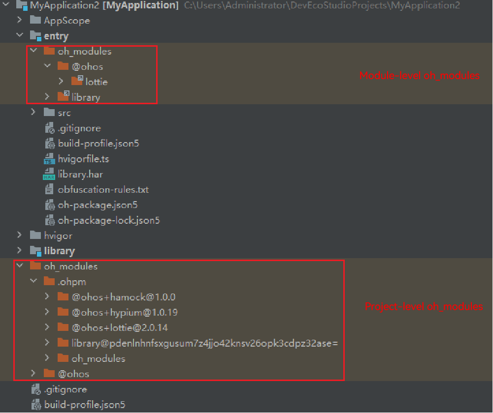

# Obfuscation Principles and Capabilities of ArkGuard

## Glossary

| Term| Definition|
| --- | --- |
| [HAP](../quick-start/hap-package.md) | The Harmony Ability Package (HAP) is the basic unit for installing and running applications. It is a module package generated by packaging code, resources, third-party libraries, and configuration files.|
| [HAR](../quick-start/har-package.md) | A Harmony Archive (HAR) is a static shared package that enables multiple modules or projects to share code such as ArkUI components and resources. It is created by using a static library.|
| [HSP](../quick-start/in-app-hsp.md) | A Harmony Shared Package (HSP) is a dynamic shared package for sharing code and resources. It is created by using a shared library.|
| Local HAR| HAR module in source code form.|
| Remote HAR| HAR generated after the build.|
| Local HSP| HSP module in source code form.|
| Remote HSP| HSP generated after the build.|
| Third-party library| Libraries developed by third parties and published to the OpenHarmony Third-Party Library Repository.|
| Name obfuscation| Changing class names, method names, variable names, and other identifiers to meaningless names.|

## Scope of Obfuscation Capabilities

### Supported Languages
ArkGuard supports ArkTS, TS, and JS, but not C/C++, JSON, or resource files.

### Obfuscation Capabilities
ArkGuard provides basic name obfuscation, code compression, and comment removal, but does not support advanced features like control obfuscation or data obfuscation.

It primarily offers name renaming and trustlist configuration for retention. 

### Limitations of Obfuscation Capabilities

**Language Limitations**

Code obfuscation tools vary in type analysis mechanisms, obfuscation strategies, and execution efficiency based on the target language. For example, ProGuard targets strongly-typed languages like Java, where each type has a clear definition source. This feature makes the type relationship tracing and processing in the obfuscation process more accurate, greatly reducing the need for retention rules.

In contrast, ArkGuard targets JS, TS, and ArkTS. JS supports dynamic modification of objects and functions at runtime, but obfuscation is a static process in the compilation phase. This difference may cause a failure in parsing obfuscated named at runtime, resulting in runtime exceptions. TS and ArkTS use a structural type system, where different named types with the same structure are considered as equivalent types. Therefore, it is difficult to trace the exact source of types. As such, when using ArkGuard, you need to configure trustlists for more syntax scenarios. Moreover, ArkGuard uses a global property retention mechanism that retains all properties with the same name according to the trustlist. It does not support precise retention settings for specific types.

To illustrate, consider this example:

Assume that ArkGuard allows the configuration of a trustlist for specific types. If class A1 is configured in a trustlist with its property prop1, but prop1 in class A2 is not in the trustlist, passing an instance of A2 (a2) to the **test** function would cause issues when accessing the prop1 property.

```typescript
// Before obfuscation:
class A1 {
  prop1: string = '';
}

class A2 {
  prop1: string = '';
}

function test(input: A1) {
  console.log(input.prop1);
}

let a2 = new A2();
a2.prop1 = 'prop a2';
test(a2);
```

```typescript
// After obfuscation:
class A1 {
  prop1: string = '';
}

class A2 {
  a: string = '';
}

function test(input: A1) {
  console.log(input.prop1);
}

let a2 = new A2();
a2.a = 'prop a2';
test(a2);
```

You should be aware of these differences and use unique names to achieve better obfuscation results.

**Limited security assurance**

Like other obfuscation tools, ArkGuard increases reverse engineering difficulty but cannot prevent it entirely.

You should not rely solely on ArkGuard for security. For higher security requirements, consider [application encryption](https://developer.huawei.com/consumer/en/doc/harmonyos-guides-V5/code-protect-V5) and third-party hardening measures.

## Obfuscation Mechanism and Process

The following figure shows a simplified compilation process.



You can enable the obfuscation feature in the **build-profile.json5** file of the module so that the source code can be automatically obfuscated during compilation and packaging.

During obfuscation, the tool reads the obfuscation switch. If the switch is enabled, it parses the obfuscation configuration file, merges rules according to the [merging strategies](#obfuscation-rule merging-strategies), applies obfuscation to intermediate files (generated after syntax conversion), and writes the obfuscated files to the **build** directory. You can verify the obfuscation effect by examining the output in the **build** directory.

Before using obfuscation, you are advised to learn about the capabilities of [obfuscation options](source-obfuscation.md#obfuscation-options) and [retention options](source-obfuscation.md#retention-options), and select the appropriate capabilities for your needs.


## Obfuscation Options

### Summary of Existing Obfuscation Options

| Function| Option|
| --- | --- |
| Disabling obfuscation| [`-disable-obfuscation`](#-disable-obfuscation) |
| Obfuscating property names| [`-enable-property-obfuscation`](#-enable-property-obfuscation) |
| Obfuscating string literal property names| [`-enable-string-property-obfuscation`](#-enable-string-property-obfuscation) |
| Obfuscating top-level scope names| [`-enable-toplevel-obfuscation`](#-enable-toplevel-obfuscation) |
| Obfuscating imported/exported names| [`-enable-export-obfuscation`](#-enable-export-obfuscation) |
| Obfuscating file names| [`-enable-filename-obfuscation`](#-enable-filename-obfuscation) |
| Compressing code| [`-compact`](#-compact) |
| Removing declaration file comments| [`-remove-comments`](#-remove-comments) |
| Removing console logs| [`-remove-log`](#-remove-log) |
| Printing name caches| [`-print-namecache`](#-print-namecache) |
| Reusing name caches| [`-apply-namecache`](#-apply-namecache) |
| Printing unobfuscated names| [`-print-kept-names`](#-print-kept-names) |
| Reducing the default language trustlist| [`-extra-options strip-language-default`](#-extra-options-strip-language-default) |
| Reducing the default system API trustlist| [`-extra-options strip-system-api-args`](#-extra-options-strip-system-api-args) |
| Retaining declaration file parameters| [`-keep-parameter-names`](#-keep-parameter-names) |
| Merging dependent module options| [`-enable-lib-obfuscation-options`](#-enable-lib-obfuscation-options) |
| Marking trustlists in source code by comments| [`-use-keep-in-source`](#-use-keep-in-source) |

### -disable-obfuscation

Disables code obfuscation.

If this option is configured, the default obfuscation capabilities (local variables and parameter names) and all configured obfuscation and retention options become invalid.

### -enable-property-obfuscation

Enables property name obfuscation. The effect is as follows:

  ```
  // Before obfuscation:
  class TestA {
    static prop1: number = 0;
  }
  TestA.prop1;
  ```

  ```
  // After obfuscation:
  class TestA {
    static i: number = 0;
  }
  TestA.i;
  ```

If this option is configured, all property names except the following are obfuscated:

* Property names of classes and objects that are directly imported or exported by using **import** or **export**. For example, the property name **data** in the following example is not obfuscated.

    ```
    export class MyClass {
       data: string;
    }
    ```

* Property names in ArkUI components. For example, **message** and **data** in the following example are not obfuscated.

    ```
    @Component struct MyExample {
        @State message: string = "hello";
        data: number[] = [];
        // ...
    }
    ```

* Property names specified in [retention options](#-keep-property-name).
* Property names in the SDK API list. The SDK API list is a set of names automatically extracted from the SDK during build. Its cache file is **systemApiCache.json**, which is stored in **build/default/cache/{...}/release/obfuscation** in the project directory.
* String literal property names. For example, **"name"** and **"age"** in the following example are not obfuscated.

    ```
    let person = {"name": "abc"};
    person["age"] = 22;
    ```

### -enable-string-property-obfuscation

Enables obfuscation of string literal property names. It is effective only if property name obfuscation is enabled.

To obfuscate string literal property names, you must use this option together with **-enable-property-obfuscation**. Example:

  ```
  -enable-property-obfuscation
  -enable-string-property-obfuscation
  ```

According to the preceding configuration, the obfuscation effect of **"name"** and **"age"** is as follows:

  ```
  // Before obfuscation:
  let person = {"name": "abc"};
  person["age"] = 22;
  ```

  ```
  // After obfuscation:
  let person = {"a": "abc"};
  person["b"] = 22;
  ```


**NOTE**

**1.** If a string literal property name in the code contains special characters, for example, **let obj = {"\n": 123, "": 4, " ": 5}**, you are advised not to use the **-enable-string-property-obfuscation** option because these names may fail to be retained using [retention options](#-keep-property-name). Special characters refer to characters other than lowercase letters a-z, uppercase letters A-Z, digits 0-9, and underscores (_).

**2.** The property trustlist of the SDK API list does not contain string constants used in the declaration file. For example, the string **'ohos.want.action.home'** in the example is not included in the property trustlist. 
```
// Part of the SDK API file @ohos.app.ability.wantConstant:
export enum Params {
  ACTION_HOME = 'ohos.want.action.home'
}
// Source code example:
let params = obj['ohos.want.action.home'];
```

When the **-enable-string-property-obfuscation** option is used, use the [-keep-property-name](#-keep-property-name) option if you want to retain the property names in the SDK API string constants in the source code, for example, **obj['ohos.want.action.home']**.

### -enable-toplevel-obfuscation

Enables obfuscation of top-level scope names. The effect is as follows:

  ```
  // Before obfuscation:
  let count = 0;
  ```

  ```
  // After obfuscation:
  let s = 0;
  ```

If this option is configured, the names of all top-level scopes except the following are obfuscated:

* Names that are directly imported or exported by using **import** or **export**.
* Top-level scope names that are not declared in the current file.
* Top-level scope names specified by [retention options](#-keep-global-name).
* Top-level scope names in the SDK API list.

### -enable-export-obfuscation

Enables obfuscation for imported/exported names. The effect is as follows:

  ```
  // Before obfuscation:
  namespace ns {
    export type customT = string;
  }
  ```

  ```
  // After obfuscation:
  namespace ns {
    export type h = string;
  }
  ```

If this option is configured, names imported/exported in non-top-level scopes will be obfuscated. To obfuscate names imported/exported in the top-level scope, use this option with **-enable-toplevel-obfuscation**. To obfuscate imported or exported property names, use this option **-enable-property-obfuscation**. Note the following special scenarios:

* Names exported from remote HARs (packages whose real paths are in **oh_modules**) and their property names are not obfuscated.
* Names and property names specified by [retention options](#retention-options) are not obfuscated.
* Names in the SDK API list are not obfuscated.

### -enable-filename-obfuscation

Enables obfuscation of file/folder names. The effect is as follows:

  ```
  // Before obfuscation:
  import * as m from '../test1/test2';
  import { foo } from '../test1/test2';
  const module = import('../test1/test2');
  ```


  ```
  // After obfuscation:
  import * as m from '../a/b';
  import { foo } from '../a/b';
  const module = import('../a/b');
  ```

If this option is configured, all file/folder names except the following are obfuscated:

* File or folder names specified by the **main** and **types** fields in the **oh-package.json5** file.
* File or folder names specified by the **srcEntry** field in the **module.json5** file of the module.
* File or folder names specified by [-keep-file-name](#-keep-file-name).
* File or folder names in non-ECMAScript module reference mode (for example, const module = require('./module')).
* File or folder names in non-path reference mode. For example, **json5** in the example **import module from 'json5'** is not obfuscated.

>**NOTE**
>
>For files that the system needs to load files during application running, manually configure them into a trustlist using the [-keep-file-name](#-keep-file-name) option. Otherwise, the application may fail to run.
>
>The names of the compilation entry file, ability component file, and Worker multithreaded file cannot be obfuscated and have been automatically added to the trustlist in DevEco Studio 5.0.3.500. No manual configuration is required. For other files that cannot be obfuscated, you need to manually configure their names in the trustlist.

### -compact

Removes unnecessary spaces and all line feeds.

If this option is configured, all code is compressed to one line. The effect is as follows:

  ```
  // Before obfuscation:
  class TestA {
    static prop1: number = 0;
  }
  TestA.prop1;
  ```

  ```
  // After obfuscation:
  class TestA { static prop1: number = 0; } TestA.prop1;
  ```

>**NOTE**
>
>The stack information built in release mode contains the line number of code, but not the column number. Therefore, when the **compact** option is used, the source code cannot be located based on the line number in the stack information.


### -remove-comments

Removes JsDoc comments from the declaration file generated after compilation. The effect is as follows:

Before obfuscation:
  ```
  /**
   * @todo
   */
  declare let count: number;
  ```

After obfuscation:
  ```
  declare let count: number;
  ```

You can configure [-keep-comments](#-keep-comments) to retain the JsDoc comments in the declaration file.

>**NOTE**
>
>By default, all comments in the source code file generated after the compilation are removed and cannot be retained. 

### -remove-log

Removes calls to console.* statements, provided the return value is not used. The effect is as follows:

  ```
  // Before obfuscation:
  if (flag) {
    console.log("hello");
  }
  ```

  ```
  // After obfuscation:
  if (flag) {
  }
  ```

If this option is configured, the console.* statements in the following scenarios are removed:

1. Calls at the top layer of a file.
2. Calls within a code block. 
   Example:
   ```
   function foo() {
    console.log('in block');
   }
   ```
3. Calls with a module or namespace. 
   Example:
   ```
   namespace ns {
    console.log('in ns');
   }
   ```
4. Calls within a **switch** statement.

### -print-namecache

Saves the name cache to the specified file path. The name cache contains the mappings of names before and after obfuscation. The **filepath** parameter is mandatory. It supports relative and absolute paths. For a relative path, the start point is the current directory of the obfuscation configuration file. The file name extension in **filepath** must be .json.

Example:
```
-print-namecache
./customCache/nameCache.json
```

>**NOTE**
>
>A new **namecache.json** file is generated each time the module if fully built. Therefore, save a copy of the file each time you publish a new version.

### -apply-namecache

Reuses a name cache file in the specified file path. The **filepath** parameter is mandatory. It supports relative and absolute paths. For a relative path, the start point is the current directory of the obfuscation configuration file. The file name extension in **filepath** must be .json.
This option should be used in incremental build scenarios. After this option is enabled, the names will be obfuscated according to the cache mappings. If there is no corresponding name, new random names are used.

Example:
```
-apply-namecache
./customCache/nameCache.json
```

By default, DevEco Studio saves cache files in a temporary cache directory and automatically applies the cache files during incremental build. 
Default cache directory: **build/default/cache/{...}/release/obfuscation**

### -print-kept-names

Prints the unobfuscated list and full trustlist to the specified file path. The **filepath** parameter is optional. It supports relative paths, with the start point being the current directory of the obfuscation configuration file. The file name extension in **filepath** must be .json.

If the **filepath** parameter is not specified, the unobfuscated list (**keptNames.json**) and full trustlist (**whitelist.json**) are output to the cache directory **build/default/cache/{...}/release/obfuscation** by default.

If the **filepath** parameter is specified, the unobfuscated list is also exported to the path specified by this parameter.

The full trustlist collected during a full build is classified into the following types:

(1) 'sdk': system APIs.

(2) 'lang': keywords in the language.

(3) 'conf': trustlist in the user-defined retention options.

(4) 'struct': properties in ArkUI structs.

(5) 'exported': names and properties exported.

(6) 'strProp': string properties.

(7) 'enum': enum members.

The 'sdk' trustlist is exported to the **systemApiCache.json** file in the **build/default/cache/{...}/release/obfuscation/** directory, and other trustlists are exported to the **whitelist.json** file.

The **keptNames.json** file contains the names that are not obfuscated and the reasons why they are not obfuscated. There are seven reasons: The name is the same as that in the SDK trustlist, language trustlist, user-defined trustlist, struct trustlist, exported name trustlist, or string property trustlist (when string literal property name obfuscation is disabled), or enum trustlist.

**NOTE**

**1.** During HAR module compilation with property name obfuscation enabled, enum member names are collected into the 'enum' trustlist. 
Example:
```
enum Test {
  member1,
  member2
}
```
The 'enum' trustlist includes names such as ['member1', 'member2']. This requirement stems from the fact that, in earlier HAR module versions, the compilation process produced JS files. In these JS files, enums are represented as immediately invoked functions, with enum members expressed as string properties and constants. To maintain proper functionality during property name obfuscation, these enum member names must be added to the trustlist. This practice continues to be applied when compiling the latest bytecode HAR modules.

**2.** During HAP/HSP/bytecode HAR module compilation with property name obfuscation enabled, variable names in initialization expressions of enum members are collected into the 'enum' trustlist. 
Example:
```
let outdoor = 1;
enum Test {
  member1,
  member2 = outdoor + member1 + 2
}
```
In the case of HAP/HSP module compilation, the content of the 'enum' trustlist is ['outdoor', 'member1']. In the case of bytecode HAR module compilation, the content is ['outdoor', 'member1', 'member2'].

### -extra-options strip-language-default

By default, the default language trustlist contains the names of APIs related to DOM, WebWorker, and ScriptHost in the TS system interfaces, as well as the names of Web APIs. If property names in the source code match these names, they will be retained.

To obfuscate these parts of the code, configure the **-extra-options strip-language-default** option.

You can determine the specific reduction range of APIs retained by default as follows:

Enable the **-print-kept-names** option and compare the differences in the **lang** field of the **whitelist.json** file when the **-extra-options strip-language-default** option is enabled and disabled. The difference represents the specific reduction range of the default language trustlist.

### -extra-options strip-system-api-args

By default, the system API trustlist contains local variable names in system APIs and is effective for local variables in your source code by default. If property names in the source code match local variables in system APIs or if local variables in the source code match the system API trustlist, these property names and local variables will be retained.

To obfuscate these parts of the code, configure the **-extra-options strip-system-api-args** option.

The specific content of the system API trustlist can be viewed in the **systemApiCache.json** file through the **ReservedLocalNames**, **ReservedPropertyNames**, and **ReservedGlobalNames** fields. This file, located in the directory **build/default/cache/{...}/release/obfuscation**, records the interface and property names in the SDK, and source code with matching names will not be obfuscated.

You can determine the specific reduction range of the system API trustlist as follows:

Compare the differences in the **ReservedLocalNames** and **ReservedPropertyNames** fields of the **systemApiCache.json** file when the **-extra-options strip-system-api-args** option is enabled and disabled. The difference represents the specific reduction range of the system API trustlist. However, the content of the **ReservedGlobalNames** field will not change.

**How to use -extra-options**

To enable trustlist optimization, add the **-extra-options** prefix directly before the option in the obfuscation configuration file, with no additional content in between. You can enable either one option or both options, like shown in the following examples:

One option enabled:

```
-extra-options
strip-language-default

-extra-options strip-language-default
```

Both options enabled:

```
-extra-options strip-language-default, strip-system-api-args

-extra-options strip-language-default strip-system-api-args

-extra-options strip-language-default
-extra-options strip-system-api-args
```

### -keep-parameter-names
Retains parameter names in declaration files for exported interfaces. The effect is as follows:
- For functions and class member methods, if the function or method name is not confused, their parameter names are retained.
- For class constructors, if the class name is not obfuscated, their parameter names in the constructors are retained.

**NOTE**

**1.** Parameter names that are not in the preceding scenarios (such as anonymous functions) will still be obfuscated.

**2.** Parameter names in source code files will be obfuscated regardless of this option.

### -enable-lib-obfuscation-options  
Merges obfuscation options of dependent modules into the obfuscation configuration of the current module. 

Obfuscation configuration includes [obfuscation options](#obfuscation-options) and [retention options](#retention-options). 
- By default, the effective obfuscation configuration is the merged result of the current module's obfuscation configuration and the dependent modules' retention options. 
- When this option is configured, the effective obfuscation configuration is the merged result of the current module's obfuscation configuration and the dependent modules' obfuscation configuration.

For details about the merging logic, see [Obfuscation Rule Merging Strategies](#obfuscation-rule-merging-strategies).

### -use-keep-in-source

Marks trustlists in .ts or .ets source code using the following two comment annotations (declaration files are not supported):

// @KeepSymbol: This annotation is used to mark names that should be retained. It is usually placed on the line above the relevant code to ensure that the name is not obfuscated when the code is compiled.

// @KeepAsConsumer: This annotation is used to mark names that should be retained. It is usually placed on the line above the relevant code to ensure that the name is not obfuscated when the code is compiled. In HAR/HSP modules, names marked with @KeepAsConsumer are also listed in the **obfuscation.txt** file. In HAP modules, @KeepAsConsumer works exactly like @KeepSymbol.

 

The examples below use // @KeepSymbol, but // @KeepAsConsumer can be used in the same way for the same purposes.

#### Classes

You can mark the following elements in a class:

- Class declarations
- Constructors
- Fields and methods

**Example**

```typescript
// Retain the class name and all member names.
// @KeepSymbol
class MyClass01 {
  prop01: string = "prop"; // MyClass01 and prop01 are not obfuscated.
}

// Use the constructor to retain the class name.
class MyClass02 {
  prop02: string = "prop";
  // @KeepSymbol
  constructor() {}; // MyClass02 is not obfuscated.
}

// Retain the class name and specified field and method names. MyClass03, prop03_1, and method03_2 in the class are not obfuscated.
class MyClass03 {
  // @KeepSymbol
  prop03_1: string = "prop";
  prop03_2: number = 1;
  constructor() {};

  method03_1(): void {};
  // @KeepSymbol
  method03_2(): void {};
}
```

#### Interfaces

You can mark the following elements in an interface:

- Interface declarations
- Fields and methods

**Example**

```typescript
// Retain the interface name and all member names. MyInterface01, name01, and foo01 are not obfuscated.
// @KeepSymbol
interface MyInterface01 {
  name01: string;
  foo01(): void;
}

// Retain the interface name and specified field and method names. MyInterface02 and name02 are not obfuscated.
interface MyInterface02 {
  // @KeepSymbol
  name02: string;
  foo02(): void;
}
```

#### Enums

You can mark the following elements in an enum:

- Enum declarations
- Enum members

**Example**

```typescript
// Retain the enum name and all member names. Color01, RED01, and BLUE01 are not obfuscated.
// @KeepSymbol
enum Color01 {
  RED01,
  BLUE01
}

// Retain the specified enum member name.
enum Color02 {
  RED02,
  // @KeepSymbol
  BLUE02 // Color02 and BLUE02 are not obfuscated.
}
```

#### Functions

Currently, function names can be marked.

**Example**

```typescript
// Retain the function name. MyAdd is not obfuscated.
// @KeepSymbol
function MyAdd(a: number, b:number): number {
  return a + b;
}
```

#### Namespaces

Currently, namespace names can be marked.

**Example**

```typescript
// Retain the namespace name and the member names directly exported internally. MyNameSpace and foo are not obfuscated.
// @KeepSymbol
namespace MyNameSpace {
  export function foo(){};
  function bar(){};
}
```

#### Global Variables

Currently, only global variables can be marked. Local variables cannot be marked.

**Example**

```typescript
// Retain the marked variable name. myVal is not obfuscated.
// @KeepSymbol
const myVal = 1;
```

#### Trustlist Addition Rules

Marked names are added to the obfuscation trustlist based on the following rules. Names kept by **KeepAsConsumer** are also recorded in the **obfuscation.txt** file.

* If a name is at the top level or directly exported, it goes into -keep-global-name.

* If a name is directly exported, it also goes into -keep-property-name.

* If a name is a property, it goes into -keep-property-name.

* Local variable names are not added to the trustlist (they are not kept).

**Example**

```typescript
// @KeepAsConsumer
export class MyClass {
  prop01: string = "prop";
}
```
In this example, MyClass is added to -keep-global-name and -keep-property-name, and prop01 is added to -keep-property-name. They are also written into the **obfuscation.txt** file.

#### -Scenarios Not Supported by -use-keep-in-source

String properties, numeric properties, and computed properties are not supported.

**Example**

```typescript
const myMethodName = "myMethod";

// 11, aa, and myMethod are not added to the trustlist.
class MyClass01 {
  // @KeepSymbol
  11:11;
  // @KeepSymbol
  'aa':'aa';
  // @KeepSymbol
  [myMethodName](){}
}

// RED is not added to the trustlist.
enum MyEnum {
  // @KeepSymbol
  'RED',
  BLUE
}
```

## Retention Options

### Summary of Existing Retention Options

| Function| Option|
| --- | --- |
| Retaining specified property names| [`-keep-property-name`](#-keep-property-name) |
| Retaining specified top-level scope names or imported/exported element names| [`-keep-global-name`](#-keep-global-name) |
| Retaining specified file/folder names| [`-keep-file-name`](#-keep-file-name) |
| Retaining specified comments| [`-keep-comments`](#-keep-comments) |
| Retaining all names in specified declaration files| [`-keep-dts`](#-keep-dts) |
| Retaining all names in specified source code files| [`-keep`](#-keep) |

### -keep-property-name

Retains the specified property names. [Name wildcards](#name-wildcards) are supported. The following configuration is used to retain properties named **age**, **firstName**, and **lastName**:

```
-keep-property-name
age
firstName
lastName
```

**NOTE**

**1.** This option takes effect when **-enable-property-obfuscation** is used.

**2.** The property trustlist applies globally. That is, if multiple properties with the same name exist in the code, they will not be confused as long as they match the names in the trustlist configured in **-keep-property-name**.

**Which property names should be retained?**

1. To ensure correct obfuscation, you are advised to retain all properties that are not accessed using dot notation. For example, object properties accessed via strings:

   ```
   var obj = {x0: 0, x1: 0, x2: 0};
   for (var i = 0; i <= 2; i++) {
       console.info(obj['x' + i]);  // x0, x1, and x2 should be retained.
   }
   
   Object.defineProperty(obj, 'y', {});  // y should be retained.
   Object.getOwnPropertyDescriptor(obj, 'y');  // y should be retained.
   console.info(obj.y);
   
   obj.s = 0;
   let key = 's';
   console.info(obj[key]);        // The variable value s corresponding to key should be retained.
   
   obj.t1 = 0;
   console.info(obj['t' + '1']);        // t1 should be retained.
   ```

   For the following string literal property calls, you can choose to retain them.

   ```
   // Obfuscation configuration:
   // -enable-property-obfuscation
   // -enable-string-property-obfuscation
   
   obj.t = 0;
   console.info(obj['t']); // 't' will be correctly confused, and t can be retained.
   
   obj.['v'] = 0;
   console.info(obj['v']); // 'v' will be correctly confused, and v can be retained.
   ```

2. In the case of indirect exports, for example, **export MyClass** and **let a = MyClass; export {a}**, if you do not want to obfuscate property names, use [retention options](#retention-options) to retain them. For property names of directly exported classes or objects, such as **name** and **age** in the following example, if you do not want to obfuscate them, use [retention options](#retention-options) to retain them.

   ```
   export class MyClass {
       person = {name: "123", age: 100};
   }
   ```

3. If an API (for example, **foo** in the example) of the .so library needs to be used in the ArkTS/TS/JS file, manually retain the API name.

   ```
   import testNapi from 'library.so'
   testNapi.foo() // foo should be retained Example: -keep-property-name foo
   ```

4. Fields used in JSON parsing and object serialization should be retained.

   ```
   // Example JSON file structure (test.json):
   /*
   {
     "jsonProperty": "value",
     "otherProperty": "value2"
   }
   */
   
   const jsonData = fs.readFileSync('./test.json', 'utf8');
   let jsonObj = JSON.parse(jsonData);
   let jsonProp = jsonObj.jsonProperty; // jsonProperty should be retained.
   
   class jsonTest {
     prop1: string = '';
     prop2: number = 0
   }
   
   let obj = new jsonTest();
   const jsonStr = JSON.stringify(obj); // prop1 and prop2 will be obfuscated and should be retained.
   ```

5. Database-related fields should be manually retained. For example, properties in the database key-value pair type (ValuesBucket):

   ```
   const valueBucket: ValuesBucket = {
     'ID1': ID1, // ID1 should be retained.
     'NAME1': name, // NAME1 should be retained.
     'AGE1': age, // AGE1 should be retained.
     'SALARY1': salary // SALARY1 should be retained.
   }
   ```

6. When custom decorators are used on member variables, member methods, or parameters in the source code, and the intermediate product of source code compilation is a JS file (for example, compiling release-mode source code HAR or source code containing @ts-ignore or @ts-nocheck), the names of these member variables or member methods should be retained. This is because the names of these member variables/methods are hardcoded as string literals during conversion from TS syntax to standard JS syntax.

   Example:

   ```
   class A {
     // 1. Member variable decorator
     @CustomDecoarter
     propertyName: string = ""   // propertyName should be retained.
     // 2. Member method decorator
     @MethodDecoarter
     methodName1(){} // methodName1 should be retained.
     // 3. Method parameter decorator
     methodName2(@ParamDecorator param: string): void { // methodName2 should be retained.
     }
   }
   ```

### -keep-global-name

Retains the specified top-level scope names or imported/exported element names. [Name wildcards](#name-wildcards) are supported. You can perform the configuration as follows:

```
-keep-global-name
Person
printPersonName
```

Names exported from the namespace can also be retained using the **-keep-global-name** option. The following is an example:

```
export namespace Ns {
  export const age = 18; // -keep-global-name age: retains variable age.
  export function myFunc () {}; // -keep-global-name myFunc: retains function myFunc.
}
```

> **NOTE**
>
> The trustlist specified by `-keep-global-name` applies globally. That is, if multiple top-level scope names or exported names exist in the code, they will not be confused as long as they match the names in the trustlist configured in **-keep-global-name**.

**Which top-level scope names should be retained?**

1. In JS, variables in the top-level scope are properties of **globalThis**. If **globalThis** is used to access a global variable in the code, the variable name should be retained.

   Example:

   ```
   var a = 0;
   console.info(globalThis.a);  // a should be retained.
   
   function foo(){}
   globalThis.foo();           // foo should be retained.
   
   var c = 0;
   console.info(c);             // c can be correctly obfuscated.
   
   function bar(){}
   bar();                      // bar can be correctly obfuscated.
   
   class MyClass {}
   let d = new MyClass();      // MyClass can be correctly obfuscated.
   ```

2. When importing API names from .so libraries using named imports, if both **-enable-toplevel-obfuscation** and **-enable-export-obfuscation** are configured, the API names should be manually retained.

   ```
   import { testNapi, testNapi1 as myNapi } from 'library.so' // testNapi and testNapi1 should be retained.
   ```

### -keep-file-name

Retains the file/folder names. You do not need to specify the file name extension. [Name wildcards](#name-wildcards) are supported. Example:

```
-keep-file-name
index
entry
```

**Which file names should be retained?**

1. When **require** is used to import file paths, the path should be retained. This is because ArkTS does not support [CommonJS](../arkts-utils/module-principle.md#commonjs module) syntax.

   ```
   const module1 = require('./file1')   // file1 should be retained.
   ```

2. For dynamically imported paths, since it is impossible to determine whether the parameter in the **import** function is a path, the path should be retained.

   ```
   const moduleName = './file2'         // The path name file2 corresponding to moduleName should be retained.
   const module2 = import(moduleName)
   ```

3. When [dynamic routing](../ui/arkts-navigation-navigation.md#cross-package-dynamic-routing) is used for navigation, the path passed to the dynamic routing should be retained. Dynamic routing provides two modes: system routing table and custom routing table. If a custom routing table is used for redirection, the way to configure a trustlist is consistent with the second dynamic reference scenario. However, if the system routing table is used for redirection, the path corresponding to the **pageSourceFile** field in the **resources/base/profile/route_map.json** file of the module should be added to the trustlist.

   ```
     {
       "routerMap": [
         {
           "name": "PageOne",
           "pageSourceFile": "src/main/ets/pages/directory/PageOne.ets",  // The path should be retained.
           "buildFunction": "PageOneBuilder",
           "data": {
             "description" : "this is PageOne"
           }
         }
       ]
     }
   ```

### -keep-comments

Retains the classes, functions, namespaces, enums, structs, interfaces, modules, types, and JsDoc comments above properties in the declaration files generated after compilation. [Name wildcards](#name-wildcards) are supported. For example, to retain the JSDoc comments above the **Human** class in the declaration file, use the following configuration:

```
-keep-comments
Human
```

**NOTE**

**1.** This option takes effect when **-remove-comments** is used.

**2.** If the classes, functions, namespaces, enums, structs, interfaces, modules, types, and property names in the declaration file generated after compilation are confused, the JsDoc comments above the element cannot be retained using **-keep-comments**. For example, when **exportClass** is configured in **-keep-comments**, if the class name is **exportClass** obfuscated, its JSDoc comments cannot be retained:

```
/*
 * @class exportClass
 */
export class exportClass {}
```

### -keep-dts

Adds names (such as variable names, class names, and property names) in the .d.ts file of the specified file path into the trustlist of **-keep-global-name** and **-keep-property-name**. Note that **filepath** supports only absolute paths and can be specified as a directory. In this case, the names in all .d.ts files in the directory are retained.

### -keep

Retains all names (such as variable names, class names, and property names) in the specified relative file path. **filepath** can be a file or directory. If it is a directory, the files in the directory and subdirectories are not obfuscated.

**filepath** must be a relative path. **./** and **../** are relative to the directory where the obfuscation configuration file is located. [Path wildcards](#path-wildcards) are supported.

```
-keep
./src/main/ets/fileName.ts   // Names in the fileName.ts file are not obfuscated.
../folder                    // Names in all the files under the folder directory and its subdirectories are not obfuscated.
../oh_modules/json5          // Names in all the files in the imported third-party library json5 are not obfuscated.
```

**How to retain remote HAR packages in modules?**

**Method 1**: Specify the exact path of the remote HAR package in the module-level oh_modules. This path is a symbolic link to the real path in the project-level oh_modules. When configuring the path in the module-level oh_modules as a trustlist, you should specify the bundle name or a directory following the bundle name to correctly link to the real directory path. Therefore, configuring only the parent directory name of the HAR package is not supported.

```
// Positive example:
-keep
./oh_modules/harName1         // Names in all the files under the harName1 directory and its subdirectories are not obfuscated.
./oh_modules/harName1/src     // Names in all the files under the src directory and its subdirectories are not obfuscated.
./oh_modules/folder/harName2  // Names in all the files under the harName2 directory and its subdirectories are not obfuscated.

// Negative example:
-keep
./oh_modules                  // To retain the HAR package in the module-level oh_modules, configuring the parent directory name of the HAR package is not supported.
```

**Method 2**: Specify the exact path of the remote HAR package in the project-level oh_modules. Since the file paths in the project-level oh_modules are all real paths, any path can be configured.

```
-keep
../oh_modules                  // Names in all the files under the project-level oh_modules and its subdirectories are not obfuscated.
../oh_modules/harName3          // Names in all the files under the harName3 directory and its subdirectories are not obfuscated.
```

The following figure shows the directory structure of module-level oh_moudles and project-level oh_modules in DevEco Studio.



**NOTE**

**1.** For files retained by **-keep filepath**, all exported names and their properties in the dependency chain of these files are also retained.

**2.** This option does not affect the capability provided by the **-enable-filename-obfuscation** option.

### Wildcards Supported by Retention Options

#### Name Wildcards

The table below lists the name wildcards supported.

| Wildcard| Description                  | Example                                      |
| ------ | ---------------------- | ------------------------------------------ |
| ?      | Matches any single character.      | "AB?" matches "ABC", but not "AB".        |
| \*     | Matches any number of characters.| "\*AB\*" matches "AB", "aABb", "cAB", and "ABc".|

**Use Example**

Retain all property names that start with **a**.

```
-keep-property-name
a*
```

Retain all single-character property names.

```
-keep-property-name
?
```

Retain all property names.

```
-keep-property-name
*
```

#### Path Wildcards

The table below lists the path wildcards supported.

| Wildcard| Description                                                                    | Example                                             |
| ------ | ------------------------------------------------------------------------ | ------------------------------------------------- |
| ?     | Matches any single character except the path separator (/).                                     | "../a?" matches "../ab", but not "../a/".        |
| \*      | Matches any number of characters except the path separator (/).                               | "../a*/c" matches "../ab/c", but not "../ab/d/s/c".|
| \*\*   | Matches any number of characters.                                                  | "../a**/c" matches "../ab/c" and "../ab/d/s/c". |
| !      | Negation. It can only be placed at the beginning of a path to exclude a certain case configured in the trustlist.| "!../a/b/c.ets" indicates all paths other than "../a/b/c.ets".          |

**Use Example**

Retain the **c.ets** file in the **../a/b/** directory (excluding subdirectories).

```
-keep
../a/b/*/c.ets
```

Retain the **c.ets** file in the **../a/b/** directory and its subdirectories.

```
-keep
../a/b/**/c.ets
```

Retain all files except the **c.ets** file in the **../a/b/** directory. The exclamation mark (!) cannot be used alone. It can only be used to exclude existing cases in the trustlist.

```
-keep
../a/b/
!../a/b/c.ets
```

Retain all the files in the **../a/** directory (excluding subdirectories).

```
-keep
../a/*
```

Retain all the files in the **../a/** directory and its subdirectories.

```
-keep
../a/**
```

Retain all the files in the module.

```
-keep
./**
```

**NOTE**

**1.** In these options, the wildcards *, ?, and ! cannot be used for other meanings.
Example:

```
class A {
  '*'= 1
}

-keep-property-name
*
```

In this example, * indicates any number of characters, and all property names are retained (not obfuscated). It does not mean that only the * property is retained.

**2.** In the **-keep** option, only the path format / is allowed. The path format \ or \\ is not.

## Obfuscation Rule Merging Strategies

During module compilation, the effective obfuscation rules are the merged result of the current module's obfuscation rules and the dependent modules' obfuscation rules. The specific rules are as follows:

**Obfuscation rules of the current module** 
Content of the obfuscation configuration file specified by the **arkOptions.obfuscation.ruleOptions.files** field in the current module's configuration file **build-profile.json5**. 

**Obfuscation rules of dependent modules** 
Depending on the type of dependent module, the obfuscation rules come from the following two sources:

- **Local HAR/HSP modules** 
  Content of the obfuscation configuration file specified by the **arkOptions.obfuscation.consumerFiles** field in the module's configuration file **build-profile.json5**.

- **Remote HAR/HSP packages** 
  Content of the **obfuscation.txt** file in the remote HAR/HSP package. 

If an HAP, HSP, or HAR is built, the final obfuscation rules are the merge of the following files:
* **ruleOptions.files** attribute of the current module
* **consumerFiles** attribute of the dependent local HSP
* **consumerFiles** attribute of the dependent local HAR
* **obfuscation.txt** files in the dependent remote HAR and remote HSP

If an HAR is built, the **obfuscation.txt** file in the generated remote HAR is the merge of the following files:
* Its own **consumerFiles** attribute
* **consumerFiles** attribute of the dependent local HSP
* **consumerFiles** attribute of the dependent local HAR
* **obfuscation.txt** files in the dependent remote HAR and remote HSP

If an HSP is built, the **obfuscation.txt** file in the generated remote HSP only contains its own **consumerFiles** attribute.
If a HAP is built, no **obfuscation.txt** will be generated.

#### Obfuscation Rule Merging Logic

Obfuscation options: The OR operation is used for merging. If a switch option exists in any of the rule files being merged, it will be included in the final merged result. 
Retention options: When merging, for trustlist options, their content is the union of all.

- If the current module's obfuscation configuration does not include the **-enable-lib-obfuscation-options** option, the merged result is the current module's obfuscation rules and the [retention options](#retention-options) in the dependent modules' obfuscation rules. 

- If the current module's obfuscation configuration includes the **-enable-lib-obfuscation-options** option, the merged result is the current module's obfuscation rules and the dependent modules' obfuscation rules. 

When the obfuscation configuration file specified by **consumerFiles** contains the following obfuscation rules, these rules will be merged into the **obfuscation.txt** file of a remote HAR or remote HSP, whereas other obfuscation rules will not.
```
// Obfuscation options
-enable-property-obfuscation
-enable-string-property-obfuscation
-enable-toplevel-obfuscation
-compact
-remove-log

// Retention options
-keep-property-name
-keep-global-name
```

**Precautions for Obfuscation in HSP and HAR**

1. If the obfuscation configuration file specified by **consumerFiles** contains the above obfuscation options, when other modules depend on this module, these obfuscation options will be merged with the main module's obfuscation rules, thereby affecting the main module. Therefore, you are not advised to configure obfuscation options in the **consumer-rules.txt** file. Instead, configure only retention options in the file.

2. If the **-keep-dts** option is added to the obfuscation configuration file specified by **consumerFiles**, it will be converted into **-keep-global-name** and **-keep-property-name**.

## Mappings Between Obfuscation Options and Minimum SDK Versions

| Obfuscation Option| Description | Minimum SDK Version|
| ------- | --------- | ------ |
| -disable-obfuscation         | Disables obfuscation.| 4.0.9.2 |
| -enable-property-obfuscation | Enables property name obfuscation.| 4.0.9.2 |
| -enable-string-property-obfuscation | Enables obfuscation for string literal property names.| 4.0.9.2 |
| -enable-toplevel-obfuscation | Enables top-level scope name obfuscation.| 4.0.9.2 |
| -enable-filename-obfuscation | Enables file or folder name obfuscation for the HAR.<br> Enables file or folder name obfuscation for the HAP/HSP.| 4.1.5.3 <br> 5.0.0.19 |
| -enable-export-obfuscation   | Enables obfuscation for imported/exported names.| 4.1.5.3 |
| -compact                     | Removes unnecessary spaces and all line feeds.| 4.0.9.2 |
| -remove-log                  | Removes the expressions involving direct calls to the console. statement in specific scenarios.| 4.0.9.2 |
| -print-namecache             | Saves the name cache to the specified file path.| 4.0.9.2 |
| -apply-namecache             | Reuses the specified name cache file.| 4.0.9.2 |
| -remove-comments             | Removes all comments in the file.| 4.1.5.3 |
| -keep-property-name          | Retains property names.| 4.0.9.2 |
| -keep-global-name            | Retains top-level scope names.| 4.0.9.2 |
| -keep-file-name              | Retains file or folder names in the HAR.<br> Retains file or folder names in the HAP/HSP.| 4.1.5.3 <br> 5.0.0.19 |
| -keep-dts                    | Retains the names in the .d.ts file in the specified path.| 4.0.9.2 |
| -keep-comments               | Retains the classes, functions, namespaces, enums, structs, interfaces, modules, types, and JsDoc comments above properties in the declaration file generated after compilation.| 4.1.5.3 |
| -keep                        | Retains all names in the specified path.| 5.0.0.18 |
| Wildcard                      | The retention options of the name classes and path classes support wildcards.| 5.0.0.24 |
| -use-keep-in-source          | Marks trustlists in source code by comments.| 5.1.0.57 |
