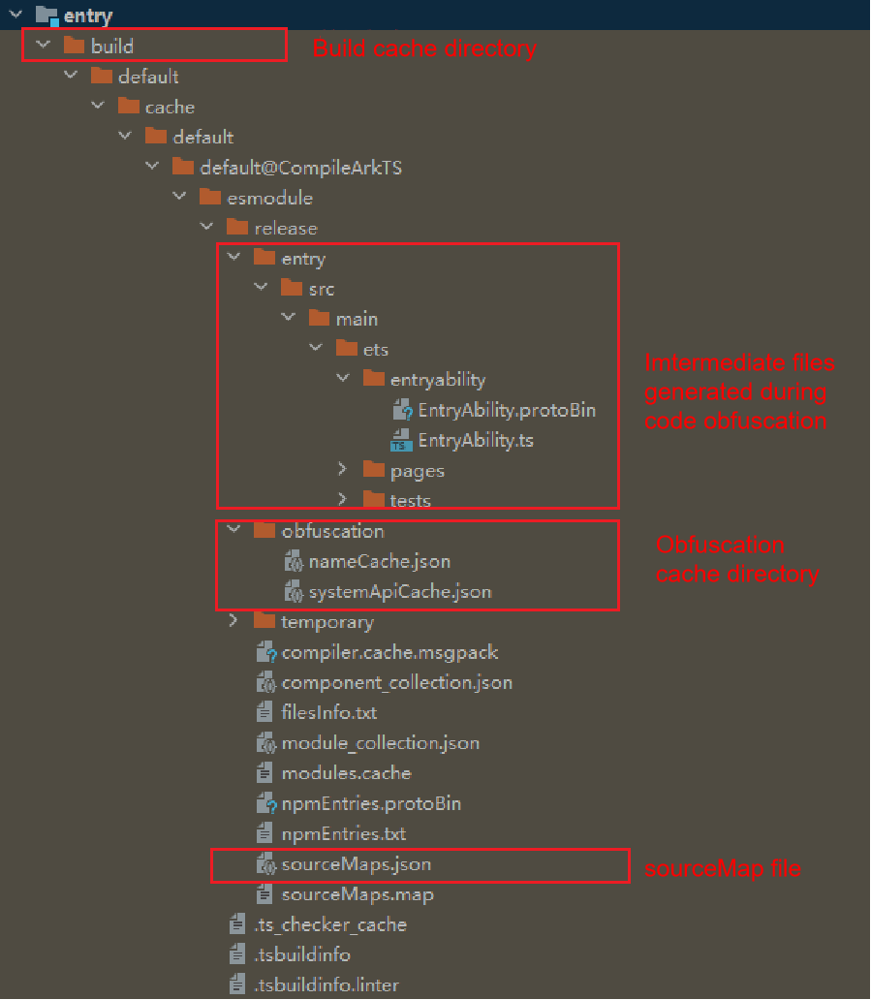

# ArkGuard

## Overview

Source code obfuscation helps reduce the risk of application hacking as well as the application package size by shortening class names and member names.

>**NOTE**
>
> 1. In versions earlier than DevEco Studio 5.0.3.600, code obfuscation is enabled by default for a new project. It automatically obfuscates the code of the stage model of API10 or later. This operation applies only to code compiled in [release mode](#usage-description), and obfuscation is limited to parameter names and local variable names.
> 2. In DevEco Studio 5.0.3.600 and later versions, code obfuscation is disabled by default when you create a project. To enable code obfuscation, set the ruleOptions.enable field in the build-profile.json5 file of the module to true. In addition, the obfuscation-rules.txt configuration file enables four recommended obfuscation options by default: -enable-property-obfuscation, -enable-toplevel-obfuscation, -enable-filename-obfuscation, and -enable-export-obfuscation. You can modify the obfuscation configuration as required. Note that enabling the four rules may cause the app to crash during running. Therefore, you are advised to rectify the app functions by referring to [Troubleshooting](#troubleshooting).

### Constraints

* Only the projects developed on the stage model are supported.
* The build mode of the project is release.
* The **disable-obfuscation** option is not configured for the module and the HAR on which the module depends.

### Code Obfuscation Scope

In a project, the following files can be obfuscated, and the cache files after obfuscation are stored in **build/[...]/release** in the module directory.

* ArkTS files
* TS files
* JS files

## Enabling Code Obfuscation

Code obfuscation has been integrated into the system and can be enabled for use in DevEco Studio.

Currently, only name obfuscation is provided. Other obfuscation capabilities deteriorate performance. You can use code obfuscation to obfuscate the following names:

* Parameter names and local variable names 
* Top-level scope names 
* Property names
* Exported names
* File names

After code obfuscation is enabled, parameter names and local variable names will be obfuscated by default. No option needs to be configured. Obfuscation of top-level scope name, property names, exported names, and file names may cause runtime errors. You can enable or disable these obfuscation capabilities by configuring obfuscate options.

When a module is created, the following content is automatically generated in the module-level build-profile.json5 file:

```
"arkOptions": {
  "obfuscation": {
    "ruleOptions": {
      "enable": true,
      "files": ["./obfuscation-rules.txt"],
    }
  }
}
```

When a library is created, the **consumerFiles** field is automatically generated in addition to the preceding content.

```
"arkOptions": {
  "obfuscation": {
    "ruleOptions": {
      "enable": true,
      "files": ["./obfuscation-rules.txt"],
    }
    "consumerFiles": ["./consumer-rules.txt"]
  }
}
```

If you disable code obfuscation and then want to enable it again, the value of **ruleOptions.enable** must be **true**.

The obfuscation configuration files specified in the **ruleOptions.files** field take effect when the HAP, HSP, or HAR is built. 
The obfuscation configuration files specified in the **consumerFiles** field take effect when the module that depends on the library is built. The contents of these obfuscation configuration files are also merged into the **obfuscation.txt** file in the HAR.

During the build of the HAP, HSP, or HAR, the final obfuscation rules are the combination of the **ruleOptions.files** field of the current module, the **consumerFiles** field of the dependent library, and the **obfuscation.txt** file in the dependent HAR. 
During HAR build, the **obfuscation.txt** file in the HAR contains the combination of the **consumerFiles** field of the current HAR, the **consumerFiles** field of the dependent library, and the **obfuscation.txt** file in the dependent HAR. No **obfuscation.txt** file is generated during HAP or HSP build. For details about the merge policy, see [Obfuscation Rule Merge Policy](#obfuscation-rule-merge-policy).

### Obfuscation Rule Configuration File

During the creation of a project or library, DevEco Studio automatically generates the **obfuscation-rules.txt** and **consumer-rules.txt** files. You can write obfuscation rules into these files or other user-defined files, and then add the file paths in **ruleOptions.files** and **consumerFiles**, as shown in the following example.

```
"buildOption": {
  "arkOptions": {
    "obfuscation": {
      "ruleOptions": {
        "enable": true,
        "files": ["./obfuscation-rules.txt", "./myrules.txt"], // Place myrules.txt in the same directory as the build-profile.json5 file.
      }
      "consumerFiles": ["./consumer-rules.txt", "./my-consumer-rules.txt"]
    }
  }
}
```

## Configuring Obfuscation Rules

There are two types of obfuscation rules: [obfuscate options](#obfuscate-options) and [keep options](#keep-options). The former provides a switch for multiple obfuscation capabilities, such as obfuscation of top-level scope names, property names, and file names. The latter provides the trustlist configuration of various obfuscation capabilities.

**NOTE**

Any modification to the obfuscation configuration takes effect only after a full build of the application.

### Obfuscate Options

#### -disable-obfuscation

Disables code obfuscation. If this option is used, the built HAP, HSP, or HAR is not obfuscated.

#### -enable-property-obfuscation

Enables property obfuscation. If this option is used, all property names except the following are obfuscated:

* Property names of classes and objects that are directly imported or exported by using the **import** or **export** statement. For example, the property name **data** in the following example is not obfuscated.

    ```
    export class MyClass {
       data: string;
    }
    ```

* Property names in ArkUI components. For example, **message** and **data** in the following example are not obfuscated.

    ```
    @Component struct MyExample {
        @State message: string = "hello";
        data: number[] = [];
        ...
    }
    ```

* Property names specified by [keep options](#keep-options).
* Property names in the SDK API list. The SDK API list is a name set automatically extracted from the SDK during build. The cache file is **systemApiCache.json**, which is stored in **build/default/cache/{...}/release/obfuscation** in the project directory.
* String literal property names. For example, **"name"** and **"age"** in the following example are not obfuscated.

    ```
    let person = {"name": "abc"};
    person["age"] = 22;
    ```

    If you want to obfuscate the string literal property name, use the **-enable-string-property-obfuscation** option in addition to the current option, as follows:

    ```
    -enable-property-obfuscation
    -enable-string-property-obfuscation
    ```

    **NOTE** 

    **1.** If a string literal property name in the code contains special characters, for example, **let obj = {"\n": 123, "": 4, " ": 5}**, you are advised not to use the **-enable-string-property-obfuscation** option because these names may fail to be kept using [keep options](#keep-options). Special characters refer to characters other than lowercase letters a-z, uppercase letters A-Z, digits 0-9, and underscores (_). 
    **2.** The property trustlist of the SDK API list does not contain the string constants used in the declaration file. For example, the string **'ohos.want.action.home'** in the example is not included in the property trustlist.

    ```
    // Part of the SDK API file @ohos.app.ability.wantConstant:
    export enum Params {
      ACTION_HOME = 'ohos.want.action.home'
    }
    // Source code example:
    let params = obj['ohos.want.action.home'];
    ```

    When the **-enable-string-property-obfuscation** option is used, use the keep option if you want to keep the property names of the SDK API string constants used in the source code, for example, **obj['ohos.want.action.home']**.

#### -enable-toplevel-obfuscation

Enables top-level scope name obfuscation. If this option is used, all names of all top-level scopes except the following are obfuscated:

* Top-level scope names imported or exported using the **import** or **export** statement.
* Top-level scope names that are not declared in the current file.
* Top-level scope names specified by [keep options](#keep-options).
* Top-level scope names in the SDK API list.

#### -enable-filename-obfuscation

Enables file or folder name obfuscation. If this option is used, all file/folder names will be confused. For example:

```
// Both directory and filename are confused.
import func from '../directory/filename';
import { foo } from '../directory/filename';
const module = import('../directory/filename');
```

In addition to the following scenarios:

* File or folder names specified by the **main** and **types** fields in the **oh-package.json5** file.
* File or folder names specified by the **srcEntry** field in the **module.json5** file of the module.
* File or folder names specified by [-keep-file-name](#keep-options).
* File or folder names in non-ECMAScript module reference mode. An ECMAScript module example is **import {foo} from './filename'**.
* File or folder names in non-path reference mode. For example, **json5** in the example **import module from 'json5'** is not obfuscated. 

**NOTE** 

The system loads certain files during application running. For these files, manually configure a trustlist in the [`-keep-file-name`] option to prevent them from being obfuscated. Otherwise, the application may fail to run.
In the following scenarios, you need to manually configure a trustlist: 

* The module contains an ability component. In this case, add all paths configured for **srcEntry** under the **abilities** field in **src/main/module.json5** to the trustlist. 
* The module contains the multithreading service: Worker. In this case, add all paths under the **buildOption'-'sourceOption'-'workers'** field in **build-profiles.json5** to the trustlist.

**Reminder**

The names of the compilation entry file, ability component file, and worker multithreaded file cannot be obfuscated and have been automatically added to the trustlist in DevEco Studio 5.0.3.500. No manual configuration is required. For other files that cannot be obfuscated, you need to manually configure their names in the trustlist.

#### -enable-export-obfuscation

Enables obfuscation for names of classes or objects that are directly imported or exported and their property names. If this option is used, the names directly imported or exported in the module are obfuscated, except the following:

* Names of classes or objects exported from remote HARs (packages whose real paths are in oh_modules) and their property names.
* Names and property names specified by [keep options](#keep-options).
* Names in the SDK API list.

**NOTE**

1. To obfuscate property names in imported or exported classes, use both the **-enable-property-obfuscation** and **-enable-export-obfuscation** options. 
2. If the **-enable-export-obfuscation** option is used during HSP build, the externally exposed interfaces must be kept in the **obfuscation-rules.txt** file of the module.
3. During the build of an HAP, an HSP, and an HSP-dependent HAR, if the **-enable-export-obfuscation** option is used, the interfaces imported from the HSP must be kept in the **obfuscation-rules.txt** file in the module. 

    ```
    // Code example (entry file Index.ets in the HSP):
    export { add, customApiName } from './src/main/ets/utils/Calc'

    // Example of keeping an interface name:
    // Configuration of the obfuscation-rules.txt file in the HSP and modules that depend on the HSP:
    -keep-global-name
    add
    customApiName
    ```

#### -compact

Removes unnecessary spaces and all line feeds. If this option is used, all code is compressed to one line.

**NOTE**

The stack information built in release mode contains the line number of code, but not the column number. Therefore, when the **compact** option is used, the source code cannot be located based on the line number in the stack information.

#### -remove-log

Removes the expressions involving direct calls to the **console.** statement in the following scenarios:

1. Calls at the top layer of a file.
2. Calls within a code block.
3. Calls within a module.
4. Calls within a switch statement.

#### -print-namecache *filepath*

Saves the name cache to the specified file path. The name cache contains mappings before and after name obfuscation. 

**NOTE**

A new **namecache.json** file is generated each time the module if fully built. Save a copy of the file each time you publish a new version.

#### -apply-namecache *filepath*

Reuses the specified name cache file. The names will be obfuscated according to the cache mappings. If there is no corresponding name, a new random segment name is used.
This option should be used in incremental build scenarios.

By default, DevEco Studio saves cache files in a temporary cache directory and automatically applies the cache files during incremental build. 
Cache Directory: **build/default/cache/{...}/release/obfuscation**

#### -remove-comments

Removes JsDoc comments from the declaration file generated after compilation. 

**NOTE** 

By default, all comments in the source code file generated after the build are removed and cannot be kept. 
You can configure **keep-comments** to keep the JsDoc comments in the declaration file from being obfuscated.

### Keep Options

#### `-keep-property-name` [,identifiers,...]

Keeps the specified property names from being obfuscated. Name wildcards are supported. An example is as follows.

```
-keep-property-name
age
firstName
lastName
```

> **NOTE**
>
> - This option takes effect when **-enable-property-obfuscation** is used.
>
> - The attribute whitelist takes effect globally. That is, if multiple attributes with the same name exist in the code, they will not be confused as long as they are the same as those in the whitelist configured in -keep-property-name.

What property names should be kept?

For safety, you are advised to keep all properties that are not accessed through dot notation.

Example:

```
var obj = {x0: 0, x1: 0, x2: 0};
for (var i = 0; i <= 2; i++) {
    console.log(obj['x' + i]); // x0, x1, and x2 should be kept.
}

Object.defineProperty(obj, 'y', {}); // y should be kept.
console.info(obj.y);

obj.s = 0;
let key = 's';
console.log(obj[key]);        // s should be kept.

obj.u = 0;
console.log(obj.u);           // u can be correctly obfuscated.

obj.t = 0;
console.log(obj['t']);        // When obfuscation of string literal property names is enabled, both t and 't' can be correctly obfuscated. However, it is recommended that 't' be kept.

obj['v'] = 0;
console.log(obj['v']);        // When obfuscation of string literal property names is enabled, 'v' can be correctly obfuscated. However, it is recommended that 'v' be kept.
```

In the case of indirect exports, for example, **export MyClass** and **let a = MyClass; export {a}**, if you do not want to obfuscate property names, use [keep options](#keep-options) to keep them. For property names of directly exported classes or objects, such as **name** and **age** in the following example, if you do not want to obfuscate them, use [keep options](#keep-options) to keep them.

```
export class MyClass {
    person = {name: "123", age: 100};
}
```

If an API (for example, **foo** in the example) of the .so library needs to be used in the ArkTS/TS/JS file, manually keep the API name.

```
import testNapi from 'library.so'
testNapi.foo() // foo should be kept. Example: -keep-property-name foo
```

Manually keep the fields used in JSON files.

```
const jsonData = ('./1.json')
let jsonStr = JSON.parse(jsonData)
let jsonObj = jsonStr.jsonProperty // jsonProperty should be kept.
```

Manually keep database-related fields.

```
const dataToInsert = {  
  value1: 'example1',   // value1 should be kept.
};
```

The custom decorator in the source code modifies member variables, member methods, and parameters, and the intermediate product of the source code compilation is a JS file (for example, the HAR of the release source code is compiled or the source code contains @ts-ignore and @ts-nocheck). The names of the member variables or member methods where these decorators are located need to be retained. This is because when the advanced TS syntax feature is converted to the standard JS syntax, the member variable or member method name of the preceding decorator is hard-coded into a string constant.

Example:

```
class A {
  // 1. Member variable decorator
  @CustomDecoarter
  The propetyName: string = "" // propetyName needs to be reserved.
  // 2. Member method decorator
  @MethodDecoarter
  methodName1 () {} // methodName1 needs to be reserved.
  // 3. Method parameter decorator.
  The methodName2(@ParamDecorator param: string): void { // methodName2 needs to be reserved.
  }
}
```

#### `-keep-global-name` [,identifiers,...]

Keep the top-level scope names from being obfuscated. Name wildcards are supported. Example:

```
-keep-global-name
Person
printPersonName
```

The names exported from the namespace can also be retained using -keep-global-name.

```
export namespace Ns {
  export const age = 18; // -keep-global-name age: reserved variable age
  export function myFunc () {}; // -keep-global-name myFunc: reserved function myFunc
}
```

> **NOTE**
>
> The whitelist specified by -keep-global-name takes effect globally. That is, if multiple top-level scope names or export names exist in the code, they will not be confused as long as they are the same as the whitelist names configured in -keep-global-name.

What top-level scope names should be kept?

In JavaScript, variables in the top-level scope are properties of **globalThis**. If **globalThis** is used to access a global variable in the code, the variable name should be kept.

Example:

```
var a = 0;
console.log(globalThis.a); // a should be kept.

function foo(){}
globalThis.foo();           // foo should be kept.

var c = 0;
console.log(c);             // c can be correctly obfuscated.

function bar(){}
bar();                      // bar can be correctly obfuscated.

class MyClass {}
let d = new MyClass();      // MyClass can be correctly obfuscated.
```

When an API of the SO library is imported by name, if both -enable-toplevel-obfuscation and -enable-export-obfuscation are enabled, you need to manually retain the API name.

```
import { testNapi, testNapi1 as myNapi } from 'library.so' // testNapi and testNapi1 should be reserved.
```

#### `-keep-file-name` [,identifiers,...]

Keeps the file or folder names from being obfuscated. You do not need to specify the file name extension. Name wildcards are supported. Example:

```
-keep-file-name
index
entry
```

What file names should be kept?

1. When the require command is used to introduce a file path, the path should be retained because ArkTS does not support the [CommonJS](../arkts-utils/module-principle.md#commonjs module) syntax.

```
The const module1 = require('./file1') // file1 should be reserved.
```

2. In dynamic reference mode, whether the parameter in the import function is a path cannot be identified. Therefore, the path should be reserved in this case.

```
The const moduleName = './file2' // file2 should be reserved.
const module2 = import(moduleName)
```

3. When using [dynamic routing](../ui/arkts-navigation-navigation.md#cross-package-dynamic-routing) for route jump, the path passed to the route should be preserved. Dynamic routing provides system routing tables and custom routing tables. If a custom route table is used for redirection, the method of configuring a whitelist is the same as that in the second dynamic reference scenario. If the system routing table is used for redirection, you need to add the path corresponding to the pageSourceFile field in the resources/base/profile/route_map.json file of the module to the whitelist.

```
  {
    "routerMap": [
      {
        "name": "PageOne",
        The "pageSourceFile": "src/main/ets/pages/directory/PageOne.ets", // path must be reserved.
        "buildFunction": "PageOneBuilder",
        "data": {
          "description" : "this is PageOne"
        }
      }
    ]
  }
```

#### `-keep-comments` [,identifiers,...]

Keeps the classes, functions, namespaces, enums, structs, interfaces, modules, types, and JsDoc comments above properties in the declaration file generated after compilation from being obfuscated. Name wildcards are supported. For example, to keep the JSDoc comments above the **Human** class in the declaration file, use the following configuration:

```
-keep-comments
Human
```

**NOTE**

1. This option takes effect when **-remove-comments** is used.
2. If the classes, functions, namespaces, enums, structs, interfaces, modules, types, and property names in the declaration file generated after compilation are confused, the JsDoc comments above the element cannot be kept using **-keep-comments**. For example, when **exportClass** is configured in **-keep-comments**, if the class name is **exportClass** obfuscated, its JSDoc comments cannot be kept:

```
/*
 * @class exportClass
 */
export class exportClass {}
```

#### `-keep-dts` filepath

Names (such as variable names, class names, and attribute names) in the .d.ts file of the specified path are added to the -keep-global-name and -keep-property-name whitelists. Note that filepath supports only absolute paths and can be specified as a directory. In this case, the names in all .d.ts files in the directory are retained.

#### `-keep` filepath

Keeps all names (such as variable names, class names, and property names) in the specified relative path from being obfuscated. The path can be a file or directory. If the path is a directory, the files in the directory and subdirectories are not obfuscated. 
The path must be a relative path. **./** and **../** are relative to the directory where the obfuscation configuration file is located. Path wildcards are supported.

```
-keep
./src/main/ets/fileName.ts   // Names in the fileName.ts file are not obfuscated.
../folder                    // Names in all the files under the folder directory and its subdirectories are not obfuscated.
../oh_modules/json5          // Names in all the files in the imported third-party library json5 are not obfuscated.
```

**NOTE**

1. For files retained by -keep filepath, the exported names and attributes in the files on the dependent links are retained.
2. NOTE: This option does not affect the capability provided by the **-enable-filename-obfuscation** option.

#### Wildcards Supported by Keep Options

##### Name Wildcards

The table below lists the name wildcards supported.

| Wildcard| Description                  | Example                                      |
| ------ | ---------------------- | ------------------------------------------ |
| ?      | Matches any single character.      | "AB?" matches "ABC", but not "AB".        |
| \*     | Matches any number of characters.| "\*AB\*" matches "AB", "aABb", "cAB", and "ABc".|

**Use Example**

Keep all property names that start with **a**.

```
-keep-property-name
a*
```

Keep all single-character property names.

```
-keep-property-name
?
```

Keep all property names.

```
-keep-property-name
*
```

##### Path Wildcards

The table below lists the path wildcards supported.

| Wildcard| Description                                                                    | Example                                             |
| ------ | ------------------------------------------------------------------------ | ------------------------------------------------- |
| ?     | Matches any single character except the path separator (/).                                     | "../a?" matches "../ab", but not "../a/".        |
| \*      | Matches any number of characters except the path separator (/).                               | "../a*/c" matches "../ab/c", but not "../ab/d/s/c".|
| \*\*   | Matches any number of characters.                                                  | "../a**/c" matches "../ab/c" and "../ab/d/s/c". |
| !      | Negation. It can only be placed at the beginning of a path to exclude a certain case configured in the trustlist.| "!../a/b/c.ets" indicates all paths other than "../a/b/c.ets".          |

**Use Example**

Keep the **c.ets** file in the **../a/b/** directory (excluding subdirectories).

```
-keep
../a/b/*/c.ets
```

Keep the **c.ets** file in the **../a/b/** directory and its subdirectories.

```
-keep
../a/b/**/c.ets
```

Keep all files except the **c.ets** file in the **../a/b/** directory. The exclamation mark (!) cannot be used alone. It can only be used to exclude existing cases in the trustlist.

```
-keep
../a/b/
!../a/b/c.ets
```

Keep all the files in the **../a/** directory (excluding subdirectories).

```
-keep
../a/*
```

Keep all the files in the **../a/** directory and its subdirectories.

```
-keep
../a/**
```

Keep all the files in the module.

```
-keep
./**
```

**NOTE**

(1) In these options, the wildcards *, ?, and ! cannot be used for other meanings.
Example:

```
class A {
  '*'= 1
}

-keep-property-name
*
```

In this example, * indicates any number of characters, and all property names are kept (not obfuscated). It does not mean that only the * property is kept.

(2) In the **-keep** option, only the path format / is allowed. The path format \ or \\ is not.

### Comments

You can use **#** to comment out an obfuscation rule file. The line that starts with **#** is treated as a comment. Example:

```
# white list for MainAbility.ets
-keep-global-name
MyComponent
GlobalFunction

-keep-property-name # white list for dynamic property names
firstName
lastName
age
```

During HAR build, comments are not merged into the final **obfuscation.txt** file.

### Obfuscation Rule Merge Policy

A project often has many obfuscation rule files, which are:

* **ruleOptions.files** of the main project (the project being built)
* File specified by the **consumerFiles** field in the local dependent libraries
* **obfuscation.txt** file in remote dependent HARs

When the main project is built, the obfuscation rules in these files are merged according to the following policy (in pseudo code):

```
let `listRules` indicates the list of all obfuscation rule files mentioned above.
let finalRule = {
    disableObfuscation: false,
    enablePropertyObfuscation: false,
    enableToplevelObfuscation: false,
    compact: false,
    removeLog: false,
    keepPropertyName: [],
    keepGlobalName: [],
    keepDts: [],
    printNamecache: string,
    applyNamecache: string
}
for each file in `listRules`:
    for each option in file:
        switch(option) {
            case -disable-obfuscation:
                finalRule.disableObfuscation = true;
                continue;
            case -enable-property-obfuscation:
                finalRule.enablePropertyObfuscation = true;
                continue;
            case -enable-toplevel-obfuscation:
                finalRule.enableToplevelObfuscation = true;
                continue;
            case -compact:
                finalRule.compact = true;
                continue;
            case -remove-log:
                finalRule.removeLog = true;
                continue;
            case -print-namecache:
                finalRule.printNamecache = #{specifiedPathName};
                continue;
            case -apply-namecache:
                finalRule.applyNamecache = #{specifiedPathName};
                continue;
            case -keep-property-name:
                finalRule.keepPropertyName.push(#{specifiedName});
                continue;
            case -keep-global-name:
                finalRule.keepGlobalName.push(#{specifiedName});
                continue;
            case -keep-dts:
                finalRule.keepDts.push(#{specifiedPath});
                continue;
        }
    end-for
end-for
```

The final obfuscation rule comes from the object **finalRule**.

If the HAR is built, the final obfuscation.txt file content comes from the consumerFiles option of the HAR and the local dependent library, and the combination of the obfuscation.txt file of the dependent HAR.

If the obfuscation configuration file specified by consumerFiles contains the following obfuscation rules, these rules will be merged into the obfuscation.txt file in the HAR package.

```
Obfuscate Options
-enable-property-obfuscation
-enable-string-property-obfuscation
-enable-toplevel-obfuscation
-compact
-remove-log

Keep Options
-keep-property-name
-keep-global-name
```

Precautions for Obfuscation in the Library

1. If the obfuscation configuration file specified by consumerFiles contains the preceding obfuscation options, these obfuscation options will be combined with the obfuscation rules of the main module when other modules depend on the HAR package. As a result, the main module is affected. Therefore, you are not advised to configure obfuscation options in the consumer-rules.txt file. You are advised to configure only reserved options.

2. If the -keep-dts option is added to the obfuscation configuration file specified by consumerFiles, it will be converted into -keep-global-name and -keep-property-name.

## Retracing Stack Traces

The function names of an application project after obfuscation are changed. As a result, the stack trace printed during crash is more difficult to understand because it is not completely consistent with the source code. You can use the hstack plugin in DevEco Studio Command Line Tools to restore the source stack trace and analyze problems. The **sourceMap.json** file generated during compilation and the obfuscation name mapping file **nameCache.json** are essential for de-obfuscation. Ensure to back them up locally.



## Usage Description

* Currently, custom obfuscation plugins cannot be inserted into the hvigor build process.
* If a module that depends on an obfuscated HAR enables obfuscation, the HAR will be obfuscated again.
* To enable the release build mode, select **Product** in the upper right corner of DevEco Studio and set **Build Mode** to **release**.


## Appendix

### Mappings Between Obfuscate Options and Minimum SDK Versions

| Obfuscate Option| Description | Minimum SDK Version|
| ------- | --------- | ------ |
| -disable-obfuscation         | Disables obfuscation.| 4.0.9.2 |
| -enable-property-obfuscation | Enables property obfuscation.| 4.0.9.2 |
| -enable-string-property-obfuscation | Enables obfuscation for string literal property names.| 4.0.9.2 |
| -enable-toplevel-obfuscation | Enables top-level scope name obfuscation.| 4.0.9.2 |
| -enable-filename-obfuscation | Enables file or folder name obfuscation for the HAR.<br> Enables file or folder name obfuscation for the HAP/HSP.| 4.1.5.3 <br> 5.0.0.19 |
| -enable-export-obfuscation   | Enables obfuscation for imported or exported names.| 4.1.5.3 |
| -compact                     | Removes unnecessary spaces and all line feeds.| 4.0.9.2 |
| -remove-log                  | Removes the expressions involving direct calls to the **console.** statement in specific scenarios.| 4.0.9.2 |
| -print-namecache             | Saves the name cache to the specified file path.| 4.0.9.2 |
| -apply-namecache             | Reuses the specified name cache file.| 4.0.9.2 |
| -remove-comments             | Removes all comments in the file.| 4.1.5.3 |
| -keep-property-name          | Keeps property names from being obfuscated.| 4.0.9.2 |
| -keep-global-name            | Keeps top-level scope names from being obfuscated.| 4.0.9.2 |
| -keep-file-name              | Keeps file or folder names in the HAR from being obfuscated.<br> Keeps file or folder names in the HAP/HSP from being obfuscated.| 4.1.5.3 <br> 5.0.0.19 |
| -keep-dts                    | Keeps the names in the .d.ts file in the specified path from being obfuscated.| 4.0.9.2 |
| -keep-comments               | Keeps the classes, functions, namespaces, enums, structs, interfaces, modules, types, and JsDoc comments above properties in the declaration file generated after compilation from being obfuscated.| 4.1.5.3 |
| -keep                        | Keeps all names in the specified path from being obfuscated.| 5.0.0.18 |
| Wildcard                      | The keep options of the name classes and path classes support wildcards.| 5.0.0.24 |

### Viewing the Obfuscation Effect

You can find the obfuscated files, name mapping file, and system API trustlist file in the **build** directory of the build product.

* Obfuscated file directory: build/default/[...]/release/moduleName
* Directory of the name mapping file and system API trustlist file: build/default/[...]/release/obfuscation
  * The name mapping file, named **nameCache.json**, records the mappings between source code names and names after obfuscation.
  * The system API trustlist file, named **systemApiCache.json**, records the APIs and property names that will be kept.

  

### Troubleshooting

1. Configure the **-disable-obfuscation** option in **obfuscation-rules.txt** to disable obfuscation, and check whether the exception is caused by obfuscation.
2. If the function is abnormal after obfuscation is enabled, read the document to understand the capabilities of obfuscation rules, such as [-enable-property-obfuscation](#keep-options), [-enable-toplevel-obfuscation](#keep-options), [-enable-filename-obfuscation](#keep-options), and [-enable-export-obfuscation](#keep-options), and the syntax scenarios that require the configuration of a [trustlist](#keep-options) to ensure that the application functions properly. The following briefly describes the four keep options that are enabled by default. For details, see the complete description of the corresponding options.
    [-enable-toplevel-obfuscation](#keep-options): keeps top-level scope name from being obfuscated.
    [-enable-property-obfuscation](#keep-options): keeps properties from being obfuscated. You need to use [-keep-property-name](#keep-options) to configure a trustlist for specified property names in scenarios where obfuscation is not allowed, such as network data access, JSON field access, dynamic property access, and .so library API calls.
    [-enable-export-obfuscation](#keep-options): keeps exported names from being obfuscated. Generally, this option is used together with the preceding two options. You need to use [-keep-global-name](#keep-options) to configure a trustlist for exported or imported names in scenarios where external APIs of the module cannot be obfuscated.
    [-enable-filename-obfuscation]: keeps file names from being obfuscated. You need to use [-keep-file-name](#keep-options) to configure a trustlist for file paths and names in scenarios where file paths are dynamically imported or directly loaded at runtime.
3. If you find a [troubleshooting](#troubleshooting) case similar to your scenario, you can quickly resolve the issue by following the recommended solution.
4. If no similar case is found, you should identify the issue by examining the configuration functions. If the relevant functions are unnecessary, you can remove the corresponding configuration items.
5. Analyze application crashes during running as follows:
    Open the application run log or click the Crash dialog box in DevEco Studio to find the crash stack.
    The line number in the crash stack is the line number of the [build product](#viewing-the-obfuscation-effect), and the method name may also be the obfuscated name. Therefore, you are advised to check the build product based on the crash stack, analyze the names that cannot be obfuscated, and add them to the trustlist.
6. If the app does not crash during running but functions are abnormal (for example, a white screen is displayed):
    1. Open the app run log: Select HiLog, search for logs directly related to the function exception, and locate the context where the problem occurs.
    2. Locate the abnormal code segment: Analyze logs to find the specific code block that causes the function exception.
    3. Enhanced log output: Logs are added to the processed data fields in the function code that may be abnormal.
    4. Analyze and determine key fields: Analyze the output of new logs to check whether the data of this field is abnormal due to confusion.
    5. Configure the whitelist to protect key fields: Add the key fields that directly affect application functions after obfuscation to the whitelist.

### **FAQs**

#### Errors That May Occur When -enable-property-obfuscation Is Configured

Case 1: The error message "Cannot read property 'xxx' of undefined" is reported.

```
// Before obfuscation
const jsonData = ('./1.json')
let jsonStr = JSON.parse(jsonData)
let jsonObj = jsonStr.jsonProperty

// After obfuscation
const jsonData = ('./1.json')
let jsonStr = JSON.parse(jsonData)
let jsonObj = jsonStr.i
```

After property obfuscation is enabled, **jsonProperty** is obfuscated as a random character **i**. However, the original name is used in the JSON file, causing the error.

**Solution**: Use the **-keep-property-name** option to add the fields used in JSON files to the trustlist.

Case 2: An error message is reported when database-related fields are used and property obfuscation is enabled.

The error message is "table Account has no column named a23 in 'INSET INTO Account(a23)'."

Database fields are used in the code. During obfuscation, the field names in the SQL statements are obfuscated, but the original field names are used in the database, causing the error.

**Solution**: Use the **-keep-property-name** option to add the database fields to the trustlist.

#### Errors That May Occur When -enable-export-obfuscation and -enable-toplevel-obfuscation Are Configured

When the two options are configured, method name confusion in the following scenarios is involved when the main module calls the methods of other modules:

| Main Module| Dependent Module| Confusion of Imported and Exported Names|
| ------- | ------- | ----------------------------|
| HAP/HSP | HSP     | The HSP and main module are built independently, and different names are generated after obfuscation. Therefore, a trustlist must be configured for both the HSP and main module.|
| HAP/HSP | Local HAR| The local HAR is built together with the main module. After obfuscation, the names are the same.|
| HAP/HSP | Third-party library | The names and properties exported from a third-party library are collected to the trustlist. They are not confused during import and export.|

For the HSP, you must add the methods used by other modules to the trustlist. You must add the same trustlist for the main module. Therefore, you are advised to add the obfuscation file configured with the trustlist (for example, **hsp-white-list.txt**) to the obfuscation configuration item of the module that depends on the obfuscation file, that is, the **files** field shown in the following figure.


Case 1: When a class is dynamically imported, the class definition is confused, but the class name is not, causing an error.

```
// Before obfuscation
export class Test1 {}

let mytest = (await import('./file')).Test1

// After obfuscation
export class w1 {}

let mytest = (await import('./file')).Test1
```

The exported class **Test1** is a top-level domain name. When **Test1** is dynamically used, it is a property. Because the **-enable-property-obfuscation** option is not configured, the class name is confused, but the property name is not.

**Solution**: Use the **-keep-global-name** option to add **Test1** to the trustlist.

Case 2: For a method in a namespace, the method definition is confused, but the statement that uses the method is not, causing an error.

```
// Before obfuscation
export namespace ns1 {
  export class person1 {}
}

import {ns1} from './file1'
let person1 = new ns1.person1()

// After obfuscation
export namespace a3 {
  export class b2 {}
}

import {a3} from './file1'
let person1 = new a3.person1()
```

**person1** in the namespace is a top-level class name. When it is called by using **ns1.person1**, **person1** is a property and is not obfuscated because property obfuscation is not enabled.

**Solution:**

1. Configure the **-enable-property-obfuscation** option.
2. Use the **-keep-global-name** option to add the methods exported from the namespace to the trustlist.

Case 3: When declare global is used, a syntax error is reported after obfuscation.

```
// Before obfuscation
declare global {
  var age : string
}

// After obfuscation
declare a2 {
  var b2 : string
}
```

The error message "SyntaxError: Unexpected token" is reported.

**Solution**: Use **-keep-global-name** to **add __global** to the trustlist.

#### The **-enable-string-property-obfuscation** option is not configured, but the string literal property name is obfuscated. As a result, the value of the string literal property name is undefined.

```
person["age"] = 22; // Before obfuscation

person["b"] = 22; // After obfuscation
```

**Solution:**

1. Check whether **-enable-string-property-obfuscation** is configured for the dependent HAR. If it is configured, the main project will be affected, and you should disable it.
2. If it must be configured, add the property name to the trustlist.
3. If it is not configured and the SDK version is earlier than 4.1.5.3, update the SDK.

#### Errors That May Occur When -enable-filename-obfuscation Is Configured

Case 1: The error message "Error Failed to get a resolved OhmUrl for 'D:code/MyApplication/f12/library1/pages/d.ets' imported by 'undefined'" is reported.

As shown below, the outer layer of the **library1** module contains a directory named **directory**. When file name obfuscation is enabled, **directory** is obfuscated as **f12**, causing the error indicating that the path is not found.


**Solution:**

1. If the project directory structure and error message are similar, update the SDK to 5.0.0.26 or later.
2. Use the **-keep-file-name** option to add the directory name **directory** of the module to the trustlist.

Case 2: The error message "Cannot find module 'ets/appability/AppAbility' which is application Entry Point" is reported.

The system loads the ability file when the application is running. Therefore, you must manually configure the trustlist to prevent the specified file from being obfuscated.

**Solution**: Use the **-keep-file-name** option to add the path corresponding to the **srcEntry** field in the **src/main/module.json5** file to the trustlist.

```
-keep-file-name
appability
AppAbility
```

#### Errors That May Occur When -keep-global-name and a Trustlist Are Configured

The error message "Cannot read properties of undefined (reading 'has')" is reported.

**Solution**: Upgrade the SDK to 4.1.6.3 or later.

#### The HAP and HSP depend on the same local source code HAR module.

* If file name obfuscation is enabled, the following problems may occur:
  * Problem 1: The singleton function is abnormal. The reason is that the build and obfuscation processes of HAP and HSP are executed independently. In the local source code HAR module, the same file name may be obfuscated into different file names in the HAP and HSP packages.
  * Problem 2: The interface fails to be called. The reason is that the build and obfuscation processes of HAP and HSP are executed independently. In the local source code HAR module, different file names may be obfuscated into the same file name in the HAP and HSP packages.
* If the -enable-export-obfuscation and -enable-toplevel-obfuscation options are enabled, the interface fails to be loaded during application running.
The reason is that HAP and HSP independently execute the build and obfuscation processes. The interfaces exposed in the HAR module of the local source code are obfuscated into different names in HAP and HSP.

**Solution:**
1. Change the local source code HAR on which HAP and HSP depend to [bytecode HAR](https://developer.huawei.com/consumer/en/doc/harmonyos-guides-V5/ide-hvigor-build-har-V5#section179161312181613). In this way, the HAR will not be confused when it is depended on.
2. The local source code HAR on which HAP and HSP depend is [built and packaged in release mode](https://developer.huawei.com/consumer/en/doc/harmonyos-guides-V5/ide-hvigor-build-har-V5#section19788284410). In this way, when the HAR is depended on, its file name is not confused with the external interface.
