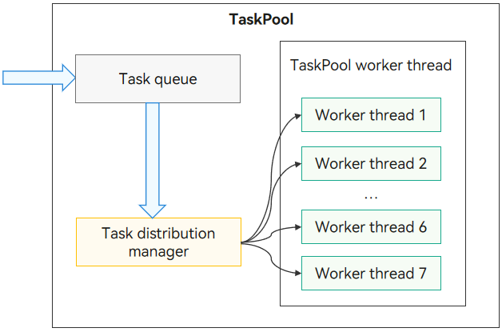

# TaskPool Introduction

TaskPool provides a multithreaded environment for applications. It helps reduce resource consumption and improve system performance. It also frees you from caring about the lifecycle of thread instances. For details about the TaskPool APIs and their usage, see [@ohos.taskpool (Starting the Task Pool)](../reference/apis-arkts/js-apis-taskpool.md).


## TaskPool Operating Mechanism

**Figure 1** TaskPool operating mechanism



With TaskPool, you can encapsulate tasks in the main thread and throw the tasks to the task queue. The system selects proper worker threads to distribute and execute the tasks, and then returns the result to the main thread. TaskPool provides APIs to execute and cancel tasks, and set the task priority. It minimizes system resource usage through unified thread management, dynamic scheduling, and load balancing. By default, the system starts a worker thread and increases the thread quantity as the number of tasks increases. The maximum number of worker threads that can be created depends on the number of physical cores of the device. The actual number is managed internally to ensure optimal scheduling and execution efficiency. If no task is distributed for a long period of time, the system reduces the number of worker threads.


## Precautions for TaskPool

- A task function must be decorated with [\@Concurrent](arkts-concurrent.md) and can be used only in .ets files.

- Since API version 11, when a function that implements a task needs to use a class method, the class must be decorated with [\@Sendable](arkts-sendable.md#sendable-decorator-declaring-and-verifying-a-sendable-class) and used only in .ets files.

- A task function in the TaskPool worker thread must finish the execution within 3 minutes (excluding the time used for Promise or async/await asynchronous call, for example, the duration of I/O tasks such as network download and file read/write). Otherwise, it forcibly exits.

- Input parameter types in a task function must be those supported by serialization. For details, see [Serialization Types Supported by TaskPool and Worker](serialization-support-types.md).

- Parameters of the ArrayBuffer type are transferred in TaskPool by default. You can set the transfer list by calling [setTransferList()](../reference/apis-arkts/js-apis-taskpool.md#settransferlist10).

- Context objects vary in different threads. Therefore, the TaskPool worker thread can use only a thread-safe library, but not a non-thread-safe library (for example, UI-related non-thread-safe library). For details, see [Precautions for Multithread Safe](multi-thread-safety.md).

- A maximum of 16 MB data can be serialized.
- Among all the values of [Priority](../reference/apis-arkts/js-apis-taskpool.md#priority), **IDLE** is used to mark time-consuming tasks (such as data synchronization and backup) that need to run in the background and has the lowest priority. Tasks marked with **IDLE** are executed only when all threads are idle and occupy only one thread for execution.

- A promise object cannot be passed across threads and cannot be used as the return value of a concurrent function.

```ts
// Positive example:
@Concurrent
async function asyncFunc(val1:number, val2:number): Promise<number> {
  let ret: number = await new Promise((resolve, reject) => {
    let value = val1 + val2;
    resolve(value);
  });
  return ret; // Supported. A promise object is returned.
}

function taskpoolExecute() {
  taskpool.execute(asyncFunc, 10, 20).then((result: Object) => {
    console.info("taskPoolTest task result: " + result);
  }).catch((err: string) => {
    console.error("taskPoolTest test occur error: " + err);
  });
}
taskpoolExecute()
```

<!--code_no_check-->
```ts
// Negative example 1:
@Concurrent
async function asyncFunc(val1:number, val2:number): Promise<number> {
  let ret: number = await new Promise((resolve, reject) => {
    let value = val1 + val2;
    resolve(value);
  });
  return Promise.resolve(ret); // Not supported. Promise.resolve is a promise object in pending state. It cannot be used as a return value.
}

// Negative example 2:
@Concurrent
async function asyncFunc(val1:number, val2:number): Promise<number> {
  // Not supported. The status is pending. It cannot be used as a return value.
  return new Promise((resolve, reject) => {
    setTimeout(() => {
      let value = val1 + val2;
      resolve(value);
    }, 2000);
  }); 
}

function taskpoolExecute() {
  taskpool.execute(asyncFunc, 10, 20).then((result: Object) => {
    console.info("taskPoolTest task result: " + result);
  }).catch((err: string) => {
    console.error("taskPoolTest test occur error: " + err);
  });
}
taskpoolExecute()
```
