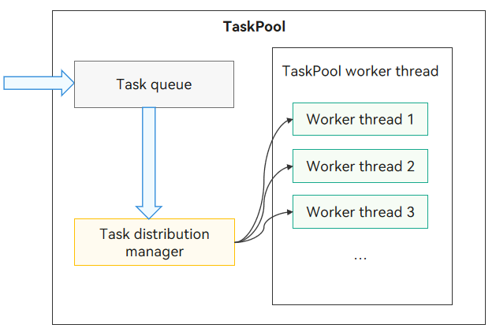

# TaskPool

TaskPool is designed to provide a multithreaded runtime environment for applications. It helps reduce overall resource consumption and improve system performance. It also frees you from caring about the lifecycle of thread instances. For details about the APIs and their usage, see [TaskPool](../reference/apis-arkts/js-apis-taskpool.md).

## TaskPool Operating Mechanism

The figure below illustrates the operating mechanism of TaskPool.



With TaskPool, you can encapsulate tasks in the host thread and submit the tasks to the task queue. The system selects appropriate worker threads to distribute and execute the tasks, and then returns the result to the host thread. TaskPool provides APIs to execute and cancel tasks, and set the task priority. It minimizes system resource usage through unified thread management, dynamic scheduling, and load balancing. By default, the system starts a worker thread and increases the thread quantity as the number of tasks increases. The maximum number of worker threads that can be created depends on the number of physical cores of the device. The actual number is managed internally to ensure optimal scheduling and execution efficiency. If no task is distributed for an extended period, the system reduces the number of worker threads.

## Precautions for TaskPool

- Functions implementing tasks must be decorated with [\@Concurrent](#concurrent-decorator) and are supported only in .ets files.

- Starting from API version 11, when passing instances with methods across concurrent instances, the class must be decorated with [@Sendable](arkts-sendable.md#sendable) and are supported only in .ets files.

- A task function must finish the execution in a TaskPool worker thread within 3 minutes (excluding the time used for Promise or async/await asynchronous call, such as the duration of I/O tasks like network download and file read/write operation). Otherwise, it is forcibly terminated.

- Parameters of functions implementing tasks must be of types supported by serialization. For details, see [Inter-Thread Communication](interthread-communication-overview.md).

- Parameters of the ArrayBuffer type are transferred in TaskPool by default. You can set the transfer list by calling [setTransferList()](../reference/apis-arkts/js-apis-taskpool.md#settransferlist10).

- The context objects in different threads are different. Therefore, TaskPool worker threads can use only thread-safe libraries. For example, non-thread-safe UI-related libraries cannot be used.

- A maximum of 16 MB data can be serialized.

- Among all the values of [Priority](../reference/apis-arkts/js-apis-taskpool.md#priority), **IDLE** is used to mark time-consuming tasks that need to run in the background (such as data synchronization and backup), and it has the lowest priority. Tasks marked with this priority are executed only when all threads are idle and occupy only one thread for execution.

- Promises cannot be transferred across threads. If TaskPool returns a Promise in the pending or rejected state, a failure message is returned. For a Promise in the fulfilled state, TaskPool parses the returned result. If the result can be transferred across threads, a success message is returned.

- [AppStorage](../quick-start/arkts-appstorage.md) cannot be used in TaskPool worker threads.

- TaskPool allows you to package tasks in the host thread and submit them to the task queue. While it can theoretically handle an unlimited number of tasks, the actual task execution is influenced by the task priority and the availability of system resources. Once the Worker threads reach their maximum capacity, the efficiency of task execution might be compromised.

- TaskPool does not allow you to specify the thread where a task runs. Instead, tasks are assigned to run in available threads. If you want to specify the thread for running a task, using [Worker](./worker-introduction.md) is a better approach.

## \@Concurrent Decorator

To pass function verification, concurrent functions executed in a [TaskPool](../reference/apis-arkts/js-apis-taskpool.md) must be decorated using \@Concurrent.

> **NOTE**
>
> Since API version 9, the @Concurrent decorator can be used to declare and verify concurrent functions.

### Decorator Description

| \@Concurrent Decorator| Description|
| -------- | -------- |
| Decorator parameters| None.|
| Use scenario| Used only in projects of the stage model and only in .ets files.|
| Decorated function types| Used for async functions or regular functions. It cannot be used for generators, arrow functions, or class methods. It does not support class member functions or anonymous functions.|
| Variable types in decorated functions| Local variables, parameters, and variables imported via **import** are allowed. Closure variables are prohibited.|
| Return value types in decorated functions| Supported types are listed in [Inter-Thread Communication](interthread-communication-overview.md).|

> **NOTE**
>
> Functions decorated with \@Concurrent cannot access closures. Therefore, they cannot call other functions within the same file. The following provides an example.
>
> ```ts
> function bar() {
> }
> 
> @Concurrent
> function foo() {
> bar(); // This violates the closure principle. An error is reported.
> }
> ```

### Decorator Usage Examples

#### General Use of Concurrent Functions

A concurrent function that calculates the sum of two numbers is executed by TaskPool and returns the result.

Example:

```ts
import { taskpool } from '@kit.ArkTS';

@Concurrent
function add(num1: number, num2: number): number {
  return num1 + num2;
}

async function ConcurrentFunc(): Promise<void> {
  try {
    let task: taskpool.Task = new taskpool.Task(add, 1, 2);
    console.info("taskpool res is: " + await taskpool.execute(task));
  } catch (e) {
    console.error("taskpool execute error is: " + e);
  }
}

@Entry
@Component
struct Index {
  @State message: string = 'Hello World'

  build() {
    Row() {
      Column() {
        Text(this.message)
          .fontSize(50)
          .fontWeight(FontWeight.Bold)
          .onClick(() => {
            ConcurrentFunc();
          })
      }
      .width('100%')
    }
    .height('100%')
  }
}
```

#### Concurrent Functions Returning Promises

Pay attention to the behavior of returning Promises in concurrent functions. In the following example, concurrent functions like **testPromise** and **testPromise1** handle these Promises and return results.

Example:

```ts
import { taskpool } from '@kit.ArkTS';

@Concurrent
function testPromise(args1: number, args2: number): Promise<number> {
  return new Promise<number>((resolve, reject)=>{
    resolve(args1 + args2);
  });
}

@Concurrent
async function testPromise1(args1: number, args2: number): Promise<number> {
  return new Promise<number>((resolve, reject)=>{
    resolve(args1 + args2);
  });
}

@Concurrent
async function testPromise2(args1: number, args2: number): Promise<number> {
  return await new Promise<number>((resolve, reject)=>{
    resolve(args1 + args2);
  });
}

@Concurrent
function testPromise3() {
  return Promise.resolve(1);
}

@Concurrent
async function testPromise4(): Promise<number> {
  return 1;
}

@Concurrent
async function testPromise5(): Promise<string> {
  return await new Promise((resolve) => {
    setTimeout(()=>{
      resolve("Promise setTimeout after resolve");
    }, 1000)
  });
}

async function testConcurrentFunc() {
  let task1: taskpool.Task = new taskpool.Task(testPromise, 1, 2);
  let task2: taskpool.Task = new taskpool.Task(testPromise1, 1, 2);
  let task3: taskpool.Task = new taskpool.Task(testPromise2, 1, 2);
  let task4: taskpool.Task = new taskpool.Task(testPromise3);
  let task5: taskpool.Task = new taskpool.Task(testPromise4);
  let task6: taskpool.Task = new taskpool.Task(testPromise5);

  taskpool.execute(task1).then((d:object)=>{
    console.info("task1 res is: " + d);
  }).catch((e:object)=>{
    console.info("task1 catch e: " + e);
  })
  taskpool.execute(task2).then((d:object)=>{
    console.info("task2 res is: " + d);
  }).catch((e:object)=>{
    console.info("task2 catch e: " + e);
  })
  taskpool.execute(task3).then((d:object)=>{
    console.info("task3 res is: " + d);
  }).catch((e:object)=>{
    console.info("task3 catch e: " + e);
  })
  taskpool.execute(task4).then((d:object)=>{
    console.info("task4 res is: " + d);
  }).catch((e:object)=>{
    console.info("task4 catch e: " + e);
  })
  taskpool.execute(task5).then((d:object)=>{
    console.info("task5 res is: " + d);
  }).catch((e:object)=>{
    console.info("task5 catch e: " + e);
  })
  taskpool.execute(task6).then((d:object)=>{
    console.info("task6 res is: " + d);
  }).catch((e:object)=>{
    console.info("task6 catch e: " + e);
  })
}

@Entry
@Component
struct Index {
  @State message: string = 'Hello World';

  build() {
    Row() {
      Column() {
        Button(this.message)
          .fontSize(50)
          .fontWeight(FontWeight.Bold)
          .onClick(() => {
            testConcurrentFunc();
          })
      }
      .width('100%')
    }
    .height('100%')
  }
}
```

#### Using Custom Classes or Functions in Concurrent Functions

Custom classes or functions used in concurrent functions must be defined in separate files. Otherwise, they will be considered as closures, as shown in the following example.

Example:

```ts
// Index.ets
import { taskpool } from '@kit.ArkTS';
import { BusinessError } from '@kit.BasicServicesKit';
import { testAdd, MyTestA, MyTestB } from './Test';

function add(arg: number) {
  return ++arg;
}

class TestA {
  constructor(name: string) {
    this.name = name;
  }
  name: string = 'ClassA';
}

class TestB {
  static nameStr: string = 'ClassB';
}

@Concurrent
function TestFunc() {
  // Case 1: Directly call a class or function defined in the same file within a concurrent function.

  // Directly call the add() function defined in the same file. The following error message is displayed: "Only imported variables and local variables can be used in @Concurrent decorated functions. <ArkTSCheck>"
  // add(1);
  // Directly use the TestA constructor defined in the same file. The following error message is displayed: "Only imported variables and local variables can be used in @Concurrent decorated functions. <ArkTSCheck>"
  // let a = new TestA("aaa");
  // Directly access the nameStr member of TestB defined in the same file. The following error message is displayed: "Only imported variables and local variables can be used in @Concurrent decorated functions. <ArkTSCheck>"
  // console.info("TestB name is: " + TestB.nameStr);

  // Case 2: In the concurrent function, call classes or functions defined in the Test.ets file and imported into the current file.

  // Output: res1 is: 2
  console.info("res1 is: " + testAdd(1));
  let tmpStr = new MyTestA("TEST A");
  // Output: res2 is: TEST A
  console.info("res2 is: " + tmpStr.name);
  // Output: res3 is: MyTestB
  console.info("res3 is: " + MyTestB.nameStr);
}


@Entry
@Component
struct Index {
  @State message: string = 'Hello World';

  build() {
    RelativeContainer() {
      Text(this.message)
        .id('HelloWorld')
        .fontSize(50)
        .fontWeight(FontWeight.Bold)
        .alignRules({
          center: { anchor: '__container__', align: VerticalAlign.Center },
          middle: { anchor: '__container__', align: HorizontalAlign.Center }
        })
        .onClick(() => {
          let task = new taskpool.Task(TestFunc);
          taskpool.execute(task).then(() => {
            console.info("taskpool: execute task success!");
          }).catch((e:BusinessError) => {
            console.error(`taskpool: execute: Code: ${e.code}, message: ${e.message}`);
          })
        })
    }
    .height('100%')
    .width('100%')
  }
}
```

```ts
// Test.ets
export function testAdd(arg: number) {
  return ++arg;
}

@Sendable
export class MyTestA {
  constructor(name: string) {
    this.name = name;
  }
  name: string = 'MyTestA';
}

export class MyTestB {
  static nameStr:string = 'MyTestB';
}
```

#### Using Promises in Concurrent Asynchronous Functions

If Promise is used in concurrent asynchronous functions, you are advised to use await to enable TaskPool to capture any exceptions that may occur within the Promise. The recommended usage is shown in the following example.

Example:

```ts
import { taskpool } from '@kit.ArkTS'

@Concurrent
async function testPromiseError() {
  await new Promise<number>((resolve, reject) => {
    resolve(1);
  }).then(()=>{
    throw new Error("testPromise Error");
  })
}

@Concurrent
async function testPromiseError1() {
  await new Promise<string>((resolve, reject) => {
    reject("testPromiseError1 Error msg");
  })
}

@Concurrent
function testPromiseError2() {
  return new Promise<string>((resolve, reject) => {
    reject("testPromiseError2 Error msg");
  })
}

async function testConcurrentFunc() {
  let task1: taskpool.Task = new taskpool.Task(testPromiseError);
  let task2: taskpool.Task = new taskpool.Task(testPromiseError1);
  let task3: taskpool.Task = new taskpool.Task(testPromiseError2);

  taskpool.execute(task1).then((d:object)=>{
    console.info("task1 res is: " + d);
  }).catch((e:object)=>{
    console.info("task1 catch e: " + e);
  })
  taskpool.execute(task2).then((d:object)=>{
    console.info("task2 res is: " + d);
  }).catch((e:object)=>{
    console.info("task2 catch e: " + e);
  })
  taskpool.execute(task3).then((d:object)=>{
    console.info("task3 res is: " + d);
  }).catch((e:object)=>{
    console.info("task3 catch e: " + e);
  })
}

@Entry
@Component
struct Index {
  @State message: string = 'Hello World';

  build() {
    Row() {
      Column() {
        Button(this.message)
          .fontSize(50)
          .fontWeight(FontWeight.Bold)
          .onClick(() => {
            testConcurrentFunc();
          })
      }
      .width('100%')
    }
    .height('100%')
  }
}
```
