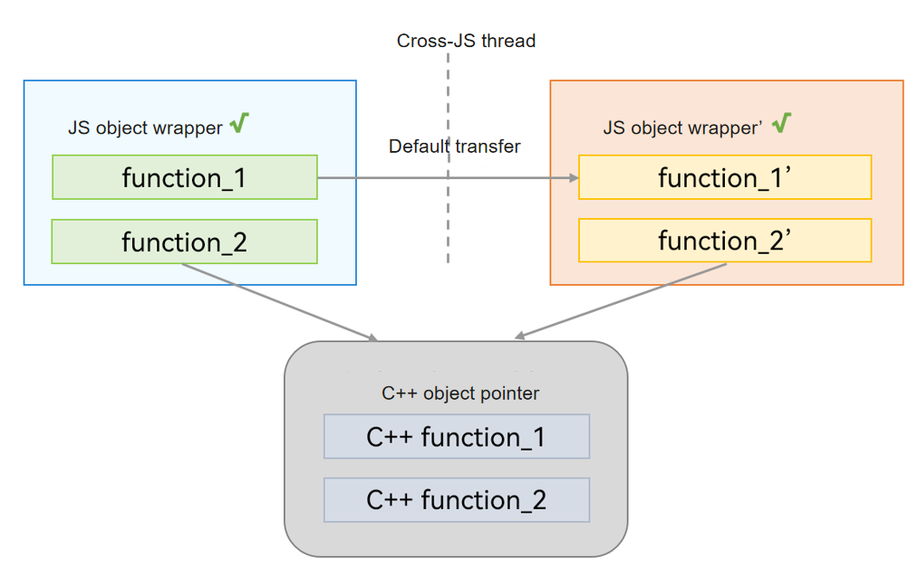
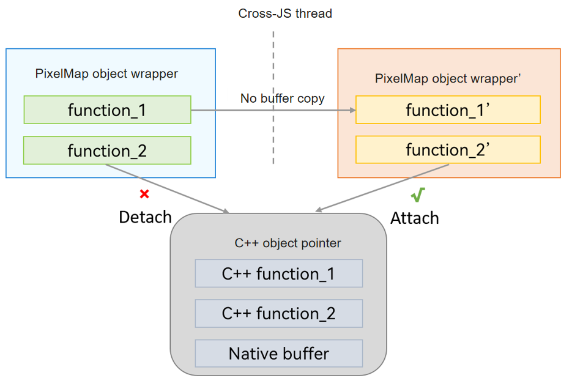

# Transferable Object (NativeBinding Object)
<!--Kit: ArkTS-->
<!--Subsystem: CommonLibrary-->
<!--Owner: @wang_zhaoyong-->
<!--Designer: @weng-changcheng-->
<!--Tester: @kirl75; @zsw_zhushiwei-->
<!--Adviser: @ge-yafang-->


A Transferable object, also known as a NativeBinding object, is a JS object that is bound to a C++ object, with the primary functionality provided by C++. Its JS object wrapper is allocated in the local heap of the virtual machine. During cross-thread communication, the same C++ object is reused. Compared with the pass-by-copy mode of JS objects, this method offers higher transfer efficiency. Therefore, NativeBinding objects that can be shared or transferred are also referred to as Transferable objects. You can also customize Transferable objects. For details, see [Multithreaded Operations with Custom Native Transferable Objects](napi-coerce-to-native-binding-object.md).


## Shared Mode

If the C++ implementation can ensure thread safety, the C++ part of the NativeBinding object supports the shared mode. In this case, after the NativeBinding object is passed across threads, you only need to create a JS object wrapper again to bridge to the same C++ object, achieving the sharing of the C++ object. The following figure shows the communication process.





A typical shared-mode NativeBinding object includes ApplicationContext, WindowContext, and AbilityContext or ComponentContext. These context objects encapsulate the context information of application components and provide the capability to access system services and resources, enabling the application components to interact with the system. For details about how to obtain context, see [Context (Stage Model)](../application-models/application-context-stage.md).

For details about the development example, see [Using TaskPool for Frequent Database Operations](batch-database-operations-guide.md#using-taskpool-for-frequent-database-operations).


## Transfer Mode

If the C++ implementation contains data and cannot ensure thread safe, the C++ part of the NativeBinding object should be passed by transfer. In this case, after the NativeBinding object is passed across threads, you only need to create a JS object wrapper again to bridge to the C++ object. However, the original object must remove its binding to this object. The following figure shows the communication process.



A typical transfer-mode NativeBinding object includes a PixelMap. The [PixelMap object](../reference/apis-image-kit/arkts-apis-image-f.md#imagecreatepixelmap8) can read or write image data and obtain image information, and is usually used for image display.

Here is an example of passing a PixelMap object across threads. Obtain the image resource from the **rawfile** folder, and create a PixelMap object in the child thread and pass it to the main thread. The specific implementation is as follows:

```ts
// Index.ets
import { taskpool } from '@kit.ArkTS';
import { loadPixelMap } from './PixelMapTest';
import { BusinessError } from '@kit.BasicServicesKit';

@Entry
@Component
struct Index {
  @State message: string = 'Hello World';
  @State pixelMap: PixelMap | undefined = undefined;

  private loadImageFromThread(): void {
    let context : Context = this.getUIContext().getHostContext() as Context;
    const resourceMgr = context.resourceManager;
    // startIcon.png is copied from the media directory to the rawfile folder. You need to replace it. Otherwise, the imageSource fails to be created and subsequent operations cannot be performed.
    resourceMgr.getRawFd('startIcon.png').then(rawFileDescriptor => {
      taskpool.execute(loadPixelMap, rawFileDescriptor).then(pixelMap => {
        if (pixelMap) {
          this.pixelMap = pixelMap as PixelMap;
          console.info('Succeeded in creating pixelMap.');
          // The main thread releases the pixelMap. Because setTransferDetached has been called when the child thread returns the pixelMap, the pixelMap can be released immediately.
          this.pixelMap.release();
        } else {
          console.error('Failed to create pixelMap.');
        }
      }).catch((e: BusinessError) => {
        console.error('taskpool execute loadPixelMap failed. Code: ' + e.code + ', message: ' + e.message);
      });
    });
  }

  build() {
    Row() {
      Column() {
        Text(this.message)
          .fontSize(50)
          .fontWeight(FontWeight.Bold)
          .onClick(() => {
            this.loadImageFromThread();
          })
      }
      .width('100%')
    }
    .height('100%')
  }
}
```
<!-- @[example_pass_obj](https://gitcode.com/openharmony/applications_app_samples/blob/master/code/DocsSample/ArkTS/ArkTsConcurrent/ConcurrentThreadCommunication/InterThreadCommunicationObjects/CommunicationObjects/entry/src/main/ets/managers/TransferabledObject.ets) -->

```ts
// PixelMapTest.ets
import { image } from '@kit.ImageKit';

@Concurrent
export async function loadPixelMap(rawFileDescriptor: number): Promise<PixelMap> {
  // Create an imageSource.
  const imageSource = image.createImageSource(rawFileDescriptor);
  // Create a pixelMap.
  const pixelMap = imageSource.createPixelMapSync();
  // Release the imageSource.
  imageSource.release();
  // Detach the reference of the original thread after the cross-thread transfer of the pixelMap is complete.
  pixelMap.setTransferDetached(true);
  // Return the pixelMap to the main thread.
  return pixelMap;
}
```
<!-- @[example_pass_obj](https://gitcode.com/openharmony/applications_app_samples/blob/master/code/DocsSample/ArkTS/ArkTsConcurrent/ConcurrentThreadCommunication/InterThreadCommunicationObjects/CommunicationObjects/entry/src/main/ets/managers/pixelMapTest.ets) -->
