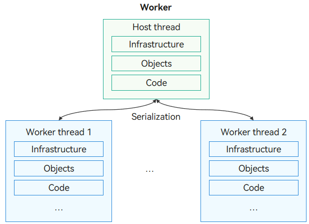

# Worker

Worker primarily provides a multithreaded runtime environment for applications, allowing them to separate from the host thread during execution. This enables scripts to run in background threads for time-consuming operations, significantly reducing the likelihood of blocking the host thread during compute-intensive or high-latency tasks. For details about the APIs and their usage, see [Worker](../reference/apis-arkts/js-apis-worker.md).


## Worker Operating Mechanism

**Figure 1** Worker operating mechanism



When creating a Worker, the thread that initiates it is referred to as the host thread (not necessarily the main thread, as worker threads can also create child Workers). The Worker itself runs in its own thread, known as a Worker thread or actor thread. Each Worker thread operates independently, with its own infrastructure, objects, and code segments, which incurs some memory overhead for each Worker. Therefore, the number of Worker threads should be limited. The Worker thread communicates with the host thread by means of message exchange. They use the serialization technique to exchange commands and data.


## Precautions for Worker

- A Worker can be created manually or automatically. In manual creation mode, you must also synchronize the related configuration. For details, see [Precautions for Creating a Worker](#precautions-for-creating-a-worker).
- When using Worker capabilities, the URL of the Worker thread file passed in the constructor varies by API version. For specifics, see [Precautions for File URLs](#precautions-for-file-urls).
- After a Worker is created, its lifecycle must be managed manually. A maximum of 64 Worker threads can run simultaneously, and the total number cannot exceed 80, including those created with [napi_create_ark_runtime](../reference/native-lib/napi.md#napi_create_ark_runtime). For details, see [Precautions for Lifecycle Management](#precautions-for-lifecycle-management).
- The context objects in different threads are different. Therefore, Worker threads can use only thread-safe libraries. For example, non-thread-safe UI-related libraries cannot be used.
- A maximum of 16 MB data can be serialized.
- When using the Worker module, you are advised to register the **onAllErrors** callback in the host thread in API version 18 or later to capture various exceptions that may occur during the lifecycle of the Worker thread. In API version 15 or earlier, register the **onerror** callback. If neither of them is registered, JS crash occurs when the Worker thread is abnormal. Note that the **onerror** callback can only capture synchronous exceptions within the **onmessage** callback. Once an exception is captured, the Worker thread will proceed to the destruction process and cannot be used. For details, see [Behavior Differences Between onAllErrors and onerror](#behavior-differences-between-onallerrors-and-onerror).
- Worker thread files cannot be used across HAPs.
- Before referencing a HAR or HSP, configure the dependency on the HAR or HSP. For details, see [Referencing a Shared Package](https://developer.huawei.com/consumer/en/doc/harmonyos-guides-V5/ide-har-import-V5).
- [AppStorage](../quick-start/arkts-appstorage.md) cannot be used in Worker threads.
- Starting from API version 18, the priority of the Worker thread can be specified in the [WorkerOptions](../reference/apis-arkts/js-apis-worker.md#workeroptions) parameter of the constructor.

### Precautions for Creating a Worker

The Worker thread file must be placed in the ***{moduleName}*/src/main/ets/** directory to be included in the application package. There are two ways to create Worker thread directories and files: manually and automatically.

- Manual creation: Manually create the directory and file, and configure the related field in **build-profile.json5** so that the Worker thread file can be packed into the application package.

  Stage model:

  ```json
  "buildOption": {
    "sourceOption": {
      "workers": [
        "./src/main/ets/workers/worker.ets"
      ]
    }
  }
  ```

  FA model:

  ```json
  "buildOption": {
    "sourceOption": {
      "workers": [
        "./src/main/ets/MainAbility/workers/worker.ets"
      ]
    }
  }
  ```

- Automatic creation: DevEco Studio supports one-click generation of Workers. Right-click any position in the {moduleName} directory and choose **New > Worker** to generate the Worker template file and configuration information. There is no need to configure the fields in **build-profile.json5**.


### Precautions for File URLs

Before calling an API of the Worker module, you must create a Worker object. The constructor is related to the API version and requires the URL to the Worker thread file to be passed in **scriptURL**.

```ts
// Import the module.
import { worker } from '@kit.ArkTS';

// Use the following function in API version 9 and later versions:
const worker1: worker.ThreadWorker = new worker.ThreadWorker('entry/ets/workers/worker.ets');
// Use the following function in API version 8 and earlier versions:
const worker2: worker.Worker = new worker.Worker('entry/ets/workers/worker.ets');
```


#### File URL Rules in Stage Model

The requirements for **scriptURL** in the constructor are as follows:

- **scriptURL** consists of {moduleName}/ets and {relativePath}.
- {relativePath} is the relative path of the Worker thread file to the ***{moduleName}*/src/main/ets/** directory.

(1) Loading a Worker thread file of an ability

To load the Worker thread file of an ability, use the URL {moduleName}/ets/{relativePath}.

```ts
import { worker } from '@kit.ArkTS';

// URL of the Worker thread file: "entry/src/main/ets/workers/worker.ets"
const workerStage1: worker.ThreadWorker = new worker.ThreadWorker('entry/ets/workers/worker.ets');

// URL of the Worker thread file: "testworkers/src/main/ets/ThreadFile/workers/worker.ets"
const workerStage2: worker.ThreadWorker = new worker.ThreadWorker('testworkers/ets/ThreadFile/workers/worker.ets');
```

(2) Loading a Worker thread file from an [HSP](../quick-start/in-app-hsp.md)

To load the Worker thread file from an HSP, use the URL {moduleName}/ets/{relativePath}.

```ts
import { worker } from '@kit.ArkTS';

// URL of the Worker thread file: "hsp/src/main/ets/workers/worker.ets"
const workerStage3: worker.ThreadWorker = new worker.ThreadWorker('hsp/ets/workers/worker.ets');
```

(3) Loading a Worker thread file from an [HAR](../quick-start/har-package.md)

There are two scenarios for loading a Worker thread file from an HAR:

- @ path loading: All types of modules load the Worker thread file from the local HAR. The URL is @{moduleName}/ets/{relativePath}.

- Relative path loading: The local HAR loads the Worker thread file within the same package. The URL is the relative path of the file where the Worker object is created to the Worker thread file.

>**NOTE**
>
>When **useNormalizedOHMUrl** is enabled (the **useNormalizedOHMUrl** field of the **strictMode** property in the application-level **build-profile.json5** file at the same level as the entry in the project directory is set to **true**) or when the HAR is used as a third-party package, the Worker thread file contained the HAR can be loaded using a relative path.

```ts
import { worker } from '@kit.ArkTS';

// @ path loading:
// URL of the Worker thread file: "har/src/main/ets/workers/worker.ets"
const workerStage4: worker.ThreadWorker = new worker.ThreadWorker('@har/ets/workers/worker.ets');

// Relative path loading:
// URL of the Worker thread file: "har/src/main/ets/workers/worker.ets"
// URL of the file where the Worker object is created: "har/src/main/ets/components/mainpage/MainPage.ets"
const workerStage5: worker.ThreadWorker = new worker.ThreadWorker('../../workers/worker.ets');
```


#### File URL Rules in FA Model

**scriptURL** in the constructor is the relative path from the Worker thread file to "{moduleName}/src/main/ets/MainAbility".

```ts
import { worker } from '@kit.ArkTS';

// The following three scenarios are involved.

// Scenario 1: URL of the Worker thread file: "{moduleName}/src/main/ets/MainAbility/workers/worker.ets"
const workerFA1: worker.ThreadWorker = new worker.ThreadWorker("workers/worker.ets", {name:"first worker in FA model"});

// Scenario 2: URL of the Worker thread file: "{moduleName}/src/main/ets/workers/worker.ets"
const workerFA2: worker.ThreadWorker = new worker.ThreadWorker("../workers/worker.ets");

// Scenario 3: URL of the Worker thread file: "{moduleName}/src/main/ets/MainAbility/ThreadFile/workers/worker.ets"
const workerFA3: worker.ThreadWorker = new worker.ThreadWorker("ThreadFile/workers/worker.ets");
```


### Precautions for Lifecycle Management

- Creating and destroying Worker consume system resources. Therefore, you are advised to manage created Workers efficiently and reuse them when possible. Idle Workers continue to run. When a Worker is no longer needed, call [terminate()](../reference/apis-arkts/js-apis-worker.md#terminate9) or [close()](../reference/apis-arkts/js-apis-worker.md#close9) to destroy it actively. If a Worker is in a non-running state such as destroyed or being destroyed, calling its functional interfaces will throw corresponding errors.


- The number of Workers is determined by the memory management policy, with a set memory threshold being the smaller of 1.5 GB and 60% of the device's physical memory. Under memory constraints, a maximum of 64 Workers can run simultaneously. If an attempt is made to create more Workers than this limit, the system displays the error message "Worker initialization failure, the number of Workers exceeds the maximum." The actual number of running Workers will be dynamically adjusted based on current memory usage. Once the cumulative memory usage of all Workers and the main thread exceeds the set threshold, Out of Memory (OOM) error occurs, and applications may crash.


### Behavior Differences Between onAllErrors and onerror

1. Exception Capture Range

    **onAllErrors** can capture global exceptions generated during the **onmessage** callback, timer callback, and file execution of the Worker thread.

    **onerror** can capture only exceptions generated by synchronous methods within the **onmessage** callback. It cannot capture exceptions from multithreaded callbacks or modularization-related exceptions.

2. Thread State After Exception Capture

    After an exception is captured by **onAllErrors**, the Worker thread remains alive and can continue to be used. This allows you to perform additional operations after an exception is captured, without worrying about the thread being terminated.

    Once an exception is captured by **onerror**, the Worker thread enters the destruction process and cannot be used. This means that after **onerror** is triggered, the Worker thread will be terminated, and subsequent operations cannot proceed.

3. Applicable Scenarios

    **onAllErrors** applies to scenarios where all types of exceptions in the Worker thread need to be captured, especially in complex scenarios where the Worker thread must continue running after an exception occurs.

    **onerror** is appropriate for simple scenarios where only synchronous exceptions in the **onmessage** callback need to be captured. Since the thread is destroyed after an exception is captured, it is best used when the Worker thread is not needed afterward.

    **onAllErrors** is recommended because it provides more comprehensive exception capture capabilities and does not lead to thread termination.


## Basic Usage Example of Worker

1. In DevEco Studio, right-click any position in the {moduleName} directory and choose **New > Worker** to automatically generate the Worker template file and configuration information. This section uses the creation of "worker" as an example.

   You can also manually create Worker thread files. For specific methods and related considerations, see [Precautions for Creating a Worker](#precautions-for-creating-a-worker).

2. Import the Worker module.

    ```ts
    // Index.ets
    import { ErrorEvent, MessageEvents, worker } from '@kit.ArkTS'
    ```

3. In the host thread, call [constructor()](../reference/apis-arkts/js-apis-worker.md#constructor9) of **ThreadWorker** to create a Worker object, and register callback functions. The calling thread is the host thread.

      ```ts
      // Index.ets
      @Entry
      @Component
      struct Index {
        @State message: string = 'Hello World';

        build() {
          RelativeContainer() {
            Text(this.message)
              .id('HelloWorld')
              .fontSize(50)
              .fontWeight(FontWeight.Bold)
              .alignRules({
                center: { anchor: '__container__', align: VerticalAlign.Center },
                middle: { anchor: '__container__', align: HorizontalAlign.Center }
              })
              .onClick(() => {
                // Create a Worker object.
                let workerInstance = new worker.ThreadWorker('entry/ets/workers/worker.ets');

                // Register the onmessage callback. When the host thread receives a message from the Worker thread through the workerPort.postMessage interface, this callback is invoked and executed in the host thread.
                workerInstance.onmessage = (e: MessageEvents) => {
                  let data: string = e.data;
                  console.info("workerInstance onmessage is: ", data);
                }

                // Register the onAllErrors callback to capture global exceptions generated during the onmessage callback, timer callback, and file execution of the Worker thread. This callback is executed in the host thread.
                workerInstance.onAllErrors = (err: ErrorEvent) => {
                  console.info("workerInstance onAllErrors message is: " + err.message);
                }

                // Register the onmessageerror callback. When the Worker object receives a message that cannot be serialized, this callback is invoked and executed in the host thread.
                workerInstance.onmessageerror = () => {
                  console.info('workerInstance onmessageerror');
                }

                // Register the onexit callback. When the Worker object is destroyed, this callback is invoked and executed in the host thread.
                workerInstance.onexit = (e: number) => {
                  // When the Worker object exits normally, the code is 0. When the Worker object exits abnormally, the code is 1.
                  console.info("workerInstance onexit code is: ", e);
                }

                // Send a message to the Worker thread.
                workerInstance.postMessage('1');
              })
          }
          .height('100%')
          .width('100%')
        }
      }
      ```

4. Register the callback functions in the Worker thread file.

      ```ts
      // worker.ets
      import { ErrorEvent, MessageEvents, ThreadWorkerGlobalScope, worker } from '@kit.ArkTS';

      const workerPort: ThreadWorkerGlobalScope = worker.workerPort;

      // Register the onmessage callback. When the Worker thread receives a message from the host thread through the postMessage interface, this callback is invoked and executed in the Worker thread.
      workerPort.onmessage = (e: MessageEvents) => {
        let data: string = e.data;
        console.info('workerPort onmessage is: ', data);

        // Send a message to the main thread.
        workerPort.postMessage('2');
      }

      // Register the onmessageerror callback. When the Worker object receives a message that cannot be serialized, this callback is invoked and executed in the Worker thread.
      workerPort.onmessageerror = () => {
        console.info('workerPort onmessageerror');
      }

      // Register the onerror callback. When an exception occurs during the execution of the Worker thread, this callback is invoked and executed in the Worker thread.
      workerPort.onerror = (err: ErrorEvent) => {
        console.info('workerPort onerror err is: ', err.message);
      }
      ```


## Loading Worker Across HARs

1. Create an HAR. For details, see [HAR](../quick-start/har-package.md).

2. Create the Worker thread file in the HAR.

   ```ts
   // worker.ets
   workerPort.onmessage = (e: MessageEvents) => {
     console.info("worker thread receive message: ", e.data);
     workerPort.postMessage('worker thread post message to main thread');
   }
   ```

3. Configure the dependency of the HAR in the **oh-package.json5** file of the entry module.

   ```ts
   // Configure the dependency of the HAR in the entry module.
   {
     "name": "entry",
     "version": "1.0.0",
     "description": "Please describe the basic information.",
     "main": "",
     "author": "",
     "license": "",
     "dependencies": {
       "har": "file:../har"
     }
   }
   ```

4. Load the Worker thread file from the HAR in the entry module.

   ```ts
   // Index.ets
   import { worker } from '@kit.ArkTS';

   @Entry
   @Component
   struct Index {
     @State message: string = 'Hello World';

     build() {
       RelativeContainer() {
         Text(this.message)
           .id('HelloWorld')
           .fontSize(50)
           .fontWeight(FontWeight.Bold)
           .alignRules({
             center: { anchor: '__container__', align: VerticalAlign.Center },
             middle: { anchor: '__container__', align: HorizontalAlign.Center }
           })
           .onClick(() => {
             // Use @ path loading mode and load the Worker thread file from the HAR.
             let workerInstance = new worker.ThreadWorker('@har/ets/workers/worker.ets');
             workerInstance.onmessage = () => {
               console.info('main thread onmessage');
             };
             workerInstance.postMessage('hello world');
           })
       }
       .height('100%')
       .width('100%')
     }
   }
   ```


## Multi-Level Worker Lifecycle Management
Multi-level Workers can be created (a hierarchical thread relationship is formed by the mechanism of creating child Workers through parent Workers), and the lifecycle of Worker threads should be manually managed. Therefore, it is important to properly manage the lifecycle of multi-level Workers. If a parent Worker is destroyed without terminating its child Workers, unpredictable results may occur. It is recommended that you ensure the lifecycle of child Workers always remains within the lifecycle of the parent Worker and that all child Workers are terminated before destroying the parent Worker.


### Recommended Usage Example

```ts
// Create a Worker thread (parent Worker) in the main thread, and create a Worker thread (child Worker) in the parent Worker.
// main thread
import { worker, MessageEvents, ErrorEvent } from '@kit.ArkTS';

// Create a parent Worker object in the main thread.
const parentworker = new worker.ThreadWorker("entry/ets/workers/parentworker.ets");

parentworker.onmessage = (e: MessageEvents) => {
  console.info("The main thread receives a message from the parent Worker" + e.data);
}

parentworker.onexit = () => {
  console.info("The parent Worker exits");
}

parentworker.onAllErrors = (err: ErrorEvent) => {
  console.info("The main thread receives an error from the parent Worker" + err);
}

parentworker.postMessage("The main thread sends a message to the parent Worker - recommended example");
```

```ts
// parentworker.ets
import { ErrorEvent, MessageEvents, ThreadWorkerGlobalScope, worker } from '@kit.ArkTS';

// Create an object in the parent Worker for communicating with the main thread.
const workerPort: ThreadWorkerGlobalScope = worker.workerPort;

workerPort.onmessage = (e : MessageEvents) => {
  if (e.data == "The main thread sends a message to the parent Worker - recommended example") {
    let childworker = new worker.ThreadWorker("entry/ets/workers/childworker.ets");

    childworker.onmessage = (e: MessageEvents) => {
      console.info("The parent Worker receives a message from the child Worker" + e.data);
      if (e.data == "The child Worker sends information to the parent Worker") {
        workerPort.postMessage("The parent Worker sends a message to the main thread");
      }
    }

    childworker.onexit = () => {
      console.info("The child Worker exits");
      // Destroy the parent Worker after the child Worker exits.
      workerPort.close();
    }

    childworker.onAllErrors = (err: ErrorEvent) => {
      console.info("An error occurred on the child Worker" + err);
    }

    childworker.postMessage("The parent Worker sends a message to the child Worker - recommended example");
  }
}
```

```ts
// childworker.ets
import { ErrorEvent, MessageEvents, ThreadWorkerGlobalScope, worker } from '@kit.ArkTS';

// Create an object in the child Worker for communicating with the parent Worker.
const workerPort: ThreadWorkerGlobalScope = worker.workerPort;

workerPort.onmessage = (e: MessageEvents) => {
  if (e.data == "The parent Worker sends a message to the child Worker - recommended example") {
    // Service logic of the child Worker...
    console.info("The service execution is complete, and the child Worker is destroyed");
    workerPort.close();
  }
}
```


### Not Recommended Example

It is not recommended that a child Worker send messages to the parent Worker after the parent Worker is destroyed.

```ts
// main thread
import { worker, MessageEvents, ErrorEvent } from '@kit.ArkTS';

const parentworker = new worker.ThreadWorker("entry/ets/workers/parentworker.ets");

parentworker.onmessage = (e: MessageEvents) => {
  console.info("The main thread receives a message from the parent Worker" + e.data);
}

parentworker.onexit = () => {
  console.info("The parent Worker exits");
}

parentworker.onAllErrors = (err: ErrorEvent) => {
  console.info("The main thread receives an error from the parent Worker" + err);
}

parentworker.postMessage("The main thread sends a message to the parent Worker");
```

```ts
// parentworker.ets
import { ErrorEvent, MessageEvents, ThreadWorkerGlobalScope, worker } from '@kit.ArkTS';

const workerPort: ThreadWorkerGlobalScope = worker.workerPort;

workerPort.onmessage = (e : MessageEvents) => {
  console.info("The parent Worker receives a message from the main thread" + e.data);

  let childworker = new worker.ThreadWorker("entry/ets/workers/childworker.ets")

  childworker.onmessage = (e: MessageEvents) => {
    console.info("The parent Worker receives a message from the child Worker" + e.data);
  }

  childworker.onexit = () => {
    console.info("The child Worker exits");
    workerPort.postMessage("The parent Worker sends a message to the main thread");
  }

  childworker.onAllErrors = (err: ErrorEvent) => {
    console.info("An error occurred on the child Worker" + err);
  }

  childworker.postMessage("The parent Worker sends a message to the child Worker");

  // Destroy the parent Worker after the child Worker is created.
  workerPort.close();
}
```

```ts
// childworker.ets
import { ErrorEvent, MessageEvents, ThreadWorkerGlobalScope, worker } from '@kit.ArkTS';

const workerPort: ThreadWorkerGlobalScope = worker.workerPort;

workerPort.onmessage = (e: MessageEvents) => {
  console.info("The child Worker receives a message" + e.data);

  // After the parent Worker is destroyed, the child Worker sends a message to the parent Worker. The behavior is unpredictable.
  workerPort.postMessage("The child Worker sends a message to the parent Worker");
  setTimeout(() => {
    workerPort.postMessage("The child Worker sends a message to the parent Worker");
  }, 1000);
}
```

You are not advised to create a child Worker in the parent Worker before and after a synchronous call that clearly triggers the destruction of the parent Worker. Furthermore, avoid creating a child Worker in the parent Worker if there is any uncertainty about whether the parent Worker is being destroyed. Ensure that the parent Worker remains active before the child Worker is successfully created.

```ts
// main thread
import { worker, MessageEvents, ErrorEvent } from '@kit.ArkTS';

const parentworker = new worker.ThreadWorker("entry/ets/workers/parentworker.ets");

parentworker.onmessage = (e: MessageEvents) => {
  console.info("The main thread receives a message from the parent Worker" + e.data);
}

parentworker.onexit = () => {
  console.info("The parent Worker exits");
}

parentworker.onAllErrors = (err: ErrorEvent) => {
  console.info("The main thread receives an error from the parent Worker" + err);
}

parentworker.postMessage("The main thread sends a message to the parent Worker");
```

```ts
// parentworker.ets
import { ErrorEvent, MessageEvents, ThreadWorkerGlobalScope, worker } from '@kit.ArkTS';

const workerPort: ThreadWorkerGlobalScope = worker.workerPort;

workerPort.onmessage = (e : MessageEvents) => {
  console.info("The parent Worker receives a message from the main thread" + e.data);

  // Create a child Worker after the parent Worker is destroyed. The behavior is unpredictable.
  workerPort.close();
  let childworker = new worker.ThreadWorker("entry/ets/workers/childworker.ets");

  // Destroy the parent Worker before it is confirmed that the child Worker is successfully created. The behavior is unpredictable.
  // let childworker = new worker.ThreadWorker("entry/ets/workers/childworker.ets");
  // workerPort.close();

  childworker.onmessage = (e: MessageEvents) => {
    console.info("The parent Worker receives a message from the child Worker" + e.data);
  }

  childworker.onexit = () => {
    console.info("The child Worker exits");
    workerPort.postMessage("The parent Worker sends a message to the main thread");
  }

  childworker.onAllErrors = (err: ErrorEvent) => {
    console.info("An error occurred on the child Worker" + err);
  }

  childworker.postMessage("The parent Worker sends a message to the child Worker");
}
```

```ts
// childworker.ets
import { ErrorEvent, MessageEvents, ThreadWorkerGlobalScope, worker } from '@kit.ArkTS';

const workerPort: ThreadWorkerGlobalScope = worker.workerPort;

workerPort.onmessage = (e: MessageEvents) => {
  console.info("The child Worker receives a message" + e.data);
}
```
