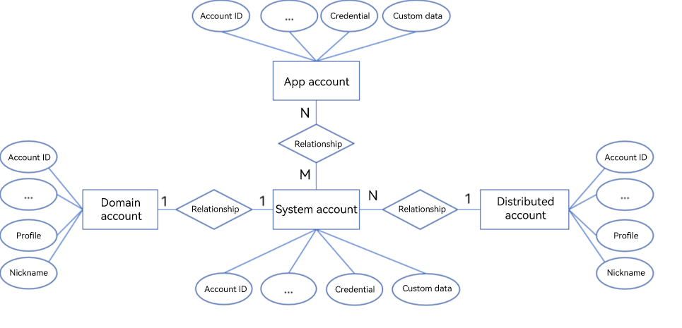

# Account Management Overview

## Introduction

The system allows multiple system (OS) accounts to be created on a device. This allows multiple users to use the same device. The data of multiple users is isolated by system account to ensure data security.

## Basic Concepts

Users are identified by accounts. A user can have multiple accounts. The **account** module manages the following types of accounts:

- System account: unique identifier of a user on a device.

- Domain account: unique identifier of a user in a specific domain, such as a company or school.

- Distributed account: identifier of a user on a distributed network. It is provisioned, authenticated, and maintained by an organization or authority and can be used for authentication, networking, and service invocation between devices.

- App account: unique identifier of an app user. Its lifecycle is managed by the application.

## Relationships Between Accounts

The **account** module uses the system account as the core for account management, in which other types of accounts are related to the system account in one way or another.

- The domain account and the system account are in one-to-one (1:1) relationship, and have the same lifecycle.
- The distributed account and the system account are in one-to-many (1:N) relationship. A user can bind a distributed account to a system account. Different system accounts can have the same distributed account. The lifecycle of a distributed account is independent of that of a system account.
- The app account and the system account are in many-to-many (N:M) relationship. A user can have multiple app accounts under different system accounts. Different system accounts can have the same app account. The lifecycle of an app account is independent of that of a system account.
- There is no direct relationship between the domain account, distributed account, and app account.

When a system account is deleted, the associated domain account, distributed account, and app accounts are also deleted.