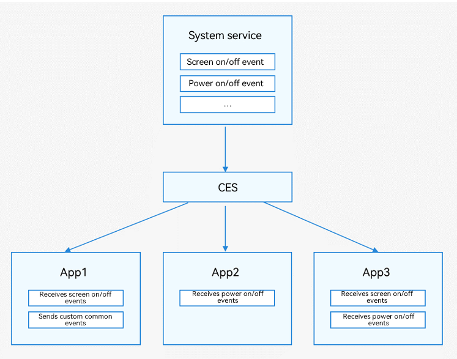

# Introduction to Common Events

Common Event Service (CES) is provided for applications to subscribe to, publish, and unsubscribe from common events.

Common events are classified into system common events and custom common events.

- System common events: defined in CES. Currently, only system applications and system services can publish system common events, such as HAP installation, update, and uninstall. For details about the supported system common events, see [System Common Events](../reference/apis/commonEventManager-definitions.md).
- Custom common events: customized by applications to implement cross-process event communication.

Common events are also classified into unordered, ordered, and sticky common events.

- Unordered common events: common events that CES forwards regardless of whether subscribers receive the events and when they subscribe to the events.
- Ordered common events: common events that CES forwards based on the subscriber priority. CES preferentially forwards an ordered common event to the subscriber with higher priority, waits until the subscriber receives the event, and then forwards the events to the subscriber with lower priority. Subscribers with the same priority receive common events in a random order.
- Sticky common events: common events that can be sent to a subscriber before or after they initiate a subscription. Only system applications and system services can send sticky common events, which remain in the system after being sent. The sends must first request the **ohos.permission.COMMONEVENT_STICKY** permission. For details, see [Declaring Permissions](../../security/AccessToken/declare-permissions.md).

Each application can subscribe to common events as required. After your application subscribes to a common event, the system sends it to your application every time the event is published. Such an event may be published by the system, other applications, or your own application.

**Figure 1** Common events

 <!--no_check--> 