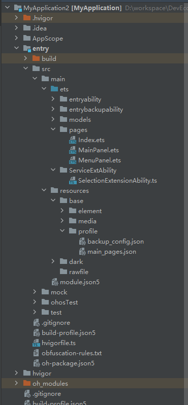

# Developing a Word Selection Application (for System Applications Only)

## Available APIs

For details about the following APIs, see [selectionInput.SelectionManager](../../reference/apis-basic-services-kit/js-apis-selectionInput-selectionManager-sys.md).

| Name| Description|
| ---- | ---- |
| on(type: 'selectionCompleted', callback: Callback\<SelectionInfo\>): void | Subscribes to the word selection completion event. This API uses a callback to return the result.|
| createPanel(ctx: Context, info: PanelInfo): Promise\<Panel\> | Creates a word selection panel.|
| show(): Promise\<void\> | Shows the word selection panel.|

## How to Develop

1. Create a project for the word selection application on DevEco Studio.

    1. In the **ets** directory of a module in the project, right-click and choose **New** > **Directory** to create a directory named **ServiceExtAbility**.

    2. In the **pages** directory, create two page files **MainPanel.ets** and **MenuPanel.ets** from the menu bar. In the **ServiceExtAbility** directory, right-click and choose **New** > **File** to create the **SelectionExtensionAbility.ts** file. The directory structure is as follows:

    ```
    /src/main/
    ├── ets/
    │   ├── pages
    │   |   ├── MainPanel.ets                    # Main panel
    │   |   └── MenuPanel.ets                    # Menu panel
    |   └── ServiceExtAbility
    │       └── SelectionExtensionAbility.ts     # Word selection extension ability
    ├── resources/base/profile/main_pages.json
    ├── module.json5                             # Configuration file
    ```

    

2. Inherit from [SelectionExtensionAbility](../../reference/apis-basic-services-kit/js-apis-selectionInput-selectionExtensionAbility-sys.md) and implement the extended lifecycle functions.
    ```ts
    import { selectionManager, PanelInfo, PanelType, SelectionExtensionAbility } from '@kit.BasicServicesKit';

    class SelectionAbilityStub extends rpc.RemoteObject {
      constructor(des) {
        if (typeof des === 'string') {
          super(des);
        } else {
          return null;
        }
      }

      onRemoteMessageRequest(
        code: number,
        data: rpc.MessageSequence,
        reply: rpc.MessageSequence,
        options: rpc.MessageOption
      ): boolean | Promise<boolean> {
        return true;
      }
    }

    class ServiceExtAbility extends SelectionExtensionAbility {
      panel_: selectionManager.Panel = undefined;

      onConnect(want: Want): rpc.RemoteObject {
        return new SelectionAbilityStub('remote');
      }

      onDisconnect(): void {
      }
    }
    ```

3. Listen for the word selection events using the **on** API when SelectionExtensionAbility is started.
    ```ts
    selectionManager.on('selectionCompleted', (info: selectionManager.SelectionInfo) => {
    });
    ```

4. Create a word selection panel using the **createPanel** API when SelectionExtensionAbility is started.
    ```ts
    let panelInfo: PanelInfo = {
      panelType: PanelType.MENU_PANEL,
      x: 0,
      y: 0,
      width: 500,
      height: 200
    }
    selectionManager.createPanel(this.context, panelInfo)
      .then(async (panel: selectionManager.Panel) => {
        panel.setUiContent('pages/MenuPanel')
          .then(()=>{
          })
          .catch((error: BusinessError) => {
          });
        this.panel_ = panel;
      })
      .catch((error: BusinessError) => {
      });
    ```
5. Destroy the word selection panel using the **destroyPanel** API when the word selection task ends.
    ```ts
    selectionManager.destroyPanel(this.panel_);
    ```

6. Configure the **module.json5** file.

    Configure the path of the SelectionExtensionAbility file in the **extensionAbilities** field.

    ```json
    {
      "module": {
      // ...
        "extensionAbilities": [
          {
            "name": "SelectionExtensionAbility",
            "srcEntry": "./ets/ServiceExtAbility/SelectionExtensionAbility.ts",
            "type": "selection",
            "exported": false,
          }
        ]
      }
    }
    ```

## Debugging and Verification

1. Set system parameters to configure the word selection service.

    1. Enable word selection service.
    2. Set the current application as the word selection application.
    3. Set the operation mode for word selection.

2. Monitor the process of starting SelectionExtensionAbility via logs.

    View logs in the **Hilog** window on DevEco Studio.

3. Click text to select it and observe the word selection panel displayed on the application.
