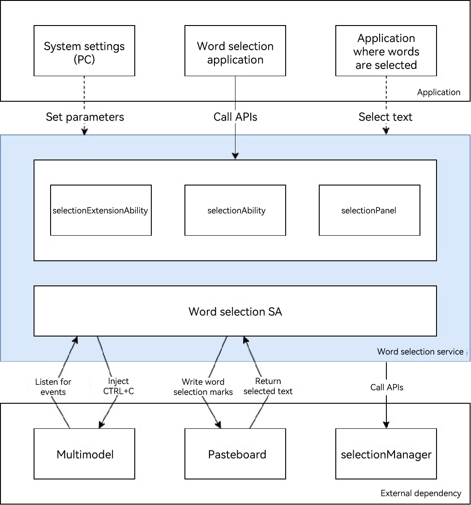

# Overview of Word Selection Service (for System Applications Only)

Since API version 20, the word selection service is available. It provides capabilities for processing text across applications and managing word selection applications.

This service is mainly used in scenarios such as text translation, content summarization, and term explanation. For example, when a user long presses a word in a news article in foreign language, the translation service is automatically triggered and the translation is displayed in a floating window; when a user selects a long paragraph in a reading application, this content can be quickly summarized; when a user selects a professional term in an education application, an instant explanation card is displayed.

## Working Principles

The word selection service can be enabled or disabled as required. When the service is enabled, it listens for multimodal events to identify word selection actions, sets word selection marks through the pasteboard API, and triggers the simulated **CTRL+C** operations. After the selected text is written to the pasteboard, the pasteboard calls the API of the service to return the selected content, which is then sent to the application for processing.

## Capabilities

- Selecting words:

  Hold left mouse button and move the cursor, double-click, and triple-click.

- Managing the word selection panels:

  You can create and manage menu panels and main panels, perform panel operations (such as adding, moving, hiding, and destroying panels), and configure panel content.

## Constraints

- This service is supported on 2-in-1 devices with external keyboards and mouses.

- The maximum length of selected text is 6000 bytes.
