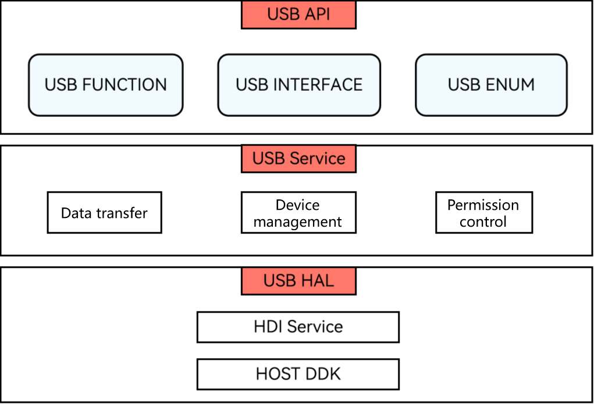

# USB Service Overview

<!--Kit: Basic Services Kit-->
<!--Subsystem: USB-->
<!--Owner: @hwymlgitcode-->
<!--Designer: @w00373942-->
<!--Tester: @dong-dongzhen-->
<!--Adviser: @w_Machine_cc-->

## Basic Concepts

The USB service is an abstraction of underlying hardware-based USB devices. Your application can access the USB devices via the USB service. With the APIs provided by the USB service, you can obtain the list of connected USB devices, manage device access permissions, and perform data transfer or control transfer between the host and connected devices.

## Working Principles

The USB subsystem logically consists of three parts: USB API, USB Service, and USB HAL. The following figure shows how the USB service is implemented.

**Figure 1** Implementation of the USB service

- USB API: provides USB APIs that implement various basic functions, for example, query of the USB device list, bulk data transfer, control transfer, and right management.

- USB Service: receives, parses, and distributes Hardware Abstraction Layer \(HAL\) data, and manages devices.

- USB HAL: provides driver capability APIs that can be directly called in user mode.
