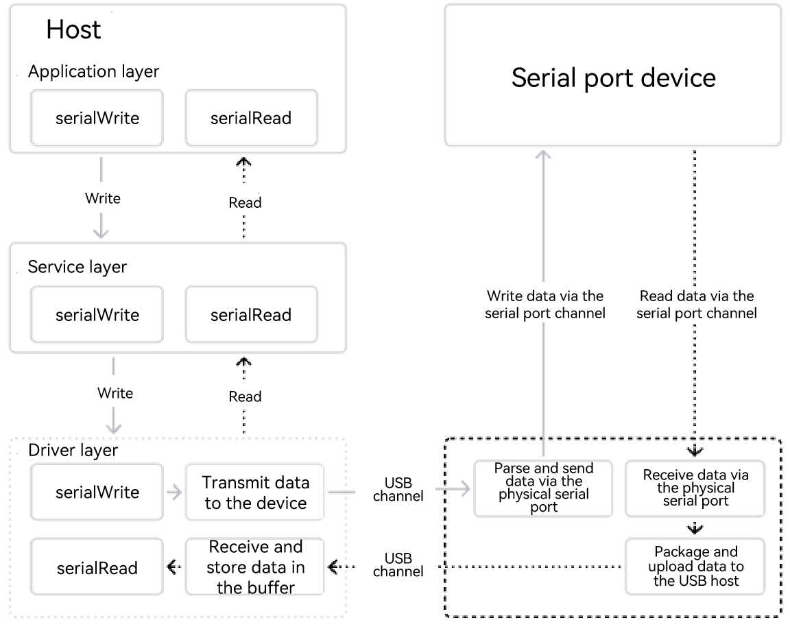

# USB Serial Communication Development Overview

## Overview

The USB serial communication service provides the USB host-to-serial port communication. With this service, you can obtain the list of connected ports that comply with the USB host-to-serial protocol and be able to enable and disable ports, set parameters, obtain parameters, read data, write data, and manage device permissions.

For details about configuration management and communication management, see [USB Serial Configuration Management](usbSerial-configuration.md) and [USB Serial Communication Management](usbSerial-communication.md) respectively.

### Basic Concepts

Before developing the service, you should have a basic understanding of the following concepts:

- Serial port
  
  It is an expansion interface that uses serial communication, where data is transmitted sequentially one bit at a time. The serial port features simple communication lines. Only one pair of transmission lines is required to implement a two-way communication in a long distance.

### Implementation Principles

The USB serial port service consists of two phases:

- Identify the device and load the driver.

  After a USB-to-serial device is inserted, the USB host initiates an enumeration process over the USB bus to obtain the device descriptor (such as the vendor ID, device ID, and USB identifier of the communication device class). The OS matches the driver based on the descriptor to initialize the device and register the virtual serial port.

- Transmit and receive data.

  Transmitting data:
  The application layer sends data. → The driver transmits the data to the device through the USB channel. → The device parses the data and sends the data to the serial port device through the physical serial port.
  
  Receiving data:
  The device receives the data from the physical serial port. → The device packages and uploads data to the USB host. → The driver receives and stores data in the serial port buffer. → The application layer reads the data.

**Figure 1** Process of transmitting and receiving data

### Constraints

- Before data transmission between the host and the serial port device, you need to request a permission to access the device. Data can be transmitted only after the user grants the permission.

- If the configuration parameters during data transmission are not set, the default configuration parameters are used (baud rate: 9600 bit/s; data bit: 8; parity bit: 0; stop bit: 1).

## Preparing the Environment

### Environment Requirements

- Development tool and configuration:

  As a development tool, DevEco Studio is a prerequisite for developing the USB serial communication service. You can use DevEco Studio to perform development, debugging, and packaging. [Download and install](https://developer.huawei.com/consumer/cn/download/) DevEco Studio and verify basic operations to ensure that it can function properly. For details, see [Creating and Running a Project](https://developer.huawei.com/consumer/en/doc/harmonyos-guides-V14/ide-create-new-project-V14) in [DevEco Studio User Guide](https://developer.huawei.com/consumer/en/doc/harmonyos-guides-V14/ide-tools-overview-V14).

- SDK version configuration:

  API version 18 or later.

### Environment Setup

- Install [DevEco Studio](https://developer.huawei.com/consumer/cn/download/deveco-studio) 4.1 or later on the PC.
- Update the public-SDK to API version 18 or later. For details, see [OpenHarmony SDK Upgrade Assistant](../../../tools/openharmony_sdk_upgrade_assistant.md).
- Prepare a USB-to-serial cable. Connect the USB port and the serial port of the cable to that of the OpenHarmony device.

<!--no_check-->