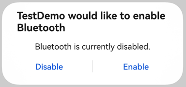
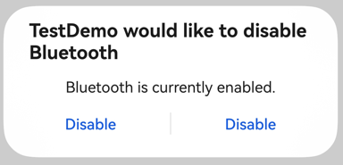

# Bluetooth Setting

## Introduction
This topic walks you through how to implement basic Bluetooth settings, including enabling and disabling Bluetooth and obtaining the Bluetooth status. Before using Bluetooth-dependent functions, ensure that Bluetooth is enabled.

## How to Develop

### Applying for Required Permissions
Apply for the **ohos.permission.ACCESS_BLUETOOTH** permission. For details about how to configure and apply for permissions, see [Declaring Permissions](../../security/AccessToken/declare-permissions.md) and [Requesting User Authorization](../../security/AccessToken/request-user-authorization.md).

### Importing Required Modules
Import the **access** and **BusinessError** modules.
```ts
import { access } from '@kit.ConnectivityKit';
import { BusinessError } from '@kit.BasicServicesKit';
```

### Subscribing to Bluetooth Status Change Events
You can subscribe to the Bluetooth status change events to obtain the real-time Bluetooth status. When Bluetooth is enabled or disabled, the Bluetooth status changes. [STATE_ON](../../reference/apis-connectivity-kit/js-apis-bluetooth-access.md#bluetoothstate) indicates that Bluetooth is enabled while [STATE_OFF](../../reference/apis-connectivity-kit/js-apis-bluetooth-access.md#bluetoothstate) indicates the opposite. An application can use Bluetooth-dependent functions only if Bluetooth is enabled.
```ts
// Define the callback for Bluetooth status change events.
function onReceiveEvent(data: access.BluetoothState) {
  let btStateMessage = '';
  switch (data) {
    case access.BluetoothState.STATE_OFF:
      // Bluetooth is disabled.
      btStateMessage += 'STATE_OFF';
      break;
    case access.BluetoothState.STATE_TURNING_ON:
      btStateMessage += 'STATE_TURNING_ON';
      break;
    case access.BluetoothState.STATE_ON:
      // Bluetooth is enabled. In this case, the application can use Bluetooth-dependent functions.
      btStateMessage += 'STATE_ON';
      break;
    case access.BluetoothState.STATE_TURNING_OFF:
      btStateMessage += 'STATE_TURNING_OFF';
      break;
    case access.BluetoothState.STATE_BLE_TURNING_ON:
      btStateMessage += 'STATE_BLE_TURNING_ON';
      break;
    case access.BluetoothState.STATE_BLE_ON:
      btStateMessage += 'STATE_BLE_ON';
      break;
    case access.BluetoothState.STATE_BLE_TURNING_OFF:
      btStateMessage += 'STATE_BLE_TURNING_OFF';
      break;
    default:
      btStateMessage += 'unknown state';
      break;
  }
  console.info('bluetooth state: ' + btStateMessage);
}

try {
    // Subscribe to scan result reporting events.
    access.on('stateChange', onReceiveEvent);
} catch (err) {
    console.error('errCode: ' + (err as BusinessError).code + ', errMessage: ' + (err as BusinessError).message);
}
```

### Enabling Bluetooth
If the Bluetooth switch is turned off, Bluetooth needs to be enabled manually when Bluetooth is required. You can subscribe to the Bluetooth status change events to determine whether Bluetooth is successfully enabled.

When you enable Bluetooth, a dialog box is displayed, as shown in Figure 1. By tapping **Enable**, you agree to enable Bluetooth.



**Figure 1** Enabling Bluetooth
```ts
try {
    // Obtain the current Bluetooth status.
    let state = access.getState();
    if (state == access.BluetoothState.STATE_OFF) {
        // Enable Bluetooth if it is disabled.
        access.enableBluetooth();
    }
} catch (err) {
    console.error('errCode: ' + (err as BusinessError).code + ', errMessage: ' + (err as BusinessError).message);
}
```

### Disabling Bluetooth
You can disable Bluetooth if access to Bluetooth-dependent functions is no longer needed. You can subscribe to the Bluetooth status change events to determine whether Bluetooth is successfully disabled.

When you disable Bluetooth, a dialog box is displayed, as shown in Figure 2. By tapping **Disable**, you agree to disable Bluetooth.



**Figure 2** Disabling Bluetooth
```ts
try {
   // Obtain the current Bluetooth status.
   let state = access.getState();
   if (state == access.BluetoothState.STATE_ON) {
     // Disable Bluetooth if it is enabled.
     access.disableBluetooth();
  }
} catch (err) {
    console.error('errCode: ' + (err as BusinessError).code + ', errMessage: ' + (err as BusinessError).message);
}
```

## Development Example
```ts
import { access } from '@kit.ConnectivityKit';
import { BusinessError } from '@kit.BasicServicesKit';

export class AdapterManager {
  // Define the callback for Bluetooth status change events.
  onReceiveEvent = (data: access.BluetoothState) => {
    let btStateMessage = '';
    switch (data) {
      case access.BluetoothState.STATE_OFF:
        // Bluetooth is disabled.
        btStateMessage += 'STATE_OFF';
        break;
      case access.BluetoothState.STATE_TURNING_ON:
        btStateMessage += 'STATE_TURNING_ON';
        break;
      case access.BluetoothState.STATE_ON:
        // Bluetooth is enabled. In this case, the application can use Bluetooth-dependent functions.
        btStateMessage += 'STATE_ON';
        break;
      case access.BluetoothState.STATE_TURNING_OFF:
        btStateMessage += 'STATE_TURNING_OFF';
        break;
      case access.BluetoothState.STATE_BLE_TURNING_ON:
        btStateMessage += 'STATE_BLE_TURNING_ON';
        break;
      case access.BluetoothState.STATE_BLE_ON:
        btStateMessage += 'STATE_BLE_ON';
        break;
      case access.BluetoothState.STATE_BLE_TURNING_OFF:
        btStateMessage += 'STATE_BLE_TURNING_OFF';
        break;
      default:
        btStateMessage += 'unknown state';
        break;
    }
    console.info('bluetooth state: ' + btStateMessage);
  };

  // Enable Bluetooth.
  public openBluetooth() {
    try {
      access.on('stateChange', this.onReceiveEvent);
    } catch (err) {
      console.error('errCode: ' + (err as BusinessError).code + ', errMessage: ' + (err as BusinessError).message);
    }
    try {
      // Obtain the current Bluetooth status.
      let state = access.getState();
      if (state == access.BluetoothState.STATE_OFF) {
        // If Bluetooth is disabled, enable Bluetooth.
        access.enableBluetooth();
      }
    } catch (err) {
      console.error('errCode: ' + (err as BusinessError).code + ', errMessage: ' + (err as BusinessError).message);
    }
  }

  // Disable Bluetooth.
  public closeBluetooth() {
    try {
      // Obtain the current Bluetooth status.
      let state = access.getState();
      if (state == access.BluetoothState.STATE_ON) {
        // Disable Bluetooth if it is enabled.
        access.disableBluetooth();
      }
    } catch (err) {
      console.error('errCode: ' + (err as BusinessError).code + ', errMessage: ' + (err as BusinessError).message);
    }
  }
}

let adapterManager = new AdapterManager();
export default adapterManager as AdapterManager;
```
