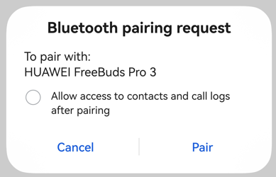

# Device Pairing

## Introduction
This document provides guidance on how to develop profile capabilities for actively pairing and connecting devices.

## How to Develop

### Applying for the Required Permission
Apply for the **ohos.permission.ACCESS_BLUETOOTH** permission. For details about how to configure and apply for permissions, see [Declaring Permissions](../../security/AccessToken/declare-permissions.md) and [Requesting User Authorization](../../security/AccessToken/request-user-authorization.md).

### Importing Required Modules
Import the **connection**, **a2dp**, **hfp**, **hid**, **baseProfile**, **constant**, and error code modules.
```ts
import { connection, a2dp, hfp, hid, baseProfile, constant } from '@kit.ConnectivityKit';
import { BusinessError } from '@kit.BasicServicesKit';
```

### Subscribing to Pairing Status Change Events
You can subscribe to pairing status change events to obtain the real-time pairing status. Multiple status transitions occur during the pairing process.

Through the [BOND_STATE_BONDED](../../reference/apis-connectivity-kit/js-apis-bluetooth-connection.md#bondstate) event, you can obtain the pairing status of the device that initiates pairing proactively or is paired.
```ts
// Define the callback for pairing status changes.
function onReceiveEvent(data: connection.BondStateParam) {
    console.info('pair result: '+ JSON.stringify(data));
}

try {
  // Subscribe to pairing status changes.
  connection.on('bondStateChange', onReceiveEvent);
} catch (err) {
  console.error('errCode: ' + (err as BusinessError).code + ', errMessage: ' + (err as BusinessError).message);
}
```

### Initiating Pairing
If the pairing status of the target device is [BOND_STATE_INVALID](../../reference/apis-connectivity-kit/js-apis-bluetooth-connection.md#bondstate), the current device can proactively pair with the target device.
- You can obtain the target device through the device discovery process. For details, see [Bluetooth Discovery](br-discovery-development-guide.md) or [BLE Device Discovery](ble-development-guide.md).

During the pairing process, a dialog box is displayed. The dialog box style varies according to the pairing type. The following figure shows the **Confirm Passkey** dialog box. The pairing can proceed only when the user agrees to the authorization.



**Figure 1** Bluetooth pairing request dialog box
```ts
// Obtain the device address through the device discovery process.
let device = 'XX:XX:XX:XX:XX:XX';

try {
  // Initiate pairing.
  connection.pairDevice(device).then(() => {
    console.info('pairDevice');
  }, (error: BusinessError) => {
    console.error('pairDevice: errCode:' + error.code + ',errMessage' + error.message);
  });
} catch (err) {
  console.error('startPair: errCode:' + err.code + ',errMessage' + err.message);
}
```

### Connecting to the Profile of a Paired Device
After successful pairing, an application can call [connectAllowedProfiles](../../reference/apis-connectivity-kit/js-apis-bluetooth-connection.md#connectionconnectallowedprofiles16) to connect to the profile supported by the target device. The profile can only be A2DP, HFP, or HID. If you need to use the SPP connection, see [SPP-based Connection and Data Transmission](spp-development-guide.md).

- The Bluetooth subsystem queries and saves all profiles supported by the target device during pairing.
- After the pairing is complete, the application can call [getRemoteProfileUuids](../../reference/apis-connectivity-kit/js-apis-bluetooth-connection.md#connectiongetremoteprofileuuids12) to query the profiles supported by the target device. If an applicable profile exists, the application can initiate a connection to the profile within 30 seconds after successful pairing.
```ts
// Device address of the paired device
let device = 'XX:XX:XX:XX:XX:XX';

// Create an A2DP, HFP, or HID instance.
let a2dpSrc = a2dp.createA2dpSrcProfile();
let hfpAg = hfp.createHfpAgProfile();
let hidHost = hid.createHidHostProfile();

// Define the callback for A2DP connection status change events.
function onA2dpConnectStateChange(data: baseProfile.StateChangeParam) {
  console.info(`A2DP State: ${JSON.stringify(data)}`);
}

// Define the callback for HFP connection status change events.
function onHfpConnectStateChange(data: baseProfile.StateChangeParam) {
  console.info(`HFP State: ${JSON.stringify(data)}`);
}

// Define the callback for HID connection status change events.
function onHidConnectStateChange(data: baseProfile.StateChangeParam) {
  console.info(`HID State: ${JSON.stringify(data)}`);
}

try {
    // Check whether the target device supports the A2DP, HFP, and HID profiles.
    // Subscribe to connection status change events depending on the supported profile.
    a2dpSrc.on('connectionStateChange', onA2dpConnectStateChange);
    hfpAg.on('connectionStateChange', onHfpConnectStateChange);
    hidHost.on('connectionStateChange', onHidConnectStateChange);

    // Initiate a connection to the profile.
    connection.connectAllowedProfiles(device).then(() => {
      console.info('connectAllowedProfiles');
    }, (error: BusinessError) => {
      console.error('errCode:' + error.code + ',errMessage' + error.message);
    });
} catch (err) {
  console.error('errCode:' + err.code + ',errMessage' + err.message);
}
```

## Sample Code
```ts
import { connection, a2dp, hfp, hid, baseProfile, constant } from '@kit.ConnectivityKit';
import { BusinessError } from '@kit.BasicServicesKit';

export class PairDeviceManager {
  device: string = '';
  pairState: connection.BondState = connection.BondState.BOND_STATE_INVALID;
  a2dpSrc = a2dp.createA2dpSrcProfile();
  hfpAg = hfp.createHfpAgProfile();
  hidHost = hid.createHidHostProfile();

  // Define the callback for pairing status change events.
  onBondStateEvent = (data: connection.BondStateParam) => {
    console.info('pair result: '+ JSON.stringify(data));
    if (data && data.deviceId == this.device) {
      this.pairState = data.state; // Save the pairing status of the target device.
    }
  };

  // Initiate pairing. The device address can be obtained through the device discovery process.
  public startPair(device: string) {
    this.device = device;
    try {
      // Subscribe to pairing status change events.
      connection.on('bondStateChange', this.onBondStateEvent);
    } catch (err) {
      console.error('bondStateChange errCode: ' + (err as BusinessError).code + ', errMessage: ' + (err as BusinessError).message);
    }

    try {
      // Initiate pairing.
      connection.pairDevice(device).then(() => {
        console.info('pairDevice');
      }, (error: BusinessError) => {
        console.error('pairDevice: errCode:' + error.code + ',errMessage' + error.message);
      });
    } catch (err) {
      console.error('startPair: errCode:' + err.code + ',errMessage' + err.message);
    }
  }

  // Define the callback for A2DP connection status change events.
  onA2dpConnectStateChange = (data: baseProfile.StateChangeParam) => {
    console.info(`A2DP State: ${JSON.stringify(data)}`);
  };

  // Define the callback for HFP connection status change events.
  onHfpConnectStateChange = (data: baseProfile.StateChangeParam) => {
    console.info(`HFP State: ${JSON.stringify(data)}`);
  };

  // Define the callback for HID connection status change events.
  onHidConnectStateChange = (data: baseProfile.StateChangeParam) => {
    console.info(`HID State: ${JSON.stringify(data)}`);
  };

  // Initiate a connection.
  public async connect(device: string) {
    try {
      let uuids = await connection.getRemoteProfileUuids(device);
      console.info('device: ' + device + ' remoteUuids: '+ JSON.stringify(uuids));
      let allowedProfiles = 0;
      // If an applicable profile exists, enable listening for connection status changes of the profile.
      if (uuids.some(uuid => uuid == constant.ProfileUuids.PROFILE_UUID_A2DP_SINK.toLowerCase())) {
        console.info('device supports a2dp');
        allowedProfiles++;
        this.a2dpSrc.on('connectionStateChange', this.onA2dpConnectStateChange);
      }
      if (uuids.some(uuid => uuid == constant.ProfileUuids.PROFILE_UUID_HFP_HF.toLowerCase())) {
        console.info('device supports hfp');
        allowedProfiles++;
        this.hfpAg.on('connectionStateChange', this.onHfpConnectStateChange);
      }
      if (uuids.some(uuid => uuid == constant.ProfileUuids.PROFILE_UUID_HID.toLowerCase()) ||
        uuids.some(uuid => uuid == constant.ProfileUuids.PROFILE_UUID_HOGP.toLowerCase())) {
        console.info('device supports hid');
        allowedProfiles++;
        this.hidHost.on('connectionStateChange', this.onHidConnectStateChange);
      }
      if (allowedProfiles > 0) { // If there is an applicable profile, initiate a connection.
        connection.connectAllowedProfiles(device).then(() => {
          console.info('connectAllowedProfiles');
        }, (error: BusinessError) => {
          console.error('errCode:' + error.code + ',errMessage' + error.message);
        });
      }
    } catch (err) {
      console.error('errCode:' + err.code + ',errMessage' + err.message);
    }
  }
}

let pairDeviceManager = new PairDeviceManager();
export default pairDeviceManager as PairDeviceManager;
```
