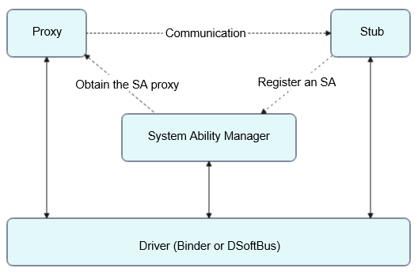

# IPC & RPC Overview

## Basic Concepts

The inter-process communication (IPC) and remote procedure call (RPC) mechanisms are used to implement cross-process communication. The difference between them lies in that IPC uses the Binder driver to implement cross-process communication within a device, whereas RPC uses the DSoftBus driver to implement cross-process communication across devices. The reason why cross-process communication is needed is that each process has its own independent resources and memory space and one process is not allowed to access the resources and memory space of other processes. IPC and RPC usually use the client-server model, where the client (service requester, that is, the process that requests a service) obtains the proxy of the server (service provider, that is, the process that provides the service) and uses the proxy to read and write data to implement data communication across processes. More specifically, the client constructs a proxy object of the server. The proxy object has the same functions as the server. To access a certain API of the server, you only need to access the corresponding API in the proxy object. The proxy object sends the request to the server, and the server processes the received request and returns the processing result to the proxy object through the driver. Then, the proxy object forwards the processing result to the client. The server registers system abilities (SAs) with the system ability manager (SAMgr), which manages the SAs and provides APIs for clients. To communicate with a specific SA, the client must obtain the proxy of the SA from SAMgr. In the following sections, proxy represents the service requester, and stub represents the service provider.

## Constraints

- During cross-process communication within a single device, the maximum amount of data to be transmitted is about 1 MB. If the amount of data to be transmitted exceeds this limit, use the [anonymous shared memory](https://gitee.com/openharmony/docs/blob/master/en/application-dev/reference/apis/js-apis-rpc.md#ashmem8).
- Subscription to death notifications of anonymous stub objects (not registered with SAMgr) is prohibited in RPC.
- During cross-process communication across processes, a proxy object cannot be passed back to the device that hosts the stub object pointed by the proxy object. That is, the proxy object pointing to the stub object of the remote device cannot be passed across processes twice on the local device.

## **Recommendations**

First, compile an API class and define message codes in the API class for both communication parties to identify operations. Unimplemented APIs are allowed in the API class because it must be inherited by both communication parties and its inheritance classes cannot be abstract classes. When inheriting the API class, both communication parties must implement the unimplemented APIs, so as to make sure that the inheritance classes are not abstract classes. 

Then, implement the API class specific to the stub, and override the **AsObject** and **OnRemoteRequest** APIs. In addition, compile the proxy to implement the APIs in the API class and override the **AsObject** API. You can also encapsulate an additional API for calling **SendRequest** to send data to the peer. 

After the preceding operations are done, register a system ability (SA) with SAMgr. Note that the registration should be completed in the process that hosts the stub. Then, obtain the proxy from SAMgr as needed to implement cross-process communication with the stub.

Related steps are as follows:

- Implementing the API class: Inherit **IRemoteBroker**, define message codes, and declare APIs that are not implemented in the API class.

- Implementing the service provider (stub): Inherit **IRemoteStub** or **RemoteObject**, and override the **AsObject** and **OnRemoteRequest** APIs.

- Implementing the service requester (proxy): Inherit **IRemoteProxy** or **RemoteProxy**, override the **AsObject** API, and encapsulate the required API to call **SendRequest**.

- Registering the SA: Apply for a unique ID for the SA, and register the SA with SAMgr.

- Obtaining the SA: Obtain the proxy based on the SA ID and device ID, and use the proxy to communicate with the remote end.

## Related Modules

[Distributed Ability Manager Service Framework](https://gitee.com/openharmony/ability_dmsfwk)
