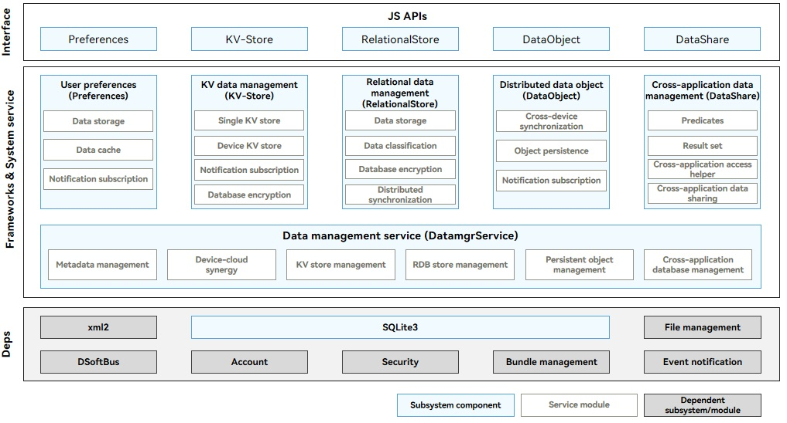

# Introduction to ArkData

## Function

ArkData provides data storage, management, and sync capabilities. For example, you can store the Contacts application data in database for secure management and shared access, and synchronize the contacts information with a smart watch.
- Unified data definition: provides unified data definitions, including the data types and structs, for different applications and devices.

- Data storage: provides data persistence capabilities, including preferences, key-value (KV) stores, relational database (RDB stores), and graph stores (available only to system applications).

- Data management: provides efficient data management capabilities, including permission management, data backup and restore, and dataShare framework.

- Data sync: provides data sync across devices. For example, distributed data objects support sharing of memory objects across devices, and distributed databases support database access across devices.

The database files created by an application are saved to the application sandbox directory. When the application is uninstalled, the database files are automatically deleted.

## Working Principles

The data management module includes preferences, KV data management (KV-Store), relational data management (RelationalStore), distributed data object (DataObject), cross-application data management (DataShare), and unified data management framework (UDMF). The interface layer provides standard JavaScript APIs for application development. The Frameworks & System service layer implements storage and sync of component data, and provides dependencies for SQLite and other subsystems.

  **Figure 1** Data management architecture 

- **Preferences**: implements persistence of lightweight configuration data and supports subscription of data change notifications. Preferences are used to store application configuration information and user preference settings and do not support distributed sync.

- **KV-Store**: implements read, write, encryption, and manual backup of data in KV stores and notification subscription. When an application needs to use the distributed capabilities of a KV store, KV-Store sends a sync request to DatamgrService, which implements data sync across devices.

- **RelationalStore**: provides the capabilities for managing an RDB store, including create, read, update, delete (CRUD) operations, encryption, manual backup, and subscription notifications. It also provides the capabilities of storing and managing data in a vector store, searching for vector data, and calculating vector data similarity. When an application needs to use the distributed capabilities of an RDB store, RelationalStore sends a sync request to DatamgrService, which implements data sync across devices.

- **DataObject**: independently provides distributed capabilities for data objects. **DatamgrService** implements temporary storage of the object data, which is still required after the application (either the application of your device or cross-device application) is restarted.

- **DataShare**: provides the data provider-consumer mode to implement addition, deletion, modification, and query of cross-application data on a device, and notification subscription. **DataShare** is not bound to any database and can interact with RDB and KV stores. You can also encapsulate your own databases for C/C++ applications. In addition to the provider-consumer mode, **DataShare** provides silent access, which allows direct access to the provider's data via the DatamgrService proxy instead of starting the provider. Currently, only the RDB stores support silent access.

- UDMF: defines the data standards for cross-application and cross-device data interaction, improving data interaction efficiency. The UDMF provides secure and standard data transmission channels and supports different levels of data access permissions and lifecycle management policies. It helps implement efficient data sharing across applications and devices.

- **DatamgrService**: implements sync and cross-application sharing for other components, including cross-device sync of **RelationalStore** and **KV-Store**, silent access to provider data of **DataShare**, and temporary storage of **DataObject** data.
