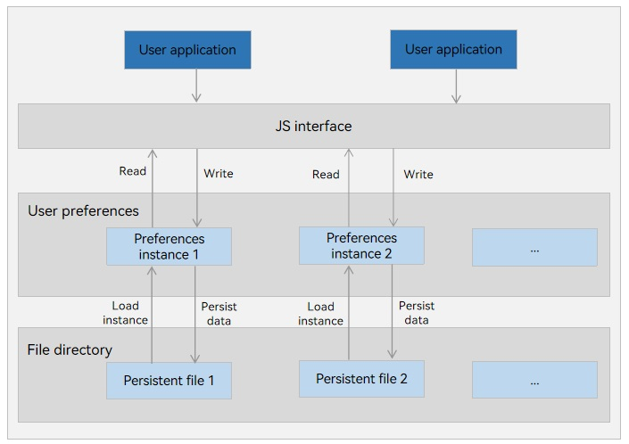

# Persisting Preferences Data


## When to Use

The **Preferences** module provides APIs for processing data in the form of key-value (KV) pairs, including querying, modifying, and persisting KV pairs. You can use **Preferences** when you want a unique storage for global data. <br>The **Preferences** data is cached in the memory, which allows fast access when the data is required. If you want to persist data, you can use **flush()** to save the data to a file. The **Preferences** data occupies the application's memory space and cannot be encrypted through configuration. Therefore, it is recommended for storing personalized settings (font size and whether to enable the night mode) of applications. 


## Working Principles

User applications call **Preference** through the ArkTS interface to read and write data files. You can load the data of a **Preferences** persistence file to a **Preferences** instance. Each file uniquely corresponds to an instance. The system stores the instance in memory through a static container until the instance is removed from the memory or the file is deleted. The following figure illustrates how **Preference** works.

The preference persistent file of an application is stored in the application sandbox. You can use **context** to obtain the file path. For details, see [Obtaining Application File Paths](../application-models/application-context-stage.md#obtaining-application-file-paths).

**Figure 1** Preferences working mechanism 



## Storage Types
By default, user preferences are stored in XML format. Since API version 16, the CLKV format is provided.

### XML
Data is stored in the form of XML files, which allow high versatility and cross-platform operations. When XML is used, preference data operations are primarily performed in the memory. You can call **flush()** to persist the data when necessary. This storage type is recommended for single-process, small data volume scenarios.

### CLKV
CLKV is available since API version 16. It supports concurrent read and write in multiple processes. When CLKV is used, preference data operations are flushed to the storage device in real time. This storage type is recommended for multi-process concurrency scenarios.

## Constraints

### Preferences Constraints

- The key in a KV pair must be a string and cannot be empty or exceed 1024 bytes.
- If the value is of the string type, use the UTF-8 encoding format. It can be empty. If not empty, it cannot exceed 16 MB.

### XML Constraints

- The XML type (default for preferences) cannot ensure process concurrency safety, posing risks of file corruption and data loss. It is not recommended for use in multi-process scenarios.

- Memory usage will increase with the amount of stored data. You are advised to keep the stored data below 50 MB. When the stored data is large, using synchronous APIs to create **Preferences** objects and persist data will become time consuming. Avoid using it in the main thread, as it may cause appfreeze problems.

### CLKV Constraints

- CLKV does not support cross-platform operations. Before using this type, call **isStorageTypeSupported** to check whether it is supported.
- Do not call **deletePreferences** concurrently with other APIs in multi-thread or multi-process mode. Otherwise, unexpected behavior may occur.
- In OpenHarmony, a user group is a logical collection of users with the same characteristics. These users share certain rights. User groups are used to facilitate system management and control user access rights. If the user group is involved when CLKV is used by multiple processes, ensure that the processes belong to the same group.


## Available APIs

The following table lists the APIs used for persisting user preference data. For more information about the APIs, see [User Preferences](../reference/apis-arkdata/js-apis-data-preferences.md).

| API                                                    | Description                                                        |
| ------------------------------------------------------------ | ------------------------------------------------------------ |
| getPreferencesSync(context: Context, options: Options): Preferences | Obtains a **Preferences** instance. This API returns the result synchronously.<br/> An asynchronous API is also provided.                   |
| putSync(key: string, value: ValueType): void                 | Writes data to the **Preferences** instance. This API returns the result synchronously. An asynchronous API is also provided.|
| hasSync(key: string): boolean                                | Checks whether the **Preferences** instance contains a KV pair with the given key. The key cannot be empty. This API returns the result synchronously.<br/> An asynchronous API is also provided.|
| getSync(key: string, defValue: ValueType): ValueType         | Obtains the value of the specified key. If the value is null or not of the default value type, **defValue** is returned. This API returns the result synchronously.<br/> An asynchronous API is also provided.|
| deleteSync(key: string): void                                | Deletes a KV pair from the **Preferences** instance. This API returns the result synchronously.<br/> An asynchronous API is also provided.|
| flush(callback: AsyncCallback&lt;void&gt;): void             | Flushes the data of this **Preferences** instance to a file for data persistence.|
| on(type: 'change', callback: Callback&lt;string&gt;): void   | Subscribes to data changes. A callback will be invoked after **flush()** is executed for the data changed.|
| off(type: 'change', callback?: Callback&lt;string&gt;): void | Unsubscribes from data changes.                                          |
| deletePreferences(context: Context, options: Options, callback: AsyncCallback&lt;void&gt;): void | Deletes a **Preferences** instance from memory. If the **Preferences** instance has a persistent file, this API also deletes the persistent file.|
| isStorageTypeSupported(type: StorageType): boolean           | Checks whether the specified storage type is supported.|


## How to Develop

1. Import the **@kit.ArkData** module.
   
   ```ts
   import { preferences } from '@kit.ArkData';
   ```

2. (Optional) Set the storage type.

   This step is optional. By default, preferences data is stored in XML format. Since API version 16, CLKV is supported.

   Before using CLKV, call **isStorageTypeSupported()** to check whether the current platform supports CLKV.

   If **false** is returned, the platform does not support CLKV. In this case, use XML.

   ```ts
    let isClkvSupported = preferences.isStorageTypeSupported(preferences.StorageType.CLKV);
    console.info("Is clkv supported on this platform: " + isClkvSupported);    
   ```

3. Obtain a **Preferences** instance.

   Obtain a **Preferences** instance in the default XML format.

   <!--Del-->Stage model:<!--DelEnd-->

   ```ts
   import { UIAbility } from '@kit.AbilityKit';
   import { BusinessError } from '@kit.BasicServicesKit';
   import { window } from '@kit.ArkUI';

   let dataPreferences: preferences.Preferences | null = null;

   class EntryAbility extends UIAbility {
     onWindowStageCreate(windowStage: window.WindowStage) {
       let options: preferences.Options = { name: 'myStore' };
       dataPreferences = preferences.getPreferencesSync(this.context, options);
     }
   }
   ```

   <!--Del-->FA model:

   ```ts
   // Obtain the context.
   import { featureAbility } from '@kit.AbilityKit';
   import { BusinessError } from '@kit.BasicServicesKit';
   
   let context = featureAbility.getContext();
   let options: preferences.Options =  { name: 'myStore' };
   let dataPreferences: preferences.Preferences = preferences.getPreferencesSync(context, options);
   ```
   <!--DelEnd-->

   Obtain a **Preferences** instance in CLKV format.

    If you want to use CLKV and the platform supports it, you can obtain the **Preferences** instance as follows. However, the storage type cannot be changed once selected.
   <!--Del-->Stage model:<!--DelEnd-->

   ```ts
   import { UIAbility } from '@kit.AbilityKit';
   import { BusinessError } from '@kit.BasicServicesKit';
   import { window } from '@kit.ArkUI';

   let dataPreferences: preferences.Preferences | null = null;

   class EntryAbility extends UIAbility {
     onWindowStageCreate(windowStage: window.WindowStage) {
       let options: preferences.Options = { name: 'myStore' , storageType: preferences.StorageType.CLKV};
       dataPreferences = preferences.getPreferencesSync(this.context, options);
     }
   }
   ```

   <!--Del-->FA model:

   ```ts
   // Obtain the context.
   import { featureAbility } from '@kit.AbilityKit';
   import { BusinessError } from '@kit.BasicServicesKit';
   
   let context = featureAbility.getContext();
   let options: preferences.Options =  { name: 'myStore' , storageType: preferences.StorageType.CLKV};
   let dataPreferences: preferences.Preferences = preferences.getPreferencesSync(context, options);
   ```
   <!--DelEnd-->


4. Write data.

   Call **putSync()** to save data to the cached **Preferences** instance.
   
   For the data stored in the default mode (XML), you can call **flush()** to persist the data written if required.
   
   If CLKV is used, the data is persisted in a file on realtime basis after being written.

   > **NOTE**
   >
   > If the key already exists, **putSync()** overwrites the value. You can use **hasSync()** to check whether the KV pair exists.

   Example:

   ```ts
   import { util } from '@kit.ArkTS';
   if (dataPreferences.hasSync('startup')) {
     console.info("The key 'startup' is contained.");
   } else {
     console.info("The key 'startup' does not contain.");
     // Add a KV pair.
     dataPreferences.putSync('startup', 'auto');
     // If a string contains special characters, convert the string to Uint8Array format and store it. The length of the string cannot exceed 16 x 1024 x 1024 bytes.
     let uInt8Array1 = new util.TextEncoder().encodeInto("~! @#￥%......&* () --+? ");
     dataPreferences.putSync('uInt8', uInt8Array1);
   }
   ```

5. Read data.

   Call **getSync()** to obtain the value of the specified key. If the value is null or is not of the default value type, the default data is returned.

   Example:

   ```ts
   let val = dataPreferences.getSync('startup', 'default');
   console.info("The 'startup' value is " + val);
   // If the value is a string containing special characters, it is stored in the Uint8Array format. Convert the obtained Uint8Array into a string.
   let uInt8Array2 : preferences.ValueType = dataPreferences.getSync('uInt8', new Uint8Array(0));
   let textDecoder = util.TextDecoder.create('utf-8');
   val = textDecoder.decodeToString(uInt8Array2 as Uint8Array);
   console.info("The 'uInt8' value is " + val);
   ```

6. Delete data.

   Call **deleteSync()** to delete a KV pair.<br>Example:

   ```ts
   dataPreferences.deleteSync('startup');
   ```

7. Persist data.

   You can use **flush()** to persist the data held in a **Preferences** instance to a file. Example:

   ```ts
   dataPreferences.flush((err: BusinessError) => {
     if (err) {
       console.error(`Failed to flush. Code:${err.code}, message:${err.message}`);
       return;
     }
     console.info('Succeeded in flushing.');
   })
   ```

8. Subscribe to data changes.

   Specify an observer as the callback to return the data changes for an application.
   
   If the preferences data is stored in the default format (XML), the observer callback will be triggered only after the subscribed value changes and **flush()** is executed.

   Example:

   ```ts
   let observer = (key: string) => {
     console.info('The key' + key + 'changed.');
   }
   dataPreferences.on('change', observer);
   // The data is changed from 'auto' to 'manual'.
   dataPreferences.put('startup', 'manual', (err: BusinessError) => {
     if (err) {
       console.error(`Failed to put the value of 'startup'. Code:${err.code},message:${err.message}`);
       return;
     }
     console.info("Succeeded in putting the value of 'startup'.");
     if (dataPreferences !== null) {
       dataPreferences.flush((err: BusinessError) => {
         if (err) {
           console.error(`Failed to flush. Code:${err.code}, message:${err.message}`);
           return;
         }
         console.info('Succeeded in flushing.');
       })
     }
   })
   ```

   If the preferences data is stored in CLKV format, the observer callback will be triggered after the subscribed value changes (without the need for calling **flush()**).

   Example:
    ```ts
    let observer = (key: string) => {
      console.info('The key' + key + 'changed.');
    }
    dataPreferences.on('change', observer);
    // The data is changed from 'auto' to 'manual'.
    dataPreferences.put('startup', 'manual', (err: BusinessError) => {
      if (err) {
        console.error(`Failed to put the value of 'startup'. Code:${err.code},message:${err.message}`);
        return;
      }
      console.info("Succeeded in putting the value of 'startup'.");
    })
    ```
9. Delete a **Preferences** instance from the memory.

   Call **deletePreferences()** to delete a **Preferences** instance from the memory. If the **Preferences** instance has a persistent file, the persistent file and its backup and corrupted files will also be deleted.

   > **NOTE**
   >
   > - The deleted **Preferences** instance cannot be used for data operations. Otherwise, data inconsistency will be caused.
   >
   > - The deleted data and files cannot be restored.
   >
   > - If CLKV is used, this API cannot be called concurrently with other APIs (including multiple processes). Otherwise, unexpected behavior may occur.

   Example:

   ```ts
   preferences.deletePreferences(this.context, options, (err: BusinessError) => {
     if (err) {
       console.error(`Failed to delete preferences. Code:${err.code}, message:${err.message}`);
         return;
     }
     console.info('Succeeded in deleting preferences.');
   })
   ```
<!--RP1--><!--RP1End-->
