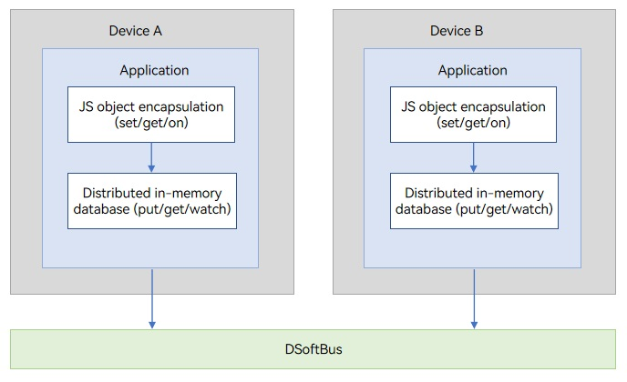
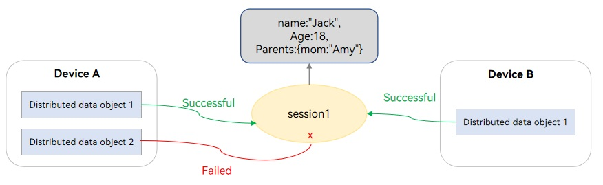
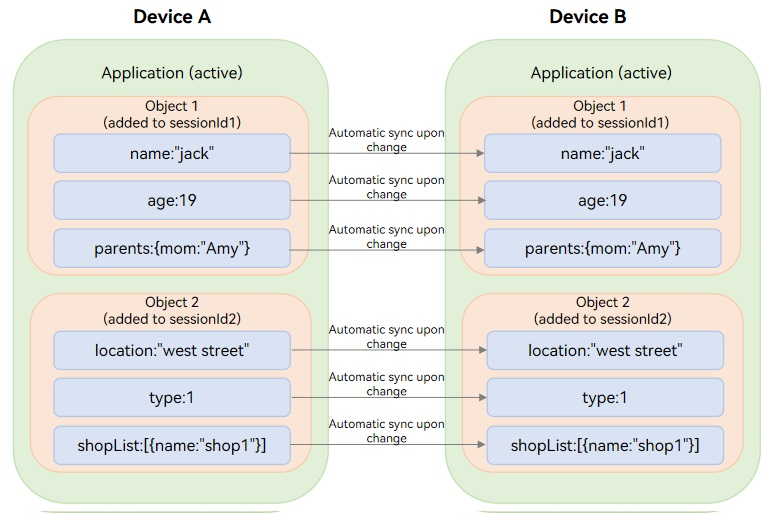

# Cross-Device Sync of Distributed Data Objects


## When to Use

The traditional implementation of data sync between devices involves heavy workload. You need to design the message processing logic for setting up a communication link, sending, receiving, and processing messages, and resolving data conflicts, as well as retry mechanism upon errors. In addition, the debugging complexity increases with the number of devices.

The device status, message sending progress, and data transmitted are variables. If these variables support global access, they can be accessed as local variables by difference devices. This simplifies data sync across devices.

The distributed data object (**distributedDataObject**) module implements global access to variables. It provides basic data object management capabilities, including creating, querying, deleting, and modifying in-memory objects and subscribing to data or status changes. It also provides distributed capabilities. OpenHarmony provides easy-to-use JS APIs for distributed application scenarios. With these APIs, you can easily implement data collaboration for an application across devices and listening for status and data changes between devices. The **distributedDataObject** module implements data object collaboration for the same application across multiple devices that form a Super Device. It greatly reduces the development workloads compared with the traditional implementation.

Currently, <!--RP2-->distributed data objects can be used only in [cross-device migration](../application-models/hop-cross-device-migration.md) and [multi-device collaboration using the cross-device call](../application-models/hop-multi-device-collaboration.md#using-cross-device-call).<!--RP2End-->

## Basic Concepts

- Distributed in-memory database<br>
  The distributed in-memory database caches data in the memory so that applications can quickly access data without persisting data. If the database is closed, the data is not retained.

- Distributed data object<br>
  A distributed data object is an encapsulation of the JS object type. Each distributed data object instance creates a data table in the in-memory database. The in-memory databases created for different applications are isolated from each other. Reading and writing a distributed data object are mapped to the **get** and **put** operations in the corresponding database, respectively.

  The distributed data object has the following states in its lifecycle:

  - **Uninitialized**: The distributed data object is not instantiated or is destroyed.
  - **Local**: A data table is created, but the data cannot be synced.
  - **Distributed**: A data table is created, and data can be synced (there are at least two online devices with the same session ID). If a device is offline or the session ID is empty, the distributed data object changes to the local state.


## Working Principles

**Figure 1** Working mechanism



The distributed data objects are encapsulated JS objects in distributed in-memory databases, and can be operated in the same way as local variables. The system automatically implements data sync across devices.


### Encapsulation and Storage of JS Objects

- An in-memory database is created for each distributed data object instance and identified by a session ID (**SessionId**). The in-memory databases created for different applications are isolated from each other.

- When a distributed data object is instantiated, all properties of the object are traversed recursively. **Object.defineProperty** is used to define the **set()** and **get()** methods for all properties. The **set()** and **get()** methods correspond to the **put** and **get** operations of a record in the database, respectively. **Key** specifies the property name, and **Value** specifies the property value.

- When a distributed data object is read or written, the **get()** or **set()** method is automatically called to perform the related operation on data in the database.

**Table 1** Correspondence between a distributed data object and a distributed database

| Distributed Data Object Instance| Object Instance| Property Name| Property Value|
| -------- | -------- | -------- | -------- |
| Distributed in-memory database| Database identified by **sessionID**| Key of a record in the database| Value of a record in the database|


### Cross-Device Sync and Data Change Notification

One of the most important functions of distributed data objects is to implement data sync between objects. Distributed data objects are created locally for the devices on a trusted network. If the distributed data objects on different devices are set with the same **sessionID**, data can be synced between them.

As shown in the following figure, distributed data object 1 of device A and distributed data object 1 of device B are set with the same session ID **session1**, and sync relationship of session 1 is established between the two objects.

  **Figure 2** Object sync relationship 



For each device, only one distributed data object can be added to a sync relationship. As shown in the preceding figure, distributed data object 2 of device A cannot be added to session 1 because distributed data object 1 of device A has been added to session 1.

After the sync relationship is established, each session has a copy of shared object data. The distributed data objects added to a session support the following operations:

- Reading or modifying the data in the session.

- Listening for data changes made by other devices.

- Listening for status changes, such as the addition and removal of other devices.

When a distributed data object is added to a session, if its data is different from that of the session, the distributed data object updates data of the session. If you do not want to update the data of the session when adding a distributed data object to a session and obtain the data of the session, set the attribute value of the object to **undefined** (for an asset, set each attribute of the asset to an empty string).

### Minimum Sync Unit

Property is the minimum unit to synchronize in distributed data objects. For example, object 1 in the following figure has three properties: name, age, and parents. If one of the properties is changed, only the changed property needs to be synced.

The object properties support basic types (number, Boolean, and string) and complex types (array and nested basic types). For the distributed data object of the complex type, only the root property can be modified. The subordinate properties cannot be modified.

```ts
dataObject['parents'] = {mom: "amy"}; // Supported modification
dataObject['parents']['mon'] = "amy"; // Unsupported modification
```

**Figure 3** Sync of distributed data objects





### Persistence of Distributed Data Objects

Distributed data objects run in the process space of applications. After the data of a distributed data object is persisted in the distributed database, the data will not be lost after the application exits.

You need to persist distributed data objects in the following scenarios:

- Enable an application to retrieve the exact same data after it starts again. In this case, you need to persist the distributed data object (for example, object 1 with session ID 1). After the application starts again, create a distributed data object (for example, object 2) and set the session ID to 1. Then, the application can retrieve the data of object 1.

- Enable an application started on another device to retrieve the exact same data. In this case, you need to persist the distributed data object (for example, object 1 with session ID 1) on device A and synchronize the data to device B. Then, create a distributed data object (for example, object 2) and set the session ID to 1. When the application is started on device B, it can retrieve the same application data used on device A before the application is closed.

### Asset Sync Mechanism

In a distributed object, [asset](../reference/apis-arkdata/js-apis-data-commonType.md#asset) is used to describe a local entity asset file. When the distributed object is synced across devices, the file is also synced to other devices with it. Currently, only asset is supported. The type [assets](../reference/apis-arkdata/js-apis-data-commonType.md#assets) is not supported. To synchronize multiple assets, use each asset as a root property of the distributed object.

## Constraints

- Currently, <!--RP2-->distributed data objects can be used only in [cross-device migration](../application-models/hop-cross-device-migration.md) and [multi-device collaboration using the cross-device call](../application-models/hop-multi-device-collaboration.md#using-cross-device-call).<!--RP2End-->

- Only the data of the same application can be synced across devices, that is, the devices must have the same **bundleName**.

- Data can be synced for the distributed data objects with the same session ID.

- Each distributed data object occupies 100 KB to 150 KB of memory. Therefore, you are advised not to create too many distributed data objects.

- The maximum size of a distributed data object is 500 KB.

- If data of 1 KB data is modified on device A, device B can complete data update within 50 ms after receiving a data change notification.

- A maximum of 16 distributed data object instances can be created for an application.

- For the sake of performance and user experience, the maximum number of devices for data collaboration is 3.

- For the distributed data object of the complex type, only the root property can be modified. The subordinate properties cannot be modified. In [asset sync mechanism](#asset-sync-mechanism), the data of the asset type must support modification of its lower-level properties.

- Currently, only JS APIs are supported.

## Available APIs

Most of the APIs for cross-device sync of distributed data objects are executed asynchronously in callback or promise mode. The following table uses the callback-based APIs as an example. For more information about the APIs, see [Distributed Data Object](../reference/apis-arkdata/js-apis-data-distributedobject.md).


| API| Description|
| -------- | -------- |
| create(context: Context, source: object): DataObject | Creates a distributed data object instance.|
| genSessionId(): string | Generates a session ID for distributed data objects.|
| setSessionId(sessionId: string, callback: AsyncCallback&lt;void&gt;): void | Sets a session ID for data sync. Automatic sync is performed for devices with the same session ID on a trusted network.|
| setSessionId(callback: AsyncCallback&lt;void&gt;): void | Exits all sessions.|
| on(type: 'change', callback: (sessionId: string, fields: Array&lt;string&gt;) => void): void | Subscribes to data changes of the distributed data object.|
| off(type: 'change', callback?: (sessionId: string, fields: Array&lt;string&gt;) => void): void | Unsubscribes from data changes of the distributed data object.|
| on(type: 'status', callback: (sessionId: string, networkId: string, status: 'online' \| 'offline' ) => void): void | Subscribes to status changes of the distributed data object.|
| off(type: 'status', callback?: (sessionId: string, networkId: string, status: 'online' \|'offline' ) => void): void | Unsubscribes from status changes of the distributed data object.|
| save(deviceId: string, callback: AsyncCallback&lt;SaveSuccessResponse&gt;): void | Saves a distributed data object.|
| revokeSave(callback: AsyncCallback&lt;RevokeSaveSuccessResponse&gt;): void | Revokes the saving of the distributed data object.|
| bindAssetStore(assetKey: string, bindInfo: BindInfo, callback: AsyncCallback&lt;void&gt;): void | Binds an asset and its RDB store.|


## How to Develop

### Using Distributed Data Objects in Cross-Device Migration

1. Create a distributed data object in **onContinue()** for the application on the source device, and save data.

    (1) Call **create()** to create a distributed data object instance.

    (2) Call **genSessionId()** to generate a **sessionId**, call **setSessionId()** to set a **sessionId**, and add the **sessionId** to **wantParam**. The distributed data objects with the same **sessionId** can connect to the same network. 

    (3) Obtain the network ID from **wantParam** for the application on the target device and call **save()** with this network ID to save data to the target device.

2. Create a distributed data object in **onCreate()** and **onNewWant()** for the application on the target device, and register a listener for the "restored" state.

    (1) Call **create()** to create a distributed data object instance for the application on the target device.

    (2) Register a listener callback for the data recovery state. If "restored" is returned by the listener callback registered, the distributed data object of the target device has obtained the data transferred from the source device.

    (3) Obtain the **sessionId** of the source device from **want.parameters** and call **setSessionId** to set the same **sessionId** for the target device.

> **NOTE**
>
> - In cross-device migration, after **setsessionId()** is called on the source device to set **sessionId**, call **save()** to save data to the target device.
>
<!--RP1-->
> - The **continuable** tag must be set for cross-device migration. For details, see [How to Develop](../application-models/hop-cross-device-migration.md#how-to-develop).<!--RP1End-->
>
> - The **sessionId** field in **wantParam** is used by other services. You are advised to customize a key for accessing the **sessionId** field.
>
> - Use data of the Asset type to record information about assets (such as documents, images, and videos). When asset data is migrated, the corresponding asset is also migrated to the target device.
>
> - The initial value of the service data must be set to **undefined** on the target device so that the data saved on the source device can be restored on the target device. Otherwise, the data on the source device will be overwritten by the data set on the target device. For asset data, you need to set each attribute of the asset data to an empty string instead of setting the entire asset data to **undefined**.
>
> - Currently, the asset array is not supported. If multiple files need to be migrated, define an asset data record for each file to migrate.
>
> - Currently, only files in distributed file directory can be migrated. Files in other directories can be copied or moved to distributed file directory before migration. For details about how to move or copy files and obtain URIs, see [File Management](../reference/apis-core-file-kit/js-apis-file-fs.md) and [File URI](../reference/apis-core-file-kit/js-apis-file-fileuri.md).

```ts
import { AbilityConstant, UIAbility, Want } from '@kit.AbilityKit';
import { hilog } from '@kit.PerformanceAnalysisKit';
import { window } from '@kit.ArkUI';
import { commonType, distributedDataObject } from '@kit.ArkData';
import { fileIo, fileUri } from '@kit.CoreFileKit';
import { BusinessError } from '@kit.BasicServicesKit';

// Define service data.
class Data {
  title: string | undefined;
  text: string | undefined;
  attachment: commonType.Asset; // Use data of the commonType.Asset to record files in the distributed file directory. When asset data is migrated, the corresponding files are also migrated to the target device. (If files do not need to be migrated, do not set this field and createAttachment and createEmptyAttachment.)
  // attachment2: commonType.Asset; // The asset array is not supported currently. If multiple files need to be migrated, define an asset data record for each file to migrate.

  constructor(title: string | undefined, text: string | undefined, attachment: commonType.Asset) {
    this.title = title;
    this.text = text;
    this.attachment = attachment;
  }
}

const TAG = '[DistributedDataObject]';
let dataObject: distributedDataObject.DataObject;

export default class EntryAbility extends UIAbility {
  // 1. Create a distributed data object in **onContinue()** for the application on the source device, and save data to the target device.
  onContinue(wantParam: Record<string, Object>): AbilityConstant.OnContinueResult | Promise<AbilityConstant.OnContinueResult> {
    // 1.1 Call create() to create a distributed data object instance.
    let attachment = this.createAttachment();
    let data = new Data('The title', 'The text', attachment);
    dataObject = distributedDataObject.create(this.context, data);

    // 1.2 Call genSessionId() to generate a sessionId, call setSessionId() to set a sessionId, and add the sessionId to wantParam.
    let sessionId = distributedDataObject.genSessionId();
    console.log(TAG + `gen sessionId: ${sessionId}`);
    dataObject.setSessionId(sessionId);
    wantParam.distributedSessionId = sessionId;

    // 1.3 Obtain networkId from **wantParam** for the application on the target device and call save() with this network ID to save data to the target device.
    let deviceId = wantParam.targetDevice as string;
    console.log(TAG + `get deviceId: ${deviceId}`);
    dataObject.save(deviceId);
    return AbilityConstant.OnContinueResult.AGREE;
  }

  // 2. Create a distributed data object in onCreate() for the application on the target device (for cold start), and add it to the network for data migration.
  onCreate(want: Want, launchParam: AbilityConstant.LaunchParam): void {
    if (launchParam.launchReason == AbilityConstant.LaunchReason.CONTINUATION) {
      if (want.parameters && want.parameters.distributedSessionId) {
        this.restoreDistributedDataObject(want);
      }
    }
  }

  // 2. Create a distributed data object in onNewWant() for the application on the target device (for hot start), and add it to the network for data migration.
  onNewWant(want: Want, launchParam: AbilityConstant.LaunchParam): void {
    if (launchParam.launchReason == AbilityConstant.LaunchReason.CONTINUATION) {
      if (want.parameters && want.parameters.distributedSessionId) {
        this.restoreDistributedDataObject(want);
      }
    }
  }

  restoreDistributedDataObject(want: Want) {
    if (!want.parameters || !want.parameters.distributedSessionId) {
      console.error(TAG + 'missing sessionId');
      return;
    }

    // 2.1 Call create() to create a distributed data object instance for the application on the target device.
    let attachment = this.createEmptyAttachment(); // Set each attribute of the asset data to an empty string so that the asset data saved on the source device can be restored on the target device.
    let data = new Data(undefined, undefined, attachment);
    dataObject = distributedDataObject.create(this.context, data);

    // 2.2 Register a listener callback for the data recovery state. If "restored" is returned by the listener callback registered, the distributed data object of the target device has obtained the data transferred from the source device. If asset data is migrated, the file is also transferred to the target device. 
    dataObject.on('status', (sessionId: string, networkId: string, status: string) => {
      if (status == 'restored') {// "restored" indicates that the data saved on the source device is restored on the target device.
        console.log(TAG + `title: ${dataObject['title']}, text: ${dataObject['text']}`);
      }
    });

    // 2.3 Obtain the sessionId of the source device from want.parameters and call setSessionId to set the same sessionId for the target device.
    let sessionId = want.parameters.distributedSessionId as string;
    console.log(TAG + `get sessionId: ${sessionId}`);
    dataObject.setSessionId(sessionId);
  }

  // Create a file in the distributed file directory and use data of the asset type to record the file information. (You can also use the data of asset type to record an existing file in the distributed file directory or copy or move a file from another directory to the distributed file directory and then migrate it.)
  createAttachment() {
    let attachment = this.createEmptyAttachment();
    try {
      let distributedDir: string = this.context.distributedFilesDir; // Distributed file directory.
      let fileName: string = 'text_attachment.txt'; // File name.
      let filePath: string = distributedDir + '/' + fileName; // File path.
      let file = fileIo.openSync(filePath, fileIo.OpenMode.READ_WRITE | fileIo.OpenMode.CREATE);
      fileIo.writeSync(file.fd, 'The text in attachment');
      fileIo.closeSync(file.fd);
      let uri: string = fileUri.getUriFromPath(filePath); // Obtain the file URI.
      let stat = fileIo.statSync(filePath); // Obtain detailed file attribute information.

      // Write asset data.
      attachment = {
        name: fileName,
        uri: uri,
        path: filePath,
        createTime: stat.ctime.toString(),
        modifyTime: stat.mtime.toString(),
        size: stat.size.toString()
      }
    } catch (e) {
      let err = e as BusinessError;
      console.error(TAG + `file error, error code: ${err.code}, error message: ${err.message}`);
    }
    return attachment;
  }

  createEmptyAttachment() {
    let attachment: commonType.Asset = {
      name: '',
      uri: '',
      path: '',
      createTime: '',
      modifyTime: '',
      size: ''
    }
    return attachment;
  }
}
```

### Using Distributed Data Objects in Multi-Device Collaboration

1. Call **startAbilityByCall()** to start an ability on another device.

    (1) Call **genSessionId()** to create a **sessionId** and obtain the network ID of the peer device through the distributed device management interface.

    (2) Assemble **want** and put **sessionId** into **want**.

    (3) Call **startAbilityByCall()** to start the peer ability.

2. Create a distributed data object on the caller device and adds it to the network.

   (1) Create a distributed data object instance.

   (2) Register a listener callback for data changes.

   (3) Set a **sessionId** for the distributed data object and add it to the network.

3. Create a distributed data object on the peer device and restore the data saved on the caller device.

   (1) Create a distributed data object instance on the peer device.

   (2) Register a listener callback for data changes.

   (3) Obtain **sessionId** of the caller device from **want** and add the distributed data object instance to the network with the **sessionId**.

> **NOTE**
>
> - Currently, <!--RP3-->distributed data objects can be used only in [multi-device collaboration using the cross-device call](../application-models/hop-multi-device-collaboration.md#using-cross-device-call) to sync data.<!--RP3End-->
>
> - To implement multi-device collaboration using the cross-device call, <!--RP4-->you need to apply for the ohos.permission.DISTRIBUTED_DATASYNC permission and set **launchType** to **singleton**. For details, see [How to Develop](../application-models/hop-multi-device-collaboration.md#using-cross-device-call).<!--RP4End-->
>
> - The **sessionId** field in **wantParam** is used by other services. You are advised to customize a key for accessing the **sessionId** field.
>
> - For details about how to obtain the network ID of the peer device, see [Querying Device Information](../distributedservice/devicemanager-guidelines.md#querying-device-information).

 The sample code is as follows:

```ts
import { AbilityConstant, Caller, common, UIAbility, Want } from '@kit.AbilityKit';
import { hilog } from '@kit.PerformanceAnalysisKit';
import { window } from '@kit.ArkUI';
import { distributedDataObject } from '@kit.ArkData';
import { distributedDeviceManager } from '@kit.DistributedServiceKit';
import { BusinessError } from '@kit.BasicServicesKit';

// Define service data.
class Data {
  title: string | undefined;
  text: string | undefined;

  constructor(title: string | undefined, text: string | undefined) {
    this.title = title;
    this.text = text;
  }
}

const TAG = '[DistributedDataObject]';

let sessionId: string;
let caller: Caller;
let dataObject: distributedDataObject.DataObject;

export default class EntryAbility extends UIAbility {
  // 1. Call startAbilityByCall() to start an ability on another device.
  callRemote() {
    if (caller) {
      console.error(TAG + 'call remote already');
      return;
    }
    let context = getContext(this) as common.UIAbilityContext;

    // 1.1 Call genSessionId() to create a sessionId and call getRemoteDeviceId() to obtain the network ID of the peer device.
    sessionId = distributedDataObject.genSessionId();
    console.log(TAG + `gen sessionId: ${sessionId}`);
    let deviceId = getRemoteDeviceId();
    if (deviceId == "") {
      console.warn(TAG + 'no remote device');
      return;
    }
    console.log(TAG + `get remote deviceId: ${deviceId}`);

    // 1.2 Assemble want and put sessionId into want.
    let want: Want = {
      bundleName: 'com.example.collaboration',
      abilityName: 'EntryAbility',
      deviceId: deviceId,
      parameters: {
        'ohos.aafwk.param.callAbilityToForeground': true, // Start the ability in the foreground. This parameter is optional.
        'distributedSessionId': sessionId
      }
    }
    try {
      // 1.3 Call startAbilityByCall() to start the peer ability.
      context.startAbilityByCall(want).then((res) => {
        if (!res) {
          console.error(TAG + 'startAbilityByCall failed');
        }
        caller = res;
      })
    } catch (e) {
      let err = e as BusinessError;
      console.error(TAG + `get remote deviceId error, error code: ${err.code}, error message: ${err.message}`);
    }
  }

  // 2. Create a distributed data object after starting the peer ability.
  createDataObject() {
    if (!caller) {
      console.error(TAG + 'call remote first');
      return;
    }
    if (dataObject) {
      console.error(TAG + 'create dataObject already');
      return;
    }
    let context = getContext(this) as common.UIAbilityContext;

    // 2.1 Create a distributed data object instance.
    let data = new Data('The title', 'The text');
    dataObject = distributedDataObject.create(context, data);

    // 2.2 Register a listener callback for data changes.
    dataObject.on('change', (sessionId: string, fields: Array<string>) => {
      fields.forEach((field) => {
        console.log(TAG + `${field}: ${dataObject[field]}`);
      });
    });
    // 2.3 Set a sessionId for the distributed data object and add it to the network.
    dataObject.setSessionId(sessionId);
  }

  // 3. Create a distributed data object on the peer device and restore the data saved on the caller device.
  onCreate(want: Want, launchParam: AbilityConstant.LaunchParam): void {
    if (want.parameters && want.parameters.distributedSessionId) {
      // 3.1 Create a distributed data object instance on the peer device.
      let data = new Data(undefined, undefined);
      dataObject = distributedDataObject.create(this.context, data);

      // 3.2 Register a listener callback for data changes.
      dataObject.on('change', (sessionId: string, fields: Array<string>) => {
        fields.forEach((field) => {
          console.log(TAG + `${field}: ${dataObject[field]}`);
        });
      });
      // 3.3 Obtain sessionId of the caller device from **want** and add the distributed data object instance to the network with the sessionId.
      let sessionId = want.parameters.distributedSessionId as string;
      console.log(TAG + `onCreate get sessionId: ${sessionId}`);
      dataObject.setSessionId(sessionId);
    }
  }
}

// Obtain devices on the trusted network.
function getRemoteDeviceId() {
  let deviceId = "";
  try {
    let deviceManager = distributedDeviceManager.createDeviceManager('com.example.collaboration');
    let devices = deviceManager.getAvailableDeviceListSync();
    if (devices[0] && devices[0].networkId) {
      deviceId = devices[0].networkId;
    }
  } catch (e) {
    let err = e as BusinessError;
    console.error(TAG + `get remote deviceId error, error code: ${err.code}, error message: ${err.message}`);
  }
  return deviceId;
}
```