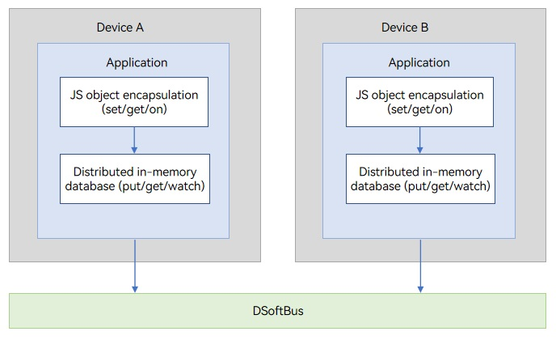
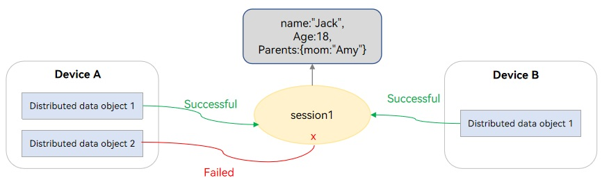
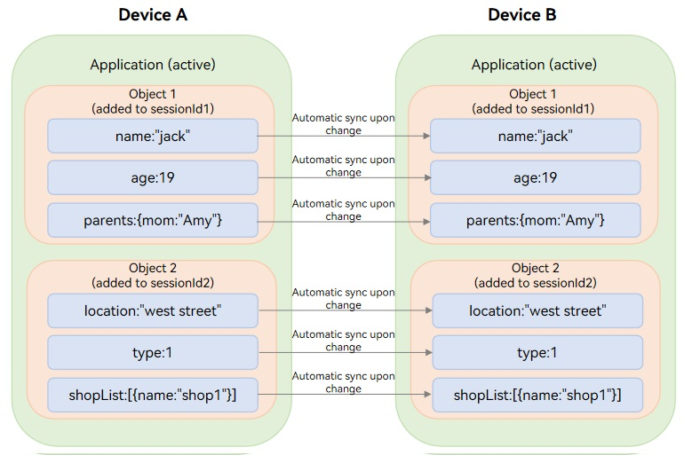

# Cross-Device Sync of Distributed Data Objects (ArkTS)

<!--Kit: ArkData-->
<!--Subsystem: DistributedDataManager-->
<!--Owner: @lvcong_oh-->
<!--Designer: @lvcong_oh-->
<!--Tester: @logic42; @hanjiawei-->
<!--Adviser: @ge-yafang-->
<!-- md-trans-meta sourceCommit=b504d26dfc97256c1aae157485692176a3eff938 translatedAt=2026-08-01T02:50:40.821Z pushedAt=2026-08-01T06:20:55.113Z -->

## When to Use

The traditional implementation of data sync between devices involves heavy workload. You need to design the message processing logic for setting up a communication link, sending, receiving, and processing messages, and resolving data conflicts, as well as retry mechanism upon errors. In addition, the debugging complexity increases with the number of devices.

The device status, message sending progress, and data transmitted are variables. If these variables support global access, they can be accessed as local variables by different devices. This simplifies data sync across devices.

The distributed data object (**distributedDataObject**) module implements global access to variables. It provides basic data object management capabilities, including creating, querying, deleting, and modifying in-memory objects and subscribing to data or status changes. It also provides distributed capabilities. OpenHarmony provides easy-to-use JS APIs for distributed application scenarios. With these APIs, you can easily implement data collaboration for an application across devices and listening for status and data changes between devices. The **distributedDataObject** module implements data object collaboration for the same application across multiple devices that form a Super Device. It greatly reduces the development workloads compared with the traditional implementation.

Currently<!--RP2--> distributed data objects can be used only in [cross-device migration](../application-models/hop-cross-device-migration.md) and [multi-device collaboration through cross-device call](../application-models/uiability-cross-device-interaction.md) scenarios.<!--RP2End-->

## Basic Concepts

- Distributed in-memory database: The distributed in-memory database caches data in the memory so that applications can quickly access the data. However, the data is not persisted. If the database is closed, the data is not retained.

- Distributed data object: A distributed data object is encapsulation of a JS object type. Each distributed data object instance creates a data table in the in-memory database. The in-memory databases created for different applications are isolated from each other. Reading and writing a distributed data object are mapped to the **get** and **put** operations in the corresponding database, respectively.

  The distributed data object has the following states in its lifecycle:

  - **Uninitialized**: The distributed data object is not instantiated or is destroyed.

  - **Local**: A data table is created, but the data cannot be synced.

  - **Distributed**: A data table is created, and data can be synced (there are at least two online devices with the same session ID). If a device is offline or the session ID is empty, the distributed data object changes to the local state.

## Working Principles

**Figure 1** Distributed data object mechanism 



The distributed data objects are encapsulated JS objects in distributed in-memory databases, and can be operated in the same way as local variables. The system automatically implements data sync across devices.

### Encapsulation and Storage of JS Objects

- An in-memory database is created for each distributed object instance, identified by **sessionId**. The in-memory databases created by each application are isolated from one another.

- When a distributed data object is instantiated, all properties of the object are traversed recursively. **Object.defineProperty** is used to define the **set()** and **get()** methods for all properties. The **set()** and **get()** methods correspond to the **put** and **get** operations of a record in the database, respectively. **Key** specifies the property name, and **Value** specifies the property value.

- When a distributed data object is read or written, the **get()** or **set()** method is automatically called to perform the related operation on data in the database.

### Cross-Device Sync and Data Change Notification

The primary capability of distributed data objects is data synchronization between objects. Devices within a trusted network can create distributed data objects locally and assign them a session ID. Distributed data objects on different devices establish a synchronization relationship by using the same session ID.

As shown in the following figure, distributed data object 1 on device A and distributed data object 1 on device B both use the session ID **session1**. As a result, the two objects establish a synchronization relationship through **session1**.

  **Figure 2** Object sync relationship  



For each device, only one distributed data object can be added to a sync relationship. As shown in the preceding figure, distributed data object 2 of device A cannot be added to session 1 because distributed data object 1 of device A has been added to session 1.

After the sync relationship is established, each session has a copy of shared object data. The distributed data objects added to a session support the following operations:

(1) Reading or modifying the data in the session.

(2) Listening for data changes made by other devices.

(3) Listening for status changes, such as the addition and removal of other devices.

When a distributed data object is added to a session, if its data is different from that of the session, the distributed data object updates data of the session. If you do not want to update the data of the session when adding a distributed data object to a session and obtain the data of the session, set the attribute value of the object to **undefined** (for an asset, set each attribute of the asset to an empty string).

### Minimum Sync Unit

Property is the minimum unit to synchronize in distributed data objects. For example, object 1 in the following figure has three properties: name, age, and parents. If one of the properties is changed, only the changed property needs to be synced.

The object properties support basic types (number, Boolean, and string) and complex types (array and nested basic types). For the distributed data object of the complex type, only the root property can be modified. The subordinate properties cannot be modified.

```ts
dataObject['parents'] = {mom: "amy"}; // Supported modifications
dataObject['parents']['mom'] = "amy"; // Unsupported modification
```

**Figure 3** Sync of distributed data objects 



### Persistence of Distributed Data Objects

Distributed data objects primarily reside in an app's process. When a distributed data object persistence API is called, the object is persisted and synchronized through the distributed database. As a result, the data is retained even after the app process exits. The distributed database synchronizes data automatically, and you can listen for data changes by calling [on('change')](../reference/apis-arkdata/js-apis-data-distributedobject.md#onchange20).

Persistent objects extend the capabilities of distributed data objects and are intended for scenarios such as the following:

- After a persistent object is created on a device, the application exits. When the application is reopened, it creates the persistent object again and joins the same session. The object data is restored to the state before the application exited.

- After a persistent object is created on device A, synchronized, and persisted to device B, the application on device A exits. When the application is opened on device B, it creates the persistent object and joins the same session. The object data is restored to the state before the application on device A exited.

### Asset Sync Mechanism

In a distributed data object, the [Asset](../reference/apis-arkdata/js-apis-data-commonType.md#asset) type is used to describe a local entity asset file. When the distributed data object syncs across devices, the file is synced to other devices alongside the data.

Prior to API version 20, only the **Asset** type is supported; the asset array type [Assets](../reference/apis-arkdata/js-apis-data-commonType.md#assets) is not. To sync multiple assets, you can set each asset as a root property of the distributed data object.

Starting from API version 20, asset arrays ([Assets](../reference/apis-arkdata/js-apis-data-commonType.md#assets)) can be synced.

## Constraints

<!--RP5-->

- Currently, distributed data objects can only be used in [cross-device migration](../application-models/hop-cross-device-migration.md) and [multi-device collaboration through cross-device call](../application-models/uiability-cross-device-interaction.md) scenarios. In cross-device migration scenarios, the size of each distributed data object does not exceed 150 KB. In multi-device collaboration scenarios, the size of each distributed data object does not exceed 500 KB.

- Currently, the cross-device continuation capability supports the following scenarios:

  - [Migrating between abilities in the same application across devices](../application-models/hop-cross-device-migration.md#migrating-between-abilities-in-the-same-application-across-devices)

  - [Migrating abilities with different bundle names in the same application across devices](../application-models/hop-cross-device-migration.md#migrating-abilities-with-different-bundle-names-in-the-same-application-across-devices)

<!--RP5End-->

- Data synchronization of distributed data objects occurs within the same application and between the same **sessionId**.

- If data of 1 KB is modified on device A, device B can complete data update within 50 ms after receiving a data change notification.

- A maximum of 16 distributed data object instances can be created for an application.

- For the sake of performance and user experience, the maximum number of devices for data collaboration is 3.

- For complex data types, only root-level properties can be modified. Modifying nested properties is not supported. In the [asset sync mechanism](#asset-sync-mechanism), nested properties one level below the root are supported for asset-type data.

- Currently, interoperability is supported only among JavaScript APIs.

## Available APIs

The following are APIs for cross-device data sync of distributed data objects. For more APIs and usage, see [@ohos.data.distributedDataObject (Distributed Data Object)](../reference/apis-arkdata/js-apis-data-distributedobject.md).

| API| Description|
| -------- | -------- |
| create(context: Context, source: object): DataObject | Creates a distributed data object instance.|
| genSessionId(): string | Generates a session ID for distributed data objects.|
| setSessionId(sessionId: string, callback: AsyncCallback&lt;void&gt;): void | Sets a session ID for data sync. Automatic sync is performed for devices with the same session ID on a trusted network.|
| setSessionId(callback: AsyncCallback&lt;void&gt;): void | Exits all sessions.|
| on(type: 'change', callback: (sessionId: string, fields: Array&lt;string&gt;) => void): void | Subscribes to data changes of a distributed data object.|
| off(type: 'change', callback?: (sessionId: string, fields: Array&lt;string&gt;) => void): void | Unsubscribes from data changes of a distributed data object.|
| on(type: 'status', callback: (sessionId: string, networkId: string, status: 'online' \| 'offline' ) => void): void | Subscribes to status changes of a distributed data object.|
| off(type: 'status', callback?: (sessionId: string, networkId: string, status: 'online' \|'offline' ) => void): void | Unsubscribes from status changes of a distributed data object.|
| save(deviceId: string, callback: AsyncCallback&lt;SaveSuccessResponse&gt;): void | Saves a distributed data object.|
| revokeSave(callback: AsyncCallback&lt;RevokeSaveSuccessResponse&gt;): void | Revokes the saving of a distributed data object.|
| bindAssetStore(assetKey: string, bindInfo: BindInfo, callback: AsyncCallback&lt;void&gt;): void | Binds an asset and its RDB store.|
| setAsset(assetKey: string, uri: string): void | Sets an asset.|
| setAssets(assetKey: string, uris: Array&lt;string&gt;): void | Sets assets.|
| on(type: 'change', callback: DataObserver&lt;void&gt;): void | Subscribes to data changes of a distributed data object. |
| off(type: 'change', callback?: DataObserver&lt;void&gt;): void | Unsubscribes from data changes of a distributed data object. |
| on(type: 'status', callback: StatusObserver&lt;void&gt;): void | Subscribes to the status changes of a distributed data object. |
| off(type: 'status', callback?: StatusObserver&lt;void&gt;): void | Unsubscribes from status changes of a distributed data object. |

## How to Develop

### Using Distributed Data Objects in Cross-Device Migration

1. Create a distributed data object in **onContinue()** for the application on the source device, and save data.

    1.1 Call **create()** to create a distributed data object instance.

    1.2 Call **genSessionId()** to generate a **sessionId**, call **setSessionId()** to set a **sessionId**, and add the **sessionId** to **wantParam**. The distributed data objects with the same **sessionId** can connect to the same network.

    1.3 Obtain the **networkId** from **wantParam** for the application on the target device and call **save()** with this **networkId** to save data to the target device.

2. Create a distributed data object in **onCreate()** and **onNewWant()** for the application on the target device, and register a listener for the "restored" state.

    2.1 Call **create()** to create a distributed data object instance for the application on the target device.

    2.2 Register a listener callback for the data recovery state. If "restored" is returned by the listener callback registered, the distributed data object of the target device has obtained the data transferred from the source device.

    2.3 Obtain the **sessionId** of the source device from **want.parameters** and call **setSessionId** to set the same **sessionId** for the target device.

> **NOTE**
>
> - During cross-device migration, after **setSessionId()** is called on the source device to set **sessionId**, you should call **save()** to save data to the target device. However, data can only be synced to the target device upon the first call of the **save()** API. This is because the migration task is completed immediately after data is obtained from the source device for the first time; subsequent data shall be subject to the target device and no further sync is required.
> - When an application is launched as a result of a migration, the [onWindowStageRestore()](../reference/apis-ability-kit/js-apis-app-ability-uiAbility.md#onwindowstagerestore) lifecycle callback function, rather than [onWindowStageCreate()](../reference/apis-ability-kit/js-apis-app-ability-uiAbility.md#onwindowstagecreate), is triggered following **onCreate()** or **onNewWant()**. This sequence occurs for both cold and hot starts. If you have performed some necessary initialization operations during application launch in `onWindowStageCreate()`, you must perform the same initialization operations in `onWindowStageRestore()` after the migration to avoid application exceptions.
>

<!--RP1-->

> - The `continuable` tag must be set for cross-device migration. For details, see [cross-device migration development procedure](../application-models/hop-cross-device-migration.md#how-to-develop).<!--RP1End-->
>
> - The **sessionId** field in **wantParam** is used by other services. You are advised to customize a key for accessing the **sessionId** field.
>
> - Use data of the Asset type to record information about assets (such as documents, images, and videos). When asset data is migrated, the corresponding asset is also migrated to the target device.
>
> - The initial value of the service data must be set to **undefined** on the target device so that the data saved on the source device can be restored on the target device. Otherwise, the data on the source device will be overwritten by the data set on the target device. For asset data, you need to set each attribute of the asset data to an empty string instead of setting the entire asset data to **undefined**.
>
> - Before API version 20, the asset array is not supported. If multiple files need to be migrated, define an asset data record for each file to migrate. Since API version 20, the asset array can be synced.
>
> - Currently, only files in distributed file directory can be migrated. Files in other directories can be copied or moved to distributed file directory before migration. For details about how to move or copy files and obtain URIs, see [File Management](../reference/apis-core-file-kit/js-apis-file-fs.md) and [File URI](../reference/apis-core-file-kit/js-apis-file-fileuri.md).

<!-- @[data_sync_on_distributed_data_object_cross_device_migration](https://gitcode.com/openharmony/applications_app_samples/blob/master/code/DocsSample/ArkData/DataObject/CrossDeviceMigration/entry/src/main/ets/entrybackupability/EntryBackupAbility.ets)-->

``` TypeScript
import { hilog } from '@kit.PerformanceAnalysisKit';
import { AbilityConstant, UIAbility, Want } from '@kit.AbilityKit';
import { commonType, distributedDataObject } from '@kit.ArkData';
import { BusinessError } from '@kit.BasicServicesKit';

// Service data definition
export class ContentInfo {
  public mainTitle: string | undefined;
  public textContent: string | undefined;
  public imageUriArray: Array<ImageInfo> | undefined;
  public isShowLocalInfo: boolean | undefined;
  public isAddLocalInfo: boolean | undefined;
  public selectLocalInfo: string | undefined;
  public attachments?: commonType.Assets | undefined;

  constructor(
    mainTitle: string | undefined,
    textContent: string | undefined,
    imageUriArray: Array<ImageInfo> | undefined,
    isShowLocalInfo: boolean | undefined,
    isAddLocalInfo: boolean | undefined,
    selectLocalInfo: string | undefined,
    attachments?: commonType.Assets | undefined
  ) {
    this.mainTitle = mainTitle;
    this.textContent = textContent;
    this.imageUriArray = imageUriArray;
    this.isShowLocalInfo = isShowLocalInfo;
    this.isAddLocalInfo = isAddLocalInfo;
    this.selectLocalInfo = selectLocalInfo;
    this.attachments = attachments;
  }

  flatAssets(): object {
    let obj: object = this;
    if (!this.attachments) {
      return obj;
    }
    for (let i = 0; i < this.attachments.length; i++) {
      obj[`attachments${i}`] = this.attachments[i];
    }
    return obj;
  }
}

export interface ImageInfo {
  /**
   * image PixelMap.
   */
  imagePixelMap: PixelMap;

  /**
   * Image name.
   */
  imageName: string;
}

const DOMAIN: number = 0x0000;
const TAG: string = '[DistributedDataObject]';
let dataObject: distributedDataObject.DataObject;

export default class EntryAbility extends UIAbility {
  private imageUriArray: Array<ImageInfo> = [];
  private distributedObject: distributedDataObject.DataObject | undefined = undefined;

  // 1. The migration source creates a distributed data object in onContinue and saves data to the target device.
  async onContinue(wantParam: Record<string, Object | undefined>): Promise<AbilityConstant.OnContinueResult> {
    // 1.1 Obtain the asset key URI of the distributed data object to be set.
    try {
      let sessionId: string = distributedDataObject.genSessionId();
      wantParam.distributedSessionId = sessionId;

      let distrUriArray: string[] = [];
      let assetUriArray = AppStorage.get<Array<string>>('assetUriArray');
      if (assetUriArray) {
        distrUriArray = assetUriArray;
      }
      // 1.2 Create a distributed data object.
      let contentInfo: ContentInfo = new ContentInfo(
        AppStorage.get('mainTitle'),
        AppStorage.get('textContent'),
        AppStorage.get('imageUriArray'),
        AppStorage.get('isShowLocalInfo'),
        AppStorage.get('isAddLocalInfo'),
        AppStorage.get('selectLocalInfo'),
      );
      let source = contentInfo.flatAssets();
      this.distributedObject = distributedDataObject.create(this.context, source);

      // 1.3 Set the asset or assets of the distributed data object.
      if (assetUriArray?.length === 1) {
        this.distributedObject?.setAsset('attachments', distrUriArray[0]).then(() => {
          hilog.info(DOMAIN, TAG, 'OnContinue setAsset');
        })
      } else {
        this.distributedObject?.setAssets('attachments', distrUriArray).then(() => {
          hilog.info(DOMAIN, TAG, 'OnContinue setAssets');
        })
      }
      // 1.4 Save the set asset or asset array to the migration initiator.
      this.distributedObject?.setSessionId(sessionId);
      this.distributedObject?.save(wantParam.targetDevice as string).catch((err: BusinessError) => {
        hilog.error(DOMAIN, TAG, 'OnContinue failed to save. code: ', err.code);
        hilog.error(DOMAIN, TAG, 'OnContinue failed to save. message: ', err.message);
      });
    } catch (error) {
      hilog.error(DOMAIN, TAG, 'OnContinue failed code: ', error.code);
      hilog.error(DOMAIN, TAG, 'OnContinue failed message: ', error.message);
    }
    hilog.info(DOMAIN, TAG, 'OnContinue success!');
    return AbilityConstant.OnContinueResult.AGREE;
  }

  // 2. The receiver creates a distributed data object in onCreate and onNewWant and joins the network for data recovery.
  onCreate(want: Want, launchParam: AbilityConstant.LaunchParam): void {
    if (launchParam.launchReason === AbilityConstant.LaunchReason.CONTINUATION) {
      if (want.parameters && want.parameters.distributedSessionId) {
        this.restoreDistributedObject(want);
      }
    }
  }

  // 2. The receiver creates a distributed data object in onCreate and onNewWant and joins the network for data recovery.
  onNewWant(want: Want, launchParam: AbilityConstant.LaunchParam): void {
    if (launchParam.launchReason === AbilityConstant.LaunchReason.CONTINUATION) {
      if (want.parameters && want.parameters.distributedSessionId) {
        this.restoreDistributedObject(want);
      }
    }
  }

  async restoreDistributedObject(want: Want): Promise<void> {
    if (!want.parameters || !want.parameters.distributedSessionId) {
      hilog.error(DOMAIN, TAG, 'missing sessionId');
      return;
    }

    // 2.1 Call the create API to create and obtain a distributed data object instance.
    let mailInfo: ContentInfo = new ContentInfo(undefined, undefined, [], undefined, undefined, undefined, undefined);
    dataObject = distributedDataObject.create(this.context, mailInfo);

    // 2.2 Register a restoration status listener. When a callback notification with the status 'restored' is received, it indicates that the receiving-end distributed data object has restored the data saved by the initiating end (if there is asset data, the corresponding files have also been migrated).
    dataObject.on('status', (sessionId: string, networkId: string, status: string) => {
      hilog.info(DOMAIN, TAG, `status change, sessionId:  ${sessionId}`);
      hilog.info(DOMAIN, TAG, `status change, networkId:  ${networkId}`);
      if (status === 'restored') { // Receiving a status notification of 'restored' indicates that the data saved by the initiating end has been restored.
        hilog.info(DOMAIN, TAG, `title: ${dataObject['title']}, text: ${dataObject['text']}`);
        AppStorage.setOrCreate('mainTitle', dataObject['mainTitle']);
        AppStorage.setOrCreate('textContent', dataObject['textContent']);
        AppStorage.setOrCreate('imageUriArray', dataObject['imageUriArray']);
        AppStorage.setOrCreate('isShowLocalInfo', dataObject['isShowLocalInfo']);
        AppStorage.setOrCreate('isAddLocalInfo', dataObject['isAddLocalInfo']);
        AppStorage.setOrCreate('selectLocalInfo', dataObject['selectLocalInfo']);
        AppStorage.setOrCreate<Array<ImageInfo>>('imageUriArray', this.imageUriArray);
      }
    });

    // 2.3 Obtain the sessionId placed by the initiating end from want.parameters, and call setSessionId to set the synchronization sessionId.
    let sessionId = want.parameters.distributedSessionId as string;
    hilog.info(DOMAIN, TAG, `get sessionId: ${sessionId}`);
    dataObject.setSessionId(sessionId);
  }
}
```

### Using Distributed Data Objects in Multi-Device Collaboration

1. Call **startAbilityByCall** to start the peer ability.

    1.1 Call **genSessionId** to create a session ID, and obtain the network ID of the peer device through the distributed device management API.

    1.2 Assemble a want and add the session ID to the want.

    1.3 Call **startAbilityByCall** to start the peer ability.

2. Create a distributed data object and join the network after the peer ability is started.

   2.1 Create a distributed object instance.

   2.2 Register a data change listener.

   2.3 Set the synchronization session ID to join the network.

3. Create and restore the distributed data objects on the target device after it is started.

   3.1 Create a distributed object instance.

   3.2 Register a data change listener.

   3.3 Obtain the session ID added by the source end from the want, and use this session ID to join the network.

> **NOTE**
>
> - Currently, distributed data objects are supported for data synchronization only in [multi-device collaboration through cross-device call scenarios](../application-models/uiability-cross-device-interaction.md).
>
> - Multi-device collaboration implemented through cross-device calls requires the `ohos.permission.DISTRIBUTED_DATASYNC` permission and the configuration of a singleton launch tag. For details, see [Multi-Device Collaboration Through Cross-Device Call Invocation](../application-models/uiability-cross-device-interaction.md).
>
> - The **sessionId** field in **wantParam** may be occupied by other services. You are advised to customize a key to store and retrieve the session ID.
>
> - For details about how to use distributed device management to obtain the peer device's networkId, see [Querying Device Information](../distributedservice/devicemanager-guidelines.md#querying-device-information).

 The sample code is as follows:

<!-- @[data_sync_on_distributed_data_object_cross_device_collaboration](https://gitcode.com/openharmony/applications_app_samples/blob/master/code/DocsSample/ArkData/DataObject/CrossDeviceCollaboration/entry/src/main/ets/entrybackupability/EntryBackupAbility.ets)-->

``` TypeScript
import { AbilityConstant, Caller, UIAbility, Want } from '@kit.AbilityKit';
import { distributedDataObject } from '@kit.ArkData';
import { distributedDeviceManager } from '@kit.DistributedServiceKit';
import { BusinessError } from '@kit.BasicServicesKit';
import { JSON } from '@kit.ArkTS';
import { hilog } from '@kit.PerformanceAnalysisKit';

// Service data definition
class Data {
  public title: string | undefined;
  public text: string | undefined;

  constructor(title: string | undefined, text: string | undefined) {
    this.title = title;
    this.text = text;
  }
}

const DOMAIN: number = 0x0000;
const TAG: string = '[DistributedDataObject]';

let sessionId: string;
let caller: Caller;
let dataObject: distributedDataObject.DataObject;
const changeCallBack: distributedDataObject.DataObserver = (sessionId: string, fields: Array<string>) => {
  console.info(`change, sessionId: ${sessionId}, fields: ${JSON.stringify(fields)}`);
}

export default class EntryAbility extends UIAbility {
  // 1. The caller invokes the startAbilityByCall API to launch the peer Ability.
  callRemote() {
    if (caller) {
      hilog.error(DOMAIN, TAG, 'call remote already');
      return;
    }

    // 1.1 Call the genSessionId API to create a sessionId, and obtain the peer device's networkId through the distributed device management API.
    sessionId = distributedDataObject.genSessionId();
    hilog.info(DOMAIN, TAG, `gen sessionId: ${sessionId}`);
    let deviceId = getRemoteDeviceId();
    if (deviceId === '') {
      hilog.warn(DOMAIN, TAG, 'no remote device');
      return;
    }
    hilog.info(DOMAIN, TAG, `get remote deviceId: ${deviceId}`);

    // 1.2 Assemble the want and put the sessionId into it.
    let want: Want = {
      bundleName: 'com.example.collaboration',
      abilityName: 'EntryAbility',
      deviceId: deviceId,
      parameters: {
        'ohos.aafwk.param.callAbilityToForeground': true, // Foreground launch, not required
        'distributedSessionId': sessionId
      }
    }
    try {
      // 1.3 Call the startAbilityByCall API to launch the peer ability.
      this.context.startAbilityByCall(want).then((res) => {
        if (!res) {
          hilog.error(DOMAIN, TAG, 'startAbilityByCall failed');
        }
        caller = res;
      })
    } catch (e) {
      let err = e as BusinessError;
      hilog.error(DOMAIN, TAG, `get remote deviceId error, error code: ${err.code}, error message: ${err.message}`);
    }
  }

  // 2. Create a distributed data object after launching the peer ability.
  createDataObject() {
    if (!caller) {
      hilog.error(DOMAIN, TAG, 'call remote first');
      return;
    }
    if (dataObject) {
      hilog.error(DOMAIN, TAG, 'create dataObject already');
      return;
    }

    // 2.1 Create a distributed data object instance.
    let data = new Data('The title', 'The text');
    dataObject = distributedDataObject.create(this.context, data);

    // 2.2 Register a data change listener.
    dataObject.on('change', changeCallBack);
    // 2.3 Set the sync sessionId to join the network.
    dataObject.setSessionId(sessionId);
  }

  // 3. Create and restore the distributed data object after the called end is launched.
  onCreate(want: Want, launchParam: AbilityConstant.LaunchParam): void {
    if (want.parameters && want.parameters.distributedSessionId) {
      // 3.1 Create a distributed data object instance.
      let data = new Data(undefined, undefined);
      dataObject = distributedDataObject.create(this.context, data);

      // 3.2 Register a data change listener.
      dataObject.on('change', changeCallBack);
      // 3.3 Obtain the sessionId placed by the source end from want, and use this sessionId to join the network.
      let sessionId = want.parameters.distributedSessionId as string;
      hilog.info(DOMAIN, TAG, `onCreate get sessionId: ${sessionId}`);
      dataObject.setSessionId(sessionId);
    }
  }
}

// Obtain devices in the trusted network.
function getRemoteDeviceId() {
  let deviceId = '';
  try {
    let deviceManager = distributedDeviceManager.createDeviceManager('com.example.collaboration');
    let devices = deviceManager.getAvailableDeviceListSync();
    if (devices[0] && devices[0].networkId) {
      deviceId = devices[0].networkId;
    }
  } catch (e) {
    let err = e as BusinessError;
    hilog.error(DOMAIN, TAG, `get remote deviceId error, error code: ${err.code}, error message: ${err.message}`);
  }
  return deviceId;
}
```

## Samples

For distributed data object development, the following samples are available:

- [DistributedAuthentication (ArkTS) (Full SDK) (API10)](https://gitcode.com/openharmony/applications_app_samples/tree/master/code/DocsSample/DistributedAppDev/DistributedAuthentication)

- [DistributedNote (ArkTS) (Full SDK) (API10)](https://gitcode.com/openharmony/applications_app_samples/tree/master/code/SuperFeature/DistributedAppDev/DistributedNote)