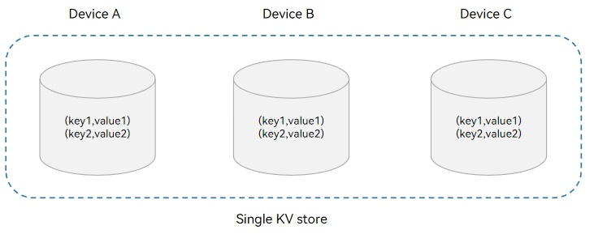
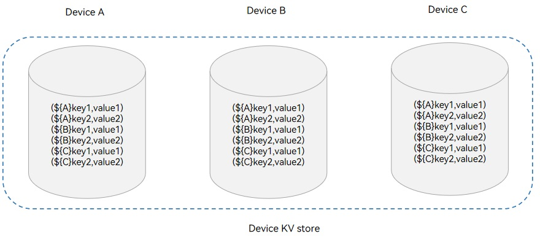
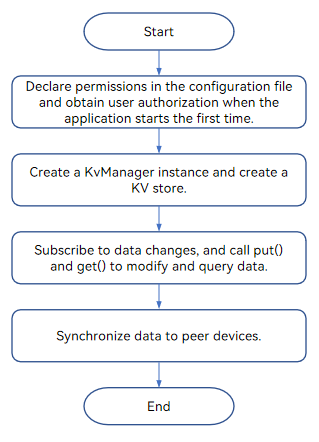

# Cross-Device Sync of KV Stores (ArkTS)
<!--Kit: ArkData-->
<!--Subsystem: DistributedDataManager-->
<!--Owner: @ding_dong_dong-->
<!--Designer: @dboy190; @houpengtao1-->
<!--Tester: @logic42-->
<!--Adviser: @ge-yafang-->


## When to Use

KV Stores are suitable for storing service data with simple relationships. It provides higher read and write performance than the SQL database. KV stores are widely used because the simplicity of the KV data model poses fewer database version compatibility issues in distributed scenarios and simplifies conflict handling in cross-device data sync.


## Basic Concepts

Before implementing cross-device data sync of KV stores, understand the following concepts:


### Single KV Store

In a single KV store, data is stored locally as individual entries. When data is modified, the change is applied directly to the entry. After sync, only one global copy of the data is retained across multiple devices. If multiple devices have the same record (with the same primary key), the latest version is preserved irrespective of the device. If data with the same key is modified on multiple devices, the latest change will overwrite the previous ones. For the data written or modified locally, the data with the latest time is synced to other devices. Single KV store is used to store information, such as the contacts and weather application data.




### Device KV Store

In a device KV store, the local device ID is added before the key of the KV pair stored by an application. In this way, the data of different devices is isolated. Data is managed by device and can be queried by device.

The underlying devices manage the data by device. The device KV stores support distributed data query by device, but do not support modification of the data synced from peer devices. Device KV stores are used to store the data that needs to be accessed by device, such as the Gallery thumbnails.




## Sync Types

The data management service provides two sync types: manual sync and auto sync. You can use either mode to sync the data of an application across devices:

### Manual Sync

The application calls **sync()** with the devices to be synced and the sync mode specified to trigger the sync. The sync mode can be **PULL_ONLY** (pulling remote data to the local end), **PUSH_ONLY** (pushing local data to the remote end), or **PUSH_PULL** (pushing local data to the remote end and pulling remote data to the local end). You can use the [**sync()** with the **query** parameter](../reference/apis-arkdata/js-apis-distributedKVStore.md#sync-1) to sync the data that meets the specified conditions.

### Auto Sync

<!--RP5-->
In [multi-device collaboration via cross-device calls](../application-models/hop-multi-device-collaboration.md#using-cross-device-call), after an application updates data, the distributed database automatically pushes the local data to the peer ends and pulls the peer data to the local device for data sync. In this case, the application does not need to call **sync()**.<!--RP5End-->


## Working Principles

After completing device discovery and authentication, the underlying communication component notifies the application that the device goes online. The **DatamgrService** then establishes an encrypted transmission channel to sync data between the two devices.


### Cross-Device Data Sync Mechanism


When **put()** or **delete()** is called successfully, an auto sync is triggered. The distributed data is sent to the peer device through the communication adaptation layer for sync.

If **sync()** is called successfully, a manual sync is triggered to send distributed data to the peer device through the communication adaptation layer.


### Data Change Notification Mechanism

When data is added, deleted, or modified, a notification is sent to the subscriber. The notifications can be classified into the following types:

- Local data change notification: subscription of the application data changes on the local device. When the data in the local KV store is added, deleted, or modified in the database, a notification is received.

- Distributed data change notification: subscription of the application data changes of other devices in the network. When the data in the local KV store changes after being synced with data from another device in the same network, a notification is received.


## Constraints

- For each record in a device KV store, the key cannot exceed 896 bytes and the value cannot exceed 4 MB.

- For each record in a single KV store, the key cannot exceed 1 KB and the value cannot exceed 4 MB.

- The KV stores do not support custom conflict resolution policies for applications.

- An application can open a maximum of 16 distributed KV stores at a time.

- A single KV store supports a maximum of eight listener callbacks for data changes.


## Available APIs

The following table lists the APIs for cross-device data sync of the single KV store. Most of the APIs are executed asynchronously, using a callback or promise to return the result. The following table uses the callback-based APIs as an example. For more information about the APIs, see [Distributed KV Store](../reference/apis-arkdata/js-apis-distributedKVStore.md).

| API| Description|
| -------- | -------- |
| createKVManager(config: KVManagerConfig): KVManager | Creates a **KvManager** instance to manage database objects.|
| getKVStore&lt;T&gt;(storeId: string, options: Options, callback: AsyncCallback&lt;T&gt;): void | Obtains a KV store of the specified type.|
| put(key: string, value: Uint8Array \| string \| number \| boolean, callback: AsyncCallback&lt;void&gt;): void | Inserts and updates data.|
| on(event: 'dataChange', type: SubscribeType, listener: Callback&lt;ChangeNotification&gt;): void | Subscribes to data changes in the KV store.|
| get(key: string, callback: AsyncCallback&lt;boolean \| string \| number \| Uint8Array&gt;): void | Queries the value of the specified key.|
| sync(deviceIds: string[], mode: SyncMode, delayMs?: number): void | Triggers a manual sync of the KV store.|


## How to Develop

The following uses a single KV store as an example to describe how to implement cross-device data sync. The development process is as follows.



> **NOTE**
>
> The security level of the destination device (to which data is synced) cannot be higher than that of the source device. For details, see [Access Control Mechanism in Cross-Device Sync](access-control-by-device-and-data-level.md#access-control-mechanism-in-cross-device-sync).

1. Import the module.
   
   ```ts
   import { distributedKVStore } from '@kit.ArkData';
   ```

2. Request permissions.

   1. Declare the **ohos.permission.DISTRIBUTED_DATASYNC** permission. For details, see [Declaring Permissions](../security/AccessToken/declare-permissions.md).
   2. Display a dialog box to ask for authorization from the user when the application is started for the first time. For details, see [Requesting User Authorization](../security/AccessToken/request-user-authorization.md).

3. Call the **createKVManager()** method to create a **KvManager** instance.

   1. Create a **kvManagerConfig** object based on the application context.
   2. Create a **KvManager** instance.

   
   ```ts
   // Obtain the context of the stage model.
   import { window } from '@kit.ArkUI';
   import { UIAbility } from '@kit.AbilityKit';
   import { BusinessError } from '@kit.BasicServicesKit';
   
   let kvManager: distributedKVStore.KVManager | undefined = undefined;
   
   class EntryAbility extends UIAbility {
     onWindowStageCreate(windowStage:window.WindowStage) {
       let context = this.context;
     }
   }
    
    // Obtain the context of the FA model.
   import { featureAbility } from '@kit.AbilityKit';
   import { BusinessError } from '@kit.BasicServicesKit';
    
   let context = featureAbility.getContext();
   
   // Construct a kvManager instance.
   try {
     const kvManagerConfig: distributedKVStore.KVManagerConfig = {
       bundleName: 'com.example.datamanagertest',
       context: context
     }
     kvManager = distributedKVStore.createKVManager(kvManagerConfig);
     console.info('Succeeded in creating KVManager.');
     // Create and obtain the KV store.
   } catch (e) {
     let error = e as BusinessError;
     console.error(`Failed to create KVManager. Code:${error.code},message:${error.message}`);
   }
   
   if (kvManager !== undefined) {
     // Perform subsequent operations such as creating a KV store.
     // ...
   }
   ```

4. Call the **getKVStore()** method to obtain the KV store of the specified type.

   1. Declare the ID of the distributed KV store to create, for example, **'storeId'** in the sample code.
   2. Disable the auto sync function (**autoSync:false**) to facilitate subsequent verification of the sync feature. If sync is required, call the **sync()** API.

   
   ```ts
   let kvStore: distributedKVStore.SingleKVStore | undefined = undefined;
   try {
     let child1 = new distributedKVStore.FieldNode('id');
     child1.type = distributedKVStore.ValueType.INTEGER;
     child1.nullable = false;
     child1.default = '1';
     let child2 = new distributedKVStore.FieldNode('name');
     child2.type = distributedKVStore.ValueType.STRING;
     child2.nullable = false;
     child2.default = 'zhangsan';

     let schema = new distributedKVStore.Schema();
     schema.root.appendChild(child1);
     schema.root.appendChild(child2);
     schema.indexes = ['$.id', '$.name'];
     // The value 0 indicates the compatible mode, and 1 indicates the strict mode.
     schema.mode = 1;
     // Set the number of bytes to be skipped during the value check. The value range is [0, 4M-2].
     schema.skip = 0;

     const options: distributedKVStore.Options = {
       createIfMissing: true,
       encrypt: false,
       backup: false,
       autoSync: false,
       // If kvStoreType is left empty, a device KV store is created by default.
       // Device KV store: kvStoreType: distributedKVStore.KVStoreType.DEVICE_COLLABORATION,
       kvStoreType: distributedKVStore.KVStoreType.SINGLE_VERSION,
       // The schema parameter is optional. You need to set this parameter when the schema function is required, for example, when predicates are used for query.
       schema: schema,
       securityLevel: distributedKVStore.SecurityLevel.S3
     };
     kvManager.getKVStore<distributedKVStore.SingleKVStore>('storeId', options, (err, store: distributedKVStore.SingleKVStore) => {
       if (err) {
         console.error(`Failed to get KVStore: Code:${err.code},message:${err.message}`);
         return;
       }
       console.info('Succeeded in getting KVStore.');
       kvStore = store;
       if (kvStore !== undefined) {
           // Before performing related data operations, obtain a KV store instance.
           // Perform subsequent data operations, such as adding, deleting, modifying, and querying data, and subscribing to data changes.
           // ...
       }
     });
   } catch (e) {
     let error = e as BusinessError;
     console.error(`An unexpected error occurred. Code:${error.code},message:${error.message}`);
   }
   ```

5. Call the **on()** method to subscribe to distributed data changes. To unsubscribe from the data changes, call [off('dataChange')](../reference/apis-arkdata/js-apis-distributedKVStore.md#offdatachange).
   
   ```ts
   try {
     kvStore.on('dataChange', distributedKVStore.SubscribeType.SUBSCRIBE_TYPE_ALL, (data) => {
       console.info(`dataChange callback call data: ${data}`);
     });
   } catch (e) {
     let error = e as BusinessError;
     console.error(`An unexpected error occurred. code:${error.code},message:${error.message}`);
   }
   ```

6. Call the **put()** method to write data to the distributed KV store.

   1. Construct the key and value to be written to the single KV store.
   2. Write KV pairs to the single KV store.

   
   ```ts
   const KEY_TEST_STRING_ELEMENT = 'key_test_string';
   // If schema is not defined, pass in other values that meet the requirements.
   const VALUE_TEST_STRING_ELEMENT = '{"id":0, "name":"lisi"}';
   try {
     kvStore.put(KEY_TEST_STRING_ELEMENT, VALUE_TEST_STRING_ELEMENT, (err) => {
       if (err !== undefined) {
         console.error(`Failed to put data. Code:${err.code},message:${err.message}`);
         return;
       }
       console.info('Succeeded in putting data.');
     });
   } catch (e) {
     let error = e as BusinessError;
     console.error(`An unexpected error occurred. Code:${error.code},message:${error.message}`);
   }
   ```

7. Query data from the distributed KV store.

   1. Construct the key to be queried from the single KV store.
   2. Query data from the single KV store.

   
   ```ts
   try {
     kvStore.put(KEY_TEST_STRING_ELEMENT, VALUE_TEST_STRING_ELEMENT, (err) => {
       if (err !== undefined) {
         console.error(`Failed to put data. Code:${err.code},message:${err.message}`);
         return;
       }
       console.info('Succeeded in putting data.');
       kvStore = kvStore as distributedKVStore.SingleKVStore;
       kvStore.get(KEY_TEST_STRING_ELEMENT, (err, data) => {
         if (err != undefined) {
           console.error(`Failed to get data. Code:${err.code},message:${err.message}`);
           return;
         }
         console.info(`Succeeded in getting data. Data:${data}`);
       });
     });
   } catch (e) {
     let error = e as BusinessError;
     console.error(`Failed to get data. Code:${error.code},message:${error.message}`);
   }
   ```

8. Call the **sync()** method to sync data to other devices.

   Select the devices to be synced with data and the sync mode. The user needs to confirm the sync mode when the application is started for the first time.

   > **NOTE**
   >
   > In manual sync mode, **deviceIds** can be obtained by using [devManager.getAvailableDeviceListSync](../reference/apis-distributedservice-kit/js-apis-distributedDeviceManager.md#getavailabledevicelistsync).

   ```ts
   import { distributedDeviceManager } from '@kit.DistributedServiceKit';
    
   let devManager: distributedDeviceManager.DeviceManager;
   try {
     // Create deviceManager.
     devManager = distributedDeviceManager.createDeviceManager(context.applicationInfo.name);
     // deviceIds is obtained by devManager.getAvailableDeviceListSync.
     let deviceIds: string[] = [];
     if (devManager != null) {
       let devices = devManager.getAvailableDeviceListSync();
       for (let i = 0; i < devices.length; i++) {
         deviceIds[i] = devices[i].networkId as string;
       }
     }
     try {
       // 1000 indicates the maximum delay, in ms.
       kvStore.sync(deviceIds, distributedKVStore.SyncMode.PUSH_ONLY, 1000);
     } catch (e) {
       let error = e as BusinessError;
       console.error(`An unexpected error occurred. Code:${error.code},message:${error.message}`);
     }
   
   } catch (err) {
     let error = err as BusinessError;
     console.error("createDeviceManager errCode:" + error.code + ",errMessage:" + error.message);
   }
   ```
