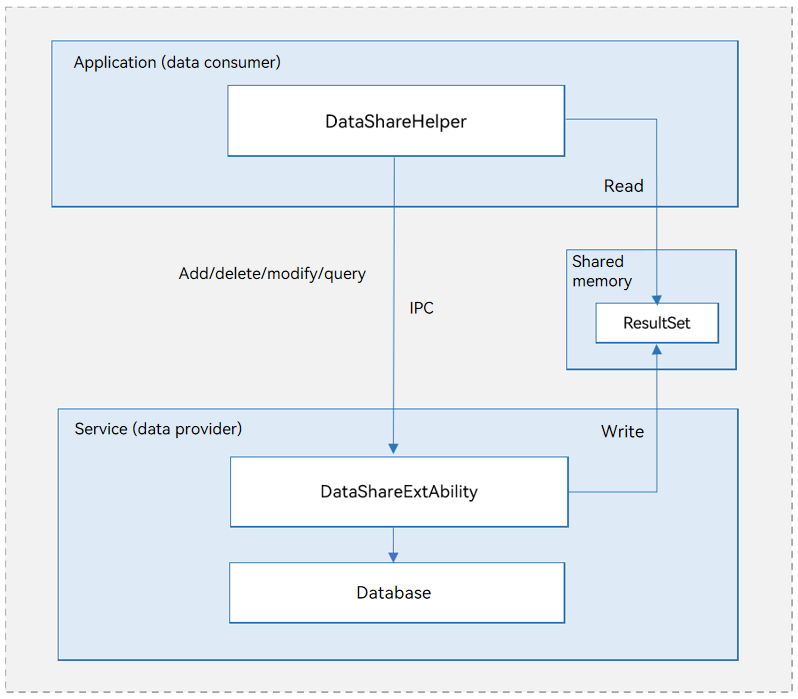

# DataShare Overview

## Introduction

The **DataShare** module allows an application to manage its own data and share data with other applications. Currently, data can be shared only between applications on the same device.

Data needs to be shared in a wealth of scenarios. For example, contacts, short message service (SMS), and media gallery always needs to be shared. However, certain data, such as accounts and passwords, cannot be shared. Some data, such as SMS messages, can be queried but not modified by other applications. **DataShare** provides a secure data sharing mechanism for applications in a variety of scenarios.

The data provider can directly use the **DataShare** framework to share data with other applications without complex encapsulation. The data consumer only needs to learn and use a set of interfaces because the data access mode does not vary with the data provisioning mode. This greatly reduces the learning time and development difficulty.

## Basic Concepts

Before you get started, familiarize yourself with the following concepts:

- Data provider

  An application that provides data and implements related services. It is also called a producer or server.

- Data consumer

  An application that accesses the data or services provided by a data provider. It is also called a client.

- **ValuesBucket**

  One or more data records stored in the form of key-value (KV) pairs. The keys are of the string type. The values can be of the number, string, Boolean, or Unit8Array type.

- Result set
  
  A collection of query results. Flexible data access modes are provided for users to obtain data.
  
- Predicate
  
  Conditions specified for updating, deleting, or querying data in the database.

## Working Principles

**Figure 1** DataShare mechanism

- The **DataShareExtAbility** module, as the data provider, implements data sharing between applications.
- The **DataShareHelper** module, as the data consumer, provides interfaces for accessing data, including adding, deleting, modifying, and querying data.
- The data consumer communicates with the data provider using inter-process communication (IPC). The data provider can be implemented through a database or other data storage.

- The **ResultSet** module is implemented through shared memory. Shared memory stores the result sets, and interfaces are provided to traverse result sets.

## Constraints

- **DataShare** is subject to the limitations on the database used by the data provider. For example, the supported data models, length of the keys and values, and maximum number of databases that can be accessed at a time by each application vary with the database in use.

- The payloads of **ValuesBucket**, predicates, and result sets are restricted by IPC.
