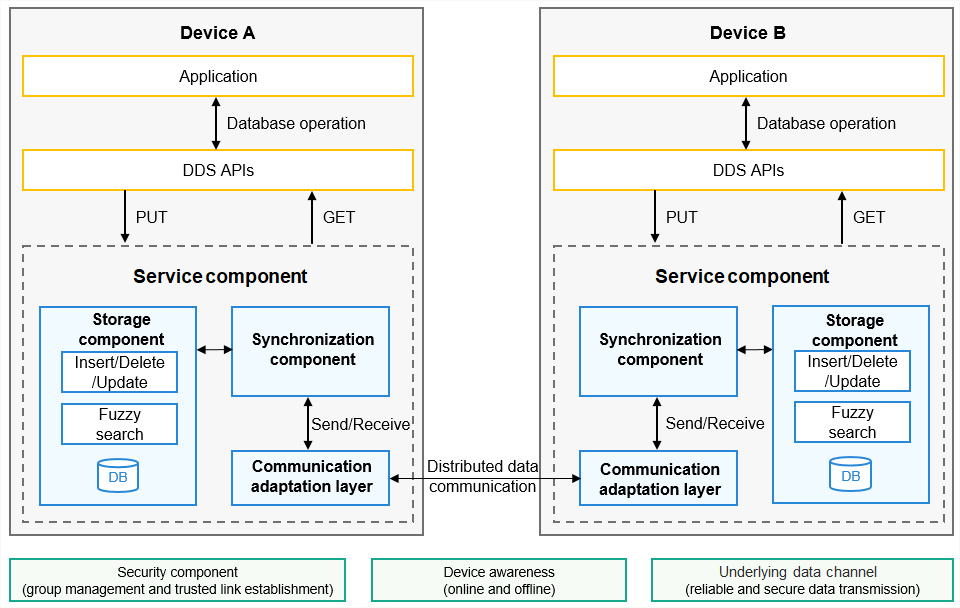

# Distributed Data Service Overview

The distributed data service (DDS) implements distributed database collaboration across devices for applications.

Applications save data to distributed databases by calling the DDS APIs. The DDS isolates data of different applications based on a triplet of account, application, and database to ensure secure data access. The DDS synchronizes application data between trusted devices to provide users with consistent data access experience on different devices.

You do not need to care about the implementation of the database locking mechanism.

## Basic Concepts

### KV Data Model

The key-value (KV) data model allows data to be organized, indexed, and stored in KV pairs.

The KV data model is suitable for storing service data that is not related. It provides better read and write performance than the SQL database. The KV data model is widely used in distributed scenarios because it handles database version compatibility issues and data synchronization conflicts easily. The distributed database is based on the KV data model and provides KV-based access interfaces.

### Distributed Database Transaction

Distributed database transactions include local transactions (same as the transactions of traditional databases) and synchronization transactions. Synchronization transactions allow data to be synchronized between devices by local transaction. Synchronization of a local transaction modification either succeeds or fails on all the devices.

### Distributed Database Consistency

In a distributed scenario, cross-device collaboration demands consistent data between the devices in the same network. The data consistency can be classified into the following types:

- **Strong consistency**: When data is inserted, deleted, or modified on a device, other devices in the same network will obtain the latest data immediately.
- **Weak consistency**: When data is added, deleted, or modified on a device, other devices in the same network may or may not obtain the latest data. The data on these devices may be inconsistent after a certain period of time.
- **Eventual consistency**: When data is added, deleted, or modified on a device, other devices in the same network may not obtain the latest data immediately. However, data on these devices will become consistent after a certain period of time.

Strong consistency has high requirements on distributed data management and may be used in distributed server deployment. The DDS supports only the eventual consistency because mobile devices are not always online and the network has no center.

### Distributed Database Synchronization

After discovering and authenticating a device, the underlying communication component notifies the upper-layer application (including the DDS) that the device goes online. The DDS then establishes an encrypted transmission channel to synchronize data between the two devices.

The DDS provides the following synchronization modes:

- **Manual synchronization**: Applications call **sync()** to trigger a synchronization. The list of devices to be synchronized and the synchronization mode must be specified. The synchronization mode can be **PULL_ONLY** (pulling remote data to the local end), **PUSH_ONLY** (pushing local data to the remote end), or **PUSH_PULL** (pushing local data to the remote end and pulling remote data to the local end). The internal interface supports condition-based synchronization. The data that meets the conditions can be synchronized to the remote end.
- **Automatic synchronization**: includes full synchronization and condition-based subscription synchronization. In full synchronization, the distributed database automatically pushes local data to the remote end and pulls remote data to the local end when a device goes online or application data is updated. Applications do not need to call **sync()**. The internal interface supports condition-based subscription synchronization. The data that meets the subscription conditions on the remote end is automatically synchronized to the local end.

### Single KV Store

Data is saved locally in the unit of a single KV entry. Only one entry is saved for each key. Data can be modified only locally and synchronized to remote devices in sequence based on the update time.

### Device KV Store

The device KV store is based on the single KV store. The local device ID is added to the key when KV data is stored in the device KV store. Data can be isolated, managed, and queried by device. However, the data synchronized from remote devices cannot be modified locally.

### Conflict Resolution

A data conflict occurs when multiple devices modify the same data and commit the modification to the database. The last write wins (LWW) is the default conflict resolution policy used for data conflicts. Based on the commit timestamps, the data with a later timestamp is used. Currently, customized conflict resolution policies are not supported.

### Schema-based Database Management and Predicate-based Data Query 

A schema is specified when you create or open a single KV store. Based on the schema, the database detects the value format of KV pairs and checks the value structure. Based on the fields in the values, the database implements index creation and predicate-based query.

### Distributed Database Backup

The DDS provides the database backup capability. You can set **backup** to **true** to enable daily backup. If a distributed database is damaged, the DDS deletes the database and restores the most recent data from the backup database. If no backup database is available, the DDS creates one. The DDS can also back up encrypted databases.

## Working Principles

The DDS supports distributed management of application database data in the OpenHarmony system. Data can be synchronized between multiple devices with the same account, delivering a consistent user experience across devices. 

The DDS consists of the following:

- **APIs** The DDS provides APIs to create databases, access data, and subscribe to data. The APIs support the KV data model and common data types. They are highly compatible and easy to use, and can be released.

- **Service component** The service component implements management of metadata, permissions, encryption, backup and restore, and multiple users, and completes initialization of the storage component, synchronization component, and communication adaptation layer of the distributed database.

- **Storage component** The storage component implements data access, data reduction, transactions, snapshots, database encryption, data combination, and conflict resolution.

- **Synchronization component** The synchronization component interacts with the storage component and the communication adaptation layer to maintain data consistency between online devices. It synchronizes data generated on the local device to other devices and merges data from other devices into the local device.

- **Communication adaptation layer** The communication adaptation layer calls APIs of the underlying public communication layer to create and connect to communication channels, receive device online and offline messages, update metadata of the connected and disconnected devices, send device online and offline messages to the synchronization component. The synchronization component updates the list of connected devices, and calls the APIs of the communication adaption layer to encapsulate data and send the data to the connected devices.

Applications call the DDS APIs to create, access, and subscribe to distributed databases. The APIs store data to the storage component based on the capabilities provided by the service component. The storage component interacts with the synchronization component to synchronize data. The synchronization component uses the communication adaptation layer to synchronize data to remote devices, which update the data in the storage component and provide the data for applications through service APIs.

**Figure 1** How DDS works

## Constraints

- The DDS supports the KV data model only. It does not support foreign keys or triggers of the relational database.

- The KV data model specifications supported by the DDS are as follows:

  - For each record in a device KV store, the key must be less than or equal to 896 bytes and the value be less than 4 MB.
  - For each record in a single KV store, the key must be less than or equal to 1 KB and the value be less than 4 MB.
  - An application can open a maximum of 16 KV stores simultaneously.

- The data that needs to be synchronized between devices should be stored in distributed databases rather than local databases.

- The DDS does not support customized conflict resolution policies.

- The maximum number of access requests to the KvStore API is 1000 per second and 10000 per minute. The maximum number of access requests to the KvManager API is 50 per second and 500 per minute.

- Blocking operations, such as modifying UI components, are not allowed in the distributed database event callback.
