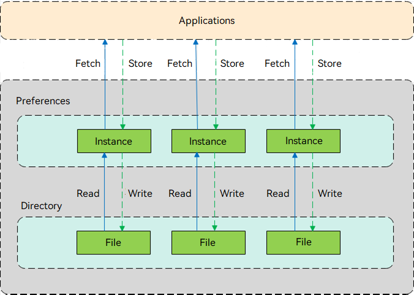

# Preferences Overview

Preferences are used for access and persistence operations on the data in the key-value structure. When an application accesses a **Preferences** instance, the data in the instance will be cached in the memory for faster access. The cached data can also be written back to the text file for persistent storage. Since file read and write consume system resources, you are advised to minimize the frequency of reading and writing persistent files.

## Basic Concepts

- **Key-Value data structure**

  A type of data structure. The key is the unique identifier for a piece of data, and the value is the specific data being identified.

- **Non-relational database**

  A database not in compliance with the atomicity, consistency, isolation, and durability (ACID) database management properties of relational data transactions. The data in a non-relational database is independent.

## Working Principles

1. When an application loads data from a **Preferences** file to a **Preferences** instance, the system stores the instance in the memory through a static container. Each file of an application or process has only one **Preferences** instance in the memory, till the application removes the instance from the memory or deletes the **Preferences** file.
2. When obtaining a **Preferences** instance, the application can read data from or write data to the instance. The data in the instance can be flushed to its **Preferences** file by calling the **flush()** method.

**Figure 1** How **Preferences** work

## Constraints

- **Preferences** instances are loaded to the memory. To minimize non-memory overhead, the number of data records stored in a **Preferences** instance cannot exceed 10,000. Delete the instances that are no longer used in a timely manner.
- The key in key-value pairs is of the string type. It cannot be empty or exceed 80 bytes.
- The value of the string type in key-value pairs can be empty, but cannot exceed 8192 bytes if not empty.
