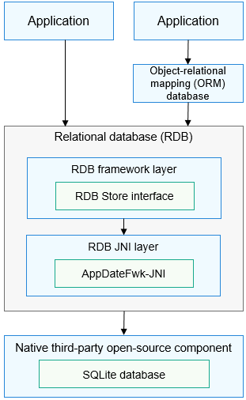

# RDB Overview

The relational database \(RDB\) manages data based on relational models. With the underlying SQLite database, the RDB provides a complete mechanism for managing local databases. To satisfy different needs in complicated scenarios, the RDB offers a series of methods for performing operations such as adding, deleting, modifying, and querying data, and supports direct execution of SQL statements.

## Basic Concepts

-   **RDB**

    A type of database based on the relational model of data. The RDB stores data in rows and columns. An RDB is also called RDB store.

-   **Predicate**

    A representation of the property or feature of a data entity, or the relationship between data entities. It is mainly used to define operation conditions.

-   **Result set**

    A set of query results used to access the data. You can access the required data in a result set in flexible modes.

-   **SQLite database**

    A lightweight open-source relational database management system that complies with Atomicity, Consistency, Isolation, and Durability \(ACID\).

## Working Principles

The RDB provides a common operation interface for external systems. It uses the SQLite as the underlying persistent storage engine, which supports all SQLite database features.

**Figure  1**  How RDB works  

## Default Settings

-   The default database logging mode is write-ahead logging \(WAL\).
-   The default database flush mode is Full mode.
-   The default shared memory used by the OpenHarmony database is 2 MB.

## Constraints

-   A maximum of four connection pools can be connected to an RDB to manage read and write operations.

-   To ensure data accuracy, the RDB supports only one write operation at a time.

