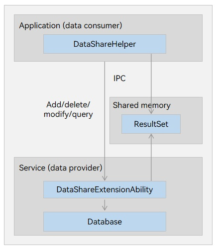

# Sharing Data Using DataShareExtensionAbility


## When to Use

If complex services are involved in cross-application data access, you can use **DataShareExtensionAbility** to start the application of the data provider to implement data access.

You need to implement flexible service logics via callbacks of the service provider.  


## Working Principles

There are two roles in **DataShare**:

- Data provider: implements operations, such as adding, deleting, modifying, and querying data, and opening a file, using [DataShareExtensionAbility](../reference/apis-arkdata/js-apis-application-dataShareExtensionAbility-sys.md).

- Data consumer: accesses the data provided by the provider using [createDataShareHelper()](../reference/apis-arkdata/js-apis-data-dataShare-sys.md#datasharecreatedatasharehelper).

**Figure 1** Data sharing mechanism 


- The **DataShareExtensionAbility** module, as the data provider, implements services related to data sharing between applications.

- The **DataShareHelper** module, as the data consumer, provides APIs for accessing data, including adding, deleting, modifying, and querying data.

- The data consumer communicates with the data provider via inter-process communication (IPC). The data provider can be implemented through a database or other data storage.

- The **ResultSet** module is implemented through shared memory. Shared memory stores the result sets, and interfaces are provided to traverse result sets.


## How to Develop


### Data Provider Application Development (for System Applications Only)

The [DataShareExtensionAbility](../reference/apis-arkdata/js-apis-application-dataShareExtensionAbility-sys.md) provides the following APIs. You can override these APIs as required.

- **onCreate**: called by the server to initialize service logic when the DataShare client connects to the DataShareExtensionAbility server.
- **insert**: called to insert data upon the request of the client. Data insertion must be implemented in this callback on the server.
- **update**: called to update data upon the request of the client. Data update must be implemented in this callback on the server.
- **batchUpdate**: called to update batch data upon the request of the client. Batch data update must be implemented in this callback on the server.
- **delete**: called to delete data upon the request of the client. Data deletion must be implemented in this callback on the server.
- **query**: called to query data upon the request of the client. Data query must be implemented in this callback on the server.
- **batchInsert**: called to batch insert data upon the request of the client. Batch data insertion must be implemented in this callback on the server.
- **normalizeUri**: converts the URI provided by the client to the URI used by the server.
- **denormalizeUri**: converts the URI used by the server to the initial URI passed by the client.

Before implementing a **DataShare** service, you need to create a **DataShareExtensionAbility** object in the DevEco Studio project as follows:

1. In the **ets** directory of the **Module** project, right-click and choose **New > Directory** to create a directory named **DataShareExtAbility**.

2. Right-click the **DataShareAbility** directory, and choose **New > ArkTS File** to create a file named **DataShareExtAbility.ets**.

3. In the **DataShareExtAbility.ets** file, import the **DataShareExtensionAbility** module. You can override the service implementation as required. For example, if the data provider provides only the insert, delete, and query services, you can override only these APIs and import the dependency modules. If permission verification is required, override the callbacks using [getCallingPid](../reference/apis-ipc-kit/js-apis-rpc.md#getcallingpid), [getCallingUid](../reference/apis-ipc-kit/js-apis-rpc.md#getcallinguid), and [getCallingTokenId](../reference/apis-ipc-kit/js-apis-rpc.md#getcallingtokenid8) provided by the IPC module to obtain the data consumer information for permission verification.
   
   ```ts
   import { DataShareExtensionAbility, dataShare, dataSharePredicates, relationalStore, DataShareResultSet } from '@kit.ArkData';
   import { Want } from '@kit.AbilityKit';
   import { BusinessError } from '@kit.BasicServicesKit'
   ```

4. Implement the data provider services. For example, implement data storage of the data provider by creating and using a database, reading and writing files, or accessing the network.
   
   ```ts
   const DB_NAME = 'DB00.db';
   const TBL_NAME = 'TBL00';
   const DDL_TBL_CREATE = "CREATE TABLE IF NOT EXISTS "
     + TBL_NAME
     + ' (id INTEGER PRIMARY KEY AUTOINCREMENT, name TEXT, age INTEGER, isStudent BOOLEAN, Binary BINARY)';

   let rdbStore: relationalStore.RdbStore;
   let result: string;

   export default class DataShareExtAbility extends DataShareExtensionAbility {
     // Override onCreate().
     onCreate(want: Want, callback: Function) {
       result = this.context.cacheDir + '/datashare.txt';
       // Create an RDB store.
       relationalStore.getRdbStore(this.context, {
         name: DB_NAME,
         securityLevel: relationalStore.SecurityLevel.S3
       }, (err:BusinessError, data:relationalStore.RdbStore) => {
         rdbStore = data;
         rdbStore.executeSql(DDL_TBL_CREATE, [], (err) => {
           console.info(`DataShareExtAbility onCreate, executeSql done err:${err}`);
         });
         if (callback) {
           callback();
         }
       });
     }

     // Override query().
     query(uri: string, predicates: dataSharePredicates.DataSharePredicates, columns: Array<string>, callback: Function) {
       if (predicates === null || predicates === undefined) {
         console.info('invalid predicates');
       }
       try {
         rdbStore.query(TBL_NAME, predicates, columns, (err:BusinessError, resultSet:relationalStore.ResultSet) => {
           if (resultSet !== undefined) {
             console.info(`resultSet.rowCount:${resultSet.rowCount}`);
           }
           if (callback !== undefined) {
             callback(err, resultSet);
           }
         });
       } catch (err) {
         let code = (err as BusinessError).code;
         let message = (err as BusinessError).message
         console.error(`Failed to query. Code:${code},message:${message}`);
       }
     }
     // Override the batchUpdate API.
     batchUpdate(operations:Record<string, Array<dataShare.UpdateOperation>>, callback:Function) {
       let recordOps : Record<string, Array<dataShare.UpdateOperation>> = operations;
       let results : Record<string, Array<number>> = {};
       let a = Object.entries(recordOps);
       for (let i = 0; i < a.length; i++) {
         let key = a[i][0];
         let values = a[i][1];
         let result : number[] = [];
         for (const value of values) {
           rdbStore.update(TBL_NAME, value.values, value.predicates).then(async (rows) => {
             console.info('Update row count is ' + rows);
             result.push(rows);
           }).catch((err:BusinessError) => {
             console.info('Update failed, err is ' + JSON.stringify(err));
             result.push(-1)
           })
         }
         results[key] = result;
       }
       callback(null, results);
     }
     // Override other APIs as required.
   };
   ```

5. Define **DataShareExtensionAbility** in **module.json5**.

     **Table 1** Fields in module.json5
   
   | Field| Description| Mandatory|
   | -------- | -------- | -------- |
   | name | Ability name, corresponding to the **ExtensionAbility** class name derived from **Ability**.| Yes|
   | type | Ability type. The value **dataShare** indicates that the development is based on the **datashare** template.| Yes|
   | uri | Unique identifier for the data consumer to access the data provider.| Yes|
   | exported | Whether it is visible to other applications. Data sharing is allowed only when the value is **true**.| Yes|
   | readPermission | Permission required for accessing data. If this parameter is not set, read permission verification is not performed by default.| No|
   | writePermission | Permission required for modifying data. If this parameter is not set, write permission verification is not performed by default.| No|
   | metadata   | Silent access configuration, which includes the following:<br>- **name**: identifies the configuration, which has a fixed value of **ohos.extension.dataShare**.<br>- **resource**: has a fixed value of **$profile:data_share_config**, which indicates that the profile name is **data_share_config.json**.| **metadata** is mandatory when the ability launch type is **singleton**. For details about the ability launch type, see **launchType** in the [Internal Structure of the abilities Attribute](../quick-start/module-structure.md#internal-structure-of-the-abilities-attribute).|

   **module.json5 example**
   
   ```json
   "extensionAbilities": [
     {
       "srcEntry": "./ets/DataShareExtAbility/DataShareExtAbility.ets",
       "name": "DataShareExtAbility",
       "icon": "$media:icon",
       "description": "$string:description_datashareextability",
       "type": "dataShare",
       "uri": "datashare://com.samples.datasharetest.DataShare",
       "exported": true,
       "metadata": [{"name": "ohos.extension.dataShare", "resource": "$profile:data_share_config"}]
     }
   ]
   ```

   **Table 2** Fields in the data_share_config.json file

   | Field           | Description                                                    | Mandatory|
   | ------------------- | ------------------------------------------------------------ | ---- |
   | tableConfig         | Configuration label, which includes **uri** and **crossUserMode**.<br>- **uri**: specifies the range for which the configuration takes effect. The URI supports the following formats in descending order by priority:<br> 1. *****: indicates all databases and tables.<br> 2. **datashare:///{*bundleName*}/{*moduleName*}/{*storeName*}**: specifies a database.<br> 3. **datashare:///{*bundleName*}/{*moduleName*}/{*storeName*}/{*tableName*}**: specifies a table.<br>If URIs of different formats are configured, only the URI with the higher priority takes effect.<br>- **crossUserMode**: Whether to share data between multiple users.<br>The value **1** means to share data between multiple users, and the value **2** means the opposite.| Yes  |
   | isSilentProxyEnable | Whether to enable silent access for this ExtensionAbility.<br>The value **true** means to enable silent access, and the value **false** means the opposite.<br>The default  value is **true**.<br>If an application has multiple ExtensionAbilities and this field is set to **false** for one of them, silent access is disabled for the application.<br>If the data provider has called **enableSilentProxy** or **disableSilentProxy**, silent access is enabled or disabled based on the API settings. Otherwise, the setting here takes effect.| No  |
   | launchInfos         | Launch information, which includes **storeId** and **tableNames**.<br>If the data in a table involved in the configuration changes, an extensionAbility will be started based on the URI in **extensionAbilities**. You need to set this parameter only when the service needs to start an extensionAbility to process data that is not actively changed by the service.<br>- **storeId**: database name, excluding the file name extension. For example, if the database name is **test.db**, set this parameter to **test**.<br>- **tableNames**: names of the database tables. Any change in a table will start an an extensionAbility. | No  |
   
   **data_share_config.json Example**
   
   ```json
   {
       "tableConfig":[
           {
               "uri":"*",
               "crossUserMode":1
           },
           {
               "uri":"datashare:///com.acts.datasharetest/entry/DB00",
               "crossUserMode":1
           },
           {
               "uri":"datashare:///com.acts.datasharetest/entry/DB00/TBL00",
               "crossUserMode":2
           }
       ],
       "isSilentProxyEnable":true,
       "launchInfos":[
           {
               "storeId": "test",
               "tableNames":["test1", "test2"]
           }
       ]
   }
   ```


### Data Consumer Application Development

1. Import the dependencies.
   
   ```ts
   import { UIAbility } from '@kit.AbilityKit';
   import { dataShare, dataSharePredicates, DataShareResultSet, ValuesBucket } from '@kit.ArkData';
   import { window } from '@kit.ArkUI';
   import { BusinessError } from '@kit.BasicServicesKit';
   ```

2. Define the URI string for communicating with the data provider.
   
   ```ts
   // Different from the URI defined in the module.json5 file, the URI passed in the parameter has an extra slash (/), because there is a DeviceID parameter between the second and the third slash (/).
   let dseUri = ('datashare:///com.samples.datasharetest.DataShare');
   ```

3. Create a **DataShareHelper** instance.
   
   ```ts
   let dsHelper: dataShare.DataShareHelper | undefined = undefined;
   let abilityContext: Context;

   export default class EntryAbility extends UIAbility {
     onWindowStageCreate(windowStage: window.WindowStage) {
       abilityContext = this.context;
       dataShare.createDataShareHelper(abilityContext, dseUri, (err, data) => {
         dsHelper = data;
       });
     }
   }
   ```

4. Use the APIs provided by **DataShareHelper** to access the services provided by the provider, for example, adding, deleting, modifying, and querying data.
   
   ```ts
   // Construct a piece of data.
   let key1 = 'name';
   let key2 = 'age';
   let key3 = 'isStudent';
   let key4 = 'Binary';
   let valueName1 = 'ZhangSan';
   let valueName2 = 'LiSi';
   let valueAge1 = 21;
   let valueAge2 = 18;
   let valueIsStudent1 = false;
   let valueIsStudent2 = true;
   let valueBinary = new Uint8Array([1, 2, 3]);
   let valuesBucket: ValuesBucket = { key1: valueName1, key2: valueAge1, key3: valueIsStudent1, key4: valueBinary };
   let updateBucket: ValuesBucket = { key1: valueName2, key2: valueAge2, key3: valueIsStudent2, key4: valueBinary };
   let predicates = new dataSharePredicates.DataSharePredicates();
   let valArray = ['*'];
   
   let record: Record<string, Array<dataShare.UpdateOperation>> = {};
   let operations1: Array<dataShare.UpdateOperation> = [];
   let operations2: Array<dataShare.UpdateOperation> = [];
   let operation1: dataShare.UpdateOperation = {
     values: valuesBucket,
     predicates: predicates
   }
   operations1.push(operation1);
   let operation2: dataShare.UpdateOperation = {
     values: updateBucket,
     predicates: predicates
   }
   operations2.push(operation2);
   record["uri1"] = operations1;
   record["uri2"] = operations2;
   
   if (dsHelper != undefined) {
     // Insert a piece of data.
     (dsHelper as dataShare.DataShareHelper).insert(dseUri, valuesBucket, (err:BusinessError, data:number) => {
       console.info(`dsHelper insert result:${data}`);
     });
     // Update data.
     (dsHelper as dataShare.DataShareHelper).update(dseUri, predicates, updateBucket, (err:BusinessError, data:number) => {
       console.info(`dsHelper update result:${data}`);
     });
     // Query data.
     (dsHelper as dataShare.DataShareHelper).query(dseUri, predicates, valArray, (err:BusinessError, data:DataShareResultSet) => {
       console.info(`dsHelper query result:${data}`);
     });
     // Delete data.
     (dsHelper as dataShare.DataShareHelper).delete(dseUri, predicates, (err:BusinessError, data:number) => {
       console.info(`dsHelper delete result:${data}`);
     });
     // Update data in batches.
     (dsHelper as dataShare.DataShareHelper).batchUpdate(record).then((data: Record<string, Array<number>>) => {
        // Traverse data to obtain the update result of each data record. value indicates the number of data records that are successfully updated. If value is less than 0, the update fails.
        let a = Object.entries(data);
        for (let i = 0; i < a.length; i++) {
          let key = a[i][0];
          let values = a[i][1]
          console.info(`Update uri:${key}`);
          for (const value of values) {
            console.info(`Update result:${value}`);
          }
        }
      });
     // Close the DataShareHelper instance.
     (dsHelper as dataShare.DataShareHelper).close();
   }
   ```