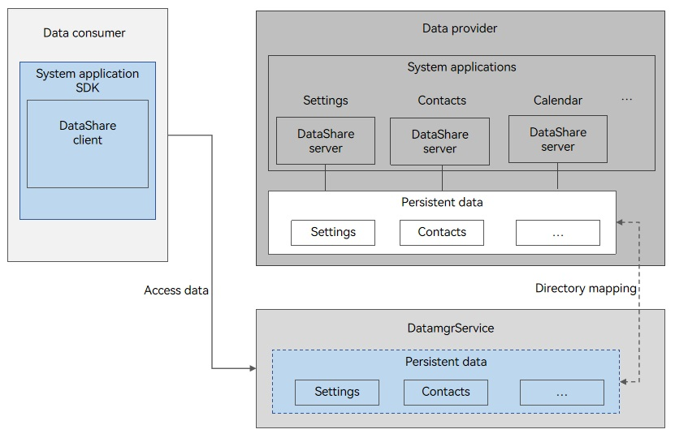

# Silent Access via the DatamgrService


## When to Use

In a typical cross-application data access scenario, the data provider may be started multiple times.

To minimize the startup times of the data provider and speed up data access, OpenHarmony provides the silent access feature, which allows access to the database without starting the data provider.

In silent access, the DatamgrService accesses and modifies data without starting the data provider.

The DatamgrService supports basic database access and data hosting only. If service processing is required, the service processing logic must be encapsulated into APIs for the data consumer to call.

If the service is too complex, use [DataShareExtensionAbility](../reference/apis-arkdata/js-apis-application-dataShareExtensionAbility-sys.md) to start the data provider.


## Working Principles

The DatamgrService can serve as a proxy to access the following data:

- Persistent data: data in the database of the data provider. It is stored in the sandbox directory of the data provider and can be shared in declaration mode by the data provider. Persistent data is configured as data tables for access.


- Process data: process data, in the JSON or byte format, managed by the DatamgrService. It is stored in the DatamgrService sandbox directory, and is automatically deleted 10 days after no subscription.


- Dynamic data: data stored in the memory of a device. It is automatically deleted after the device is restarted. Currently, the dynamic data refers to only the data set by **enableSilentProxy** and **disableSilentProxy**.


| Data Type | Location     | Data Format       | Validity Period         | Usage                             |
| ----- | --------- | ----------- | ------------ | --------------------------------- |
| Persistent data| Sandbox directory of the data provider | Database tables   | Permanent        | RDB data used for schedules and meetings.     |
| Process data | DatamgrService sandbox directory| JSON or byte| Automatically deleted 10 days after no subscription| Time-sensitive data in simple format used for step count, weather, and heart rate monitoring.|
| Dynamic data | DatamgrService memory| KV pair| Automatically deleted after the device is restarted| Data generated when silent access is dynamically disabled or enabled. For example, to ensure data accuracy, silent access needs to be disabled in upgrade and enabled after the upgrade by using APIs. The "enabled" or "disabled" status generated by using the API is cleared after the device is restarted. The dynamic data refers to only the data set by **enableSilentProxy** and **disableSilentProxy**.|


**Figure 1** Silent access



- In silent access, **DatamgrService** obtains the access rules configured by the data provider through directory mapping, performs preprocessing based on rules, and accesses the database.

- To use silent access, the URIs must be in the following format:
  datashareproxy://{bundleName}/{dataPath}

  The **DatamgrService** obtains the data provider application based on **bundleName**, reads the configuration, verifies the permission, and accesses data.

  **dataPath** identifies the data. It can be customized and must be unique in the same data provider application.


## Constraints

- Currently, only the RDB stores support silent access.
- The system supports a maximum of 16 concurrent query operations. Excess query requests need to be queued for processing.
- The proxy is not allowed to create a database for persistent data. To create a database, you must start the data provider.
- If the data provider is an application with a normal signature, the data read/write permission must be system_basic or higher.


## Available APIs

Most of the APIs for silent access are executed asynchronously in callback or promise mode. In the following table, callback-based APIs are used as an example. For more information about the APIs, see [Data Sharing](../reference/apis-arkdata/js-apis-data-dataShare-sys.md).

### Universal APIs

| API                                    | Description                  |
| ---------------------------------------- | -------------------- |
| createDataShareHelper(context: Context, uri: string, options: DataShareHelperOptions, callback: AsyncCallback&lt;DataShareHelper&gt;): void | Creates a **DataShareHelper** instance.|

### APIs for Accessing Persistent Data

| API                                    | Description                  |
| ---------------------------------------- | -------------------- |
| insert(uri: string, value: ValuesBucket, callback: AsyncCallback&lt;number&gt;): void | Inserts a row of data into a table.        |
| delete(uri: string, predicates: dataSharePredicates.DataSharePredicates, callback: AsyncCallback&lt;number&gt;): void | Deletes one or more data records from the database.   |
| query(uri: string, predicates: dataSharePredicates.DataSharePredicates, columns: Array&lt;string&gt;, callback: AsyncCallback&lt;DataShareResultSet&gt;): void | Queries data in the database.          |
| update(uri: string, predicates: dataSharePredicates.DataSharePredicates, value: ValuesBucket, callback: AsyncCallback&lt;number&gt;): void | Updates data in the database.        |
| addTemplate(uri: string, subscriberId: string, template: Template): void | Adds a data template with the specified subscriber.     |
| on(type: 'rdbDataChange', uris: Array&lt;string&gt;, templateId: TemplateId, callback: AsyncCallback&lt;RdbDataChangeNode&gt;): Array&lt;OperationResult | Subscribes to the changes of the data corresponding to the specified URI and template.|

### APIs for Accessing Process Data

| API                                    | Description                |
| ---------------------------------------- | ------------------ |
| publish(data: Array&lt;PublishedItem&gt;, bundleName: string, version: number, callback: AsyncCallback&lt;Array&lt;OperationResult&gt;&gt;): void | Publish data to the DatamgrService.|
| on(type: 'publishedDataChange', uris: Array&lt;string&gt;, subscriberId: string, callback: AsyncCallback&lt;PublishedDataChangeNode&gt;): Array&lt;OperationResult&gt; | Subscribes to changes of the published data.   |

### APIs for Accessing Dynamic Data

| API                                    | Description                |
| ---------------------------------------- | ------------------ |
| enableSilentProxy(context: Context, uri?: string): Promise&lt;void&gt; | Enables silent access by the data provider dynamically.<br>When the data consumer calls the **DataShare** API through silent access, the system verifies the silent access status.<br>If silent access is enabled, the **DataShare** API will be executed.|
| disableSilentProxy(context: Context, uri?: string): Promise&lt;void&gt; | Disables silent access by the data provider dynamically.<br>When the data consumer calls the **DataShare** API through silent access, the system verifies the silent access status.<br>If silent access is disabled, the **DataShare** API will be denied. |


## Accessing Persistent Data

The following walks you through on how to share an RDB store.

### Data Provider Application

1. In the **module.json5** file, set the data to be shared in **proxyData**. For details about the configuration, see [module.json5 Configuration File](../quick-start/module-configuration-file.md).

   **Table 1** proxyData in module.json5

   | Name                   | Description                                    | Mandatory  |
   | ----------------------- | ---------------------------------------- | ---- |
   | uri                     | URI of the data proxy, which is the unique identifier for cross-application data access.                 | Yes   |
   | requiredReadPermission  | Permission required for reading data from the data proxy. If this parameter is not set, other applications are not allowed to access data. For details about the permissions, see [Permissions for All Applications](../security/AccessToken/permissions-for-all.md).           | No   |
   | requiredWritePermission | Permission required for writing data to the data proxy. If this parameter is not set, other applications are not allowed to write data to the data proxy. For details about the permissions, see [Permissions for All Applications](../security/AccessToken/permissions-for-all.md).         | No   |
   | metadata                | Metadata of the data source, including the **name** and **resource** fields.<br>The **name** field identifies the configuration, which has a fixed value of **dataProperties**.<br>The value of **resource** is **$profile:{fileName}**, indicating that the name of the configuration file is **{fileName}.json**.| Yes   |

   **module.json5 example**

   ```json
   "proxyData":[
     {
       "uri": "datashareproxy://com.acts.ohos.data.datasharetest/test",
       "requiredReadPermission": "ohos.permission.GET_BUNDLE_INFO",
       "requiredWritePermission": "ohos.permission.KEEP_BACKGROUND_RUNNING",
       "metadata": {
         "name": "dataProperties",
         "resource": "$profile:my_config"
       }
     }
   ]
   ```
   **Table 2** Fields in my_config.json

   | Name | Description                                    | Mandatory  |
   | ----- | ---------------------------------------- | ---- |
   | path  | Data source path, in the **Database_name/Table_name** format. Currently, only RDB stores are supported.             | Yes   |
   | type  | Database type. Currently, only **rdb** is supported.            | Yes   |
   | scope | Scope of the database.<br>- **module** indicates that the database is located in this module.<br>- **application** indicates that the database is located in this application.| No   |

   **my_config.json example**

   ```json
   {
     "path": "DB00/TBL00",
     "type": "rdb",
     "scope": "application"
   }
   ```

### Data Consumer Application


1. Import dependencies.

   ```ts
   import { dataShare, dataSharePredicates, ValuesBucket } from '@kit.ArkData';
   import { UIAbility } from '@kit.AbilityKit';
   import { window } from '@kit.ArkUI';
   import { BusinessError } from '@kit.BasicServicesKit'
   ```

2. Define the URI string for communicating with the data provider.

   ```ts
   let dseUri = ('datashareproxy://com.acts.ohos.data.datasharetest/test');
   ```

3. Create a **DataShareHelper** instance.

   ```ts
   let dsHelper: dataShare.DataShareHelper | undefined = undefined;
   let abilityContext: Context;

   export default class EntryAbility extends UIAbility {
     onWindowStageCreate(windowStage: window.WindowStage) {
       abilityContext = this.context;
       dataShare.createDataShareHelper(abilityContext, dseUri, {
         isProxy: true
       }, (err, data) => {
         dsHelper = data;
       });
     }
   }
   ```

4. Use **DataShareHelper** APIs to access the services provided by the provider, for example, adding, deleting, modifying, and querying data.

   ```ts
   // Construct a piece of data.
   let key1 = 'name';
   let key2 = 'age';
   let key3 = 'isStudent';
   let key4 = 'Binary';
   let valueName1 = 'ZhangSan';
   let valueName2 = 'LiSi';
   let valueAge1 = 21;
   let valueAge2 = 18;
   let valueIsStudent1 = false;
   let valueIsStudent2 = true;
   let valueBinary = new Uint8Array([1, 2, 3]);
   let valuesBucket: ValuesBucket = { key1: valueName1, key2: valueAge1, key3: valueIsStudent1, key4: valueBinary };
   let updateBucket: ValuesBucket = { key1: valueName2, key2: valueAge2, key3: valueIsStudent2, key4: valueBinary };
   let predicates = new dataSharePredicates.DataSharePredicates();
   let valArray = ['*'];
   if (dsHelper != undefined) {
     // Insert a piece of data.
     (dsHelper as dataShare.DataShareHelper).insert(dseUri, valuesBucket, (err, data) => {
       console.info(`dsHelper insert result:${data}`);
     });
     // Update data.
     (dsHelper as dataShare.DataShareHelper).update(dseUri, predicates, updateBucket, (err, data) => {
       console.info(`dsHelper update result:${data}`);
     });
     // Query data.
     (dsHelper as dataShare.DataShareHelper).query(dseUri, predicates, valArray, (err, data) => {
       console.info(`dsHelper query result:${data}`);
     });
     // Delete data.
     (dsHelper as dataShare.DataShareHelper).delete(dseUri, predicates, (err, data) => {
       console.info(`dsHelper delete result:${data}`);
     });
   }
   ```

5. Subscribe to data.

   ```ts
   function onCallback(err: BusinessError, node: dataShare.RdbDataChangeNode) {
     console.info("uri " + JSON.stringify(node.uri));
     console.info("templateId " + JSON.stringify(node.templateId));
     console.info("data length " + node.data.length);
     for (let i = 0; i < node.data.length; i++) {
       console.info("data " + node.data[i]);
     }
   }

   let key21: string = "p1";
   let value21: string = "select * from TBL00";
   let key22: string = "p2";
   let value22: string = "select name from TBL00";
   let template: dataShare.Template = {
     predicates: {
       key21: value21,
       key22: value22,
     },
     scheduler: ""
   }
   if(dsHelper != undefined)
   {
     (dsHelper as dataShare.DataShareHelper).addTemplate(dseUri, "111", template);
   }
   let templateId: dataShare.TemplateId = {
     subscriberId: "111",
     bundleNameOfOwner: "com.acts.ohos.data.datasharetestclient"
   }
   if(dsHelper != undefined) {
     // When the DatamgrService modifies data, onCallback is invoked to return the data queried based on the rules in the template.
     let result: Array<dataShare.OperationResult> = (dsHelper as dataShare.DataShareHelper).on("rdbDataChange", [dseUri], templateId, onCallback);
   }
   ```

## Accessing Process Data

The following walks you through on how to host process data.

### (Optional) Data Provider Application

In the **module.json5** file, set the data to be hosted in **proxyData**. For details about the configuration, see [module.json5 Configuration File](../quick-start/module-configuration-file.md).

> **NOTE**
>
> - The configuration of **proxyData** is optional.
> - If **proxyData** is not configured, the hosted data cannot be accessed by other applications.
> - If **proxyData** is not configured, you do not need to use the full data path. For example, you can use **weather** instead of **datashareproxy://com.acts.ohos.data.datasharetest/weather** when publishing, subscribing to, and querying data.

**Table 3** proxyData in module.json5

| Name                   | Description                         | Mandatory  |
| ----------------------- | ----------------------------- | ---- |
| uri                     | URI of the data proxy, which is the unique identifier for cross-application data access.      | Yes   |
| requiredReadPermission  | Permission required for reading data from the data proxy. If this parameter is not set, other applications are not allowed to access data. For details about the permissions, see [Permissions for All Applications](../security/AccessToken/permissions-for-all.md).| No   |
| requiredWritePermission | Permission required for writing data to the data proxy. If this parameter is not set, other applications are not allowed to write data to the dta proxy. For details about the permissions, see [Permissions for All Applications](../security/AccessToken/permissions-for-all.md).| No   |

**module.json5 example**

```json
"proxyData": [
  {
    "uri": "datashareproxy://com.acts.ohos.data.datasharetest/weather",
    "requiredReadPermission": "ohos.permission.GET_BUNDLE_INFO",
    "requiredWritePermission": "ohos.permission.KEEP_BACKGROUND_RUNNING"
  }
]
```

### Data Consumer Application

1. Import dependencies.

   ```ts
   import { dataShare } from '@kit.ArkData';
   import { UIAbility } from '@kit.AbilityKit';
   import { window } from '@kit.ArkUI';
   import { BusinessError } from '@kit.BasicServicesKit';
   ```

2. Define the URI string for communicating with the data provider.

   ```ts
   let dseUri = ('datashareproxy://com.acts.ohos.data.datasharetest/weather');
   ```

3. Create a **DataShareHelper** instance.

   ```ts
   let dsHelper: dataShare.DataShareHelper | undefined = undefined;
   let abilityContext: Context;

   export default class EntryAbility extends UIAbility {
     onWindowStageCreate(windowStage: window.WindowStage) {
       abilityContext = this.context;
       dataShare.createDataShareHelper(abilityContext, dseUri, {isProxy : true}, (err, data) => {
         dsHelper = data;
       });
     }
   }
   ```

4. Use the **DataShareHelper** APIs to access the services provided by the provider, for example, adding, deleting, modifying, and querying data.

   ```ts
   // Construct two pieces of data. The first data is not configured with proxyDatas and cannot be accessed by other applications.
   let data : Array<dataShare.PublishedItem> = [
     {key:"city", subscriberId:"11", data:"xian"},
     {key:"datashareproxy://com.acts.ohos.data.datasharetest/weather", subscriberId:"11", data:JSON.stringify("Qing")}];
   // Publish data.
   if (dsHelper != undefined) {
     let result: Array<dataShare.OperationResult> = await (dsHelper as dataShare.DataShareHelper).publish(data, "com.acts.ohos.data.datasharetestclient");
   }
   ```

5. Subscribe to data.

   ```ts
   function onPublishCallback(err: BusinessError, node:dataShare.PublishedDataChangeNode) {
     console.info("onPublishCallback");
   }
   let uris:Array<string> = ["city", "datashareproxy://com.acts.ohos.data.datasharetest/weather"];
   if (dsHelper != undefined) {
     let result: Array<dataShare.OperationResult> = (dsHelper as dataShare.DataShareHelper).on("publishedDataChange", uris, "11", onPublishCallback);
   }
   ```

## Accessing Dynamic Data

Only the data provider is involved. The following walks you through on how to dynamically enable silent access.

### Data Provider Application

The data provider calls the **enableSilentProxy** API to dynamically enable silent access. This API must be used with the **isSilentProxyEnable** field in the **data_share_config.json** file. For details, see [**data_share_config.json** configuration](./share-data-by-datashareextensionability.md).

> **NOTE**
>
> - In the **data_share_config.json** file, the default value of **isSilentProxyEnable** is **true**, which means silent access is enabled.
> - To verify whether silent access is enabled, the system first checks the silent access status set by the **enableSilentProxy** or **disableSilentProxy** API called, and then checks the value of **isSilentProxyEnable** in the **data_share_config.json** file.
> - If **enableSilentProxy** or **disableSilentProxy** has not been called, the value of **isSilentProxyEnable** in the **data_share_config.json** file is preferentially checked.
> - Silent access is enabled by default if **enableSilentProxy** or **disableSilentProxy** has not been called and **isSilentProxyEnable** in the **data_share_config.json** file is not configured.

1. Import dependencies.

   ```ts
   import { dataShare } from '@kit.ArkData';
   import { UIAbility } from '@kit.AbilityKit';
   import { window } from '@kit.ArkUI';
   ```

2. Define the URI string for communicating with the data provider.

   ```ts
   let dseUri = ('datashare:///com.acts.datasharetest/entry/DB00/TBL00');
   ```

3. Create a **DataShareHelper** instance.

   ```ts
   let abilityContext: Context;
   
   export default class EntryAbility extends UIAbility {
     onWindowStageCreate(windowStage: window.WindowStage) {
       abilityContext = this.context;
       dataShare.enableSilentProxy(abilityContext, dseUri);
     }
   }
   ```
