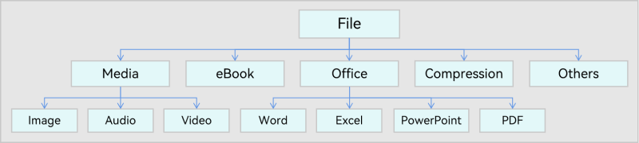
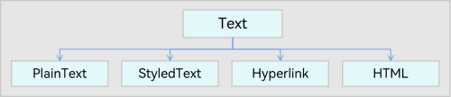

# Unified Data Definition


## When to Use

To streamline cross-application data interaction of OpenHarmony and minimize the application/service data interaction costs, the Unified Data Management Framework (UDMF) provides standard data definitions to define common data types. Applications can use the APIs provided by the UDMF to create and use these data types.

For example, in the cross-application drag scenario, the application of the drag source writes the data to be dragged to a [drag event](../reference/arkui-ts/ts-universal-events-drag-drop.md#dragevent) based on the standard data definitions. The application of the drop target reads the dragged data from the drag event and parses the data based on the standard data definitions. The data dragged between different applications complies with the same standard definitions, which avoids exhaustive data type adaptation and effectively reduces the development workload.

## Unified Data Types

The UDMF provides the following unified data types:

**Basic data types**

Basic data types include File and Text, which can be used for cross-application and cross-platform data interaction. Figure 1 and Figure 2 illustrate the basic data types.

**Figure 1** UDMF File



**Figure 2** UDMF Text



**System Defined Types (SDTs)**

The SDTs are specific to the platform or operating system, such as Form (UI card information), AppItem (app description information), and PixelMap (thumbnail). This type of data can be used for cross-application data interaction in a system or platform. Figure 3 illustrates the SDT data.

**Figure 3** UDMF SDT data


**App Defined Type (ADT)**

The SDT data is application-specific. This type of data can be used for across-platform data interaction for an application. As shown in Figure 4, the MyFile file format can be defined for use in an application ecosystem.

**Figure 4** UDMF ADT data


## Restrictions

- The size of each data record in the UDMF cannot exceed 2 MB.
- The UDMF supports data group management. The size of each group cannot exceed 4 MB.

## Available APIs

The UDMF provides the unified data object **UnifiedData** to encapsulate a group of data records **UnifiedRecord**. **UnifiedRecord** is an abstract definition of data content supported by the UDMF, for example, a text record or an image record. The data content type in a data record corresponds to **UniformDataType**.

The following table describes common UDMF APIs. For more information about the APIs, see [Unified Data Channel](../reference/apis/js-apis-data-unifiedDataChannel.md) and [Standard Data Definition and Description](../reference/apis/js-apis-data-uniformTypeDescriptor.md).

| Class          | API          | Description                                                                                           |
|---------------|-------------------|-----------------------------------------------------------------------------------------------|
| UnifiedRecord | getType(): string                      | Obtains the data type of this data record.|
| UnifiedData   | constructor(record: UnifiedRecord)     | A constructor used to create a **UnifiedData** object with a data record.                                                    |
| UnifiedData   | addRecord(record: UnifiedRecord): void | Adds a data record to this **UnifiedRecord** object.                                                     |
| UnifiedData   | getRecords(): Array\<UnifiedRecord> | Obtains all data records from this **UnifiedData** object. The data obtained is of the **UnifiedRecord** type. You need to obtain the data type by using **getType** and convert the data type to a child class before using it.|


## How to Develop

The following describes how to create a **UnifiedData** object containing two data records: image and plain text.

1. Import the **@ohos.data.unifiedDataChannel** and **@ohos.data.uniformTypeDescriptor** modules.
   
   ```ts
   import unifiedDataChannel from '@ohos.data.unifiedDataChannel';
   import uniformTypeDescriptor from '@ohos.data.uniformTypeDescriptor';
   ```
   
2. Create an image data record and initialize the **UnifiedData** object with the image data record.
   
    (1) Create an image data record.
   
   ```ts
   let image = new unifiedDataChannel.Image();
   ```
   
    (2) Modify object attributes.
   
   ```ts
   // The Image object contains the imageUri attribute.
   image.imageUri = '...';
   ```
   
    (3) Access the object attributes.
   
   ```ts
   console.info(`imageUri = ${image.imageUri}`);
   ```
   
    (4) Create a **UnifiedData** instance.
   
   ```ts
   let unifiedData = new unifiedDataChannel.UnifiedData(image);
   ```
   
3. Create a plain text data record and add it to the **UnifiedData** instance created.

   ```ts
   let plainText = new unifiedDataChannel.PlainText();
   plainText.textContent = 'this is textContent of plainText';
   plainText.abstract = 'abstract of plainText';
   plainText.details = {
     plainKey1: 'plainValue1',
     plainKey2: 'plainValue2',
   };
   unifiedData.addRecord(plainText);
   ```

4. Obtain all data records in this **UnifiedData** instance.

   ```ts
   let records = unifiedData.getRecords();
   ```

5. Traverse each record, determine the data type of the record, and convert the record into a child class object to obtain the original data record.

   ```ts
   for (let i = 0; i < records.length; i ++) {
     // Read the type of the data record.
     let type = records[i].getType();
     switch (type) {
       case uniformTypeDescriptor.UniformDataType.IMAGE:
         // Convert the data to obtain the original image data record.
         let image = records[i] as unifiedDataChannel.Image;
         break;
       case uniformTypeDescriptor.UniformDataType.PLAIN_TEXT:
         // Convert the data to obtain the original text record.
         let plainText = records[i] as unifiedDataChannel.PlainText;
         break;
       default:
         break;
     }
   }
   ```
