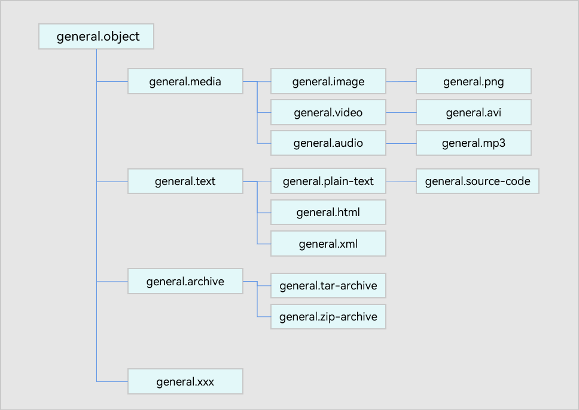

# UTDs


## When to Use

There can be different ways of describing the same data type. For example, when describing a JPG/JPEG image, you can use **image/jpeg**, **.jpg**, **.jpeg**, or **image/picture**. When the same type of data defined in different types is passed across applications or devices, the target application or device may fail to identify the data or can process the data after lots of adaptation.

Uniform Type Descriptors (UTDs) can address this issue by providing a consistent way of describing data types. It ensures that data types are represented uniformly in the system.

The UTDs can be classified into [prebuilt UTDs](#prebuilt-utds) and [custom UTDs](#custom-utds). In addition, you can convert other data types, for example, file name extensions or MIME types, into UTDs.

UTDs are used in image preview and file sharing.

## Design and Classification Principles

### Hierarchical Structure

Defining data types by MIME type or file name extension may cause loose data type definitions, which

cannot describe the compatibility and inheritance relationships between different types and further increase development complexity in data type processing. For example, in a scenario where a user searches for any type of animal images, loose data type definitions may involve search of any image, video, or audio assets related to animals. UTDs are defined in a hierarchical structure to address this problem.

The data type hierarchies identify the relationships between different data types, helping organize data in a way that makes it easier to understand, manage, and analyze. For example, when the data to be shared or dragged includes images, videos, and audio clips, the system or application can sort the data by data type hierarchy, for example, to share or drag photos, videos, or media files as required.

### Classification of UTDs

The UTDs can be classified by physical property or logic. OpenHarmony is prebuilt with common UTDs. For details, see [Prebuilt UTDs](./uniform-data-type-list.md).

- For the UTDs classified by physical property, the root node is **general.entity**. The UTD describes the physical properties of that type, such as file and directory, as shown in **Figure 1**.

- For the UTDs classified by logic, the root node is **general.object**. The UTD describes the functionality of that type, such as image and web page, as shown in **Figure 2**.

According to the classification principles, data types can be described from two dimensions. For example, an image can be defined as an image object or a file.

However, not all data formats have two dimensions. For example, **general.calendar** focuses more on the functionality of the calendar object.

**Figure 1** UTD based on physical properties


**Figure 2** UTD based on logical functionality



## UTD Definition

A UTD contains information such as the ID, relationships, and brief description of a uniform data type. For details, see [TypeDescriptor properties](../reference/apis-arkdata/js-apis-data-uniformTypeDescriptor.md#properties). Each UTD contains the following information:

+ **typeId**: unique ID of the UTD.
+ **belongingToTypes**: types to which the UTD belongs. A UTD may belong to multiple data types.
+ **description**: brief description of the uniform data type.
+ **referenceURL**: URL of the data type reference, which provides detailed information about the data type.
+ **iconFile**: path of the default icon file for the data type. If the data type has no default icon, it is an empty string. The application can determine whether to use the default icon.
+ **filenameExtensions**: File name extensions associated with the uniform data type.
+ **mimeTypes**: MIME types associated with the uniform data type.

## Prebuilt UTDs

The system is prebuilt with common UTDs. For example, **general.audio** is used to represent an audio file, and **general.video** is used to represent a video file. For details about the prebuilt UTDs, see [Prebuilt UTDs](./uniform-data-type-list.md).


## Custom UTDs

You can also customize UTDs for your application.

Custom UTDs can inherit from existing UTDs. For example, a custom image type can use **com.company.x-image** as its identifier.

The custom UTDs of a service can be used by other services after being registered with the system.

### Working Principles

When declaring a UTD, you need to declare the hierarchical logic of the data type. For example, declare the custom UTD **com.company.x-image** and its **BelongingToTypes** "general.image". The custom UTD will be verified to prevent the ring structure between data types.

When an application is installed, the custom UTDs are read and verified. If the verification is successful, the custom UTDs will be installed on the device. After started, the application can read the custom UTDs installed. The custom UTDs of other applications to be used must also be added to the custom uniform data type configuration file of your application during development.

### Constraints

The fields of a custom UTD must comply with the following requirements:

+ **TypeId**: The value must be unique and consist of the application bundle name and data type name. It cannot be left blank. The value can contain digits, uppercase and lowercase letters, hyphens (-), and periods (.).

+ **BelongingToTypes**: Multiple data types are allowed, but the types specified must be existing data types (prebuilt UTDs or other custom UTDs). The value cannot be empty or the custom UTD itself, or form a ring dependency with the existing UTDs or newly added custom UTDs.

+ **FilenameExtensions**: It can be left blank. One or more file name extensions are allowed. Each file name extension starts with a period (.) and cannot exceed 127 characters.

+ **MIMETypes**: It can be left blank. One or more MIME types are allowed. Each MIME type cannot exceed 127 characters.

+ **Description**: The value cannot exceed 255 characters. It can be left blank.

+ **ReferenceURL**: The value cannot exceed 255 characters. It can be left blank.


### How to Develop

The following walks you through on who to define a custom UTD for media files.

1. Create the **utd.json5** file in the **entry\src\main\resources\rawfile\arkdata\utd** directory of the application, for example, application A.

2. Add a custom UTD in the **utd.json5** file.
   ```json
   {
        "UniformDataTypeDeclarations": [
            {
                "TypeId": "com.example.myFirstHap.image",
                "BelongingToTypes": ["general.image"],
                "FilenameExtensions": [".myImage", ".khImage"],
                "MIMETypes": ["application/myImage", "application/khImage"],
                "Description": "My Image.",
                "ReferenceURL": ""
            },
            {
                "TypeId": "com.example.myFirstHap.audio",
                "BelongingToTypes": ["general.audio"],
                "FilenameExtensions": [".myAudio", ".khAudio"],
                "MIMETypes": ["application/myAudio", "application/khAudio"],
                "Description": "My audio.",
                "ReferenceURL": ""
            },
            {
                "TypeId": "com.example.myFirstHap.video",
                "BelongingToTypes": ["general.video"],
                "FilenameExtensions": [".myVideo", ".khVideo"],
                "MIMETypes": ["application/myVideo", "application/khVideo"],
                "Description": "My video.",
                "ReferenceURL": ""
            }
        ]
   }
   ```

3. To enable another application, for example, application B, to use the custom UTD of this application, create the **utd.json5** file in the **entry\src\main\resources\rawfile\arkdata\utd** directory of application B.

   Then, add the following to the **utd.json5** file of application B:

   ```json
   {
       "ReferenceUniformDataTypeDeclarations": [
            {
                "TypeId": "com.example.myFirstHap.image",
                "BelongingToTypes": ["general.image"],
                "FilenameExtensions": [".myImage", ".khImage"],
                "MIMETypes": ["application/myImage", "application/khImage"],
                "Description": "My Image.",
                "ReferenceURL": ""
            }
       ]
   }
   ```

4. You can also create the **utd.json5** template for application B in DevEco Studio, reference the custom UTD of application A in the template, and customize the data type as required. DevEco Studio also verifies the formats of the fields in the **utd.json5** file. The following is an example of the **utd.json5** file.

   ```json
   {
       "UniformDataTypeDeclarations": [
           {
               "TypeId": "com.example.mySecondHap.image",
               "BelongingToTypes": ["com.example.myFirstHap.image"],
               "FilenameExtensions": [".myImageEx", ".khImageEx"],
               "MIMETypes": ["application/my-ImageEx", "application/khImageEx"],
               "Description": "My Image extension.",
               "ReferenceURL": ""
           }
       ]
   }
   ```

## Available APIs

The following table describes the commonly used APIs, which are applicable to both prebuilt and custom UTDs. For more information, see [@ohos.data.uniformTypeDescriptor](../reference/apis-arkdata/js-apis-data-uniformTypeDescriptor.md).

| API                                                    | Description                                                        |
| ------------------------------------------------------------ | ------------------------------------------------------------ |
| UniformDataType                                              | Enumerates the UTDs, which are not provided here.|
| belongsTo(type: string): boolean                             | Checks whether this data type belongs to the specified data type.      |
| isLowerLevelType(type: string): boolean                      | Checks whether this data type is a lower-level type of the specified data type.|
| isHigherLevelType(type: string): boolean                     | Checks whether this data type is a higher-level type of the specified data type.|
| getUniformDataTypeByFilenameExtension(filenameExtension: string, belongsTo?: string): string | Obtains the UTD type ID based on the given file name extension and data type. If there are multiple UTD type IDs matched, the first one is returned.|
| getUniformDataTypeByMIMEType(mimeType: string, belongsTo?: string): string | Obtains the UTD type ID based on the given MIME type and data type. If there are multiple UTD type IDs matched, the first one is returned.|
| getUniformDataTypesByFilenameExtension(filenameExtension: string, belongsTo?: string): Array\<string> | Obtains the UTD type IDs based on the given file name extension and data type.|
| getUniformDataTypesByMIMEType(mimeType: string, belongsTo?: string): Array\<string> | Obtains the UTD type IDs based on the given MIME type and data type.|

## Obtaining belongingToTypes of a Media File

The following walks you through on how to obtain **belongingToTypes** of a media file.

1. Import the **uniformTypeDescriptor** module.
2. Obtain the UTD type ID based on the file name extension .mp3, and then obtain properties of the UTD.
3. Obtain the UTD type ID based on **audio/mp3**, and then obtain properties of the UTD.
4. Compare the UTDs obtained in the preceding steps to check whether they are the same.
5. Check whether **general.mp3** belongs to **general.audio**.

```ts
// 1. Import the module.
import { uniformTypeDescriptor } from '@kit.ArkData';

try {
  // 2. Obtain the UTD type ID (typeId) based on the file name extension .mp3, and then obtain properties of the UTD.
  let fileExtention = '.mp3';
  let typeId1 = uniformTypeDescriptor.getUniformDataTypeByFilenameExtension(fileExtention);
  let typeObj1 = uniformTypeDescriptor.getTypeDescriptor(typeId1);
  console.info('typeId:' + typeObj1.typeId);
  console.info('belongingToTypes:' + typeObj1.belongingToTypes);
  console.info('description:' + typeObj1.description);
  console.info('referenceURL:' + typeObj1.referenceURL);
  console.info('filenameExtensions:' + typeObj1.filenameExtensions);
  console.info('mimeTypes:' + typeObj1.mimeTypes);


  // 3. Obtain the UTD type ID based on audio/mp3, and then obtain properties of the UTD.
  let mineType = 'audio/mp3';
  let typeId2 = uniformTypeDescriptor.getUniformDataTypeByMIMEType(mineType);
  let typeObj2 = uniformTypeDescriptor.getTypeDescriptor(typeId2);
  console.info('typeId:' + typeObj2.typeId);
  console.info('belongingToTypes:' + typeObj2.belongingToTypes);
  console.info('description:' + typeObj2.description);
  console.info('filenameExtensions:' + typeObj2.filenameExtensions);
  console.info('mimeTypes:' + typeObj2.mimeTypes);


  // 4. Compare the two UTDs to check whether they are the same.
  if (typeObj1 != null && typeObj2 != null) {
    let ret = typeObj1.equals(typeObj2);
    console.info('typeObj1 equals typeObj2, ret:' + ret);
  }

  // 5. Check whether general.mp3 belongs to general.audio.
  if (typeObj1 != null) {
    let ret = typeObj1.belongsTo('general.audio');
    console.info('belongsTo, ret:' + ret);
    let mediaTypeObj = uniformTypeDescriptor.getTypeDescriptor('general.media');
    ret = mediaTypeObj.isHigherLevelType('general.audio'); // Check the relationship between them.
    console.info('isHigherLevelType, ret:' + ret);
  }
} catch (err) {
  console.error('err message:' + err.message + ', err code:' + err.code);
}
```

## Obtaining MIME Types Based on a File Name Extension

The following walks you through on how to obtain MIME types based on the file name extension .ts.

1. Import the **uniformTypeDescriptor** module.
2. Obtain the UTD type ID (**typeId**) based on the file name extension .ts.
3. Obtain the MIME types based on the UTD type ID.

```ts
// 1. Import the module.
import { uniformTypeDescriptor } from '@kit.ArkData';
try {
  // 2. Obtain the UTD type ID based on the file name extension .ts.
  let fileExtention = '.ts';
  let typeIds = uniformTypeDescriptor.getUniformDataTypesByFilenameExtension(fileExtention);
  for (let typeId of typeIds) {
    // 3. Obtain the MIME types based on the UTD type ID.
    let typeObj = uniformTypeDescriptor.getTypeDescriptor(typeId);
    let mimeTypes = typeObj.mimeTypes;
    console.info('mimeTypes:' + mimeTypes);
  }
} catch (err) {
  console.error('err message:' + err.message + ', err code:' + err.code);
}
```
## Obtaining File Name Extensions Based on the MIME Type

The following walks you through on how to obtain the file name extensions based on the MIME type **text/plain**.

1. Import the **uniformTypeDescriptor** module.
2. Obtain the UTD type ID based on the MIME type **text/plain**.
3. Obtain the MIME types based on the UTD type ID.

```ts
// 1. Import the module.
import { uniformTypeDescriptor } from '@kit.ArkData';
try {
  // 2. Obtain the UTD type ID based on the MIME type text/plain.
  let mineType = 'text/plain';
  let typeIds = uniformTypeDescriptor.getUniformDataTypesByMIMEType(mineType);
  for (let typeId of typeIds) {
    // 3. Obtain the MIME types based on the UTD type ID.
    let typeObj = uniformTypeDescriptor.getTypeDescriptor(typeId);
    let filenameExtensions = typeObj.filenameExtensions;
    console.info('filenameExtensions:' + filenameExtensions);
  }
} catch (err) {
  console.error('err message:' + err.message + ', err code:' + err.code);
}
```

