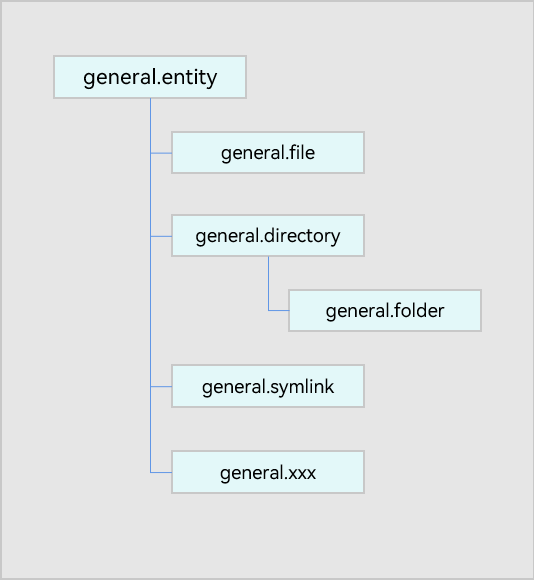
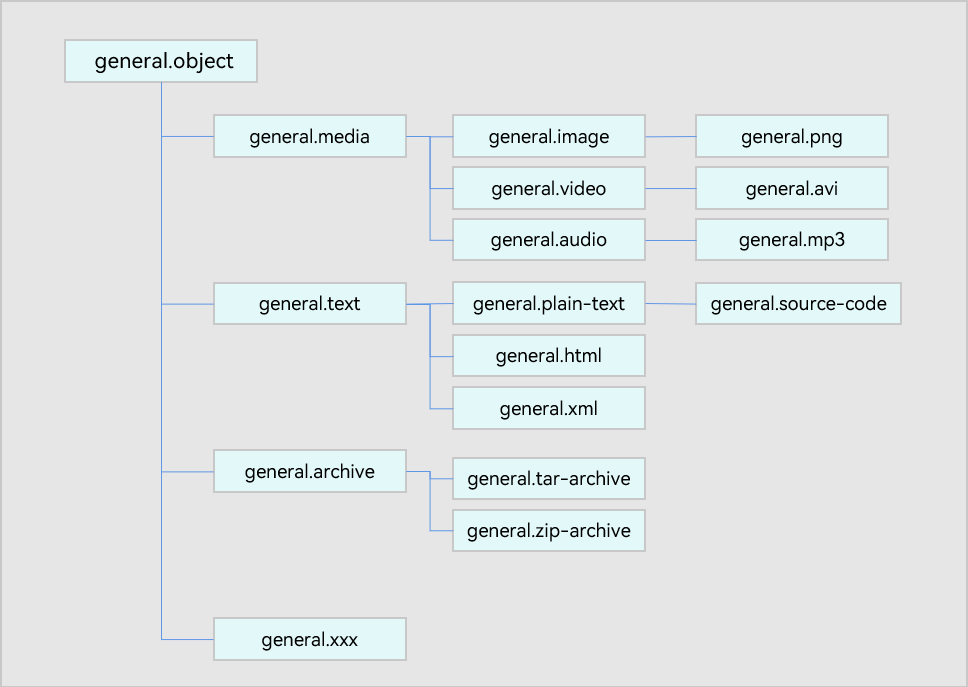

# UTDs (ArkTS)

<!--Kit: ArkData-->
<!--Subsystem: DistributedDataManager-->
<!--Owner: @jcwen-->
<!--Designer: @junathuawei1; @zph000-->
<!--Tester: @lj_liujing; @yippo; @logic42-->
<!--Adviser: @ge-yafang-->
<!-- md-trans-meta sourceCommit=05bb12367fee189c7aecbeb9ad82dabebbba21d0 translatedAt=2026-07-27T08:17:28.463Z pushedAt=2026-07-27T10:11:16.877Z -->

## When to Use

Uniform Type Descriptors (UTDs) are designed to resolve the ambiguity of data type descriptions. For example, JPEG images may be described as forms such as image/jpeg, .jpg, .jpeg, or image/picture. As a result, complex compatibility logic (such as extension matching and MIME type detection) is required to identify the data type during cross-system transmission, and the identification may fail due to inconsistent descriptions. With UTD, data can be parsed and processed accurately and efficiently.

The UTDs can be classified into [prebuilt UTDs](#prebuilt-utds) and [custom UTDs](#custom-utds). In addition, you can convert other data types, for example, file name extensions or MIME types, into UTDs.

UTDs are used in image preview and file sharing.

## Design and Classification Principles

### Hierarchical Structure

Another drawback of type differentiation based on MIME types or file extensions is the flat definition of data types.

Flat or loose type definitions make it difficult to accurately describe compatibility and inheritance relationships between different types, and in practice, they increase the development complexity when applications handle data types. For example, in a search scenario, a user who has precisely searched for animal-related images may wish to further expand the search to include animal-related images, videos, or audio resources. To meet this need, we must support a type hierarchy when defining data types.

Building a hierarchical structure for standard types and defining type affiliation relationships within the hierarchy helps systems and applications achieve layered and categorized management of data types. When users share or drag-and-drop data, if the data contains images, videos, audio, and other content simultaneously, the system/application can organize the shared content on demand based on the hierarchy—for example, how many images, how many videos, or how many media resource files were shared.

### Classification of UTDs

The UTDs can be classified by physical property or logic. OpenHarmony is prebuilt with common UTDs. For details, see [Prebuilt UTDs](./uniform-data-type-list.md).

- For the UTDs classified by physical property, the root node is **general.entity**. The UTD describes the physical properties of that type, such as file and directory, as shown in **Figure 1**.

- For the UTDs classified by logic, the root node is **general.object**. The UTD describes the functionality of that type, such as image and web page, as shown in **Figure 2**.

According to the classification principles, data types can be described from two dimensions. For example, an image can be defined as an image object or a file.

Not all formats have two dimensions. For example, **general.calendar** focuses more on the functional description of the calendar object.

**Figure 1** UTD based on physical properties



**Figure 2** UTD based on logical functionality



## UTD Definition

A UTD contains information such as the ID, relationships, and brief description of a uniform data type. For details, see [TypeDescriptor properties](../reference/apis-arkdata/js-apis-data-uniformTypeDescriptor.md#properties). Each UTD contains the following information:

+ **typeId**: unique ID of the UTD.

+ **belongingToTypes**: types to which the UTD belongs. A UTD may belong to multiple data types.

+ **description**: brief description of the uniform data type.

+ **referenceURL**: URL of the data type reference, which provides detailed information about the data type.

+ **iconFile**: path of the default icon file for the data type. If the data type has no default icon, it is an empty string. The application can determine whether to use the default icon.

+ **filenameExtensions**: File name extensions associated with the uniform data type.

+ **mimeTypes**: MIME types associated with the uniform data type.

## Prebuilt UTDs

The system is prebuilt with common UTDs. For example, **general.audio** is used to represent an audio file, and **general.video** is used to represent a video file. For details about the prebuilt UTDs, see [Prebuilt UTDs](./uniform-data-type-list.md).

## Custom UTDs

Since preset data types cannot cover all data types, and cross-application and cross-device interactions may involve application-specific data types, you can define custom data types for your application.

Custom UTDs can inherit from existing UTDs. For example, a custom image type can use **com.company.x-image** as its identifier.

Developers can register custom data types with the device's local system. In this way, other services can reference them when needed, thereby enabling the sharing and unification of custom data types across applications within the ecosystem.

### Working Principles

When declaring a UTD, you need to declare the hierarchical logic of the data type. For example, declare the custom UTD **com.company.x-image** and its **BelongingToTypes** "general.image". The custom UTD will be verified to prevent the ring structure between data types.

When an application is installed, the custom UTDs are read and verified. If the verification is successful, the custom UTDs will be installed on the device. After started, the application can read the custom UTDs installed. The custom UTDs of other applications to be used must also be added to the custom uniform data type configuration file of your application during development.

### Constraints

The **utd.json5** file should be configured in the entry HAP.

The fields of a custom UTD must comply with the following requirements:

+ **TypeId**: The value must be unique and consist of the application bundle name and data type name. It cannot be left blank. The value can contain digits, uppercase and lowercase letters, hyphens (-), and periods (.).

+ **BelongingToTypes**: Multiple data types are allowed, but the types specified must be existing data types (prebuilt UTDs or other custom UTDs). The value cannot be empty or the custom UTD itself, or form a ring dependency with the existing UTDs or newly added custom UTDs.

+ **FilenameExtensions**: It can be left blank. One or more file name extensions are allowed. Each file name extension starts with a period (.) and cannot exceed 127 characters.

+ **MIMETypes**: It can be left blank. One or more MIME types are allowed. Each MIME type cannot exceed 127 characters.

+ **Description**: The value cannot exceed 255 characters. It can be left blank.

+ **ReferenceURL**: The value cannot exceed 255 characters. It can be left blank.

### How to Develop

The following walks you through on how to define a custom UTD for media files.

1. Create the **utd.json5** file in the **entry\src\main\resources\rawfile\arkdata\utd** directory of the application.

2. Add a custom UTD in the **utd.json5** file.

   ```json
   {
        "UniformDataTypeDeclarations": [
            {
                "TypeId": "com.example.myFirstHap.image",
                "BelongingToTypes": ["general.image"],
                "FilenameExtensions": [".myImage", ".khImage"],
                "MIMETypes": ["application/myImage", "application/khImage"],
                "Description": "My Image.",
                "ReferenceURL": ""
            },
            {
                "TypeId": "com.example.myFirstHap.audio",
                "BelongingToTypes": ["general.audio"],
                "FilenameExtensions": [".myAudio", ".khAudio"],
                "MIMETypes": ["application/myAudio", "application/khAudio"],
                "Description": "My audio.",
                "ReferenceURL": ""
            },
            {
                "TypeId": "com.example.myFirstHap.video",
                "BelongingToTypes": ["general.video"],
                "FilenameExtensions": [".myVideo", ".khVideo"],
                "MIMETypes": ["application/myVideo", "application/khVideo"],
                "Description": "My video.",
                "ReferenceURL": ""
            }
        ]
   }
   ```

3. To enable another application, for example, application B, to use the custom UTD of this application, create the **utd.json5** file in the **entry\src\main\resources\rawfile\arkdata\utd** directory of application B.

   Then, add the following to the **utd.json5** file of application B:

   ```json
   {
       "ReferenceUniformDataTypeDeclarations": [
            {
                "TypeId": "com.example.myFirstHap.image",
                "BelongingToTypes": ["general.image"],
                "FilenameExtensions": [".myImage", ".khImage"],
                "MIMETypes": ["application/myImage", "application/khImage"],
                "Description": "My Image.",
                "ReferenceURL": ""
            }
       ]
   }
   ```

4. You can also create the **utd.json5** template for application B in DevEco Studio, reference the custom UTD of application A in the template, and customize the data type as required. DevEco Studio also verifies the formats of the fields in the **utd.json5** file. The following is an example of the **utd.json5** file.

   ```json
   {
       "UniformDataTypeDeclarations": [
           {
               "TypeId": "com.example.mySecondHap.image",
               "BelongingToTypes": ["com.example.myFirstHap.image"],
               "FilenameExtensions": [".myImageEx", ".khImageEx"],
               "MIMETypes": ["application/my-ImageEx", "application/khImageEx"],
               "Description": "My Image extension.",
               "ReferenceURL": ""
           }
       ]
   }
   ```

## Available APIs

The following table describes the commonly used APIs, which are applicable to both prebuilt and custom UTDs. For more information, see [@ohos.data.uniformTypeDescriptor](../reference/apis-arkdata/js-apis-data-uniformTypeDescriptor.md).

| API                                                    | Description                                                        |
| ------------------------------------------------------------ | ------------------------------------------------------------ |
| UniformDataType                                              | Enumerates the UTDs, which are not provided here.|
| belongsTo(type: string): boolean                             | Checks whether a UTD belongs to the specified UTD. The value **true** means the UTD belongs to the specified UTD, and the value **false** means the opposite.     |
| isLowerLevelType(type: string): boolean                      | Checks whether a UTD is a lower-level type of the specified UTD. The value **true** means the UTD is a lower-level type, and the value **false** means the opposite.|
| isHigherLevelType(type: string): boolean                     | Checks whether a UTD is a higher-level type of the specified UTD. The value **true** means the UTD is a higher-level type, and the value **false** means the opposite.|
| getUniformDataTypesByFilenameExtension(filenameExtension: string, belongsTo?: string): Array\<string> | Obtains the UTD type IDs based on the given file name extension and data type.|
| getUniformDataTypesByMIMEType(mimeType: string, belongsTo?: string): Array\<string> | Obtains the UTD type IDs based on the given MIME type and data type.|

## Obtaining belongingToTypes of a Media File

The following walks you through on how to obtain **belongingToTypes** of a media file.

1. Import the **uniformTypeDescriptor** module.

    <!-- @[import_module](https://gitcode.com/openharmony/applications_app_samples/blob/master/code/DocsSample/ArkData/Udmf/UniformDataTypeDescriptors/entry/src/main/ets/pages/Index.ets) -->

    ``` TypeScript
    // 1. Import modules.
    import { uniformTypeDescriptor } from '@kit.ArkData';
    import { hilog } from '@kit.PerformanceAnalysisKit';
    ```

2. Use **getUniformDataTypesByFilenameExtension()** to obtain the UTD type ID based on the file name extension .mp3, and then obtain properties of the specific UTD.

3. Use **getUniformDataTypesByMIMEType()** to obtain the UTD type ID based on the MIME type **audio/mp3**, and then obtain properties of the specific UTD.

4. Compare the UTDs obtained in the preceding steps to check whether they are the same.

5. Check whether **general.mp3** belongs to **general.audio**.

    <!-- @[uniform_type_descriptor_test](https://gitcode.com/openharmony/applications_app_samples/blob/master/code/DocsSample/ArkData/Udmf/UniformDataTypeDescriptors/entry/src/main/ets/pages/Index.ets) -->

    ``` TypeScript
    function uniformTypeDescriptorTest() {
      try {
        // 2. Obtain the UTD type ID (typeId) based on the file name extension .mp3, and then obtain properties of the UTD.
        let fileExtension = '.mp3';
        let typeIds1 = uniformTypeDescriptor.getUniformDataTypesByFilenameExtension(fileExtension);
        if (typeIds1.length == 0) {
          return;
        }
        let typeObj1 = uniformTypeDescriptor.getTypeDescriptor(typeIds1[0]);
        hilog.info(0xFF00, '[Sample_Udmf]', `typeId: ${typeObj1.typeId}`);
        hilog.info(0xFF00, '[Sample_Udmf]', `belongingToTypes: ${typeObj1.belongingToTypes}`);
        hilog.info(0xFF00, '[Sample_Udmf]', `description: ${typeObj1.description}`);
        hilog.info(0xFF00, '[Sample_Udmf]', `filenameExtensions: ${typeObj1.filenameExtensions}`);
        hilog.info(0xFF00, '[Sample_Udmf]', `mimeTypes: ${typeObj1.mimeTypes}`);

        // 3. Obtain the UTD type ID based on audio/mp3, and then obtain properties of the UTD.
        let mimeType = 'audio/mp3';
        let typeIds2 = uniformTypeDescriptor.getUniformDataTypesByMIMEType(mimeType);
        if (typeIds2.length == 0) {
          return;
        }
        let typeObj2 = uniformTypeDescriptor.getTypeDescriptor(typeIds2[0]);
        hilog.info(0xFF00, '[Sample_Udmf]', `typeId: ${typeObj2.typeId}`);
        hilog.info(0xFF00, '[Sample_Udmf]', `belongingToTypes: ${typeObj2.belongingToTypes}`);
        hilog.info(0xFF00, '[Sample_Udmf]', `description: ${typeObj2.description}`);
        hilog.info(0xFF00, '[Sample_Udmf]', `filenameExtensions: ${typeObj2.filenameExtensions}`);
        hilog.info(0xFF00, '[Sample_Udmf]', `mimeTypes: ${typeObj2.mimeTypes}`);

        // 4. Compare the two UTDs to check whether they are the same.
        if (typeObj1 != null && typeObj2 != null) {
          let ret = typeObj1.equals(typeObj2);
          hilog.info(0xFF00, '[Sample_Udmf]', `typeObj1 equals typeObj2, ret: ${ret}`);
        }

        // 5. Check whether general.mp3 belongs to general.audio.
        if (typeObj1 != null) {
          let ret = typeObj1.belongsTo('general.audio');
          hilog.info(0xFF00, '[Sample_Udmf]', `belongsTo, ret: + ${ret}`);
          let mediaTypeObj = uniformTypeDescriptor.getTypeDescriptor('general.media');
          // Check whether there is an ownership relationship.
          ret = mediaTypeObj.isHigherLevelType('general.audio');
          hilog.info(0xFF00, '[Sample_Udmf]', `isHigherLevelType, ret: + ${ret}`);
        }
      } catch (err) {
        hilog.error(0xFF00, '[Sample_Udmf]', `err message: ${err.message}, err code: ${err.code}`);
      }
    }
    ```

## Obtaining MIME Types Based on a File Name Extension

The following walks you through on how to obtain MIME types based on the file name extension .ts.

1. Import the **uniformTypeDescriptor** module.

    <!-- @[import_module](https://gitcode.com/openharmony/applications_app_samples/blob/master/code/DocsSample/ArkData/Udmf/UniformDataTypeDescriptors/entry/src/main/ets/pages/Index.ets) -->

    ``` TypeScript
    // 1. Import modules.
    import { uniformTypeDescriptor } from '@kit.ArkData';
    import { hilog } from '@kit.PerformanceAnalysisKit';
    ```

2. Use **getUniformDataTypesByFilenameExtension()** to obtain the UTD type ID (**typeId**) based on the file name extension .ts.

3. Use **getTypeDescriptor()** to obtain the MIME types based on the UTD type ID.

    <!-- @[get_filename_extensions_by_mimeType](https://gitcode.com/openharmony/applications_app_samples/blob/master/code/DocsSample/ArkData/Udmf/UniformDataTypeDescriptors/entry/src/main/ets/pages/Index.ets) -->

    ``` TypeScript
    try {
      // 2. Obtain the UTD type ID based on the file name extension .ts.
      let fileExtension = '.ts';
      let typeIds = uniformTypeDescriptor.getUniformDataTypesByFilenameExtension(fileExtension);
      for (let typeId of typeIds) {
        // 3. Obtain the MIME types based on the UTD type ID.
        let typeObj = uniformTypeDescriptor.getTypeDescriptor(typeId);
        let mimeTypes = typeObj.mimeTypes;
        hilog.info(0xFF00, '[Sample_Udmf]', `mimeTypes: ${mimeTypes}`);
      }
    } catch (err) {
      hilog.error(0xFF00, '[Sample_Udmf]', `err message: ${err.message}, err code: ${err.code}`);
    }
    ```

## Obtaining File Name Extensions Based on the MIME Type

The following walks you through on how to obtain the file name extensions based on the MIME type **text/plain**.

1. Import the **uniformTypeDescriptor** module.

    <!-- @[import_module](https://gitcode.com/openharmony/applications_app_samples/blob/master/code/DocsSample/ArkData/Udmf/UniformDataTypeDescriptors/entry/src/main/ets/pages/Index.ets) -->

    ``` TypeScript
    // 1. Import modules.
    import { uniformTypeDescriptor } from '@kit.ArkData';
    import { hilog } from '@kit.PerformanceAnalysisKit';
    ```

2. Use **getUniformDataTypesByMIMEType()** to obtain the UTD type ID based on the MIME type **text/plain**.

3. Use **getTypeDescriptor()** to obtain the MIME types based on the UTD type ID.

    <!-- @[get_filename_extension_by_mimeType](https://gitcode.com/openharmony/applications_app_samples/blob/master/code/DocsSample/ArkData/Udmf/UniformDataTypeDescriptors/entry/src/main/ets/pages/Index.ets) -->

    ``` TypeScript
    try {
      // 2. Obtain the UTD type ID based on the MIME type text/plain.
      let mimeType = 'text/plain';
      let typeIds = uniformTypeDescriptor.getUniformDataTypesByMIMEType(mimeType);
      for (let typeId of typeIds) {
        // 3. Obtain the file name extensions based on the UTD type ID.
        let typeObj = uniformTypeDescriptor.getTypeDescriptor(typeId);
        let filenameExtensions = typeObj.filenameExtensions;
        hilog.info(0xFF00, '[Sample_Udmf]', `filenameExtensions: ${filenameExtensions}`);
      }
    } catch (err) {
      hilog.error(0xFF00, '[Sample_Udmf]', `err message: ${err.message}, err code: ${err.code}`);
    }
    ```

## Samples

For the development of uniform data definitions, the following sample is available:

- [UTDType (ArkTS) (API11)](https://gitcode.com/openharmony/applications_app_samples/tree/master/code/BasicFeature/DataManagement/UDMF/UniformTypeDescriptor/UTDType)