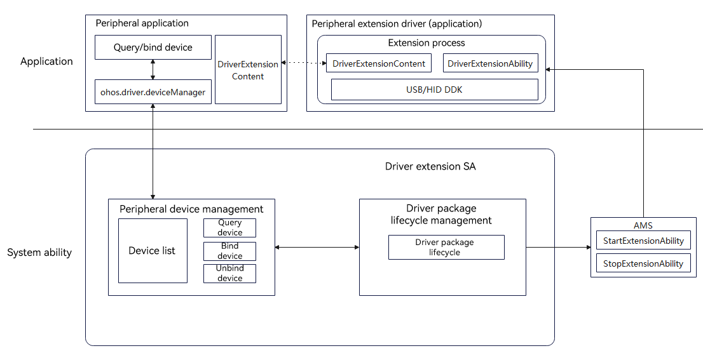
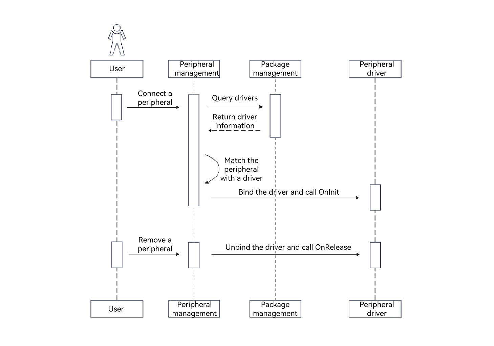
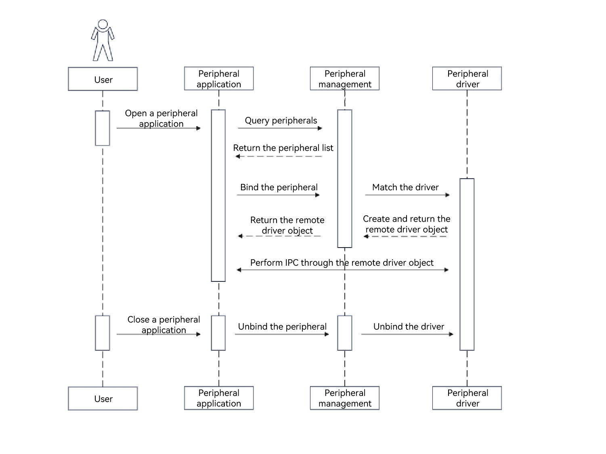

# Introduction to Driver Development Kit
<!--Kit: Driver Development Kit-->
<!--Subsystem: Driver-->
<!--Owner: @lixinsheng2-->
<!--Designer: @w00373942-->
<!--Tester: @dong-dongzhen-->
<!--Adviser: @w_Machine_cc-->

Empowered by the C-API solution, Driver Development Kit (DDK) provides easy-to-use, secure, and diversified ArkTs-API and C APIs to elevate your experience in developing peripheral drivers, which bring ultimate plug-and-play experience to users.

## When to Use

With DDK, you can develop dedicated or extended peripheral drivers in an efficient and secure manner.

1. Develop drivers of dedicated

   peripherals for bank counters, enterprise office, and medical detection, such as high-speed document scanners, ID card scanners, fingerprint scanners, and blood oxygen and blood glucose meters.

2. Develop enhanced functions of non-standard peripherals,

   such as customizing handwriting pad shortcut keys, setting the pressure sensing/drawing area, setting extended enhancement capabilities, setting the mouse lighting effect, customizing mouse extended buttons, and setting DPI and X and Y axes.

## Typical Use Cases

- You can develop advanced peripheral functions to meet user requirements.

- The extended driver framework supports lifecycle management of peripheral drivers and provides APIs for querying and binding peripheral devices.

## Basic Concepts

- Peripheral driver client: [basic UI-based driver](externaldevice-guidelines.md), which is used to query and bind drivers, and customize the communication mode and data processing mode.
- Peripheral driver: [basic UI-free driver](driverextensionability.md), which is the dedicated peripheral driver or enhanced peripheral driver developed based on DDK.
- External Device Manager: performs lifecycle management of peripheral devices and driver packages.
- Bundle Manager Service (BMS): manages application installation, uninstallation, and data on the system.
- Ability Manager Service (AMS): used to start and stop **DriverExtensionAbility**.
- System Ability (SA): a system service that provides basic system capabilities for devices. For example, the driver extension SA is a system service that provides extended drivers for non-standard peripherals.
- Non-standard peripheral: a peripheral that uses non-standard protocols (also called vendor-defined protocols) for communication.

## Implementation Principles

The HDF extended driver framework provides unified APIs for you to leverage the DDK capabilities for user-mode peripheral driver development.

External Device Manager, the core service of user-mode peripheral management, performs lifecycle management of peripherals and peripheral drivers. In addition, standard ArkTS APIs are provided to query, bind, and unbind peripherals.

### Peripheral Driver Architecture

  **Figure 1** Peripheral driver working mechanism 

### Operation Process

Figure 2 shows the process for matching a peripheral driver client with a peripheral driver when a peripheral is connected.

**Figure 2** Process for matching a peripheral driver client with a peripheral driver

Figure 3 shows the process for binding the peripheral driver client with a peripheral driver.

**Figure 3** Process of binding the peripheral driver client with a peripheral driver

## Notes and Constraints

To call the ArkTs or C APIs provided by DDK, you need to apply for specified permissions.

The following table lists the required permissions.

| API Type| DDK Type| Permission|
| --------- | --------- | --------- |
| ArkTs-API | NA| ohos.permission.ACCESS_EXTENSIONAL_DEVICE_DRIVER |
| C-API     | USB DDK | ohos.permission.ACCESS_DDK_USB |
| C-API     | HID DDK | ohos.permission.ACCESS_DDK_HID |
| C-API     | USB Serial DDK | ohos.permission.ACCESS_DDK_USB_SERIAL |
| C-API     | SCSI Peripheral DDK | ohos.permission.ACCESS_DDK_SCSI_PERIPHERAL |

## Associated Modules

The following table lists the associated modules you may use during development of peripheral drivers.

| Name| Description| 
| --------- | --------- |
| PerformanceAnalysisKit | Introduces {[hilog](../../dfx/hilog.md)} for log printing.| 
| BasicServicesKit       | Introduces {[BusinessError](../../reference/apis-basic-services-kit/js-apis-base.md#businesserror)} to capture error information.|
| IPCKit                 | Introduces {[rpc](../../reference/apis-ipc-kit/js-apis-rpc.md)} to implement inter-process communication between the driver and the client.|
| AbilityKit             | Introduces {[want](../../reference/apis-ability-kit/js-apis-application-want.md)} for lifecycle management.|

## Driver Application Specifications
1. Driver application definition
- A driver application is a user-mode driver developed based on DDK for non-standard peripherals.
- Since driver applications are based on **DriverExtensionAbility**, you need to override its lifecycle callback APIs.

2. Driver application installation and uninstallation
- Installation policy
  - When a user installs a driver application, the system installs the application in all existing user spaces.
  - When a user is created, the system installs the installed driver application in the respective user space.
- Uninstallation policy: When a user uninstalls a driver application in any user space, the system uninstalls the driver application in all user spaces.

3. DriverExtensionAbility-based lifecycle management
- ExtensionAbility is a general term of scenario-based service extension abilities, such as user-mode peripheral drivers, service widgets, and input methods.
- The lifecycle of each ExtensionAbility is managed by its SA. The SA calls **connectAbility** to start the ExtensionAbility and drive the execution of the defined service APIs. When the service is complete, the SA calls **disconnectAbility** to disconnect the ExtensionAbility. The AMS then determines whether to destroy the ExtensionAbility and its associated process based on whether the ExtensionAbility has any active SA connections. In the user-mode driver development scenario, the system SA that manages the DriverExtensionAbility lifecycle is the driver extension SA.

4. API access security control in DriverExtensionAbility
- The system supports scenario-based extension abilities built on ExtensionAbility. DriverExtensionAbility is a type of ability designed to support the development of user-mode drivers.
- DriverExtensionAbility can use only the APIs in ([Driver Development Kit (DDK)](https://gitcode.com/openharmony/docs/tree/master/en/application-dev/reference/apis-driverdevelopment-kit)) to control access to non-standard peripherals and implement data communication.
- Based on the security constraints and service scenarios in driver development, access to other ArkTS APIs is not allowed within DriverExtensionAbility, which is intended to prevent malicious behavior and data leakage.
- Restricted access to ArkTS APIs in DriverExtensionAbility is implemented as follows:
  - During the incubation and creation of DriverExtensionAbility, system modules are loaded based on the list of ArkTS APIs that can be accessed by DriverExtensionAbility. If a restricted ArkTS API is called in DriverExtensionAbility during the operation process, the API call fails because the corresponding system module is not loaded during the incubation and creation process.
- For the list of restricted ArkTS APIs, see the DriverExtension configuration in [Restricted ArkTS APIs](https://gitcode.com/openharmony/ability_ability_runtime/blob/master/frameworks/native/ability/native/etc/extension_blocklist_config.json).
