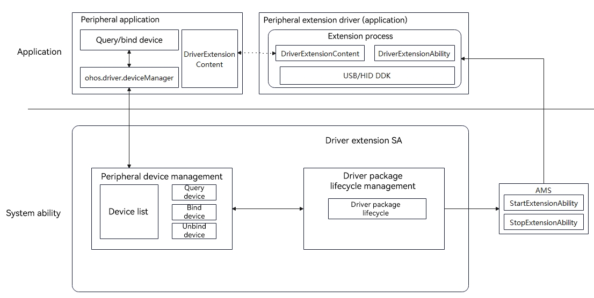
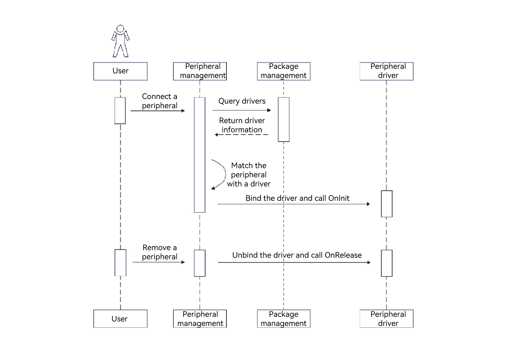
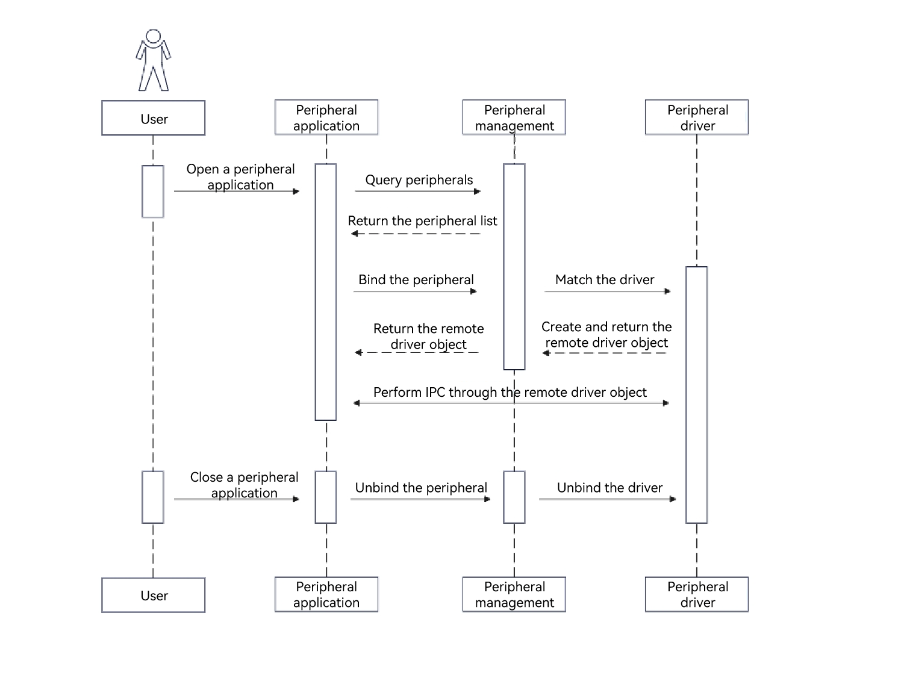

# About This Kit

<!--Kit: Driver Development Kit-->
<!--Subsystem: Driver-->
<!--Owner: @zgene94-->
<!--Designer: @w00373942-->
<!--Tester: @dong-dongzhen-->
<!--Adviser: @hu-zhiqiong-->
<!-- md-trans-meta sourceCommit=0bd849420b8023922f904909cad7f1ce911d0c8d translatedAt=2026-07-29T01:37:41.204Z pushedAt=2026-07-29T02:00:42.867Z -->

Driver Development Kit (DDK) provides peripheral driver developers with efficient, secure, and feature-rich extended peripheral driver development solutions — ArkTS APIs and C APIs — enabling a seamless plug-and-play experience for end users.

## When to Use

DDK allows you to efficiently and securely develop specialized peripheral devices and extend advanced peripheral capabilities:

1. Driver development for specialized office peripherals

   Examples include document scanners, ID card scanners, fingerprint readers, and blood oxygen or blood glucose monitoring devices used at bank counters, in enterprise offices, and in medical testing scenarios.

2. Capability extension for non-standard peripherals

   Examples include extending the capabilities of manufacturer-specific, non-standard HID peripherals, such as customizing shortcut keys for graphics tablets; configuring pressure sensitivity and drawing areas; setting extended features; configuring mouse lighting effects and extra button mappings; and adjusting advanced settings such as DPI and X/Y-axis controls.

## Typical Use Cases

- You can implement advanced features for peripheral accessories to meet consumers' advanced usage needs.

- The extended driver framework supports lifecycle management for extended peripheral drivers and provides APIs for extended device applications to query and bind extended peripherals.

## Basic Concepts

- Extended peripheral driver client: A UI-based basic driver that queries and binds drivers and customizes communication and data processing between the driver and device. For details, see [UI-based Driver Development](externaldevice-guidelines.md).

- Extended peripheral driver: A UI-free basic driver for specialized extended peripherals or enhanced extended peripheral capabilities, developed based on DDK capabilities. For details, see [UI-free Driver Development](driverextensionability.md).

- External Device Manager: Provides extended device management and lifecycle management for driver packages.

- Bundle Manager Service (BMS): Provides bundle management. In OpenHarmony, it is primarily responsible for application installation, uninstallation, and data management.

- Ability Manager Service (AMS): Manages abilities and is used to start and stop the **DriverExtensionAbility** of an extended peripheral driver.

- System ability (SA): A system service that provides capabilities to external clients. For example, the peripheral extension service SA provides system services for non-standard peripheral driver capabilities.

- Non-standard peripheral: A peripheral that uses a non-standard communication protocol, also known as a vendor-defined protocol.

## Implementation Principles

The HDF extended driver framework provides unified APIs for you to leverage the DDK capabilities for user-mode peripheral driver development.

External Device Manager, the core service of user-mode peripheral management, performs lifecycle management of peripherals and peripheral drivers. In addition, standard ArkTS APIs are provided to query, bind, and unbind peripherals.

### Peripheral Driver Architecture

  **Figure 1** Peripheral driver working mechanism  

### Operation Process

Figure 2 shows the process for matching a peripheral driver client with a peripheral driver when a peripheral is connected.

**Figure 2** Process for matching a peripheral driver client with a peripheral driver

Figure 3 shows the process for binding the peripheral driver client with a peripheral driver.

**Figure 3** Process of binding the peripheral driver client with a peripheral driver

## Constraints

To call the ArkTS or C APIs provided by DDK, you need to apply for specified permissions.

The following table lists the required permissions.

| API Type | DDK Type | Permission |
| --------- | --------- | --------- |
| ArkTS-API | N/A | ohos.permission.ACCESS_EXTENSIONAL_DEVICE_DRIVER |
| C-API     | UsbDdk | ohos.permission.ACCESS_DDK_USB |
| C-API     | HidDdk | ohos.permission.ACCESS_DDK_HID |
| C-API     | USBSerialDDK | ohos.permission.ACCESS_DDK_USB_SERIAL |
| C-API     | ScsiPeripheralDDK | ohos.permission.ACCESS_DDK_SCSI_PERIPHERAL |

<!--RP1--><!--RP1End-->

For API call restrictions of DriverExtensionAbility, see [Constraints](../../reference/apis-driverdevelopment-kit/js-apis-app-ability-driverExtensionAbility.md#constraints) in the API reference.

## Associated Modules

The following table lists the associated modules you may use during development of peripheral drivers.

| Name | Description | 
| --------- | --------- |
| PerformanceAnalysisKit | Imports [hilog](../../reference/apis-performance-analysis-kit/js-apis-hilog.md) for log printing. | 
| BasicServicesKit       | Imports [BusinessError](../../reference/apis-basic-services-kit/js-apis-base.md#businesserror) for capturing error information. |
| IPCKit                 | Imports [rpc](../../reference/apis-ipc-kit/js-apis-rpc.md) for IPC (Inter-Process Communication) between the driver and the client. |
| AbilityKit             | Imports [@ohos.application.Want (Want)](../../reference/apis-ability-kit/js-apis-application-want.md) for lifecycle management. |

## Driver Application Specifications

1. Driver application definition

- A driver application is a user-mode driver for non-standard peripherals, developed using DDK.

- Driver applications are based on **DriverExtensionAbility**. You must override its lifecycle callback APIs.

2. Driver application installation and uninstallation policies

- Installation policy

  - When a user installs a driver application, the system installs it in all existing user spaces.

  - When a new user is created, the system installs all previously installed driver applications in that user's space.

- Uninstallation policy: When a user uninstalls a driver application in any user space, the system uninstalls it from all user spaces.

3. **DriverExtensionAbility** lifecycle management

- **ExtensionAbility** is a collective term for scenario-based service extension capabilities (such as user-mode peripheral drivers, service widgets, and input methods), designed to address diverse usage scenarios.

- The lifecycle of each **ExtensionAbility** is managed by its corresponding SA. The SA calls **connectAbility** to start the ExtensionAbility and drive the execution of its defined service APIs. When the service completes, the SA calls **disconnectAbility** to disconnect. The AMS then determines whether to destroy the ExtensionAbility and its associated process based on whether any SA connection remains active. In the user-mode driver development scenario, the system SA responsible for managing the **DriverExtensionAbility** lifecycle is the driver extension SA.

4. API access security control in **DriverExtensionAbility**

- The system supports building scenario-specific extension abilities based on **ExtensionAbility**. **DriverExtensionAbility** is a type of ability designed for developing user-mode peripheral drivers.

- Within **DriverExtensionAbility**, only DDK APIs can be accessed to perform access control and data communication for non-standard peripherals.

- Based on the security constraints and service scenarios in driver development, access to other ArkTS APIs is not allowed within DriverExtensionAbility, which is intended to prevent malicious behavior and data leakage.

- Restricted ArkTS API access in **DriverExtensionAbility** is implemented as follows:

  - During initialization and creation of the **Extension** process, system modules are loaded according to the configured list of ArkTS APIs accessible to **DriverExtensionAbility**. At runtime, if a restricted ArkTS API is called within **DriverExtensionAbility**, the call fails because the corresponding system module was not loaded during initialization and creation.

- For the specific list of ArkTS APIs restricted in **DriverExtensionAbility**, refer to the **DriverExtension** configuration in [frameworks/native/ability/native/etc/extension_blocklist_config.json · OpenHarmony/ability_ability_runtime - AtomGit | GitCode](https://gitcode.com/openharmony/ability_ability_runtime/blob/master/frameworks/native/ability/native/etc/extension_blocklist_config.json).