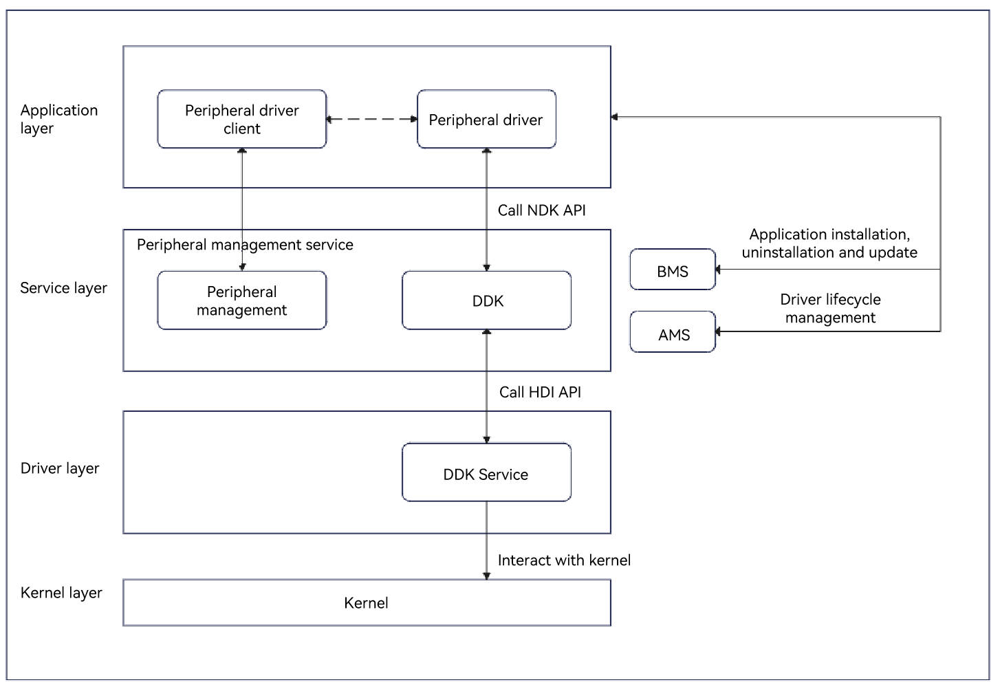

# HID DDK Development
<!--Kit: Driver Development Kit-->
<!--Subsystem: Driver-->
<!--Owner: @lixinsheng2-->
<!--Designer: @w00373942-->
<!--Tester: @dong-dongzhen-->
<!--Adviser: @w_Machine_cc-->

## Overview

The Human Interface Device (HID) Driver Development Kit (DDK) is a toolset that helps you develop HID drivers at the application layer based on the user mode. It provides APIs for accessing HID devices on a host, including creating a HID device, sending events to a device, destroying a device, opening or closing a device, reading and writing a report, and obtaining device information.

The HID DDK can be used to develop drivers for devices that use HID protocol to transfer data over a USB bus, or for devices that use peripheral drivers to create virtual devices to exchange information with non-standard devices.

### Basic Concepts

Before developing the HID DDK, you must understand the following basic concepts:

- **HID**

  HID is a type of hardware device that implements interaction between a person and a computer or another electronic device. The primary function of HID is to convert user input (such as a key, a click, or a movement) into a data signal, and send the signal to a host device (such as a computer, tablet, or game console), so that the user can control and operate the device.

- **DDK**

  DDK is a tool package provided by OpenHarmony for developing drivers for non-standard USB serial port devices based on the peripheral framework.

### Implementation Principles

A non-standard peripheral application obtains the HID device ID by using the peripheral management service, and delivers the ID and the action to the HID device driver application through RPC. The driver application calls the HID DDK API to create and destroy a HID device, send events to a HID device, or obtain and parse packets sent from a HID device. The DDK API uses the HDI service to deliver instructions to the kernel driver, and the kernel driver uses instructions to communicate with the device.

**Figure 1** Principles of invoking the HID DDK



## Constraints

- The APIs provided by the HID DDK can be used to develop drivers of non-standard HID devices.

- The open APIs of HID DDK can be used only within the lifecycle of **DriverExtensionAbility**.

- Before using the open APIs of the HID DDK, you must declare the matching ACL permissions in **module.json5**, for example, **ohos.permission.ACCESS_DDK_HID**.

## Available APIs

| Name| Description|
| -------- | -------- |
| OH_Hid_CreateDevice(Hid_Device *hidDevice, Hid_EventProperties *hidEventProperties) | Creates a HID device. When the device is no longer required, call **OH_Hid_DestroyDevice** to destroy it.|
| OH_Hid_EmitEvent(int32_t deviceId, const Hid_EmitItem items[], uint16_t length) | Sends an event to a HID device.|
| OH_Hid_DestroyDevice(int32_t deviceId) | Destroys a HID device.|
| int32_t OH_Hid_Init(void) | Initializes the HID DDK.|
| int32_t OH_Hid_Release(void) | Releases the HID DDK.|
| int32_t OH_Hid_Open(uint64_t deviceId, uint8_t interfaceIndex, Hid_DeviceHandle **dev) | Opens the device specified by **deviceId** and **interfaceIndex**.|
| int32_t OH_Hid_Close(Hid_DeviceHandle **dev) | Closes a HID device.|
| int32_t OH_Hid_Write(Hid_DeviceHandle *dev, uint8_t *data, uint32_t length, uint32_t *bytesWritten) | Writes a report to a HID device.|
| int32_t OH_Hid_ReadTimeout(Hid_DeviceHandle *dev, uint8_t *data, uint32_t buffSize, int timeout, uint32_t *bytesRead) | Reads a report from a HID device within the specified time.|
| int32_t OH_Hid_Read(Hid_DeviceHandle *dev, uint8_t *data, uint32_t buffSize, uint32_t *bytesRead) | Reads a report from a HID device in the specified mode. The blocking mode (that is, blocking remains active until data can be read) is used by default. You can call **OH_Hid_SetNonBlocking** to change the mode.|
| int32_t OH_Hid_SetNonBlocking(Hid_DeviceHandle *dev, int nonblock) | Sets the device read mode to non-blocking mode.|
| int32_t OH_Hid_GetRawInfo(Hid_DeviceHandle *dev, Hid_RawDevInfo *rawDevInfo) | Obtains the raw information of a HID device.|
| int32_t OH_Hid_GetRawName(Hid_DeviceHandle *dev, char *data, uint32_t buffSize) | Obtains the raw name of a HID device.|
| int32_t OH_Hid_GetPhysicalAddress(Hid_DeviceHandle *dev, char *data, uint32_t buffSize) | Obtains the physical address of a HID device.|
| int32_t OH_Hid_GetRawUniqueId(Hid_DeviceHandle *dev, uint8_t *data, uint32_t buffSize) | Obtains the raw unique identifier of a HID device.|
| int32_t OH_Hid_SendReport(Hid_DeviceHandle *dev, Hid_ReportType reportType, const uint8_t *data, uint32_t length) | Sends a report to a HID device.|
| int32_t OH_Hid_GetReport(Hid_DeviceHandle *dev, Hid_ReportType reportType, uint8_t *data, uint32_t buffSize) | Obtains a report from a HID device.|
| int32_t OH_Hid_GetReportDescriptor(Hid_DeviceHandle *dev, uint8_t *buf, uint32_t buffSize, uint32_t *bytesRead) | Obtains the report descriptor of a HID device.|

For details about the APIs, see [HID DDK](../../reference/apis-driverdevelopment-kit/capi-hidddk.md).

## How to Develop

### Developing a Basic HID Driver

The following steps you through on how to develop a HID device driver using the HID DDK.

**Adding Dynamic Link Libraries**

Add the following libraries to **CMakeLists.txt**.
```txt
libhid.z.so
```

**Including Header Files**
```c++
#include <hid/hid_ddk_api.h>
#include <hid/hid_ddk_types.h>
```

1. Create a HID device.

    Use **OH_Hid_CreateDevice** of **hid_ddk_api.h** to create a HID device. If the operation is successful, a device ID is returned. If the operation fails, an [error code](../../reference/apis-driverdevelopment-kit/capi-hid-ddk-types-h.md#hid_ddkerrcode) is returned.

    ```c++
    // Construct HID device properties.
    std::vector<Hid_DeviceProp> deviceProp = {HID_PROP_DIRECT}; // Import the header file using #include <vector>.
    std::string deviceName = "keyboard"; // Import the header file using #include <string>.
    Hid_Device hidDevice = {
        .deviceName = deviceName.c_str(), 
        .vendorId = 0x6006, 
        .productId = 0x6006, 
        .version = 1, 
        .bustype = 3,
        .properties = deviceProp.data(),
        .propLength = (uint16_t)deviceProp.size()
    };
    // Construct the event properties related to the HID device.
    std::vector<Hid_EventType> eventType = {HID_EV_ABS, HID_EV_KEY, HID_EV_SYN, HID_EV_MSC};
    Hid_EventTypeArray eventTypeArray = {.hidEventType = eventType.data(), .length = (uint16_t)eventType.size()};
    std::vector<Hid_KeyCode> keyCode = {HID_BTN_TOOL_PEN, HID_BTN_TOOL_RUBBER, HID_BTN_TOUCH, HID_BTN_STYLUS, HID_BTN_RIGHT};
    Hid_KeyCodeArray keyCodeArray = {.hidKeyCode = keyCode.data(), .length = (uint16_t)keyCode.size()};
    std::vector<Hid_MscEvent> mscEvent = {HID_MSC_SCAN};
    Hid_MscEventArray mscEventArray = {.hidMscEvent = mscEvent.data(), .length = (uint16_t)mscEvent.size()};
    std::vector<Hid_AbsAxes> absAxes = {HID_ABS_X, HID_ABS_Y, HID_ABS_PRESSURE};
    Hid_AbsAxesArray absAxesArray = {.hidAbsAxes = absAxes.data(), .length = (uint16_t)absAxes.size()};
    Hid_EventProperties hidEventProp = {
        .hidEventTypes = eventTypeArray,
        .hidKeys = keyCodeArray,
        .hidAbs = absAxesArray,
        .hidMiscellaneous = mscEventArray
        };
        // Create a device. The device ID of the device created is returned.
        int32_t deviceId = OH_Hid_CreateDevice(&hidDevice, &hidEventProp);
    ```

2. Send an event to the HID device.

    Call **OH_Hid_EmitEvent** in **hid_ddk_api.h** to send an event to the device with the specified **deviceId**.

    ```c++
    // Construct the event to be sent.
    Hid_EmitItem event = {.type = HID_EV_MSC, .code = HID_MSC_SCAN, .value = 0x000d0042};
    std::vector<Hid_EmitItem> itemVec;
    itemVec.push_back(event);
    // Send the event to a HID device.
    int32_t ret = OH_Hid_EmitEvent(deviceId, itemVec.data(), (uint16_t)itemVec.size());
    ```

3. Release resources.

    Call **OH_Hid_DestroyDevice** in **hid_ddk_api.h** to destroy the device after all requests are processed and before the application exits.

    ```c++
    // Destroy a HID device.
    int32_t ret = OH_Hid_DestroyDevice(deviceId);
    ```

### Developing a HID Packet Communication Driver

The following steps you through on how to develop a HID packet communication driver using the HID DDK.

**Adding Dynamic Link Libraries**

Add the following libraries to **CMakeLists.txt**.
```txt
libhid.z.so
```

**Including Header Files**
```c++
#include <hid/hid_ddk_api.h>
#include <hid/hid_ddk_types.h>
```

1. Initialize the HID DDK.

    Call **OH_Hid_Init** in **hid_ddk_api.h** to initialize the HID DDK.

    ```c++
    // Initialize the HID DDK.
    OH_Hid_Init();
    ```

2. Open the device.

    Call **OH_Hid_Open** in **hid_ddk_api.h** to open a HID device.

    ```c++
    uint64_t deviceId = 0x100000003;
    uint8_t interfaceIndex1 = 0;
    uint8_t interfaceIndex2 = 1;
    Hid_DeviceHandle *dev = NULL;
    Hid_DeviceHandle *devFeature = NULL;
    // Open the HID device specified by deviceId and interfaceIndex1. Generally, it is a /dev/hidraw0 file.
    OH_Hid_Open(deviceId, interfaceIndex1, &dev);
    // Open the HID device specified by deviceId and interfaceIndex2. Generally, it is a /dev/hidraw1 file.
    OH_Hid_Open(deviceId, interfaceIndex2, &devFeature);
    ```

3. (Optional) Write or send reports from the host to the HID device as data packets.
    - If the report type is **HID_OUTPUT_REPORT** (output report), you can write/send the report in any of the following ways:
        - Call **OH_Hid_Write** in **hid_ddk_api.h** to write an output report to the HID device.

            ```c++
            uint8_t data[] = {0x02, 0x02};
            uint32_t bytesWritten = 0;
            // Write a report.
            int32_t ret = OH_Hid_Write(dev, data, sizeof(data), &bytesWritten);
            ```

        - Call **OH_Hid_SendReport** in **hid_ddk_api.h** to send an output report to the HID device.

            ```c++
            uint8_t data1[2] = {0x00};
            // Specify the report ID.
            data1[0] = 0x02;
            // Set the report data.
            data1[1] = 0x02;

            // Send an output report.
            int32_t ret = OH_Hid_SendReport(dev, HID_OUTPUT_REPORT, data1, sizeof(data1));
            ```

    - If the report type is **HID_FEATURE_REPORT** (feature report), call **OH_Hid_SendReport** in **hid_ddk_api.h** to send a feature report to the HID device.

        ```c++
        uint8_t data2[2] = {0x00};
        // Specify the report ID.
        data2[0] = 0x02;
        // Set the report data.
        data2[1] = 0x02;

        // Send a feature report.
        int32_t ret = OH_Hid_SendReport(devFeature, HID_FEATURE_REPORT, data2, sizeof(data2));
        ```

4. (Optional) Read reports from the HID device.
    - If the report type is **HID_INPUT_REPORT** (input report), you can read the report in any of the following ways:
        - Call **OH_Hid_Read** or **OH_Hid_ReadTimeout** in **hid_ddk_api.h** to read an input report from the HID device in blocking mode.

            ```c++
            uint8_t data3[9] = {0x00};
            uint32_t bytesRead = 0;
            // Read a report from a HID device.
            int32_t ret = OH_Hid_Read(dev, data3, sizeof(data3), &bytesRead);

            uint8_t data4[9] = {0x00};
            // Read a report from a HID device within the specified time.
            ret = OH_Hid_ReadTimeout(dev, data4, sizeof(data4), 10000, &bytesRead);
            ```

        - Call **OH_Hid_SetNonBlocking** and **OH_Hid_Read** in **hid_ddk_api.h** to read an input report from the HID device in non-blocking mode.

            ```c++
            // 1 means to enable non-blocking, and 0 means to disable non-blocking.
            int32_t ret = OH_Hid_SetNonBlocking(dev, 1);

            // Wait for user input if no data is input when the code is executed.
            sleep(1); // Import the header file using #include <unistd.h>.
            uint8_t data5[9] = {0};
            uint32_t bytesRead = 0;
            // Read a report from a HID device.
            ret = OH_Hid_Read(dev, data5, sizeof(data5), &bytesRead);
            ```

        - Call **OH_Hid_GetReport** in **hid_ddk_api.h** to obtain an input report from the HID device.

            ```c++
            uint8_t data6[9] = {0};
            // Specify the report ID.
            data6[0] = 0x00;

            // Obtain an input report.
            int32_t ret = OH_Hid_GetReport(dev, HID_INPUT_REPORT, data6, sizeof(data6));
            ```

    - If the report type is **HID_FEATURE_REPORT** (feature report), call **OH_Hid_GetReport** in **hid_ddk_api.h** to obtain a feature report from a HID device.

        ```c++
        uint8_t data7[8] = {0};
        // Specify the report ID.
        data7[0] = 0x07;

        // Obtain a feature report.
        int32_t ret = OH_Hid_GetReport(devFeature, HID_FEATURE_REPORT, data7, sizeof(data7));
        ```

5. (Optional) Obtain the raw device information, raw name, physical address, and raw unique identifier of a HID device.

    Call **OH_Hid_GetRawInfo** in **hid_ddk_api.h** to obtain the raw information about a HID device.<br>Call **OH_Hid_GetRawName** to obtain the raw name of a HID device.<br>Call **OH_Hid_GetPhysicalAddress** to obtain the physical address of a HID device.<br>Call **OH_Hid_GetRawUniqueId** to obtain the raw unique identifier of a HID device. The obtained information can be referenced by applications, for example, displaying device information on the GUI.

    ```c++
    struct Hid_RawDevInfo rawDevInfo;
    int32_t ret = OH_Hid_GetRawInfo(dev, &rawDevInfo);

    char rawName[1024] = {0};
    ret = OH_Hid_GetRawName(dev, rawName, sizeof(rawName));

    char physicalAddress[1024] = {0};
    ret = OH_Hid_GetPhysicalAddress(dev, physicalAddress, sizeof(physicalAddress));

    uint8_t uniqueIdData[64] = {0};
    ret = OH_Hid_GetRawUniqueId(dev, uniqueIdData, sizeof(uniqueIdData));
    ```

6. (Optional) Obtain the report descriptor.

    Call **OH_Hid_GetReportDescriptor** in **hid_ddk_api.h** to obtain the HID device report descriptor.

    ```c++
    uint8_t desData[1024] = {0};
    uint32_t bytesRead = 0;
    int32_t ret = OH_Hid_GetReportDescriptor(dev, desData, sizeof(desData), &bytesRead);
    ```

7. Close the HID device.

    Call **OH_Hid_Close** in **hid_ddk_api.h** to close the device.

    ```c++
    // Close the device.
    OH_Hid_Close(&dev);
    OH_Hid_Close(&devFeature);
    ```

8. Release the HID DDK.

    After the HID device is closed, call **OH_Hid_Release** in **hid_ddk_api.h** to release the HID DDK.

    ```c++
    // Release the HID DDK.
    OH_Hid_Release();
    ```
