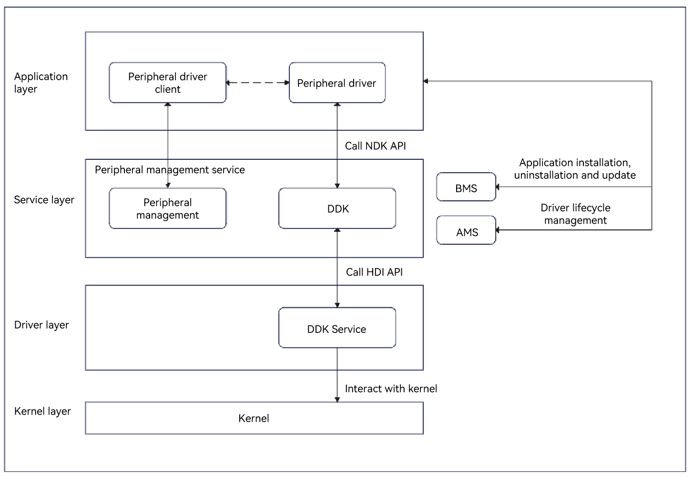

# USB DDK Development

<!--Kit: Driver Development Kit-->
<!--Subsystem: Driver-->
<!--Owner: @zgene94-->
<!--Designer: @w00373942-->
<!--Tester: @dong-dongzhen-->
<!--Adviser: @hu-zhiqiong-->
<!-- md-trans-meta sourceCommit=4e2e44136e02c57f70e721649f26e12ec63e7374 translatedAt=2026-08-15T01:44:20.722Z pushedAt=2026-08-15T06:45:57.647Z -->

## Overview

The USB Driver Development Kit (UsbDdk) is a toolset that helps you develop USB device drivers at the application layer based on the user mode. It provides a series of device access APIs, for example, opening and closing USB interfaces, and performing non-isochronous transfer, isochronous transfer, control transfer, and interrupt transfer over USB pipes.

The UsbDdk can be used to develop device drivers for all devices that use the USB protocol to transfer data over a USB bus. For the peripherals that are not supported by standard kernel drivers, you can use the peripheral driver application developed based on the UsbDdk to implement unique device capabilities.

### Basic Concepts

Before you get started, understand the following concepts:

- **USB**

  Universal Serial Bus (USB) is a widely used interface technology that connects a computer to various external devices, such as a keyboard, mouse, printer, storage device, and smartphone. The USB is designed to provide a standardized, efficient, and easy-to-use connection mode that replaces the traditional serial and parallel interface communication.

- **DDK**

  DDK is a tool package provided by OpenHarmony for developing drivers for non-standard USB serial port devices based on the peripheral framework.

### Implementation Principles

A non-standard peripheral application obtains the USB device ID by using the peripheral management service, and delivers the ID and the action to the USB driver application through RPC. The USB driver application can obtain or set the device descriptor and initiate a control transfer or interrupt transfer request by calling the UsbDdk API. Then, the DDK API uses the HDI service to deliver instructions to the kernel driver, and the kernel driver uses instructions to communicate with the device.

**Figure 1** Principle of invoking the UsbDdk



## Constraints

- The open APIs of the UsbDdk can be used to develop drivers of non-standard USB peripherals.

- The open APIs of the UsbDdk can be used only within the lifecycle of **DriverExtensionAbility**.

- To use the open APIs of the UsbDdk, you need to declare the matching ACL permissions in **module.json5**, for example, **ohos.permission.ACCESS_DDK_USB**.

## Environment Setup

Before you get started, make necessary preparations by following instructions in [Environment Preparation](environmental-preparation.md).

## How to Develop

### Available APIs

| Name| Description|
| -------- | -------- |
| OH_Usb_Init(void) | Initializes the UsbDdk.|
| OH_Usb_Release(void) | Releases the UsbDdk.|
| OH_Usb_GetDeviceDescriptor(uint64_t deviceId, struct UsbDeviceDescriptor *desc) | Obtains the device descriptor of a USB device.|
| OH_Usb_GetConfigDescriptor(uint64_t deviceId, uint8_t configIndex, struct UsbDdkConfigDescriptor **const config) | Obtains a USB configuration descriptor. To avoid memory leakage, use **OH_Usb_FreeConfigDescriptor()** to release a descriptor after use.|
| OH_Usb_FreeConfigDescriptor(const struct UsbDdkConfigDescriptor *const config) | Releases a configuration descriptor. To avoid memory leakage, release a descriptor in time after use.|
| OH_Usb_ClaimInterface(uint64_t deviceId, uint8_t interfaceIndex, uint64_t *interfaceHandle) | Declares a USB interface.|
| OH_Usb_SelectInterfaceSetting(uint64_t interfaceHandle, uint8_t settingIndex) | Activates the alternate setting of a USB interface.|
| OH_Usb_GetCurrentInterfaceSetting(uint64_t interfaceHandle, uint8_t \*settingIndex) | Obtains the alternate setting of a USB interface.|
| OH_Usb_SendControlReadRequest(uint64_t interfaceHandle, const struct UsbControlRequestSetup \*setup, uint32_t timeout, uint8_t \*data, uint32_t \*dataLen) | Sends a control read transfer request. This API returns the result synchronously.|
| OH_Usb_SendControlWriteRequest(uint64_t interfaceHandle, const struct UsbControlRequestSetup \*setup, uint32_t timeout, const uint8_t \*data, uint32_t dataLen) | Sends a control write transfer request. This API returns the result synchronously.|
| OH_Usb_ReleaseInterface(uint64_t interfaceHandle) | Releases a USB interface.|
| OH_Usb_SendPipeRequest(const struct UsbRequestPipe *pipe, UsbDeviceMemMap *devMmap) | Sends a pipe request. This API returns the result synchronously. It applies to interrupt transfer and bulk transfer.|
| OH_Usb_CreateDeviceMemMap(uint64_t deviceId, size_t size, UsbDeviceMemMap **devMmap) | Create a buffer. To avoid resource leakage, use **OH_Usb_DestroyDeviceMemMap()** to destroy a buffer after use.|
| OH_Usb_DestroyDeviceMemMap(UsbDeviceMemMap *devMmap) | Destroy a buffer. To avoid resource leakage, destroy a buffer in time after use.|
| OH_Usb_GetDevices(struct Usb_DeviceArray *devices) | Obtains the USB device ID list. Ensure that the input pointer is valid and the number of devices does not exceed 128. To prevent resource leakage, release the member memory after usage. Besides, make sure that the obtained USB device ID has been filtered by **vid** in the driver configuration information.|

For details about the APIs, see [UsbDdk](../../reference/apis-driverdevelopment-kit/capi-usbddk.md).

### How to Develop

To develop a USB driver using the UsbDdk, perform the following steps:

**Adding Dynamic Link Libraries**

Add the following libraries to **CMakeLists.txt**.

```txt
libusb_ndk.z.so
```

**Including Header Files**

```c++
#include <usb/usb_ddk_api.h>
#include <usb/usb_ddk_types.h>
```

1. Obtain the device descriptor of a USB device.

   Call **OH_Usb_Init** of **usb_ddk_api.h** to initialize the UsbDdk, and call **OH_Usb_GetDeviceDescriptor** to obtain the device descriptor.

   <!-- @[driver_usb_step1](https://gitcode.com/openharmony/applications_app_samples/blob/master/code/DocsSample/DriverDevelopmentKit/UsbDriverDemo/entry/src/main/cpp/hello.cpp) --> 

   ``` C++
   // Initialize the UsbDdk.
   int32_t ret = OH_Usb_Init();
   OH_LOG_INFO(LOG_APP, "OH_Usb_Init ret=:%{public}d\n", ret);
   // ...
   struct UsbDeviceDescriptor devDesc;
   // Obtain the device descriptor.
   ret = OH_Usb_GetDeviceDescriptor(g_devHandle, &devDesc);
   ```

2. Obtain a configuration descriptor, and declare the USB interface.

   Call **OH_Usb_GetConfigDescriptor** of **usb_ddk_api.h** to obtain the configuration descriptor **config**, and call **OH_Usb_ClaimInterface** to declare claiming of the USB interface.

   <!-- @[driver_usb_step2](https://gitcode.com/openharmony/applications_app_samples/blob/master/code/DocsSample/DriverDevelopmentKit/UsbDriverDemo/entry/src/main/cpp/hello.cpp) -->  

   ``` C++
   struct UsbDdkConfigDescriptor *config = nullptr;
   // Obtain the configuration descriptor.
   auto ret = OH_Usb_GetConfigDescriptor(g_devHandle, 1, &config);
   OH_LOG_INFO(LOG_APP, "OH_Usb_GetConfigDescriptor ret = %{public}d", ret);
   if (ret != 0) {
       OH_LOG_ERROR(LOG_APP, "get config desc failed:%{public}d", ret);
       return false;
   }
   // Obtain the handwriting tablet-related interface and endpoint from the configuration descriptor.
   auto [res, interface, endpoint, maxPktSize] = GetInterfaceAndEndpoint(config);
   OH_LOG_INFO(LOG_APP, "OH_Usb_GetConfigDescriptor ret = %{public}d", res);
   if (!res) {
       OH_LOG_ERROR(LOG_APP, "GetInterfaceAndEndpoint failed");
       return false;
   }
   // Release the configuration descriptor to prevent memory leaks.
   OH_Usb_FreeConfigDescriptor(config);
   g_dataEp = endpoint;
   g_maxPktSize = maxPktSize;
   g_interface = interface;
   // Claim the interface. The kernel keyboard driver will be uninstalled.
   ret = OH_Usb_ClaimInterface(g_devHandle, g_interface, &g_interfaceHandle);
   ```

3. (Optional) Obtain the activated alternate setting of a USB interface.

   Call **OH_Usb_GetCurrentInterfaceSetting** of **usb_ddk_api.h** to obtain the alternate setting, and call **OH_Usb_SelectInterfaceSetting** to activate it.

   <!-- @[driver_usb_step3](https://gitcode.com/openharmony/applications_app_samples/blob/master/code/DocsSample/DriverDevelopmentKit/UsbDriverDemo/entry/src/main/cpp/hello.cpp) -->  

   ``` C++
   uint8_t settingIndex = 0;
   // Obtain the alternate setting.
   int32_t ret = OH_Usb_GetCurrentInterfaceSetting(g_interfaceHandle, &settingIndex);
   if (ret != USB_DDK_SUCCESS) {
       OH_LOG_ERROR(LOG_APP, "OH_Usb_GetCurrentInterfaceSetting failed, ret=%{public}d", ret);
   }
   
   // Activate the alternate setting.
   ret = OH_Usb_SelectInterfaceSetting(g_interfaceHandle, settingIndex);
   if (ret != USB_DDK_SUCCESS) {
       OH_LOG_ERROR(LOG_APP, "OH_Usb_SelectInterfaceSetting failed, ret=%{public}d", ret);
   }
   ```

4. (Optional) Send control read requests and control write requests.

    Call **OH_Usb_SendControlReadRequest** of **usb_ddk_api.h** to send a control read request, or call **OH_Usb_SendControlWriteRequest** to send a control write request.

    <!-- @[driver_usb_step4_2](https://gitcode.com/openharmony/applications_app_samples/blob/master/code/DocsSample/DriverDevelopmentKit/UsbDriverDemo/entry/src/main/cpp/hello.cpp) -->  

    ``` C++
    uint8_t strDesc[100] = {0};
    // Obtain the product's string descriptor.
    uint32_t len = 100;
    struct UsbControlRequestSetup strDescSetup;
    strDescSetup.bmRequestType = 0x80;
    strDescSetup.bRequest = 0x06;
    strDescSetup.wValue = (0x03 << BIT_EIGHT) | (iProduct); // desc Index
    strDescSetup.wIndex = 0x409;                    // language Id
    strDescSetup.wLength = len;
    auto ret = OH_Usb_SendControlReadRequest(g_interfaceHandle, &strDescSetup, UINT32_MAX, strDesc, &len);
    ```

    <!-- @[driver_usb_step4_1](https://gitcode.com/openharmony/applications_app_samples/blob/master/code/DocsSample/DriverDevelopmentKit/UsbDriverDemo/entry/src/main/cpp/hello.cpp) -->  

    ``` C++
    // Set the feature.
    uint32_t timeout = 5000;
    struct UsbControlRequestSetup strDescSetup;
    strDescSetup.bmRequestType = 0x21;
    strDescSetup.bRequest = 0x09;
    strDescSetup.wValue = ((0x03 << BIT_EIGHT) | 0x02); // desc Index
    strDescSetup.wIndex = 0x0;
    strDescSetup.wLength = 0x02;
    uint8_t data[128] = {0x02, 0x02};
    uint32_t dataLen = 2;
    int32_t ret = OH_Usb_SendControlWriteRequest(g_interfaceHandle, &strDescSetup, timeout, data, dataLen);
    ```

5. (Optional) Create a buffer, and send a request.

    Call **OH_Usb_CreateDeviceMemMap** of **usb_ddk_api.h** to create the buffer **devMmap**, and call **OH_Usb_SendPipeRequest** to send a request.

    <!-- @[driver_usb_step5_1](https://gitcode.com/openharmony/applications_app_samples/blob/master/code/DocsSample/DriverDevelopmentKit/UsbDriverDemo/entry/src/main/cpp/hello.cpp) -->  

    ``` C++
    // Claim the interface. The kernel keyboard driver will be uninstalled.
    // Create a buffer for storing data.
    int32_t ret = OH_Usb_CreateDeviceMemMap(g_devHandle, bufferLen, &devMmap);
    ```

    <!-- @[driver_usb_step5_2](https://gitcode.com/openharmony/applications_app_samples/blob/master/code/DocsSample/DriverDevelopmentKit/UsbDriverDemo/entry/src/main/cpp/hello.cpp) -->  

    ``` C++
    struct UsbRequestPipe pipe;
    pipe.interfaceHandle = g_interfaceHandle;
    pipe.endpoint = g_dataEp;
    pipe.timeout = 4; // Interrupt transfer timeout interval, which must be the same as the bInterval value of the handwriting tablet.
    // Read the handwriting tablet data.
    // Read key values in interrupt transfer mode.
    ret = OH_Usb_SendPipeRequest(&pipe, devMmap);
    ```

6. Release resources.

    After all requests are processed and before the application exits, call **OH_Usb_DestroyDeviceMemMap** of **usb_ddk_api.h** to destroy the buffer, call **OH_Usb_ReleaseInterface** to release the USB interface, and call **OH_Usb_Release** to release the UsbDdk.

    <!-- @[driver_usb_step6](https://gitcode.com/openharmony/applications_app_samples/blob/master/code/DocsSample/DriverDevelopmentKit/UsbDriverDemo/entry/src/main/cpp/hello.cpp) -->  

    ``` C++
    // Destroy the buffer.
    OH_Usb_DestroyDeviceMemMap(devMmap);
    // Release the USB interface.
    int32_t ret = OH_Usb_ReleaseInterface(g_interfaceHandle);
    if (ret != 0) {
        OH_LOG_ERROR(LOG_APP, "ReleaseInterface failed %{public}d", ret);
    }
    // Release the UsbDdk.
    OH_Usb_Release();
    ```

7. (Optional) Obtain the USB device list.

    After the driver is started, call **OH_Usb_GetDevices** to obtain the device ID that matches the VID in the driver configuration for subsequent application development. (VID is the ID of the device vendor and is configured in the driver application to indicate the applicable devices. The queried device IDs need to be filtered by VID.)

    <!-- @[driver_usb_step7](https://gitcode.com/openharmony/applications_app_samples/blob/master/code/DocsSample/DriverDevelopmentKit/UsbDriverDemo/entry/src/main/cpp/hello.cpp) -->  

    ``` C++
    constexpr size_t maxUsbDeviceNum = 128;
    struct Usb_DeviceArray deviceArray;
    deviceArray.deviceIds = new uint64_t[maxUsbDeviceNum];
    // Obtain the USB device list.
    int32_t ret = OH_Usb_GetDevices(&deviceArray);
    if (ret != USB_DDK_SUCCESS) {
        OH_LOG_ERROR(LOG_APP, "OH_Usb_GetDevices failed, ret=%{public}d", ret);
    }
    ```