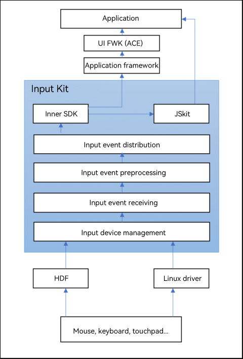

# Introduction to Input Kit

## Function Description

Input Kit provides services for a plurality of input devices, such as the touchpad, touchscreen, mouse, and keyboard. It normalizes various input events to ensure unified and smooth experience for users when interacting with different input devices.

In addition to the basic input event services, Input Kit provides APIs for you to implement functions such as obtaining the device list and changing the mouse pointer style.

## How Input Kit Works
As a basic service provided by the system for applications, Input Kit fulfills input device management as well as input event management, receiving, preprocessing, and distribution, and reports the input events to applications through the inner SDK and JSkit. The operation mechanism is as follows:

<!--Del-->
## Constraints

1. Before using the following functions, declare the corresponding permissions.

  | API | Description| Permission|
  | ------------------------------------------------------------ | -------------------------- |-----|
  | setShieldStatus(shieldMode: ShieldMode, isShield: boolean): void | Sets the shortcut key shield status. The value **true** means to shield shortcut keys, and the value **false** means the opposite.|ohos.permission.INPUT_CONTROL_DISPATCHING|
  | getShieldStatus(shieldMode: ShieldMode): boolean | Obtains the shortcut key shield status. The value **true** means to shield shortcut keys, and the value **false** means the opposite.|ohos.permission.INPUT_CONTROL_DISPATCHING|
    
2. The APIs provided by the [inputConsumer](inputconsumer-guidelines.md), [inputEventClient](inputeventclient-guidelines.md), [inputMonitor](inputmonitor-guidelines.md), and [shortKey](shortkey-guidelines.md) modules are system APIs. Wherein, the APIs provided by the [inputMonitor](inputmonitor-guidelines.md) module require the **ohos.permission.INPUT_MONITORING** permission.

<!--DelEnd-->
