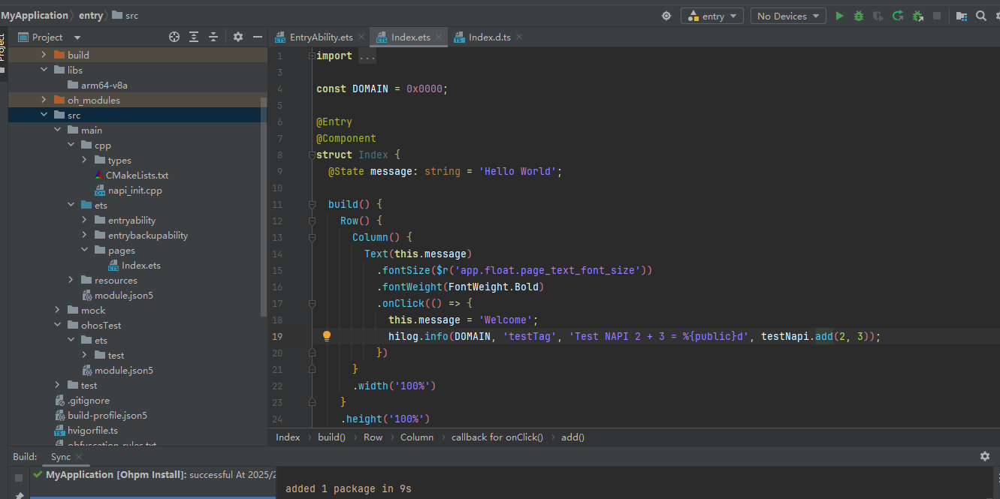

# Obtaining Device Location Information (C/C++)


## When to Use

You can call location-related APIs to listen for device location changes.

## Function Description

| Name                                                        | Description                                                        |
| ------------------------------------------------------------ | ------------------------------------------------------------ |
| OH_Location_IsLocatingEnabled(bool* enabled)     | Checks whether the location switch is enabled.                                |
| OH_Location_StartLocating(const Location_RequestConfig* requestConfig) | Starts locating and subscribes to location changes.|
| Location_ResultCode OH_Location_StopLocating(const Location_RequestConfig* requestConfig) | Stops locating and unsubscribes from location changes.|
| OH_LocationInfo_GetBasicInfo(Location_Info* location)   | Obtains basic information from the location result, such as the longitude, latitude, altitude, and speed.|
| OH_LocationInfo_GetAdditionalInfo(Location_Info* location, char* additionalInfo, uint32_t length) | Obtains additional information from the location result. The additional information is a string in JSON format.|
| OH_Location_CreateRequestConfig(void) | Creates a **Location_RequestConfig** instance.   |
| OH_Location_DestroyRequestConfig(Location_RequestConfig* requestConfig) | Destroys the **Location_RequestConfig** instance and reclaims the memory. |
| OH_LocationRequestConfig_SetUseScene(Location_RequestConfig* requestConfig, Location_UseScene useScene) | Sets the user activity scenario in a location request.<br>If **useScene** is set, **powerConsumptionScene** is invalid.<br>Otherwise, **powerConsumptionScene** takes effect.<br>If neither of the two parameters is set, **useScene** is defaulted to **LOCATION_USE_SCENE_DAILY_LIFE_SERVICE**, and **powerConsumptionCenario** is invalid.    |
| OH_LocationRequestConfig_SetPowerConsumptionScene(Location_RequestConfig* requestConfig, Location_PowerConsumptionScene powerConsumptionScene) | Sets the power consumption scenario in a location request.     |
| OH_LocationRequestConfig_SetInterval(Location_RequestConfig* requestConfig, int interval) | Sets the interval for reporting location results.                              |
| OH_LocationRequestConfig_SetCallback(Location_RequestConfig* requestConfig, Location_InfoCallback callback, void* userData) | Sets the callback for receiving reported location information.    |


## How to Develop
1. Create a native C++ project.
   

2. Before using system basic location capabilities, check whether your application has been granted the permission to access the device location information. If not, your application first needs to apply for the required permission. For details, see [Applying for Location Permissions](location-permission-guidelines.md).


3. Add the dynamic dependency libraries into the **CMakeLists.txt** file.

   ```c
   target_link_libraries(entry PUBLIC libace_napi.z.so)
   target_link_libraries(entry PUBLIC libhilog_ndk.z.so)
   target_link_libraries(entry PUBLIC liblocation_ndk.so)
   ```

4. Write the **napi_init.cpp** file to import related modules.

   ```c
   #include "napi/native_api.h"
   #include "LocationKit/oh_location.h"
   #include "LocationKit/oh_location_type.h"
   #include "hilog/log.h"
   #include <stdlib.h>
   ```

5. Call **isLocationEnabled** to check whether the location switch is enabled. 
   The return result is a Boolean value. The value **true** indicates that the location switch is enabled, and the value **false** indicates the opposite.

   ```c
    static napi_value OhLocationIsEnabled(napi_env env, napi_callback_info info)
    {
        bool isEnabled = false;
        int resultCode = OH_Location_IsLocatingEnabled(&isEnabled);
        napi_value result = NULL;
        napi_get_boolean(env, isEnabled, &result);
        return result;
    }
    // Add related APIs to the Init function.
    EXTERN_C_START
    static napi_value Init(napi_env env, napi_value exports)
    {
        napi_property_descriptor desc[] = {
            {"ohLocationIsEnabled", NULL, OhLocationIsEnabled, NULL, NULL, NULL, napi_default, NULL},
        };
        napi_define_properties(env, exports, sizeof(desc) / sizeof(desc[0]), desc);
        return exports;
    }
    EXTERN_C_END
   ```

6. Start positioning and subscribe to location changes.

    ```c
    // Define a location request.
    struct Location_RequestConfig *g_requestConfig = NULL;
    void *mydata = NULL;

    // Define a callback to receive location information.
    void reportLocation(Location_Info* location, void* userData)
    {
        Location_BasicInfo baseInfo = OH_LocationInfo_GetBasicInfo(location);
        char additionalInfo[1024] = "";
        Location_ResultCode result = OH_LocationInfo_GetAdditionalInfo(location, additionalInfo, sizeof(additionalInfo));
        if (mydata == userdata) {
            OH_LOG_INFO(LOG_APP, "userData is mydata");
        }
        return;
    }

    // Subscribe to location information.
    static napi_value OhLocationStartLocating(napi_env env, napi_callback_info info)
    {
        if (g_requestConfig == NULL) {
            g_requestConfig = OH_Location_CreateRequestConfig();
        }
        OH_LocationRequestConfig_SetUseScene(g_requestConfig, LOCATION_USE_SCENE_NAVIGATION);
        OH_LocationRequestConfig_SetInterval(g_requestConfig, 1);
        mydata = (void *) malloc (sizeof ("mydata")); // Custom data, which is transparently returned through callback.
        OH_LocationRequestConfig_SetCallback(g_requestConfig, reportLocation, mydata);
        OH_Location_StartLocating(g_requestConfig);
        int32_t ret = 0;
        napi_value result = NULL;
        napi_create_int32(env, ret, &result);
        return result;
    }

    // Unsubscribe from location information. The value of g_requestConfig must be the same as the object passed during subscription.
    static napi_value OhLocationStopLocating(napi_env env, napi_callback_info info)
    {
        OH_Location_StopLocating(g_requestConfig);
        if (g_requestConfig != NULL) {
            OH_Location_DestroyRequestConfig(g_requestConfig);
            g_requestConfig = NULL;
        }
        free(mydata);
        mydata = NULL;
        int32_t ret = 0;
        napi_value result = NULL;
        napi_create_int32(env, ret, &result);
        return result;
    }

    // Add related APIs to the Init function.
    EXTERN_C_START
    static napi_value Init(napi_env env, napi_value exports)
    {
        napi_property_descriptor desc[] = {
            {"ohLocationStartLocating", NULL, OhLocationStartLocating, NULL, NULL, NULL, napi_default, NULL},
            {"ohLocationStopLocating", NULL, OhLocationStopLocating, NULL, NULL, NULL, napi_default, NULL},
        };
        napi_define_properties(env, exports, sizeof(desc) / sizeof(desc[0]), desc);
        return exports;
    }
    EXTERN_C_END
    ```

6. Introduce the NAPI APIs to the **index.d.ts** file in **types/libentry**.
    ```c
     export const ohLocationIsEnabled: () => boolean;
     export const ohLocationStartLocating: () => number;
     export const ohLocationStopLocating: () => number;
    ```

7. Delete deprecated functions from the **Index.ets** file.

    ```js
    .onClick(() => {
        hilog.info(0x0000, 'testTag', 'Test NAPI 2 + 3 = %{public}d', testNapi.add(2, 3));
    })
    ```
