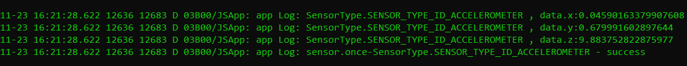

# Sensor Development


## When to Use

- Data provided by the compass sensor denotes the current orientation of the user device, which helps your application accurately navigate for the user.

- Data provided by the proximity sensor denotes the distance between the device and a visible object, which enables the device to automatically turn on or off its screen accordingly to prevent accidental touch on the screen.

- Data provided by the barometer sensor helps your application accurately determine the altitude of the device.

- Data provided by the ambient light sensor helps your device automatically adjust its backlight.

- Data provided by the Hall effect sensor implements the smart cover mode of your device.

- Data provided by the heart rate sensor helps your application track the heart health of a user.

- Data provided by the pedometer sensor helps your application obtain the number of steps a user has walked.

- Data provided by the wear detection sensor helps your application detect whether a user is wearing a wearable device.


## Available APIs

| Module| API| Description|
| -------- | -------- | -------- |
| ohos.sensor | sensor.on(sensorType, callback:AsyncCallback&lt;Response&gt;): void | Subscribes to data changes of a type of sensor.|
| ohos.sensor | sensor.once(sensorType, callback:AsyncCallback&lt;Response&gt;): void | Subscribes to only one data change of a type of sensor.|
| ohos.sensor | sensor.off(sensorType, callback?:AsyncCallback&lt;void&gt;): void | Unsubscribes from sensor data changes.|


## How to Develop

1. Before obtaining data from a type of sensor, check whether the required permission has been configured.<br>
     The system provides the following sensor-related permissions:
   - ohos.permission.ACCELEROMETER

   - ohos.permission.GYROSCOPE

   - ohos.permission.ACTIVITY_MOTION

   - ohos.permission.READ_HEALTH_DATA

   For details about how to configure a permission, see [Declaring Permissions](../security/accesstoken-guidelines.md).
   
2. Subscribe to data changes of a type of sensor.
  
   ```
   import sensor from "@ohos.sensor";
   sensor.on(sensor.SensorType.SENSOR_TYPE_ID_ACCELEROMETER, function(data){
      console.info("Data obtained successfully. x: " + data.x + "y: " + data.y + "z: " + data.z); // Data is obtained.
   });
   ```
   
   The following figure shows the successful call result when **SensorType** is **SENSOR_TYPE_ID_ACCELEROMETER**.
   
   

3. Unsubscribe from sensor data changes.
  
   ```
   import sensor from "@ohos.sensor";
   sensor.off(sensor.SensorType.SENSOR_TYPE_ID_ACCELEROMETER);
   ```
   
   The following figure shows the successful call result when **SensorType** is **SENSOR_TYPE_ID_ACCELEROMETER**.
   
   

4. Subscribe to only one data change of a type of sensor.
  
   ```
   import sensor from "@ohos.sensor";
   sensor.once(sensor.SensorType.SENSOR_TYPE_ID_ACCELEROMETER, function(data) {
      console.info("Data obtained successfully. x: " + data.x + "y: " + data.y + "z: " + data.z); // Data is obtained.
   });
   ```
   
   The following figure shows the successful call result when **SensorType** is **SENSOR_TYPE_ID_ACCELEROMETER**.
   
   

   If the API fails to be called, you are advised to use the **try/catch** statement to capture error information that may occur in the code. Example:

    ```
   import sensor from "@ohos.sensor";
    try {
      sensor.once(sensor.SensorType.SENSOR_TYPE_ID_ACCELEROMETER, function(data) {
          console.info("Data obtained successfully. x: " + data.x + "y: " + data.y + "z: " + data.z); // Data is obtained.
      });
    } catch (error) {
      console.error("Failed to get sensor data");
    }
    ```