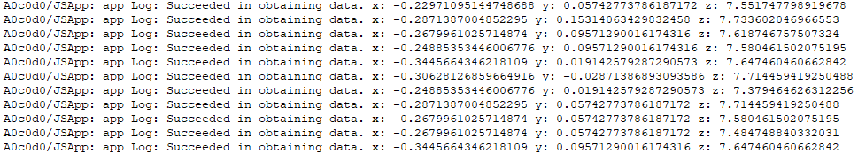

# Sensor Development (ArkTS)


## When to Use

With the sensor module, a device can obtain sensor data. For example, the device can subscribe to data of the orientation sensor to detect its own orientation, and data of the pedometer sensor to learn the number of steps the user walks every day.

For details about the APIs, see [Sensor](../../reference/apis-sensor-service-kit/js-apis-sensor.md).


## Available APIs

| Name| Description                             |
| -------- |---------------------------------|
| sensor.on(sensorId, callback:AsyncCallback&lt;Response&gt;, options?: Options): void | Enables listening for data changes of the specified type of sensor.                   |
| sensor.on(type: 'sensorStatusChange', callback: Callback&lt;SensorStatusEvent&gt;): void | Enables listening for sensor status changes.|
| sensor.once(sensorId, callback:AsyncCallback&lt;Response&gt;): void | Enables one-time listening for sensor data changes.                   |
| sensor.off(sensorId, callback?:AsyncCallback&lt;void&gt;): void | Disables listening for data changes of the specified type of sensor.                    |
| sensor.off(sensorId, sensorInfoParam?: SensorInfoParam, callback?:AsyncCallback&lt;void&gt;): void | Disables listening for data changes of the specified type of sensor based on the given sensor parameters.            |
| sensor.off(type: 'sensorStatusChange', callback?: Callback&lt;SensorStatusEvent&gt;): void | Disables listening for sensor status changes.             |
| sensor.getSensorList(callback: AsyncCallback\<Array\<Sensor>>): void| Obtains information about all sensors on the device.                 |


## How to Develop

The acceleration sensor is used as an example.

1. Import the module.

   ```ts
   import { sensor } from '@kit.SensorServiceKit';
   import { BusinessError } from '@kit.BasicServicesKit';
   ```

2. Obtain information about all sensors on the device.

    ```ts    
    sensor.getSensorList((error: BusinessError, data: Array<sensor.Sensor>) => {
        if (error) {
            console.error('getSensorList failed');
        } else {
            console.info('getSensorList success');
            for (let i = 0; i < data.length; i++) {
                console.info(JSON.stringify(data[i]));
            }
        }
    });
    ```

    

    The minimum and the maximum sampling periods supported by the sensor are 5000000 ns and 200000000 ns, respectively. The sampling interval may vary depending on the sensor type. The specified sampling interval must be within this range. If the configured value is smaller than the minimum sampling interval of the sensor, the minimum sampling interval is used. If the configured value is larger than the maximum sampling interval of the sensor, the maximum sampling interval is used. A smaller value means a higher reporting frequency and a higher power consumption.

    You can query sensors based on the given device ID.
    ```ts
    try {
      const deviceId = 1;
      // The deviceId parameter is optional. By default, it is set to the ID of the local device.
      const sensorList: sensor.Sensor[] = sensor.getSensorListByDeviceSync(deviceId);
      console.log(`sensorList length: ${sensorList.length}`);
      console.log(`sensorList: ${JSON.stringify(sensorList)}`);
    } catch (error) {
      let e: BusinessError = error as BusinessError;
      console.error(`Failed to get sensorList. Code: ${e.code}, message: ${e.message}`);
    }
    ```

3. Check whether the corresponding permission has been configured. For details, see [Declaring Permissions](../../security/AccessToken/declare-permissions.md).

4. Enable listening for sensor status changes. You can call **on()** or **once()** to listen for sensor data changes.

   The **on()** API is used to continuously listen for data changes of the sensor. The sensor reporting interval is set to 100000000 ns.

   ```ts
   import { sensor } from '@kit.SensorServiceKit';
   import { BusinessError } from '@kit.BasicServicesKit';

   try { 
     sensor.on(sensor.SensorId.ACCELEROMETER, (data: sensor.AccelerometerResponse) => {
          console.info("Succeeded in obtaining data. x: " + data.x + " y: " + data.y + " z: " + data.z);
     }, { interval: 100000000 });
   } catch (error) {
      let e: BusinessError = error as BusinessError;
      console.error(`Failed to get sensorList. Code: ${e.code}, message: ${e.message}`);
   }
   ```

   You can also specify SensorInfoParam, which is used to pass deviceId and sensorIndex.
   ```ts 
   import { sensor } from '@kit.SensorServiceKit';
   import { BusinessError } from '@kit.BasicServicesKit';
    
   try {
     sensor.on(sensor.SensorId.ACCELEROMETER, (data: sensor.AccelerometerResponse) => {
          console.info("Succeeded in obtaining data. x: " + data.x + " y: " + data.y + " z: " + data.z);
     }, { interval: 100000000, sensorInfoParam: { deviceId: 1, sensorIndex: 3 } });
   } catch (error) {
      let e: BusinessError = error as BusinessError;
      console.error(`Failed to get sensorList. Code: ${e.code}, message: ${e.message}`);
   }
   ```

    

   The **once()** API is used to perform one-time listening for sensor data changes.

   ```ts
   sensor.once(sensor.SensorId.ACCELEROMETER, (data: sensor.AccelerometerResponse) => {
       console.info("Succeeded in obtaining data. x: " + data.x + " y: " + data.y + " z: " + data.z);
   });
   ```

   

5. Disable listening for sensor status changes.

    Note that disabling listening without a prior subscription is an abnormal behavior and requires exception handling.
    ```ts
    sensor.off(sensor.SensorId.ACCELEROMETER);
    ```

    Disables listening for sensor status changes based on the given sensor parameters.
    ```ts
    sensor.off(sensor.SensorId.ACCELEROMETER, { deviceId: 1, sensorIndex: 3 });
    ```

6. Enable listening for sensor status changes. When receiving a device offline event, you need to call **off** to close the sensor on the device.

    In **SensorStatusEvent**, the following information is included: event timestamp, sensor ID, sensor index, online/offline status, device ID, and device name.
    ```ts
    sensor.on('sensorStatusChange', (data: sensor.SensorStatusEvent) => {
          console.log(`timestamp: ${data.timestamp},
            deviceId: ${data.deviceId} deviceName: ${data.deviceName}
            sensorId: ${data.sensorId} sensorIndex:${data.sensorIndex} isSensorOnline: ${data.isSensorOnline}`)
    });
    ```

    Disable listening for sensor status changes.
    ```ts
    // Before performing this operation, ensure that listening for sensor status changes has been enabled.
    sensor.off('sensorStatusChange');
    ```
