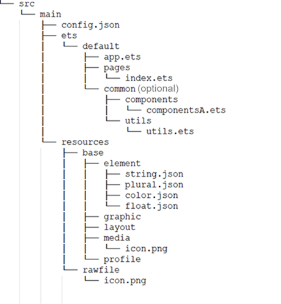

# Directory Structure

The following figure shows the typical directory structure of the eTS module (entry/src/main) for an application with feature abilities (FAs).

Functions of the files are as follows:

- The Extended TypeScript (eTS) files that end with the .ets extension describe the UI layouts, styles, event interactions, and page logics.

Functions of the folders and files are as follows:

- The app.ets file manages global application logics and lifecycles.

- The pages directory stores all component pages.

- The common directory stores common code files, such as custom components and public methods.

>  **NOTE**:
>
> TypeScript and JavaScript files can be imported as page files.
