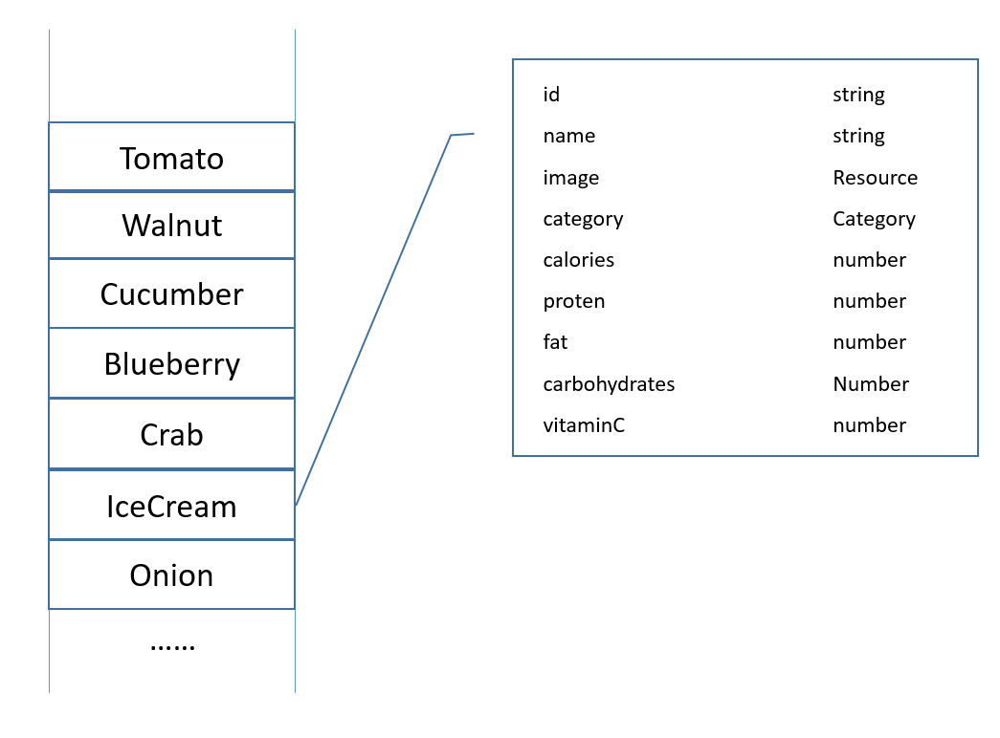

# Building a Food Data Model


On the created page, we use various items to describe food, such as food names, calories, proteins, fats, carbohydrates, and vitamin C. This form of coding is impractical in actual development. Therefore, you need to create food data models to store and manage data in a unified manner.





1. Create a folder named model and create a file named FoodData.ets therein.
   

2. Define a food data storage model, FoodData, and an enum variable, Category. The FoodData class contains the food ID, name, category, image, calories, protein, fat, carbohydrates, and vitamin C attributes.
   The eTS programming language is an extension of the TS language and also supports the TS syntax.

     
   ```
   enum Category  {
     Fruit,
     Vegetable,
     Nut,
     Seafood,
     Dessert
   }
   
   let NextId = 0;
   class FoodData {
     id: string;
     name: string;
     image: Resource;
     category: Category;
     calories: number;
     protein: number;
     fat: number;
     carbohydrates: number;
     vitaminC: number;
   
     constructor(name: string, image: Resource, category: Category, calories: number, protein: number, fat: number, carbohydrates: number, vitaminC: number) {
       this.id = `${ NextId++ }`;
       this.name = name;
       this.image = image;
       this.category = category;
       this.calories = calories;
       this.protein = protein;
       this.fat = fat;
       this.carbohydrates = carbohydrates;
       this.vitaminC = vitaminC;
     }
   }
   ```

3. Store food image resources in the resources > phone > media directory. Use food names as the image names.
   

4. Create food resource data. Create FoodDataModels.ets in the model folder and declare a food composition array, FoodComposition on the page.
   In this example, 12 pieces of food data are used. You can customize more data resources when needed. Use LazyForEach to load data if a large amount of food data is involved. The following nutritional data is sourced from the Internet.

     
   ```
   const FoodComposition: any[] = [
     { 'name': 'Tomato', 'image': $r('app.media.Tomato'), 'category': Category.Vegetable, 'calories': 17, 'protein': 0.9, 'fat': 0.2, 'carbohydrates': 3.9, 'vitaminC': 17.8 },
     { 'name': 'Walnut', 'image': $r('app.media.Walnut'), 'category': Category.Nut, 'calories': 654 , 'protein': 15, 'fat': 65, 'carbohydrates': 14, 'vitaminC': 1.3 },
     { 'name': 'Cucumber', 'image': $r('app.media.Cucumber'), 'category': Category.Vegetable, 'calories': 30, 'protein': 3, 'fat': 0, 'carbohydrates': 1.9, 'vitaminC': 2.1 },
     { 'name': 'Blueberry', 'image': $r('app.media.Blueberry'), 'category': Category.Fruit, 'calories': 57, 'protein': 0.7, 'fat': 0.3, 'carbohydrates': 14, 'vitaminC': 9.7 },
     { 'name': 'Crab', 'image': $r('app.media.Crab'), 'category': Category.Seafood, 'calories': 97, 'protein': 19, 'fat': 1.5, 'carbohydrates': 0, 'vitaminC': 7.6 },
     { 'name': 'IceCream', 'image': $r('app.media.IceCream'), 'category': Category.Dessert, 'calories': 207, 'protein': 3.5, 'fat': 11, 'carbohydrates': 24, 'vitaminC': 0.6 },
     { 'name': 'Onion', 'image': $r('app.media.Onion'), 'category': Category.Vegetable, 'calories': 39, 'protein': 1.1, 'fat': 0.1, 'carbohydrates': 9, 'vitaminC': 7.4 },
     { 'name': 'Mushroom', 'image': $r('app.media.Mushroom'), 'category': Category.Vegetable, 'calories': 22, 'protein': 3.1, 'fat': 0.3, 'carbohydrates': 3.3, 'vitaminC': 2.1 },
     { 'name': 'Kiwi', 'image': $r('app.media.Kiwi'), 'category': Category.Fruit, 'calories': 60 , 'protein': 1.1, 'fat': 0.5, 'carbohydrates': 15, 'vitaminC': 20.5 },
     { 'name': 'Pitaya', 'image': $r('app.media.Pitaya'), 'category': Category.Fruit, 'calories': 60, 'protein': 1.2, 'fat': 0, 'carbohydrates': 10, 'vitaminC': 60.9 },
     { 'name': 'Avocado', 'image': $r('app.media.Avocado'), 'category': Category.Fruit, 'calories': 160, 'protein': 2, 'fat': 15, 'carbohydrates': 9, 'vitaminC': 10 },
     { 'name': 'Strawberry', 'image': $r('app.media.Strawberry'), 'category': Category.Fruit, 'calories': 32, 'protein': 0.7, 'fat': 0.3, 'carbohydrates': 8, 'vitaminC': 58.8 }
   ]
   ```

5. Create the initializeOnStartUp method to initialize the FoodData array. Export the FoodData class from FoodData.ets, and import FoodData and Category in FoodDataModels.ets.
     
   ```
   // FoodData.ets
   export enum Category {
    ......
   }
   export class FoodData {
     ......
   }
   // FoodDataModels.ets
   import { Category, FoodData } from './FoodData'
   
   export function initializeOnStartup(): Array<FoodData> {
     let FoodDataArray: Array<FoodData> = []
     FoodComposition.forEach(item => {
       FoodDataArray.push(new FoodData(item.name, item.image, item.category, item.calories, item.protein, item.fat, item.carbohydrates, item.vitaminC ));
     })
     return FoodDataArray;
   }
   ```


The data resources for the diet application are now ready. You can continue to create a food category list by loading the data.
