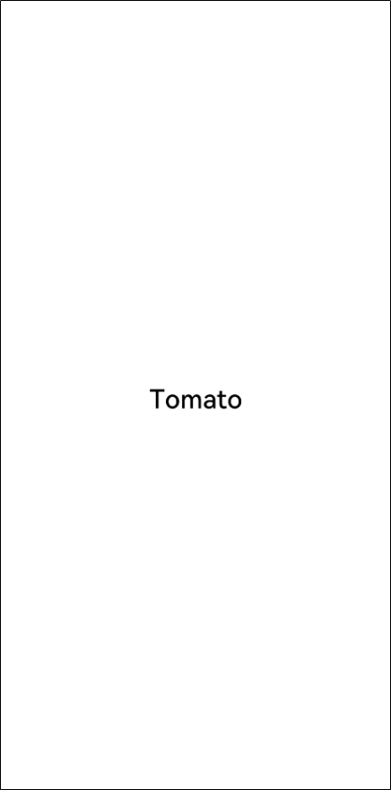

# Getting to Know Components


Before customizing a component, get to know what the [component and decorator](#components-and-decorators) are and initialize the component. Then, [modify the component attributes and constructor parameters](#modifying-component-attributes-and-constructor-parameters) to customize a component.


## Components and Decorators

In a declarative UI, all pages are composed of components. The data structure of the component is struct, and the decorator [@Component](ts-component-based-component.md) is the component-based flag. The struct decorated by @Component indicates that the struct has the component capability.

The method for declaring a custom component is as follows:


```
@Component
struct MyComponent {}
```

In an IDE project template, MyComponent is a custom component that can display text in the center. You can describe your UI structures in the build method of the component, by complying with the API constraints of the Builder.


```
interface Builder {
    build: () => void
}
```

The component decorated by [@Entry](ts-component-based-entry.md) indicates that the component is the main entry of the page and can also be considered as the root node of the page. **NOTE** that a page must have one and only one @Entry. Only the @Entry decorated component and its child components are displayed on the page.

@Component and @Entry are basic and important decorators. To put it simply, a decorator assigns a capability to an object to be decorated. For example, @Entry assigns the capability of the page entry, and @Component assigns the component capability.

With a basic knowledge of the component and decorator, you are ready to develop a diet application.


## Modifying Component Attributes and Constructor Parameters

When you create a system component, the default style is used. You can change the display of the component by changing its attributes and styles.

1. Modify the fontSize attribute of the <Text> component to change the font size of the component. In this example, the font size is set to 26 and font weight 500. Two configuration methods are available for setting the font weight:
   1. The value of the number type ranges from 100 to 900. The default value is 400. A larger value indicates a thicker font.
   2. fontWeight is a built-in enumeration type. Its value can be Lighter, Normal, Bold, or Bolder.

   The attribute method must follow the component and be connected by the operator ".". You can also configure multiple attributes of the component in method chaining mode.

   
   ```
   @Entry
   @Component
   struct MyComponent {
       build() {
           Flex({ direction: FlexDirection.Column, alignItems: ItemAlign.Center, justifyContent: FlexAlign.Center }) {
               Text('Hello World')
                   .fontSize(26)
                   .fontWeight(500)
           }
           .width('100%')
           .height('100%')
       }
   }
   ```

   

2. Change the display content of the <Text> component from Hello World to Tomato by modifying the constructor parameters of the <Text> component.
  
   ```
   @Entry
   @Component
   struct MyComponent {
       build() {
           Flex({ direction: FlexDirection.Column, alignItems: ItemAlign.Center, justifyContent: FlexAlign.Center }) {
               Text('Tomato')
                   .fontSize(26)
                   .fontWeight(500)
           }
           .width('100%')
           .height('100%')
       }
   }
   ```

   
