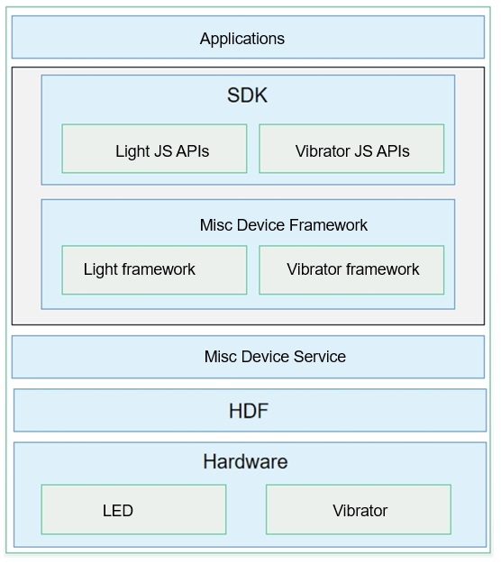

# Vibrator Overview

The vibrator service opens up the latest capabilities of the vibrator hardware to the maximum extent. By expanding the native vibrator service to implement integrated vibration and interaction design, the service delivers an exquisite integrated vibration experience and differentiated experience, and improves user interaction efficiency and usability.

## Working Principles

The vibrator is a Misc device that consists of four modules: Vibrator API, Vibrator Framework, Vibrator Service, and HDF layer.

  **Figure 1** Vibrator in Misc devices

- Vibrator API: provides basic vibrator APIs, including the APIs for querying the vibrator list, querying the vibrator by effect, and triggering and stopping vibration.

- Vibrator Framework: manages the framework layer of the vibrator and communicates with the Misc Device Service.

- Vibrator Service: manages services of vibrators.

- HDF layer: adapts to different devices.

## Constraints

When using a vibrator, you must declare the **ohos.permission.VIBRATE** permission before you can control the vibration effect. The sensitivity level of this permission is **system_grant**.
