# Analyzing Application Freeze

Application freeze (AppFreeze) means that an application does not respond to user operations (for example, clicking) for a specified period of time. In this case, the system detects AppFreeze faults and generates AppFreeze logs for fault analysis.

> **NOTE**
>
> This guide applies only to applications in the stage model. Before using this guide, you must have basic knowledge about the JS applications, C++ program stacks, and application-related subsystems.

## AppFreeze Detection

Currently, AppFreeze detection supports the fault types listed in the following table.

| Fault| Description|
| -------- | -------- |
| THREAD_BLOCK_6S | The application main thread times out.|
| APP_INPUT_BLOCK | The user input response times out.|
| LIFECYCLE_TIMEOUT | Ability lifecycle switching times out.|

### THREAD_BLOCK_6S Application Main Thread Timeout

This fault indicates that the main thread of this application is suspended or too many tasks are executed, affecting task execution smoothness and experience.

Detection principle: The watchdog thread of the application periodically inserts an activation detection to the main thread. If the activity detection is not executed within 3s, the **THREAD_BLOCK_3S** warning event is reported. If the activity detection is not executed within 6s, the **THREAD_BLOCK_6S** main thread timeout event is reported. The two events constitute an AppFreeze log.

The following figure shows the detection principle.

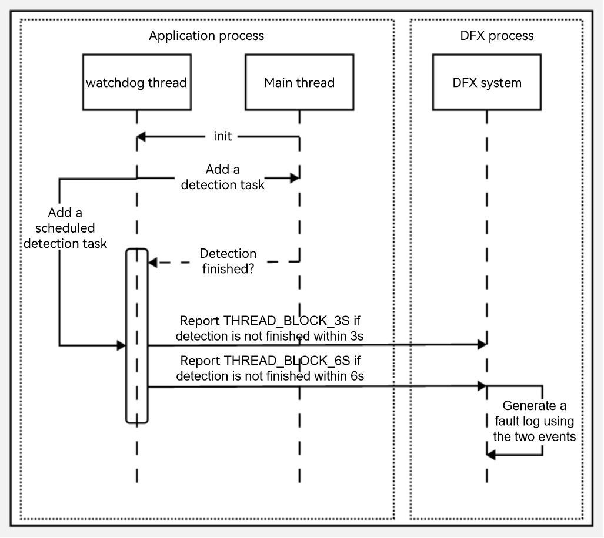

### APP_INPUT_BLOCK User Input Response Timeout

This fault occurs when the tap event is not responded within 5 seconds.

Detection principle: When a user taps an application, the input system sends a tap event to the application. If the application response times out, this fault is reported.

The following figure shows the detection principle.

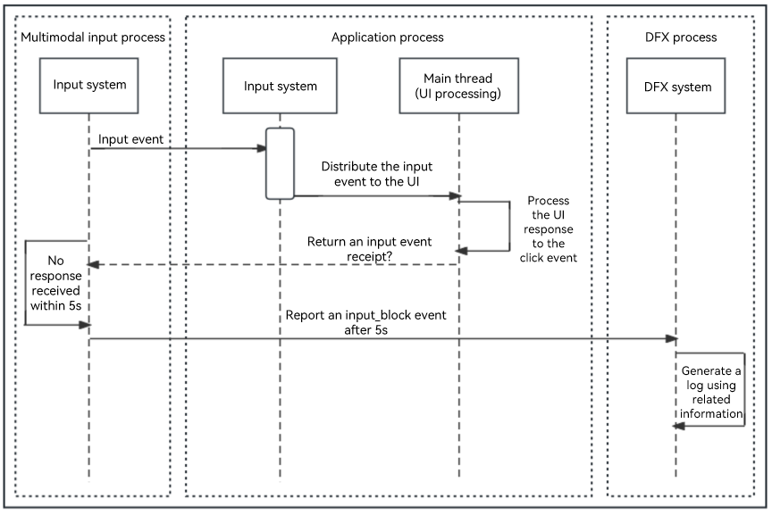

### Lifecycle Switching Timeout

Lifecycle switching timeout refers to an [UIAbility Lifecycle](../application-models/uiability-lifecycle.md#uiability-lifecycle) switching timeout or a [PageAbility Lifecycle](../application-models/pageability-lifecycle.md#pageability-lifecycle) switching timeout.

This fault occurs during lifecycle switching and affects Ability switching and PageAbility switching of the application.

Detection principle: Upon the start of a lifecycle switching process, the main thread inserts a timeout task to the watchdog thread, and then removes the timeout task when the lifecycle switching is complete. If the timeout task is not removed within a specific time frame, a fault is reported.

The lifecycle switching timeout event consist of the **LIFECYCLE_HALF_TIMEOUT** and **LIFECYCLE_TIMEOUT** events. **LIFECYCLE_HALF_TIMEOUT** is used as the warning event of **LIFECYCLE_TIMEOUT** to capture the binder information.

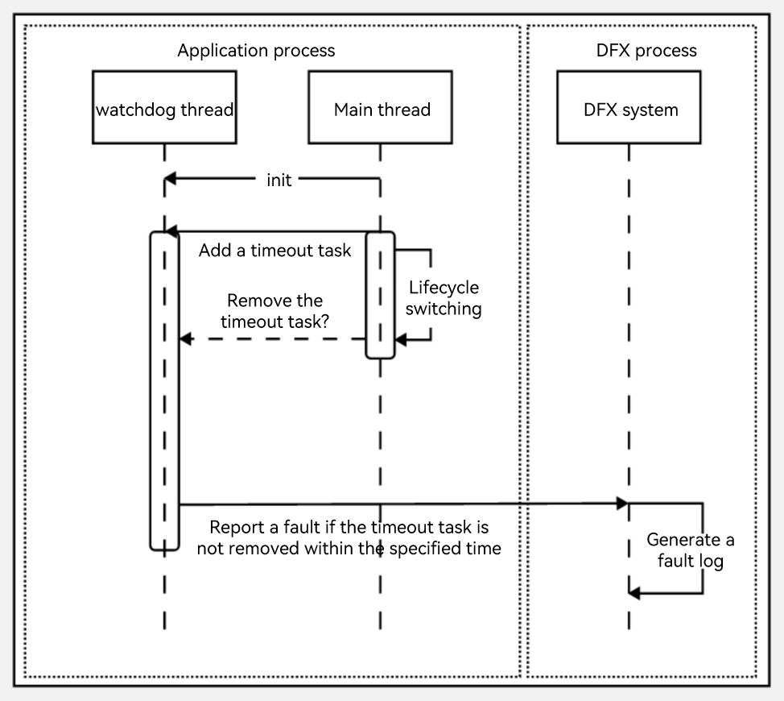

Timeout durations vary with lifecycles. For details, see the following table.

| Lifecycle| Timeout Duration|
| -------- | -------- |
| Load | 10s |
| Terminate | 10s |
| Connect | 3s |
| Disconnect | 0.5s |
| Foreground | 5s |
| Background | 3s |

## AppFreeze Log Analysis

To identify the cause of an AppFreeze event, analyze the AppFreeze logs together with HiLog logs.

The following example is for reference only. You should analyze the problem based on the actual situation.

AppFreeze logs consist of header information, and general and specific information in the body.

### Header Information

| Field| Description|
| -------- | -------- |
| Reason | Reason why the application does not respond. For details, see [AppFreeze Detection](#appfreeze-detection).|
| PID | PID of the faulty process.|
| PACKAGE_NAME | Application process package name.|

```
Generated by HiviewDFX@OpenHarmony
================================================================
Device info:OpenHarmony 3.2
Build info:OpenHarmony 5.1.0.59
Fingerprint:9f232fb5053c092144eedaa39ceecd67a6997db69467973b4d5fe786f184374d
Module name:com.example.freeze
Version:1.0.0
VersionCode:1000000
PreInstalled:No
Foreground:Yes
Pid:2212
Uid:20010044
Reason:THREAD_BLOCK_6S
appfreeze: com.example.freeze THREAD_BLOCK_6S at 20170817192244
DisplayPowerInfo:powerState:UNKNOWN
>>>>>>>>>>>>>>>>>>>>>>>>>>>>>>>>>>>>>>>>>>>
DOMAIN:AAFWK
STRINGID:THREAD_BLOCK_6S
TIMESTAMP:2017/08/17-19:22:44:952
PID:2212
UID:20010044
PACKAGE_NAME:com.example.freeze
PROCESS_NAME:com.example.freeze
*******************************************
```

### General Information in the Log Body

All the three types of AppFreeze events include the following information. You can search for the field to locate it in the logs.  

| Field| Description|
| -------- | -------- |
| EVENTNAME | Name of the fault event.|
| TIMESTAMP | Time when a fault event is reported. You can narrow down the time range to view HiLog logs based on the timeout duration described in [AppFreeze Detection](#appfreeze-detection).|
| PID | PID of the faulty process.|
| PACKAGE_NAME | Application process package name.|
| MSG | Dump information or description of the fault.|
| BinderCatcher | Information about IPC calls between processes, such as the call waiting time.|
| PeerBinder Stacktrace | Stack trace information of the peer process of the faulty process.|
| cpuusage | CPU usage of the device when the fault occurs.|
| memory | Memory usage of the device when the fault occurs.|

> **NOTE**
>
> When the device is heavily loaded and the call stack is obtained in low-overhead mode, the function name and **build-id** information may be lost. If the user stack fails to be obtained, the **build-id** is empty.

The **MSG** field includes the cause of the AppFreeze event and task information in the main thread queue of the application.

The task information in the main thread queue includes:

- The running task and its start time. If the task start time is much earlier than the event report time, the running task may causes the freeze event.

- Historical task time. If a new task cannot respond in time, you can check whether there are too many historical tasks and whether the execution of each task takes a long time based on historical task time.

- Tasks that are not executed in the stack.

Example of the process stack:

Search for the application stack information based on PID. In the following stack, the window stays in the IPC communication phase when it sends events to the system through IPC.

```
OpenStacktraceCatcher -pid==1561 packageName is com.example.myapplication
Result: 0 ( no error )
Timestamp:2017-08-0817:06:53.000
Pid:1561
Uid:20010039
Process name:com.example.myapplication
Tid:1561,Name:i.myapplication
#00 pc 0017888c /system/lib/libark_jsruntime.so
#01 pc 00025779 /system/lib/platformsdk/libipc_core.z.so(OHOS:BinderConnector:WriteBinder(unsigned Long,void*)+56)
#02 pc 000265a5 /system/lib/platformsdk/libipc_core.z.so(OHOS:BinderInvoker:TransactWithDriver(bool)+216)
#03 pc 0002666f /system/lib/platformsdk/libipc_core.z.so(OHOS:BinderInvoker:StartWorkLoop()+18)
#04 pc 000270a9 /system/lib/platformsdk/libipc_core.z.so(OHOS:BinderInvoker:JoinThread(bool)+32)
#05 pc 00023783 /system/lib/platformsdk/libipc_core.z.so(OHOS:IPCWorkThread:ThreadHandler(void*)+290)
#06 pc 00e1c6f7 /system/lib/libace.z.so
#07 pc 0091bbdd /system/lib/libace.z.so
#08 pc 0092fd9d /system/lib/libace.z.so
#09 pc 0092fa5f /system/lib/libace.z.so
#10 pc 0092cd6b /system/lib/libace.z.so
#11 pc 009326a9 /system/lib/libace.z.so
#12 pc 0093054b /system/lib/libace.z.so
#13 pc 009324f3 /system/lib/libace.z.so
#14 pc 003989e1 /system/lib/libace.z.so
#15 pc 0045dd4b /system/lib/libace.z.so
#16 pc 00d24fef /system/lib/libace.z.so
#17 pc 0041e6e9 /system/lib/libace.z.so
#18 pc 0000b4d9 /system/lib/platformsdk/libeventhandler.z.so(OHOS:AppExecFwk:EventHandler:DistributeEvent(std::__h:unique_ptr<0 #19 pc 00012829 /system/lib/platformsdk/libeventhandler.z.so))
#20 pc 00011841 /system/lib/platformsdk/libeventhandler.z.so(OHOS:AppExecFwk:EventRunner:Run()+64)
#21 pc 00054a8b /system/lib/libappkit_native.z.so(OHOS:AppExecFwk:MainThread:Start()+278)
#22 pc 00011503 /system/bin/appspawn
#23 pc 0001141f /system/bin/appspawn
#24 pc 0000ee97 /system/bin/appspawn
```

Example of BinderCatcher information:

Search for which process the current process is communicating with and the waiting duration for synchronous communication based on PID.

In the following example, process **1561** sends an IPC request to process **685** but does not receive any response within 10 seconds.

```
PeerBinderCatcher -pid==1561 Layer_==0


BinderCatcher --
    1561:1561 to 685:0 code 0 Wait:10.366245919 s,  ns:-1:-1 to -1:-1, debug:1561:1561 to 685:0, active_code:0 active_thread:0, pending_async_proc=0
    1329:1376 to 487:794 code 0 Wait:0.12070041 s,  ns:-1:-1 to -1:-1, debug:1329:1376 to 487:794, active_code:0 active_thread:0, pending_async_proc=0

pid   context  request  started  max  ready free_async_space
1561   binder    0       3       16     4       520192
544    binder    0       4       16     5       520192
1104   binder    0       1       16     2       520192
1397   binder    0       1       16     3       520192
...
```

**Example of PeerBinder Stacktrace information**:

The following example shows the stack information of the suspended peer process **685**.

```
Binder catcher stacktrace, type is peer, pid : 685
Result: 0 ( no error )
Timestamp:2017-08-0817:06:55.000
Pid:685
Uid:1000
Process name:wifi_manager_service
Tid:658,Name:wifi_manager_service
#00 pc 000669f0 /system/lib/ld-musl-arm.so.1
#01 pc 000c60cc /system/lib/ld-musl-arm.so.1
#02 pc 000c5040 /system/lib/ld-musl-arm.so.1
#03 pc 000c6818 /system/lib/ld-musl-arm.so.1(__pthread_cond_timedwait_time64+596)
#04 pc 000bd058 /system/lib/libc++.so
#05 pc 0008592c /system/lib/ld-musl-arm.so.1(ioctl+72)
#06 pc 00025779 /system/lib/platformsdk/libipc_core.z.so(OHOS:BinderConnector:WriteBinder(unsigned long,void*)+56)
#07 pc 000265a5 /system/lib/platformsdk/libipc_core.z.so(OHOS:BinderInvoker:TransactWithDriver(bool)+216)
#08 pc 0002666f /system/lib/platformsdk/libipc_core.z.so(OHOS:BinderInvoker:StartWorkLoop()+18)
#09 pc 000270a9 /system/lib/platformsdk/libipc_core.z.so(OHOS:BinderInvoker:JoinThread(bool)+32)
#10 pc 00023783 /system/lib/platformsdk/libipc_core.z.so(OHOS:IPCWorkThread:ThreadHandler(void*)+290)
#11 pc 0007b4d9 /system/lib/platformsdk/libeventhandler.z.so
#12 pc 00072829 /system/lib/platformsdk/libeventhandler.z.so
#13 pc 00071841 /system/lib/platformsdk/libeventhandler.z.so(OHOS:AppExecFwk:EventRunner:Run()+64)
#14 pc 00094a8b /system/lib/libappkit_native.z.so(OHOS:AppExecFwk:MainThread:Start()+278)

Tid:1563,Name:IPC_0_1563
#00 pc 0009392c /system/lib/ld-musl-arm.so.1(ioctl+72)
#01 pc 00025779 /system/lib/platformsdk/libipc_core.z.so(OHOS:BinderConnector:WriteBinder(unsigned long,void*)+56)
```

**Example of CPU usage information**:

The following example shows the CPU usage information of the device.

```
Load average: 2.87 / 1.45 / 0.58; the cpu load average in 1 min,5 min and 15 min
CPU usage from 2023-03-10 17:06:53 to 2023-03-10 17:06:53
Total: 29%; User Space: 28%; Kernel Space: 1%; iowait: 6%; irq: 0%; idle: 62%
Details of Processes:
    PID     Total Usage     User Space     Kernel Space     Page Fault Minor     Page Fault Major      Name
    1561       23%            23%              0%               9985                  26            i.myapplication
    527        1%             1%               0%               3046                  9             hidumper_servic
    242        1%             1%               0%               69799                 280           hiview
```

**Example of memory usage information**:

The following example shows the memory usage information of the process.

```
-------------------------------------------[memory]----------------------------------------
                 Pss      Shared   Shared   Private  Private   Swap   SwapPss   Heap  Heap
                 Total    CLean    Dirty    CLean    Dirty     Total  Total     Size  Alloc
                 (kB)     (kB)     (kB)     (kB)      (kB)     (kB)    (kB)     (kB)  (kB)
-------------------------------------------------------------------------------------------
guard             0        0         0       0         0         0      0        0      0
native heap      185       0        180      0        160        0      0        0      0
AnonPage other   17881    12        12376    88       15948      0      0        0      0
stack            292       0        0        0        292        0      0        0      0
.S0              5053     63408     4172     1812     2640       0      0        0      0
.ttf             1133     3092      0        4        0          0      0        0      0
dev              10       0         108      8        0          0      0        0      0
FilePage other   121      556       8        0        4          0      0        0      0
------------------------------------------------------------------------------------------
Total            34675    67068     16844    1912     19044      0      0        0      0
```

### Specific Information in the Log Body (Application Main Thread Timeout)

The value of **Reason** is **THREAD_BLOCK_6S**. According to [THREAD_BLOCK_6S Application Main Thread Timeout](#thread_block_6s-application-main-thread-timeout), **THREAD_BLOCK** consists of **THREAD_BLOCK_3S** and **THREAD_BLOCK_6S**. By comparing the two parts, you can determine whether the AppFreeze event is caused by a suspension or excessive tasks.

The first part of the log displays the **THREAD_BLOCK_3S** event, and the second part displays the **THREAD_BLOCK_6S** event. You can search for the **EVENTNAME** field to locate the two events.

Both events contain the **MSG** field, which records the information about the main thread processing queue when the main thread of the application is suspended and times out. By comparing the **MSG** fields, you can view the tasks in the main thread event processing queue at two time points.

The example log shows that the event in the VIP priority event queue is running at **07:22:40.931**, and it is displayed in both the **THREAD_BLOCK_3S** and **THREAD_BLOCK_6S** logs. This indicates that the main thread suspension is not caused by excessive tasks.

Since **THREAD_BLOCK_6S** indicates that the main thread is suspended, you only need to pay attention to the stack of the main thread (the thread ID of the main thread is the same as the process ID). The following example log shows that the main thread stack runs from the ArkUI component to the JS, indicating that the stack is suspended in the JS code. The stack positions of the 3S and 6S events are the same, indicating that the JS code is suspended, but not due to excessive tasks.

**THREAD_BLOCK_3S**:

```
start time: 2017/08/17-19:22:42:022
DOMAIN = AAFWK
EVENTNAME = THREAD_BLOCK_3S
TIMESTAMP = 2017/08/17-19:22:42:10
PID = 2212
UID = 20010044
TID = 2212
PACKAGE_NAME = com.example.freeze
PROCESS_NAME = com.example.freeze
eventLog_action = ffrt,t,GpuStack,cmd:m,hot
eventLog_interval = 10
MSG = 
Fault time:2017/08/17-19:22:40
App main thread is not response!

Main handler dump start time: 2017-08-17 19:22:40.932
mainHandler dump is:
 EventHandler dump begin curTime: 2017-08-17 07:22:40.932
 Event runner (Thread name = , Thread ID = 2212) is running
 Current Running: start at 2017-08-17 07:22:34.930, Event { send thread = 2212, send time = 2017-08-17 07:22:29.932, handle time = 2017-08-17 07:22:34.929, trigger time = 2017-08-17 07:22:34.930, task name = uv_timer_task, caller = [ohos_loop_handler.cpp(OnTriggered:72)] }
 History event queue information:
 No. 0 : Event { send thread = 2212, send time = 2017-08-17 07:22:29.864, handle time = 2017-08-17 07:22:29.864, trigger time = 2017-08-17 07:22:29.864, completeTime time = 2017-08-17 07:22:29.865, priority = VIP, task name = MMITask }
 No. 1 : Event { send thread = 2212, send time = 2017-08-17 07:22:29.814, handle time = 2017-08-17 07:22:29.865, trigger time = 2017-08-17 07:22:29.865, completeTime time = 2017-08-17 07:22:29.865, priority = Low, task name = ArkUIIdleTask }
 No. 2 : Event { send thread = 2212, send time = 2017-08-17 07:22:29.869, handle time = 2017-08-17 07:22:29.869, trigger time = 2017-08-17 07:22:29.869, completeTime time = 2017-08-17 07:22:29.870, priority = VIP, task name = MMITask }
 ......
 VIP priority event queue information:
 No.1 : Event { send thread = 2486, send time = 2017-08-17 07:22:37.931, handle time = 2017-08-17 07:22:37.931, id = 1, caller = [watchdog.cpp(Timer:208)] }
 No.2 : Event { send thread = 2486, send time = 2017-08-17 07:22:40.931, handle time = 2017-08-17 07:22:40.931, id = 1, caller = [watchdog.cpp(Timer:208)] }
 Total size of VIP events : 2
 Immediate priority event queue information:
 Total size of Immediate events : 0
 High priority event queue information:
 Total size of High events : 0
 Low priority event queue information:
 Total size of Low events : 0
 Idle priority event queue information:
 Total size of Idle events : 0
 Total event size : 2
Main handler dump end time: 2017-08-17 19:22:40.934

Catche stack trace start time: 2017-08-17 19:22:41.098

Tid:2212, Name:.example.freeze
#00 pc 001d0d1e /system/lib/platformsdk/libark_jsruntime.so(panda::BytecodeInst<(panda::BytecodeInstMode)0>::Size(panda::BytecodeInst<(panda::BytecodeInstMode)0>::Format)+6)(ec51476a00bfde9c6d68b983a483d1ee)
#01 pc 0024b011 /system/lib/platformsdk/libark_jsruntime.so(panda::ecmascript::EcmaInterpreter::RunInternal(panda::ecmascript::JSThread*, unsigned char const*, unsigned long long*)+1824)(ec51476a00bfde9c6d68b983a483d1ee)
#02 pc 0024a75d /system/lib/platformsdk/libark_jsruntime.so(panda::ecmascript::EcmaInterpreter::Execute(panda::ecmascript::EcmaRuntimeCallInfo*)+1084)(ec51476a00bfde9c6d68b983a483d1ee)
#03 pc 002e78e5 /system/lib/platformsdk/libark_jsruntime.so(panda::ecmascript::JSFunction::Call(panda::ecmascript::EcmaRuntimeCallInfo*)+392)(ec51476a00bfde9c6d68b983a483d1ee)
#04 pc 00427fbb /system/lib/platformsdk/libark_jsruntime.so(panda::FunctionRef::CallForNapi(panda::ecmascript::EcmaVM const*, panda::JSValueRef*, panda::JSValueRef* const*, int)+1382)(ec51476a00bfde9c6d68b983a483d1ee)
#05 pc 000502a1 /system/lib/platformsdk/libace_napi.z.so(napi_call_function+156)(394b2e21899459da15b9fe3f1c3188f0)
......
```

THREAD_BLOCK_6S:
```
start time: 2017/08/17-19:22:44:962
DOMAIN = AAFWK
EVENTNAME = THREAD_BLOCK_6S
TIMESTAMP = 2017/08/17-19:22:44:952
PID = 2212
UID = 20010044
TID = 2212
PACKAGE_NAME = com.example.freeze
PROCESS_NAME = com.example.freeze
eventLog_action = t,cmd:c,cmd:cci,cmd:m,cmd:dam,tr,k:SysRqFile,hot
eventLog_interval = 10
MSG = 
Fault time:2017/08/17-19:22:43
App main thread is not response!

Main handler dump start time: 2017-08-17 19:22:43.932
mainHandler dump is:
 EventHandler dump begin curTime: 2017-08-17 07:22:43.932
 Event runner (Thread name = , Thread ID = 2212) is running
 Current Running: start at 2017-08-17 07:22:34.930, Event { send thread = 2212, send time = 2017-08-17 07:22:29.933, handle time = 2017-08-17 07:22:34.930, trigger time = 2017-08-17 07:22:34.930, task name = uv_timer_task, caller = [ohos_loop_handler.cpp(OnTriggered:72)] }
 History event queue information:
 No. 0 : Event { send thread = 2212, send time = 2017-08-17 07:22:29.864, handle time = 2017-08-17 07:22:29.864, trigger time = 2017-08-17 07:22:29.864, completeTime time = 2017-08-17 07:22:29.865, priority = VIP, task name = MMITask }
 No. 1 : Event { send thread = 2212, send time = 2017-08-17 07:22:29.814, handle time = 2017-08-17 07:22:29.865, trigger time = 2017-08-17 07:22:29.865, completeTime time = 2017-08-17 07:22:29.865, priority = Low, task name = ArkUIIdleTask }
 No. 2 : Event { send thread = 2212, send time = 2017-08-17 07:22:29.869, handle time = 2017-08-17 07:22:29.869, trigger time = 2017-08-17 07:22:29.870, completeTime time = 2017-08-17 07:22:29.870, priority = VIP, task name = MMITask }
 .......
 VIP priority event queue information:
 No.1 : Event { send thread = 2486, send time = 2017-08-17 07:22:37.931, handle time = 2017-08-17 07:22:37.931, id = 1, caller = [watchdog.cpp(Timer:208)] }
 No.2 : Event { send thread = 2486, send time = 2017-08-17 07:22:40.931, handle time = 2017-08-17 07:22:40.931, id = 1, caller = [watchdog.cpp(Timer:208)] }
 No.3 : Event { send thread = 2486, send time = 2017-08-17 07:22:43.932, handle time = 2017-08-17 07:22:43.932, id = 1, caller = [watchdog.cpp(Timer:208)] }
 Total size of VIP events : 3
 Immediate priority event queue information:
 Total size of Immediate events : 0
 High priority event queue information:
 Total size of High events : 0
 Low priority event queue information:
 Total size of Low events : 0
 Idle priority event queue information:
 Total size of Idle events : 0
 Total event size : 3
Main handler dump end time: 2017-08-17 19:22:43.934

Catche stack trace start time: 2017-08-17 19:22:44.061

Tid:2212, Name:.example.freeze
#00 pc 0024afea /system/lib/platformsdk/libark_jsruntime.so(panda::ecmascript::EcmaInterpreter::RunInternal(panda::ecmascript::JSThread*, unsigned char const*, unsigned long long*)+1786)(ec51476a00bfde9c6d68b983a483d1ee)
#01 pc 0024a75d /system/lib/platformsdk/libark_jsruntime.so(panda::ecmascript::EcmaInterpreter::Execute(panda::ecmascript::EcmaRuntimeCallInfo*)+1084)(ec51476a00bfde9c6d68b983a483d1ee)
#02 pc 002e78e5 /system/lib/platformsdk/libark_jsruntime.so(panda::ecmascript::JSFunction::Call(panda::ecmascript::EcmaRuntimeCallInfo*)+392)(ec51476a00bfde9c6d68b983a483d1ee)
#03 pc 00427fbb /system/lib/platformsdk/libark_jsruntime.so(panda::FunctionRef::CallForNapi(panda::ecmascript::EcmaVM const*, panda::JSValueRef*, panda::JSValueRef* const*, int)+1382)(ec51476a00bfde9c6d68b983a483d1ee)
#04 pc 000502a1 /system/lib/platformsdk/libace_napi.z.so(napi_call_function+156)(394b2e21899459da15b9fe3f1c3188f0)
......
```

Based on the HiLog logs and [General Information in the Log Body](general-information-in-the-log-body), you can check whether the running code of the application

has the following problems: suspended peer communication, slow application response due to high CPU usage, and task execution failure due to memory leaks or insufficient memory.

### Specific Information in the Log Body (User Input Response Timeout)

The value of **Reason** is **APP_INPUT_BLOCK**, indicating that no response is received within 5 seconds after a click event.

The **MSG** field is the description of the event, indicating that the user input is not responded.

For details, see [General Information in the Log Body](#general-information-in-the-log-body). Note that the main thread may be suspended in the case of no response to the user input. You can analyze the fault based on the log stack and BinderCatcher information. If there is no log indicating that the main thread is suspended, a large number of other events may occur before the input event. These events cannot cause the main thread to be suspended, but the number of events is large, which affects the response to the input event.

### Specific Information in the Log Body (Lifecycle Switching Timeout)

The value of **Reason** is **LIFECYCLE_TIMEOUT**. **LIFECYCLE_TIMEOUT** consists of the **LIFECYCLE_HALF_TIMEOUT** and **LIFECYCLE_TIMEOUT** events.

The **MSG** field describes the lifecycle timeout type.

In the following example, **LIFECYCLE_TIMEOUT** is caused by Ability background switching timeout. You can search for information such as HiLog logs based on the timeout durations in [Lifecycle Switching Timeout](#lifecycle-switching-timeout).

**LIFECYCLE_TIMEOUT**:

```
DOMAIN:AAFWK
STRINGID:LIFECYCLE
TIMEOUT TIMESTAMP:2023/03/10-17:06:53:65
PID:1561
UID:20010039
PACKAGE_NAME:com.example.myapplication
PROCESS_NAME:com.example.myapplication
MSG:ability:EntryAbility background timeout
```

You can analyze other log information by referring to [General Information in the Log Body](#general-information-in-the-log-body). Note that the main thread is suspended during lifecycle switching in most cases. You can compare the stack and BinderCatcher information in the two event logs.

## Application Exit

If any of the following faults occurs on an application, the application will be killed to ensure that the application can be recovered:

| Fault| Description|
| -------- | -------- |
| THREAD_BLOCK_6S | The application main thread times out.|
| APP_INPUT_BLOCK | The user input response times out.|
| LIFECYCLE_TIMEOUT | Ability lifecycle switching times out.|

## Fault Analysis

To locate an AppFreeze event, you need to obtain related event logs, HiLog logs, and trace data.

### Obtaining the Log

The appfreeze log is managed together with the native process crash, JS application crash, and system process crash logs in the FaultLog module. You can obtain the log in any of the following ways.

- Method 1: DevEco Studio

    DevEco Studio collects fault logs of the device and saves them to **FaultLog**. For details, see [DevEco Studio User Guide - Fault Log](https://developer.huawei.com/consumer/en/doc/harmonyos-guides/ide-fault-log).

- Method 2: HiAppEvent APIs

    HiAppEvent provides APIs to subscribe to various fault information. For details, see [Introduction to HiAppEvent](hiappevent-intro.md).

<!--Del-->
- Method 3: Shell

    AppFreeze logs are stored in the device-specific **/data/log/faultlog/faultlogger/** directory. The file name format is **appfreeze-application bundle name-application UID-millisecond-level time.log**.

    
<!--DelEnd-->

### Confirming Basic Information

#### Obtain basic information such as the process ID of the freeze application and whether the application is in the foreground.

```
Generated by HiviewDFX@OpenHarmony
============================================================
Device info:HUAWEI Mate 60 Pro
Build info:ALN-AL00 x.x.x.xx(XXXXXXX)
Fingerprint:ef8bd28f8b57b54656d743b546efa73764c77866a65934bd96f2678f886813b7
Module name:com.xxx.xxx
Version:1.2.2.202
VersionCode:1002002202
PreInstalled:Yes
Foreground:No   --> Indicates that the application is not in the foreground.
Pid:15440
Uid:20020029
Reason:THREAD BLOCK 6S
appfreeze: com.xxx.xxx THREAD_BLOCK 6S at 20240410164052
DisplayPowerInfo:powerState: AWAKE
>>>>>>>>>>>>>>>>>>>>>>>>>>>>>>>>>>>>>>>>>>>
```

#### Obtain the fault occurrence time

Fault report time:

```
>>>>>>>>>>>>>>>>>>>>>>>>>>>>>>>>>>>>>>>>
DOMAIN:AAFWK
STRINGID: THREAD BLOCK 6S
TIMESTAMP: 2024/04/10-16:40:52:743   --> The timestamp when the fault is reported.
PID:15440
UID:20020029
PACKAGE NAME:com.xxx.xxx
PROCESS NAME:com.xxx.xxx
****************************************
```

Detection durations for different faults in different scenarios:

| THREAD_BLOCK_6S |APP_INPUT_BLOCK|LIFECYCLE_TIMEOUT|
| -------- |--------|--------|
|Foreground application: 6s<br> Background application: 3s * 5 + 6s = 21s| 5s | Load: 10s<br> Active: 5s<br> Inactive: 0.5s<br> Terminate: 10s<br> Connect: 3s<br> Disconnect: 0.5s<br> Restart: 5s<br> Foreground: 5s<br> Background: 3s|

**NOTE**

1. The detection duration of **THREAD_BLOCK_3S** is half that of **THREAD_BLOCK_6S**, while **LIFECYCLE_HALF_TIMEOUT** is half that of **LIFECYCLE_TIMEOUT**. **THREAD_BLOCK_3S** and **LIFECYCLE_HALF_TIMEOUT** are warnings and do not report logs independently. **THREAD_BLOCK_6S** and **LIFECYCLE_TIMEOUT** are errors and report logs with the corresponding warning events.

2. When a **THREAD_BLOCK_3S** event occurs in the foreground application, the **THREAD_BLOCK_6S** event will be triggered.

3. The **backgroundReportCount_** counter in the background application is set to **0** during initialization or main thread recovery. When a **THREAD_BLOCK_3S** event occurs, the counter value increases by 1. The **THREAD_BLOCK_6S** event is triggered when the counter value reaches or exceeds 5. The detection durations of the **THREAD_BLOCK_3S** and **THREAD_BLOCK_6S** events for the background applications are 18s and 21s respectively.

You can obtain the fault occurrence time by subtracting the detection duration from the fault reporting time.

### Viewing **eventHandler** Information

You can search for the keyword **mainHandler dump is** to view the **eventHandler dump** information in logs.

1. **dump begin curTime** & **Current Running**.

```
mainHandler dump is:
 EventHandler dump begin curTime: 2024-08-08 12:17:43.544      --> Time when dump begins.
 Event runner (Thread name = , Thread ID = 35854) is running    --> Information about the running thread.
 Current Running: start at 2024-08-08 12:17:16.629, Event { send thread = 35882, send time = 2024-08-08 12:17:16.628,  handle time = 2024-08-08 12:17:16.629, trigger time = 2024-08-08 12:17:16.630, task name = , caller = xx }  
 --> trigger time--> Time when the task starts to run.
```

Running duration of the current task = **dump begin curTime** – **trigger time**. In this example, the running duration of the current task is 27s.

If the task running duration is longer than the fault detection duration, the running task causes the application freeze event. In this case, you need to check the task.

If the current task running duration is short, the task is only one of the tasks running in the main thread within the detection duration and may not be the task that consumes most time. You are advised to check the task that consumes the longest time recently (in **History event queue information**). In this case, the watchdog cannot be scheduled because the thread is busy.

2. **History event queue information**.

```
 Current Running: start at 2024-08-08 12:17:16.629, Event { send thread = 35882, send time = 2024-08-08 12:17:16.628, handle time = 2024-08-08 12:17:16.629, trigger time = 2024-08-08 12:17:16.630, task name = , caller = [extension_ability_thread.cpp(ScheduleAbilityTransaction:393)]}
 History event queue information:
 No. 0 : Event { send thread = 35854, send time = 2024-08-08 12:17:15.525, handle time = 2024-08-08 12:17:15.525, trigger time = 2024-08-08 12:17:15.527, completeTime time = 2024-08-08 12:17:15.528, priority = High, id = 1 }
 No. 1 : Event { send thread = 35854, send time = 2024-08-08 12:17:15.525, handle time = 2024-08-08 12:17:15.525, trigger time = 2024-08-08 12:17:15.527, completeTime time = 2024-08-08 12:17:15.527, priority = Low, task name = MainThread:SetRunnerStarted }
 No. 2 : Event { send thread = 35856, send time = 2024-08-08 12:17:15.765, handle time = 2024-08-08 12:17:15.765, trigger time = 2024-08-08 12:17:15.766, completeTime time = 2024-08-08 12:17:15.800, priority = Low, task name = MainThread:LaunchApplication }
 No. 3 : Event { send thread = 35856, send time = 2024-08-08 12:17:15.767, handle time = 2024-08-08 12:17:15.767, trigger time = 2024-08-08 12:17:15.800, completeTime time = 2024-08-08 12:17:16.629, priority = Low, task name = MainThread:LaunchAbility }
 No. 4 : Event { send thread = 35854, send time = 2024-08-08 12:17:15.794, handle time = 2024-08-08 12:17:15.794, trigger time = 2024-08-08 12:17:16.629, completeTime time = 2024-08-08 12:17:16.629, priority = IDEL, task name = IdleTime:PostTask }
 No. 5 : Event { send thread = 35852, send time = 2024-08-08 12:17:16.629, handle time = 2024-08-08 12:17:16.629, trigger time = 2024-08-08 12:17:16.629, completeTime time = , priority = Low, task name =  }
```

You can search for time-consuming tasks in History event queue information. The task whose **completeTime time** is empty is the current task. 
Task running duration = completeTime time – trigger time. 
Filter out the tasks that take a longer time and check the running status of the tasks.

3. **VIP priority event queue information**.

```
 VIP priority event queue information:
 No.1 : Event { send thread = 2486, send time = 2017-08-17 07:22:37.931, handle time = 2017-08-17 07:22:37.931, id = 1, caller = [watchdog.cpp(Timer:208)] }
 No.2 : Event { send thread = 2486, send time = 2017-08-17 07:22:40.931, handle time = 2017-08-17 07:22:40.931, id = 1, caller = [watchdog.cpp(Timer:208)] }
 No.3 : Event { send thread = 2486, send time = 2017-08-17 07:22:43.932, handle time = 2017-08-17 07:22:43.932, id = 1, caller = [watchdog.cpp(Timer:208)] }
 ...
```

The watchdog task is in the VIP priority event queue, which is sent every 3 seconds.

You should check the movement of the watchdog task in the queue by comparing it with other priority events.

To ensure timely response to the user, all tasks in the user input event propagation are high-priority tasks. The VIP priority event queue is created by the system and records the transmission process of user input -> screen -> window -> ArkUI -> application. It is irrelevant to third-party application events and does not need to be concerned.

```
 VIP priority event queue information:
 No. 1 : Event { send thread = 35862, send time = 2024-08-08 12:17:25.526, handle time = 2024-08-08 12:17:25.526, id = 1, caller = [watchdog.cpp(Timer:156)]}
 No. 2 : Event { send thread = 35862, send time = 2024-08-08 12:17:28.526, handle time = 2024-08-08 12:17:28.526, id = 1, caller = [watchdog.cpp(Timer:156)]}
 No. 3 : Event { send thread = 35862, send time = 2024-08-08 12:17:31.526, handle time = 2024-08-08 12:17:31.526, id = 1, caller = [watchdog.cpp(Timer:156)]}
 No. 4 : Event { send thread = 35862, send time = 2024-08-08 12:17:34.530, handle time = 2024-08-08 12:17:34.530, id = 1, caller = [watchdog.cpp(Timer:156)]}
 No. 5 : Event { send thread = 35862, send time = 2024-08-08 12:17:37.526, handle time = 2024-08-08 12:17:37.526, id = 1, caller = [watchdog.cpp(Timer:156)]}
 No. 6 : Event { send thread = 35862, send time = 2024-08-08 12:17:40.526, handle time = 2024-08-08 12:17:40.526, id = 1, caller = [watchdog.cpp(Timer:156)]}
 No. 7 : Event { send thread = 35862, send time = 2024-08-08 12:17:43.544, handle time = 2024-08-08 12:17:43.544 ,id = 1, caller = [watchdog.cpp(Timer:156)]}
 Total size of High events : 7
```

warning:
```
 VIP priority event queue information:
 No. 1 : Event { send thread = 35862, send time = 2024-08-08 12:17:25.526, handle time = 2024-08-08 12:17:25.526, id = 1, caller = [watchdog.cpp(Timer:156)]}
 No. 2 : Event { send thread = 35862, send time = 2024-08-08 12:17:28.526, handle time = 2024-08-08 12:17:28.526, id = 1, caller = [watchdog.cpp(Timer:156)]}
 No. 3 : Event { send thread = 35862, send time = 2024-08-08 12:17:31.526, handle time = 2024-08-08 12:17:31.526, id = 1, caller = [watchdog.cpp(Timer:156)]}
 No. 4 : Event { send thread = 35862, send time = 2024-08-08 12:17:34.530, handle time = 2024-08-08 12:17:34.530, id = 1, caller = [watchdog.cpp(Timer:156)]}
 Total size of High events : 4
```

block:
```
 VIP priority event queue information:
 No. 1 : Event { send thread = 35862, send time = 2024-08-08 12:17:25.526, handle time = 2024-08-08 12:17:25.526, id = 1, caller = [watchdog.cpp(Timer:156)]}
 No. 2 : Event { send thread = 35862, send time = 2024-08-08 12:17:28.526, handle time = 2024-08-08 12:17:28.526, id = 1, caller = [watchdog.cpp(Timer:156)]}
 No. 3 : Event { send thread = 35862, send time = 2024-08-08 12:17:31.526, handle time = 2024-08-08 12:17:31.526, id = 1, caller = [watchdog.cpp(Timer:156)]}
 No. 4 : Event { send thread = 35862, send time = 2024-08-08 12:17:34.530, handle time = 2024-08-08 12:17:34.530, id = 1, caller = [watchdog.cpp(Timer:156)]}
 No. 5 : Event { send thread = 35862, send time = 2024-08-08 12:17:37.526, handle time = 2024-08-08 12:17:37.526, id = 1, caller = [watchdog.cpp(Timer:156)]}
  Total size of High events : 5
```

In the preceding example, the block queue is longer than the warning queue, but the first tasks are the same. The possible causes are as follows:

- The running task is suspended. As a result, other tasks are not scheduled and executed.
- Tasks in the high priority queue are stacked. As a result, the watchdog task in the low priority queue is not scheduled.

### Viewing Stack Information

Check the stack using the obtained PID and TID. The result may show as follows:

1. The suspension stack information is displayed.

```
Tid:3025, Name: xxx
# 00 pc 00000000001b4094 /system/lib/ld-musl-aarch64.so.1(__timedwait_cp+188)(b168f10a179cf6050a309242262e6a17)
# 01 pc 00000000001b9fc8 /system/lib/ld-musl-aarch64.so.1(__pthread_mutex_timedlock_inner+592)(b168f10a179cf6050a309242262e6a17)
# 02 pc 00000000000c3e40 /system/lib64/libc++.so(std::__h::mutex::lock()+8)(9cbc937082b3d7412696099dd58f4f78242f9512) --> The so. file is suspended while waiting for a lock.
# 03 pc 000000000007ac4c /system/lib64/platformsdk/libnative_rdb.z.so(OHOS::NativeRdb::SqliteConnectionPool::Container::Release(std::__h::shared_ptr<OHOS::NativeRdb::SqliteConnectionPool::ConnNode>)+60)(5e8443def4695e8c791e5f847035ad9f)
# 04 pc 000000000007aaf4 /system/lib64/platformsdk/libnative_rdb.z.so(OHOS::NativeRdb::SqliteConnectionPool::ReleaseNode(std::__h::shared_ptr<OHOS::NativeRdb::SqliteConnectionPool::ConnNode>)+276)(5e8443def4695e8c791e5f847035ad9f)
# 05 pc 000000000007a8c0 /system/lib64/platformsdk/libnative_rdb.z.so(5e8443def4695e8c791e5f847035ad9f)
# 06 pc 00000000000b36ec /system/lib64/platformsdk/libnative_rdb.z.so(OHOS::NativeRdb::SqliteSharedResultSet::Close()+324)(5e8443def4695e8c791e5f847035ad9f)
# 07 pc 000000000006da94 /system/lib64/module/data/librelationalstore.z.so(OHOS::RelationalStoreJsKit::ResultSetProxy::Close(napi_env__*, napi_callback_info__*) (.cfi)+212)(5c7c67512e12e0e53fd23e82ee576a88)
# 08 pc 0000000000034408 /system/lib64/platformsdk/libace_napi.z.so(panda::JSValueRef ArkNativeFunctionCallBack<true>(panda::JsiRuntimeCallInfo*)+220)(f271f536a588ef9d0dc5328c70fce511)
# 09 pc 00000000002d71d0 /system/lib64/module/arkcompiler/stub.an(RTStub_PushCallArgsAndDispatchNative+40)
# 10 at parseResultSet (entry/build/default/cache/default/default@CompileArkTS/esmodule/release/datamanager/datawrapper/src/main/ets/database/RdbManager.ts:266:1)
# 11 at query (entry/build/default/cache/default/default@CompileArkTS/esmodule/release/datamanager/datawrapper/src/main/ets/database/RdbManager.ts:188:1)
```

The so. file is suspended while waiting for a lock. In this case, locate the error code by decompiling and check the context to fix the bug.

The fault call stack supports native stack frames and JS stack frames. In the preceding stack, stack frames at layers 10 and 11 are JS stack frames. The format is as follows:
 ```text
# 10 at parseResultSet (entry/build/default/cache/default/default@CompileArkTS/esmodule/release/datamanager/datawrapper/src/main/ets/database/RdbManager.ts:266:1)
            ^                                                                                                                                       ^
          Function name                                                                                                                                Row and column numbers in the file
 ```

2. The IPC request is suspended.

```
Tid:53616, Name:xxx
# 00 pc 0000000000171c1c /system/lib/ld-musl-aarch64.so.1(ioctl+176)(b168f10a179cf6050a309242262e6a17)
# 01 pc 0000000000006508 /system/lib64/chipset-pub-sdk/libipc_common.z.so(OHOS::BinderConnector::WriteBinder(unsigned long, void*)+100)(1edec25445c569dd1093635c1da3bc0a) --> The binder is suspended.
# 02 pc 000000000004d500 /system/lib64/platformsdk/libipc_core.z.so(OHOS::BinderInvoker::TransactWithDriver(bool)+296)(6151eca3b47aa2ab3e378e6e558b90f3)
# 03 pc 000000000004c6c0 /system/lib64/platformsdk/libipc_core.z.so(OHOS::BinderInvoker::WaitForCompletion(OHOS::MessageParcel*, int*)+128)(6151eca3b47aa2ab3e378e6e558b90f3)
# 04 pc 000000000004c304 /system/lib64/platformsdk/libipc_core.z.so(OHOS::BinderInvoker::SendRequest(int, unsigned int, OHOS::MessageParcel&, OHOS::MessageParcel&, OHOS::MessageOption&)+348)(6151eca3b47aa2ab3e378e6e558b90f3)
# 05 pc 00000000000319ac /system/lib64/platformsdk/libipc_core.z.so(OHOS::IPCObjectProxy::SendRequestInner(bool, unsigned int, OHOS::MessageParcel&, OHOS::MessageParcel&, OHOS::MessageOption&)+124)(6151eca3b47aa2ab3e378e6e558b90f3)
# 06 pc 0000000000031cfc /system/lib64/platformsdk/libipc_core.z.so(OHOS::IPCObjectProxy::SendRequest(unsigned int, OHOS::MessageParcel&, OHOS::MessageParcel&, OHOS::MessageOption&)+184)(6151eca3b47aa2ab3e378e6e558b90f3)
# 07 pc 0000000000023c7c /system/lib64/libipc.dylib.so(<ipc::remote::obj::RemoteObj>::send_request+268)(7006cb5520edc22f64d04df86cb90152)
# 08 pc 000000000000b904 /system/lib64/libasset_sdk.dylib.so(<asset_sdk::Manager>::send_request+48)(4073ec22b58b83f79883d5fc8102ce77)
# 09 pc 000000000000b600 /system/lib64/libasset_sdk.dylib.so(<asset_sdk::Manager>::query+156)(4073ec22b58b83f79883d5fc8102ce77)
# 10 pc 0000000000006d94 /system/lib64/libasset_sdk_ffi.z.so(query_asset+116)(9a309896092ba014c878289a54688679)
# 11 pc 0000000000006740 /system/lib64/module/security/libasset_napi.z.so((anonymous namespace)::NapiQuerySync(napi_env__*, napi_callback_info__*) (.cfi)+220)(ef7afe850712e4822f085ed0ac184e8a)
# 12 pc 0000000000034408 /system/lib64/platformsdk/libace_napi.z.so(panda::JSValueRef ArkNativeFunctionCallBack<true>(panda::JsiRuntimeCallInfo*)+220)(f271f536a588ef9d0dc5328c70fce511)
```

3. The warning and error stacks are the same. The stack top displays the synchronous execution codes.

The warning and error stacks are as follows:

```
Tid:14727, Name:xxx
# 00 pc 00000000001c4c60 /system/lib/ld-musl-aarch64.so.1(pread+72)(b168f10a179cf6050a309242262e6a17)
# 01 pc 0000000000049154 /system/lib64/platformsdk/libsqlite.z.so(unixRead+180)(48485aa23da681fc87d8dc0b4be3e34c)
# 02 pc 0000000000053e98 /system/lib64/platformsdk/libsqlite.z.so(readDbPage+116)(48485aa23da681fc87d8dc0b4be3e34c)
# 03 pc 0000000000053d48 /system/lib64/platformsdk/libsqlite.z.so(getPageNormal+864)(48485aa23da681fc87d8dc0b4be3e34c)
# 04 pc 00000000000757a0 /system/lib64/platformsdk/libsqlite.z.so(getAndInitPage+216)(48485aa23da681fc87d8dc0b4be3e34c)
# 05 pc 0000000000077658 /system/lib64/platformsdk/libsqlite.z.so(moveToLeftmost+164)(48485aa23da681fc87d8dc0b4be3e34c)
# 06 pc 000000000006aa34 /system/lib64/platformsdk/libsqlite.z.so(sqlite3VdbeExec+34532)(48485aa23da681fc87d8dc0b4be3e34c)
# 07 pc 000000000002e424 /system/lib64/platformsdk/libsqlite.z.so(sqlite3_step+644)(48485aa23da681fc87d8dc0b4be3e34c)
# 08 pc 00000000000b1a70 /system/lib64/platformsdk/libnative_rdb.z.so(FillSharedBlockOpt+408)(5e8443def4695e8c791e5f847035ad9f)
# 09 pc 0000000000082a94 /system/lib64/platformsdk/libnative_rdb.z.so(OHOS::NativeRdb::SqliteStatement::FillBlockInfo(OHOS::NativeRdb::SharedBlockInfo*) const+76)(5e8443def4695e8c791e5f847035ad9f)
# 10 pc 00000000000b4214 /system/lib64/platformsdk/libnative_rdb.z.so(OHOS::NativeRdb::SqliteSharedResultSet::ExecuteForSharedBlock(OHOS::AppDataFwk::SharedBlock*, int, int, bool)+236)(5e8443def4695e8c791e5f847035ad9f)
```

Based on [Analyzing Trace Data](#analyzing-trace-data), check whether the execution of the function at stack top times out.

4. The stack is a temporary stack, and the warning stack is not the same as the error stack.

Warning stack:

```
Tid:3108, Name:xxx
# 00 pc 0000000000146e2c /system/lib/ld-musl-aarch64.so.1(open64+224)(b168f10a179cf6050a309242262e6a17)
# 01 pc 0000000000014600 /system/lib64/chipset-pub-sdk/libextractortool.z.so(OHOS::AbilityBase::ZipFileReader::init()+600)(c4893935af8fc8cb36569be5ccdebfa9)
# 02 pc 0000000000014144 /system/lib64/chipset-pub-sdk/libextractortool.z.so(OHOS::AbilityBase::ZipFileReader::CreateZipFileReader(std::__h::basic_string<char, std::__h::char_traits<char>, std::__h::allocator<char>> const&)+392)(c4893935af8fc8cb36569be5ccdebfa9)
# 03 pc 000000000000f724 /system/lib64/chipset-pub-sdk/libextractortool.z.so(OHOS::AbilityBase::ZipFile::Open()+728)(c4893935af8fc8cb36569be5ccdebfa9)
# 04 pc 000000000000a808 /system/lib64/chipset-pub-sdk/libextractortool.z.so(OHOS::AbilityBase::Extractor::Init()+124)(c4893935af8fc8cb36569be5ccdebfa9)
# 05 pc 000000000000c4a4 /system/lib64/chipset-pub-sdk/libextractortool.z.so(OHOS::AbilityBase::ExtractorUtil::GetExtractor(std::__h::basic_string<char, std::__h::char_traits<char>, std::__h::allocator<char>> const&, bool&, bool)+596)(c4893935af8fc8cb36569be5ccdebfa9)
# 06 pc 00000000000391e4 /system/lib64/platformsdk/libglobal_resmgr.z.so(OHOS::Global::Resource::GetIndexData(char const*, std::__h::unique_ptr<unsigned char [], std::__h::default_delete<unsigned char []>>&, unsigned long&)+284)(5c4263e737507b4a8f2ee7196a152dbd)
# 07 pc 0000000000038590 /system/lib64/platformsdk/libglobal_resmgr.z.so(OHOS::Global::Resource::HapResource::LoadFromHap(char const*, std::__h::shared_ptr<OHOS::Global::Resource::ResConfigImpl>&, bool, bool, unsigned int const&)+80)(5c4263e737507b4a8f2ee7196a152dbd)
# 08 pc 00000000000384e8 /system/lib64/platformsdk/libglobal_resmgr.z.so(OHOS::Global::Resource::HapResource::Load(char const*, std::__h::shared_ptr<OHOS::Global::Resource::ResConfigImpl>&, bool, bool, unsigned int const&)+364)(5c4263e737507b4a8f2ee7196a152dbd)
# 09 pc 000000000002f118 /system/lib64/platformsdk/libglobal_resmgr.z.so(OHOS::Global::Resource::HapManager::AddResourcePath(char const*, unsigned int const&)+280)(5c4263e737507b4a8f2ee7196a152dbd)
# 10 pc 000000000002efdc /system/lib64/platformsdk/libglobal_resmgr.z.so(OHOS::Global::Resource::HapManager::AddResource(char const*, unsigned int const&)+52)(5c4263e737507b4a8f2ee7196a152dbd)
```

Error stack:

```
Tid:3108, xxx
# 00 pc 00000000003e13cc /system/lib64/platformsdk/libark_jsruntime.so(panda::ecmascript::JSObject::GetProperty(panda::ecmascript::JSThread*, panda::ecmascript::JSHandle<panda::ecmascript::JSTaggedValue> const&, panda::ecmascript::JSHandle<panda::ecmascript::JSTaggedValue> const&, panda::ecmascript::JSShared::SCheckMode)+164)(13376099388381a01b166c00a8af99fb)
# 01 pc 00000000003d5518 /system/lib64/platformsdk/libark_jsruntime.so(panda::ecmascript::JSIterator::IteratorStep(panda::ecmascript::JSThread*, panda::ecmascript::JSHandle<panda::ecmascript::JSTaggedValue> const&)+228)(13376099388381a01b166c00a8af99fb)
# 02 pc 0000000000570fa8 /system/lib64/platformsdk/libark_jsruntime.so(panda::ecmascript::RuntimeStubs::StArraySpread(unsigned long, unsigned int, unsigned long)+592)(13376099388381a01b166c00a8af99fb)
# 03 pc 00000000002d53c0 /system/lib64/module/arkcompiler/stub.an(RTStub_CallRuntime+40)
# 04 at doTask (product/phone/build/default/cache/default/default@CompileArkTS/esmodule/release/staticcommon/launchercommon/src/main/ets/db/RdbTaskPool.ts:1:1)
# 05 at update (product/phone/build/default/cache/default/default@CompileArkTS/esmodule/release/staticcommon/launchercommon/src/main/ets/db/RdbTaskPool.ts:1:1)
# 06 at updateAppNameByAbilityInfoAndType (product/phone/build/default/cache/default/default@CompileArkTS/esmodule/release/staticcommon/launchercommon/src/main/ets/db/RdbStoreManager.ts:12:1)
# 07 at anonymous (product/phone/build/default/cache/default/default@CompileArkTS/esmodule/release/staticcommon/launchercommon/src/main/ets/model/AppModel.ts:0:1)
# 08 pc 0000000000304a94 /system/lib64/platformsdk/libark_jsruntime.so(panda::ecmascript::InterpreterAssembly::Execute(panda::ecmascript::EcmaRuntimeCallInfo*)+144)(13376099388381a01b166c00a8af99fb)
# 09 pc 0000000000201d84 /system/lib64/platformsdk/libark_jsruntime.so(panda::ecmascript::builtins::BuiltinsPromiseJob::PromiseReactionJob(panda::ecmascript::EcmaRuntimeCallInfo*)+348)(13376099388381a01b166c00a8af99fb)
# 10 pc 00000000002d6e14 /system/lib64/module/arkcompiler/stub.an(RTStub_AsmInterpreterEntry+208)
```

In this case, the stacks are irregular because they are captured during thread running, which indicates that the thread is not suspended. If the thread is busy, analyze and optimize the application based on [Analyzing Trace Data](#analyzing-trace-data) and HiLog logs.

### Viewing Binder Information

Obtain the binder information after the warning event if it occurs, otherwise, obtain the binder information after the block event.

1. Obtain the Binder information.

```
PeerBinderCatcher -- pid==35854 layer_ == 1

BinderCatcher --

    35854:35854 to 52462:52462 code 3 wait:27.185154163 s frz_state:3,  ns:-1:-1 to -1:-1, debug:35854:35854 to 52462:52462, active_code:0 active_thread:0, pending_async_proc=0
    ...
    52462:52462 to 1386:0 code 13 wait:24.733640622 s frz_state:3,  ns:-1:-1 to -1:-1, debug:35854:35854 to 52462:52462, active_code:0 active_thread:0, pending_async_proc=0
async 1590:14743 to 1697:0 code 4 wait:124.733640622 s frz_state:1,  ns:-1:-1 to -1:-1, debug:1590:14743 to 1697:0, active_code:-1 active_thread:0, pending_async_proc=1590
    ...
```
This example shows that there is a call chain from the main thread of process **35854** to process **52462** and to process **1386**. You can analyze the cause of the block event based on the stack information of the peer processes.

2. Check whether the thread ID is **0**.

When the thread ID of a process is **0**, it indicates that the application is IPC_FULL. That is, all IPC threads of the application are in use, and no other thread is allocated to the request. As a result, the request is blocked. For example, the thread ID of 1386 process is **0**, which can be analyzed based on its stack.

```
pid     context     request   started    max     ready   free_async_space

35862    binder      0          2        16       2         519984

35854    binder      0          2        16       3         520192

35850    binder      0          2        16       3         520192

13669    binder      0          1        16       3         520192

...

1386     binder      1          15       16       0         517264                 -> binderInfo

1474     binder      0          2        16       4         520192
```

As shown in the stack, the number of threads in the ready state of process **1386** is 0. This indicates that some IPC threads of the process may be blocked. To analyze why the IPC threads are not released, you can check the following causes: An IPC thread that holds the lock is blocked. As a result, other threads are suspended while waiting for the lock.

**free_async_space** is unavailable. As a result, there is no sufficient buffer space for the request of the new IPC thread. It should be noted that this value is required by both synchronous and asynchronous requests. Generally, **free_async_space** is unavailable when a large number of asynchronous requests are sent in a short period of time.

3. Check whether the value of **waitTime** is too small.

**waitTime** indicates the IPC duration. If the value of **waitTime** is far less than the fault detection duration, the suspension is not caused by the IPC request.
If the main thread on the application sends multiple IPC requests in a short period of time, the value of **waitTime** will be large. As a result, the thread is suspended.

In this case, you can check the following items:
    - Whether the wait time of a single request is as expected. If the wait time of a single request is greater than the normal value (for example, the request whose normal wait time is 20 ms waits for 1s), check why the API performance does not meet the expectation.
    - Whether the frequent calling on the application is proper.

4. There is no calling relationship and the stack is an IPC stack.

Check whether the stack is a temporary stack, that is, whether the warning stack is the same as the block stack. It is possible that the warning stack is an IPC stack, and the block stack is a temporary stack because the IPC request takes a short time and ends when the binder is captured.
It should be noted that binder information is not obtained in real time when a fault occurs and is delayed. For faults that require half-period detection, binder information is accurately captured because most binder information can be collected within the fault period. For other faults, the off-site binder information may be captured when the reporting is delayed.

You can view the execution duration of binder based on [Analyzing Trace Data](#analyzing-trace-data).

### Analyzing HiLog logs

#### DFX-related Logs

1. Fault report (reportEvent).


2. Stack capture (signal: 35).


3. Background application detection for five times before reporting, about 21s.


4. Application exit reason record.

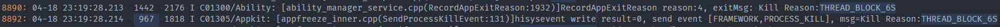

5. **APP_FREEZE** kills the application.

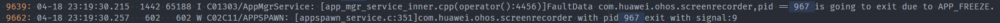

#### Procedure

View [Obtain the fault occurrence time](#obtain-the-fault-occurrence-time), and determine the fault occurrence time based on the fault type. Analyze the HiLog logs in the specific period to obtain the status of the running thread.

- If no application log is printed, the suspension occurs when the logging API is called.

   

   **...**

   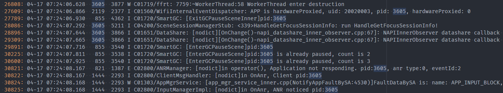

   In the preceding figure, the **APP_INPUT_BLOCK** event is reported at **07:24:08.167**, and the application main thread does not print logs after **07:24:01.581**. In this case, check whether the logic of **FormManagerService:**

   **[form_mgr_proxy.cpp(GetFormsInfoByApp:1128)]** times out.

- If the application logs are printed frequently, check whether the logs are normal.

   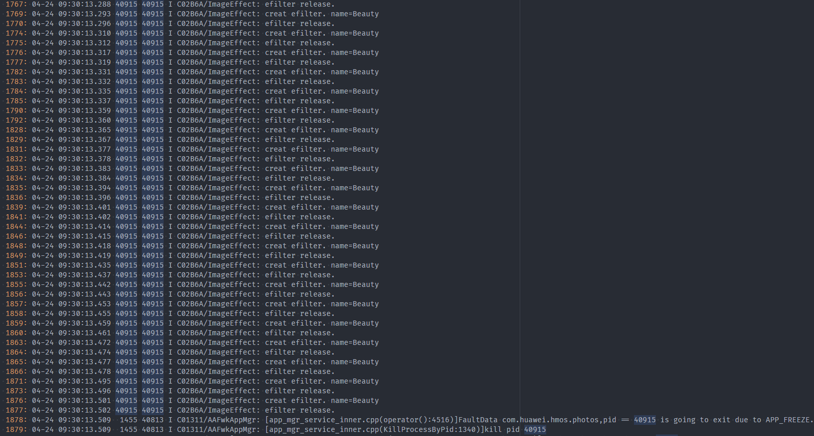

   In the preceding figure, a large number of logs are printed before the process is killed by **APP_FREEZE**. In this case, check whether the logs are normal in the **ImageEffect** domain.

### Analyzing Trace Data

The possible scenarios are as follows:

1. The duration of each service is not long, but the number of services is too large. Therefore, the process runs intensively in a long period of time and occupies the main thread.


In the preceding figure, the **animator** in **PriviewArea::updateShotComponent** is executed for 9.2s.

The thread is busy executing a service cyclically and analyzing each service segment.

- If the service scenario is not normal (the service should not be called frequently), analyze the service code and find out why the service is executed cyclically.

- Otherwise, check whether the service segment takes more time than expected and why the performance does not meet the design specifications.

2. The process times out when executes a function.

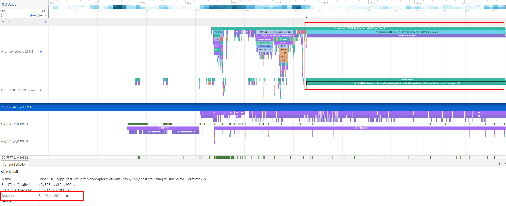

In the preceding figure, the execution duration of **OHOS::AppExecFwk::FormMgrAdapter::GetFormsInfoByApp** exceeds 8s.

## Case Study

### Typical Case of ThreadBlock - Incorrect Use of Locks

#### Background

The xxx service reports the **THREAD_BLOCK_6S** event.

#### Error Codes

In the following code, a thread uses **mutex_.lock()** but not releases it when the return failed. As a result, other threads are blocked for waiting the lock.

```cpp
int xxx()
{
    //...
    mutex_.lock();
    AIContext aiContext;
    if (ConvertRpcHandle2AIContext(inputs[0], aiContext) != aicp::SUCCESS) {
        return FAILED;
    }
    //...
}
```

#### Impact

The background application is suspended and its features are unavailable, but it is imperceptible to the user.

#### Fault Locating

Extract the key fault logs.

```
appfreeze: com.example.hmsapp.xxx THREAD_BLOCK_6S at 20240408082432
DisplayPowerInfo:powerState:AWAKE
```

The value of **Foreground** indicates that the application is in the background. When the 3s event is reported, the background application is suspended for 18s.

```
Module name:com.xxx.xxx.xxx
Version:1.2.2.202
VersionCode:1002002202
PreInstalled:Yes
Foreground: No --> Indicates that the application is in the background.
Pid:43675
Uid:20020029
Reason:THREAD_BLOCK_6S
```

The **THREAD_BLOCK_3S** event is reported at **08:24:29:612**. 
The **THREAD_BLOCK_6S** event is reported at **08:24:32:638**. The interval is 3s as expected.

```
>>>>>>>>>>>>>>>>>>>>>>>>>>>>>>>>>>>>>>>>>>>
DOMAIN:AAFWK
STRINGID:THREAD_BLOCK_6S
TIMESTAMP:2024/04/08-08:24:32:638
PID:43675
UID:20020029
PACKAGE_NAME:com.xxx.xxx.xxx
PROCESS_NAME:com.xxx.xxx.xxx
*******************************************
start time: 2024/04/08-08:24:29:627
DOMAIN = AAFWK
EVENTNAME = THREAD_BLOCK_3S
TIMESTAMP = 2024/04/08-08:24:29:612
PID = 43675
UID = 20020029
PACKAGE_NAME = com.xxx.xxx.xxx
PROCESS_NAME = com.xxx.xxx.xxx
```

When the **THREAD_BLOCK_3S** event is reported, the **EventHandler** is captured at **08:24:29.413**. The cause is as expected: "App main thread is not response!" The main thread does not respond. The running task is sent at **08:24:01.514**.

```
MSG = 
Fault time:2024/04/08-08:24:29
App main thread is not response!
mainHandler dump is:
 EventHandler dump begin curTime: 2024-04-08 08:24:29.413
 Event runner (Thread name = , Thread ID = 43675) is running
 Current Running: start at 2024-04-08 08:24:01.514, Event { send thread = 43675, send time = 2024-04-08 08:24:01.514, handle time = 2024-04-08 08:24:01.514, task name = uvLoopTask }
```

The watchdog task is in **High priority event queue**. As shown in the following figure, a watchdog task is thrown to the main thread every 3 seconds, which is as expected.

The queue of **THREAD_BLOCK_6S** contains one additional event compared to the queue of **THREAD_BLOCK_3S**.

The earliest event is sent at **08:24:11.388**, 18s earlier than the report time of **THREAD_BLOCK_3S** at **08:24:29:612**, which is as expected.

```
 High priority event queue information:
 No.1 : Event { send thread = 43679, send time = 2024-04-08 08:24:11.388, handle time = 2024-04-08 08:24:11.388, id = 1, caller = [watchdog.cpp(Timer:139)] }
 No.2 : Event { send thread = 43679, send time = 2024-04-08 08:24:14.458, handle time = 2024-04-08 08:24:14.458, id = 1, caller = [watchdog.cpp(Timer:139)] }
 No.3 : Event { send thread = 43679, send time = 2024-04-08 08:24:17.383, handle time = 2024-04-08 08:24:17.383, id = 1, caller = [watchdog.cpp(Timer:139)] }
 No.4 : Event { send thread = 43679, send time = 2024-04-08 08:24:20.363, handle time = 2024-04-08 08:24:20.363, id = 1, caller = [watchdog.cpp(Timer:139)] }
 No.5 : Event { send thread = 43679, send time = 2024-04-08 08:24:23.418, handle time = 2024-04-08 08:24:23.418, id = 1, caller = [watchdog.cpp(Timer:139)] }
 No.6 : Event { send thread = 43679, send time = 2024-04-08 08:24:26.369, handle time = 2024-04-08 08:24:26.369, id = 1, caller = [watchdog.cpp(Timer:139)] }
 No.7 : Event { send thread = 43679, send time = 2024-04-08 08:24:29.412, handle time = 2024-04-08 08:24:29.412, id = 1, caller = [watchdog.cpp(Timer:139)] }
```

To sum up, the main thread of the application starts to run this task at **08:24:01.514**. The first **THREAD_BLOCK_3S** event occurs at **08:24:11.388**, and the block event occurs at about **08:24:11**.

Check the main thread stack at **xxx_request_client.so->libsamgr_proxy.z.so->libipc_core.z.so(OHOS::BinderConnector::WriteBinder)**.

In this case, the main thread initiates an IPC request, but the peer process does not respond. As a result, the process is suspended, as shown in the following stack.

```
Tid:43675, Name:xxx
# 00 pc 0000000000168c44 /system/lib/ld-musl-aarch64.so.1(ioctl+176)(91b804d2409a13f27463debe9e19fb5d)
# 01 pc 0000000000049268 /system/lib64/platformsdk/libipc_core.z.so(OHOS::BinderConnector::WriteBinder(unsigned long, void*)+112)(e59500a4ea66775388332f6e3cc12fe3)
# 02 pc 0000000000054fd4 /system/lib64/platformsdk/libipc_core.z.so(OHOS::BinderInvoker::TransactWithDriver(bool)+296)(e59500a4ea66775388332f6e3cc12fe3)
# 03 pc 00000000000544c8 /system/lib64/platformsdk/libipc_core.z.so(OHOS::BinderInvoker::WaitForCompletion(OHOS::MessageParcel*, int*)+304)(e59500a4ea66775388332f6e3cc12fe3)
# 04 pc 0000000000053c84 /system/lib64/platformsdk/libipc_core.z.so(OHOS::BinderInvoker::SendRequest(int, unsigned int, OHOS::MessageParcel&, OHOS::MessageParcel&, OHOS::MessageOption&)+312)(e59500a4ea66775388332f6e3cc12fe3)
# 05 pc 000000000002d6d8 /system/lib64/platformsdk/libipc_core.z.so(OHOS::IPCObjectProxy::SendRequestInner(bool, unsigned int, OHOS::MessageParcel&, OHOS::MessageParcel&, OHOS::MessageOption&)+128)(e59500a4ea66775388332f6e3cc12fe3)
# 06 pc 0000000000030e00 /system/lib64/platformsdk/libipc_core.z.so(OHOS::IPCObjectProxy::GetProtoInfo()+396)(e59500a4ea66775388332f6e3cc12fe3)
# 07 pc 000000000002e990 /system/lib64/platformsdk/libipc_core.z.so(OHOS::IPCObjectProxy::WaitForInit()+292)(e59500a4ea66775388332f6e3cc12fe3)
# 08 pc 0000000000036cd0 /system/lib64/platformsdk/libipc_core.z.so(OHOS::IPCProcessSkeleton::FindOrNewObject(int)+116)(e59500a4ea66775388332f6e3cc12fe3)
# 09 pc 00000000000571cc /system/lib64/platformsdk/libipc_core.z.so(OHOS::BinderInvoker::UnflattenObject(OHOS::Parcel&)+272)(e59500a4ea66775388332f6e3cc12fe3)
# 10 pc 00000000000463a4 /system/lib64/platformsdk/libipc_core.z.so(OHOS::MessageParcel::ReadRemoteObject()+116)(e59500a4ea66775388332f6e3cc12fe3)
# 11 pc 000000000001250c /system/lib64/chipset-pub-sdk/libsamgr_proxy.z.so(OHOS::SystemAbilityManagerProxy::CheckSystemAbility(int, bool&)+952)(6f113f37ac6ac882cfa16077ad5b406a)
# 12 pc 0000000000010e7c /system/lib64/chipset-pub-sdk/libsamgr_proxy.z.so(OHOS::SystemAbilityManagerProxy::GetSystemAbilityWrapper(int, std::__h::basic_string<char, std::__h::char_traits<char>, std::__h::allocator<char>> const&)+232)(6f113f37ac6ac882cfa16077ad5b406a)
# 13 pc 00000000000118b8 /system/lib64/chipset-pub-sdk/libsamgr_proxy.z.so(OHOS::SystemAbilityManagerProxy::Recompute(int, int)+132)(6f113f37ac6ac882cfa16077ad5b406a)
# 14 pc 0000000000011170 /system/lib64/chipset-pub-sdk/libsamgr_proxy.z.so(OHOS::DynamicCache<int, OHOS::sptr<OHOS::IRemoteObject>>::QueryResult(int, int)+316)(6f113f37ac6ac882cfa16077ad5b406a)
# 15 pc 0000000000007e0c xxx_request_client.so(xxx::RPCRequestClient::GetService()+540)(557450139184527807025a632613fd76)
# 16 pc 0000000000008824 xxx_request_client.so(xxx::RPCRequestClient::Init()+16)(557450139184527807025a632613fd76)
# 17 pc 0000000000008d60 xxx_request_client.so(CreateRpcRequestByServiceName+104)(557450139184527807025a632613fd76)
# 18 pc 0000000000008f98 xxx_request_client.so(CreateRpcRequest+72)(557450139184527807025a632613fd76)
# 19 pc 0000000000002944 xxx_rpc_client.so(xxx::xxx::RpcRequestClient::RpcRequestClient()+224)(02343ed2fff69759d408b23eaf69fcde)
```

Check **BinderCatcher**. The main thread **43675** is communicating with process **979** and the thread is suspended for 27s when the binder is captured.

```
PeerBinderCatcher -- pid==43675 layer_ == 1

BinderCatcher --

    The 43675:43675 to 979:0 code 5f475249 wait:27.104545829 s frz_state:1, ns:-1:-1 to -1:-1, debug:35854:35854 to 52462:52462, active_code:0 active_thread:0, pending_async_proc=0  --> The binder communication waits for 27s.
    57187:39147 to 28644:30753 code 0 wait:0.337894271 s frz_state:3,  ns:-1:-1 to -1:-1, debug:57187:39147 to 28644:30753, active_code:0 active_thread:0, pending_async_proc=0
    57187:39151 to 28644:28652 code 7 wait:0.531140625 s frz_state:3,  ns:-1:-1 to -1:-1, debug:57187:39151 to 28644:28652, active_code:0 active_thread:0, pending_async_proc=0
    57187:39150 to 28644:31297 code 0 wait:0.976419270 s frz_state:3,  ns:-1:-1 to -1:-1, debug:57187:39150 to 28644:31297, active_code:0 active_thread:0, pending_async_proc=0
    57187:38979 to 28644:32554 code 0 wait:0.22108334 s frz_state:3,  ns:-1:-1 to -1:-1, debug:57187:38979 to 28644:32554, active_code:0 active_thread:0, pending_async_proc=0
    57187:39149 to 28644:30754 code 0 wait:0.534261979 s frz_state:3,  ns:-1:-1 to -1:-1, debug:57187:39149 to 28644:30754, active_code:0 active_thread:0, pending_async_proc=0
    57187:38949 to 28644:31301 code 0 wait:0.977779166 s frz_state:3,  ns:-1:-1 to -1:-1, debug:57187:38949 to 28644:31301, active_code:0 active_thread:0, pending_async_proc=0
    57187:39172 to 28644:35667 code 0 wait:1.47387500 s frz_state:3,  ns:-1:-1 to -1:-1, debug:57187:39172 to 28644:35667, active_code:0 active_thread:0, pending_async_proc=0
    57187:39173 to 28644:28822 code 0 wait:0.565389063 s frz_state:3,  ns:-1:-1 to -1:-1, debug:57187:39173 to 28644:28822, active_code:0 active_thread:0, pending_async_proc=0
    1477:1676 to 1408:2026 code 17 wait:0.0 s frz_state:3,  ns:-1:-1 to -1:-1, debug:1477:1676 to 1408:2026, active_code:0 active_thread:0, pending_async_proc=0
    628:8136 to 979:0 code 2 wait:13166.722870859 s frz_state:1,  ns:-1:-1 to -1:-1, debug:628:8136 to 979:0, active_code:0 active_thread:0, pending_async_proc=0
```

Check the main thread stack of process **979**, and it shows that **xxxserver** is waiting for lock release. This fault is caused by improper use of locks.

```
Binder catcher stacktrace, type is peer, pid : 979
Result: 0 ( no error )
Timestamp:2024-04-08 08:24:29.000
Pid:979
Uid:3094
Process name:xxxserver
Process life time:60410s
Tid:979, Name:xxxserver
# 00 pc 00000000001aafc4 /system/lib/ld-musl-aarch64.so.1(__timedwait_cp+192)(91b804d2409a13f27463debe9e19fb5d)
# 01 pc 00000000001b0d50 /system/lib/ld-musl-aarch64.so.1(__pthread_mutex_timedlock_inner+592)(91b804d2409a13f27463debe9e19fb5d)
# 02 pc 00000000000c38e0 /system/lib64/libc++.so(std::__h::mutex::lock()+8)(0b61ba21a775725a1bd8802a393b133afbc503a5) --> The lock() function is called and the process waits for it.
# 03 pc 00000000000086dc xxx_server.so(xxx::xxx::InitImpl(int, std::__h::vector<xxx::xxx::RpcHandle, std::__h::allocator<xxx::xxx::RpcHandle>> const&, std::__h::vector<xxx::xxx::RpcHandle, std::__h::allocator<xxx::xxx::RpcHandle>>&)+84)(f4bb275898d797b22eae35fe48db9009)
# 04 pc 000000000000798c xxx_request_server.so(xxx::RPCRequestStub::SyncExecute(OHOS::MessageParcel&, OHOS::MessageParcel&)+164)(70cbb10c758902c1e3e179efc93ce0af)
# 05 pc 0000000000008314 xxx_request_server.so(xxx::RPCRequestStub::OnRemoteRequest(unsigned int, OHOS::MessageParcel&, OHOS::MessageParcel&, OHOS::MessageOption&)+300)(70cbb10c758902c1e3e179efc93ce0af)
# 06 pc 00000000000153e4 /system/lib64/chipset-pub-sdk/libipc_single.z.so(OHOS::IPCObjectStub::SendRequest(unsigned int, OHOS::MessageParcel&, OHOS::MessageParcel&, OHOS::MessageOption&)+604)(25b3d63905ef47289c096ea42ba2d86a)
# 07 pc 000000000002b464 /system/lib64/chipset-pub-sdk/libipc_single.z.so(OHOS::IPC_SINGLE::BinderInvoker::OnTransaction(unsigned char const*)+1220)(25b3d63905ef47289c096ea42ba2d86a)
# 08 pc 000000000002baec /system/lib64/chipset-pub-sdk/libipc_single.z.so(OHOS::IPC_SINGLE::BinderInvoker::HandleCommandsInner(unsigned int)+368)(25b3d63905ef47289c096ea42ba2d86a)
# 09 pc 000000000002a6b0 /system/lib64/chipset-pub-sdk/libipc_single.z.so(OHOS::IPC_SINGLE::BinderInvoker::HandleCommands(unsigned int)+60)(25b3d63905ef47289c096ea42ba2d86a)
# 10 pc 000000000002a4dc /system/lib64/chipset-pub-sdk/libipc_single.z.so(OHOS::IPC_SINGLE::BinderInvoker::StartWorkLoop()+120)(25b3d63905ef47289c096ea42ba2d86a)
# 11 pc 000000000002bc2c /system/lib64/chipset-pub-sdk/libipc_single.z.so(OHOS::IPC_SINGLE::BinderInvoker::JoinThread(bool)+92)(25b3d63905ef47289c096ea42ba2d86a)
# 12 pc 0000000000004bd4 xxxserver(02cff7e5dce05d6d28096601458b6f6d)
# 13 pc 00000000000a3b58 /system/lib/ld-musl-aarch64.so.1(libc_start_main_stage2+64)(91b804d2409a13f27463debe9e19fb5d)
```

Decompile the code to locate the error code line and check the lock based on the context.

#### Solution

```cpp
int xxx()
{
    //...
    mutex_.lock();
    AIContext aiContext;
    if (ConvertRpcHandle2AIContext(inputs[0], aiContext) != aicp::SUCCESS) {
        return FAILED;
    }
    //...
}
```

Modify the preceding codes as follows:

```cpp
int xxx()
{
    //...
    mutex_.lock();
    AIContext aiContext;
    if (ConvertRpcHandle2AIContext(inputs[0], aiContext) != aicp::SUCCESS) {
        mutex_.unlock();
        return FAILED;
    }
    //...
    mutex_.unlock();
    //...
}
```

Adjust the lock properly based on the context.

#### Suggestion

1. Pay special attention to the timing and deadlock issues during multi-thread interaction.

### Typical Case of **APP_INPUT_BLOCK** - Full Component Update

#### Background

When the theme is switched, a suspension occurs, and the AppFreeze event of sceneboard is reported.

This suspension is caused by busy threads.

#### Error Codes

Component update and reuse are controlled by the **key** value of the component. When a page is updated, if the **key** value of the component remains unchanged, the original component is reused. Otherwise, the component and its subcomponents are updated.

The **getForeachKey** function is used to generate the key of the home screen component and is associated with **themeStyle**. When a user continuously switches the theme on the home screen, the component is repeatedly refreshed in full mode. As a result, a suspension occurs.

```ts
private getForeachKey(item: xxx): string {
    //...
    return `${item.xxx2}${item.xxx2}...${item.themeStyle}`;
}
```

#### Impact

There is a high probability that the page is suspended when the theme is switched on the integrated home screen. When a user clicks, the screen does not respond and then returns to the lock screen, 

deteriorating user experience.

#### Fault Locating

Extract the key fault logs.

```
appfreeze: com.example.sceneboard APP_INPUT_BLOCK at 202403144059
DisplayPowerInfo:powerState:AWAKE
```

Check the report time of the **APP_INPUT_BLOCK** event, which is **14:40:59:440**.

```
DOMAIN:AAFWK
STRINGID:APP_INPUT_BLOCK
TIMESTAMP:2024/03/14-14:40:59:440 --> Fault report time.
PID:2918
UID:20020017
PACKAGE_NAME:com.example.sceneboard
PROCESS_NAME:com.example.sceneboard
```

The report cause is "User input does not respond!". That is, there is no response to the user input event. 
It shows that the running task of the main thread (Thread ID == PID) starts at **14:40:53.499** and is not complete until the Fault time **14:40:58**.

```
MSG = 
Fault time:2024/03/14-14:40:58
User input does not respond!
mainHandler dump is:
 EventHandler dump begin curTime: 2024-03-14 02:40:58.520
 Event runner (Thread name = , Thread ID = 2918) is running
 Current Running: start at 2024-03-14 02:40:53.499, Event { send thread = 2918, send time = 2024-03-14 02:40:53.499, handle time = 2024-03-14 02:40:53.499, task name =  }
```

User input events need to be responded immediately. Therefore, they are in the high priority event queue, together with the watchdog tasks.

The following stack shows that more than 200 input events in the queue are blocked and not processed.

```
 High priority event queue information:
 No.1 : Event { send thread = 3370, send time = 2024-03-14 02:40:53.690, handle time = 2024-03-14 02:40:53.690, task name = , caller = [input_manager_impl.cpp(OnPointerEvent:465)] }
 No.2 : Event { send thread = 3370, send time = 2024-03-14 02:40:53.699, handle time = 2024-03-14 02:40:53.699, task name = , caller = [input_manager_impl.cpp(OnPointerEvent:465)] }
 No.3 : Event { send thread = 3370, send time = 2024-03-14 02:40:53.708, handle time = 2024-03-14 02:40:53.708, task name = , caller = [input_manager_impl.cpp(OnPointerEvent:465)] }
 No.4 : Event { send thread = 3370, send time = 2024-03-14 02:40:53.717, handle time = 2024-03-14 02:40:53.717, task name = , caller = [input_manager_impl.cpp(OnPointerEvent:465)] }
 No.5 : Event { send thread = 3370, send time = 2024-03-14 02:40:53.726, handle time = 2024-03-14 02:40:53.726, task name = , caller = [input_manager_impl.cpp(OnPointerEvent:465)] }
 No.6 : Event { send thread = 3370, send time = 2024-03-14 02:40:53.736, handle time = 2024-03-14 02:40:53.736, task name = , caller = [input_manager_impl.cpp(OnPointerEvent:465)] }
 No.7 : Event { send thread = 3370, send time = 2024-03-14 02:40:53.745, handle time = 2024-03-14 02:40:53.745, task name = , caller = [input_manager_impl.cpp(OnPointerEvent:465)] }
 No.8 : Event { send thread = 3370, send time = 2024-03-14 02:40:53.754, handle time = 2024-03-14 02:40:53.754, task name = , caller = [input_manager_impl.cpp(OnPointerEvent:465)] }
 ...
 No.190 : Event { send thread = 3370, send time = 2024-03-14 02:40:56.166, handle time = 2024-03-14 02:40:56.166, task name = , caller = [input_manager_impl.cpp(OnPointerEvent:465)] }
 No.191 : Event { send thread = 3370, send time = 2024-03-14 02:40:56.176, handle time = 2024-03-14 02:40:56.176, task name = , caller = [input_manager_impl.cpp(OnPointerEvent:465)] }
 No.192 : Event { send thread = 3370, send time = 2024-03-14 02:40:56.186, handle time = 2024-03-14 02:40:56.186, task name = , caller = [input_manager_impl.cpp(OnPointerEvent:465)] }
 No.193 : Event { send thread = 2923, send time = 2024-03-14 02:40:56.196, handle time = 2024-03-14 02:40:56.196, id = 1, caller = [watchdog.cpp(Timer:140)] }
 No.194 : Event { send thread = 3370, send time = 2024-03-14 02:40:56.196, handle time = 2024-03-14 02:40:56.196, task name = , caller = [input_manager_impl.cpp(OnPointerEvent:465)] }
 No.195 : Event { send thread = 3370, send time = 2024-03-14 02:40:56.206, handle time = 2024-03-14 02:40:56.206, task name = , caller = [input_manager_impl.cpp(OnPointerEvent:465)] }
 No.196 : Event { send thread = 3370, send time = 2024-03-14 02:40:56.216, handle time = 2024-03-14 02:40:56.216, task name = , caller = [input_manager_impl.cpp(OnPointerEvent:465)] }
 No.197 : Event { send thread = 3370, send time = 2024-03-14 02:40:56.226, handle time = 2024-03-14 02:40:56.226, task name = , caller = [input_manager_impl.cpp(OnPointerEvent:465)] }
 No.198 : Event { send thread = 3370, send time = 2024-03-14 02:40:56.236, handle time = 2024-03-14 02:40:56.236, task name = , caller = [input_manager_impl.cpp(OnPointerEvent:465)] }
 No.199 : Event { send thread = 3370, send time = 2024-03-14 02:40:56.245, handle time = 2024-03-14 02:40:56.245, task name = , caller = [input_manager_impl.cpp(OnPointerEvent:465)] }
 No.200 : Event { send thread = 3370, send time = 2024-03-14 02:40:56.254, handle time = 2024-03-14 02:40:56.254, task name = , caller = [input_manager_impl.cpp(OnPointerEvent:465)] }
 No.201 : Event { send thread = 3370, send time = 2024-03-14 02:40:56.265, handle time = 2024-03-14 02:40:56.265, task name = , caller = [input_manager_impl.cpp(OnPointerEvent:465)] }
 No.202 : Event { send thread = 3370, send time = 2024-03-14 02:40:56.275, handle time = 2024-03-14 02:40:56.274, task name = , caller = [input_manager_impl.cpp(OnPointerEvent:465)] }
 No.203 : Event { send thread = 3370, send time = 2024-03-14 02:40:56.284, handle time = 2024-03-14 02:40:56.284, task name = , caller = [input_manager_impl.cpp(OnPointerEvent:465)] }
 No.204 : Event { send thread = 3370, send time = 2024-03-14 02:40:56.294, handle time = 2024-03-14 02:40:56.294, task name = , caller = [input_manager_impl.cpp(OnPointerEvent:465)] }
 No.205 : Event { send thread = 3370, send time = 2024-03-14 02:40:56.305, handle time = 2024-03-14 02:40:56.305, task name = , caller = [input_manager_impl.cpp(OnPointerEvent:465)] }
```

It can be inferred that the input event triggers the main thread task of the application. However, the execution is not complete within 6 seconds. As a result, the ANR times out.
In this case, you only need to find out the task that the input triggers and why the task execution times out.

In the main thread stack, the **GetCurrentThreadId** function in **ark_jsruntime.so** at the stack top does not hold a lock or is time-consuming. The captured stack is a transient stack that is not necessary for analysis.

```
Tid:2918, Name:example.sceneboard
# 00 pc 000000000009f73c /system/lib/ld-musl-aarch64.so.1(8fa55898166cd804dad43d909b5319cc)
# 01 pc 000000000054b7b4 /system/lib64/platformsdk/libark_jsruntime.so(panda::os::thread::GetCurrentThreadId()+12)(7715646e48f750f3dc31e660b056eb43)
# 02 pc 00000000002107a4 /system/lib64/platformsdk/libark_jsruntime.so(panda::ecmascript::EcmaVM::CheckThread() const+200)(7715646e48f750f3dc31e660b056eb43)
# 03 pc 0000000000432998 /system/lib64/platformsdk/libark_jsruntime.so(panda::JSNApi::GetHandleAddr(panda::ecmascript::EcmaVM const*, unsigned long)+64)(7715646e48f750f3dc31e660b056eb43)
# 04 pc 000000000003eeb8 /system/lib64/platformsdk/libace_napi.z.so(ArkNativeReference::Get()+32)(c3a760aff0c73a2e76accaf518321fc9)
# 05 pc 0000000000043cb4 /system/lib64/platformsdk/libace_napi.z.so(napi_get_reference_value+48)(c3a760aff0c73a2e76accaf518321fc9)
# 06 pc 0000000000007564 /system/lib64/module/events/libemitter.z.so(OHOS::AppExecFwk::SearchCallbackInfo(napi_env__*, std::__h::variant<unsigned int, std::__h::basic_string<char, std::__h::char_traits<char>, std::__h::allocator<char>>> const&, napi_value__*)+248)(8fe2937855aab3ea839419f952597511)
# 07 pc 0000000000007d8c /system/lib64/module/events/libemitter.z.so(OHOS::AppExecFwk::OnOrOnce(napi_env__*, napi_callback_info__*, bool)+568)(8fe2937855aab3ea839419f952597511)
# 08 pc 00000000000096d8 /system/lib64/module/events/libemitter.z.so(OHOS::AppExecFwk::JS_Once(napi_env__*, napi_callback_info__*) (.cfi)+84)(8fe2937855aab3ea839419f952597511)
# 09 pc 000000000002c8f0 /system/lib64/platformsdk/libace_napi.z.so(ArkNativeFunctionCallBack(panda::JsiRuntimeCallInfo*)+168)(c3a760aff0c73a2e76accaf518321fc9)
# 10 pc 0000000000187b48 /system/lib64/module/arkcompiler/stub.an(RTStub_PushCallArgsAndDispatchNative+40)
# 11 pc 00000000002da5fc /system/lib64/platformsdk/libark_jsruntime.so(panda::ecmascript::InterpreterAssembly::Execute(panda::ecmascript::EcmaRuntimeCallInfo*)+416)(7715646e48f750f3dc31e660b056eb43)
# 12 pc 00000000002da5fc /system/lib64/platformsdk/libark_jsruntime.so(panda::ecmascript::InterpreterAssembly::Execute(panda::ecmascript::EcmaRuntimeCallInfo*)+416)(7715646e48f750f3dc31e660b056eb43)
# 13 pc 00000000003954a0 /system/lib64/platformsdk/libark_jsruntime.so(panda::ecmascript::JSStableArray::HandleforEachOfStable(panda::ecmascript::JSThread*, panda::ecmascript::JSHandle<panda::ecmascript::JSObject>, panda::ecmascript::JSHandle<panda::ecmascript::JSTaggedValue>, panda::ecmascript::JSHandle<panda::ecmascript::JSTaggedValue>, unsigned int, unsigned int&)+596)(7715646e48f750f3dc31e660b056eb43)
# 14 pc 000000000018f4b0 /system/lib64/platformsdk/libark_jsruntime.so(panda::ecmascript::builtins::BuiltinsArray::ForEach(panda::ecmascript::EcmaRuntimeCallInfo*)+840)(7715646e48f750f3dc31e660b056eb43)
...
```

Check the HiLog logs.

The **APP_INPUT_BLOCK** event is reported at about **13:40:59.448**, and then DFX kills the suspended SCB.


6 seconds before, a click event was sent to the SCB at about **14:40:53.498**.


Within the 6 seconds, a large number of SCB logs are printed, showing that the SCB is re-rendered.

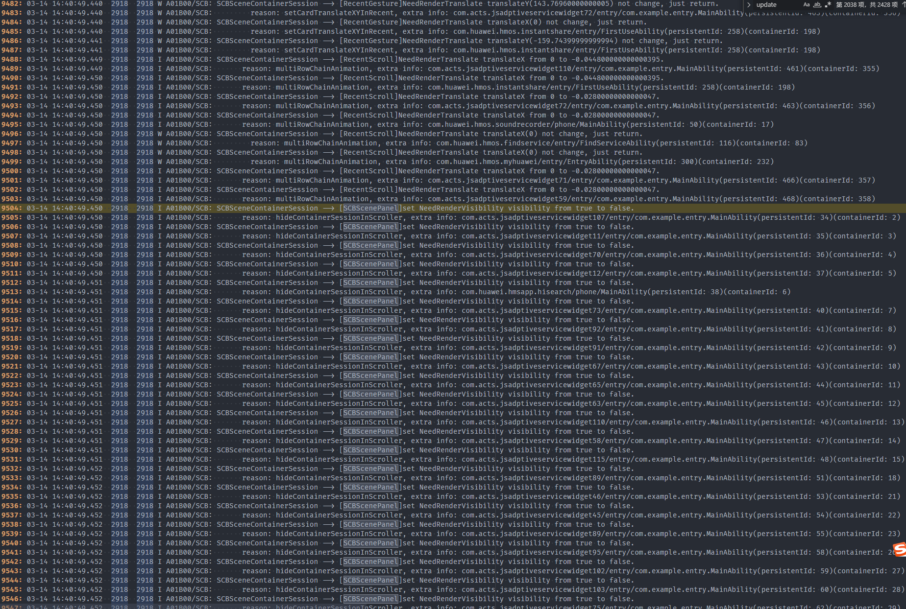

Check the trace data within the 6 seconds.

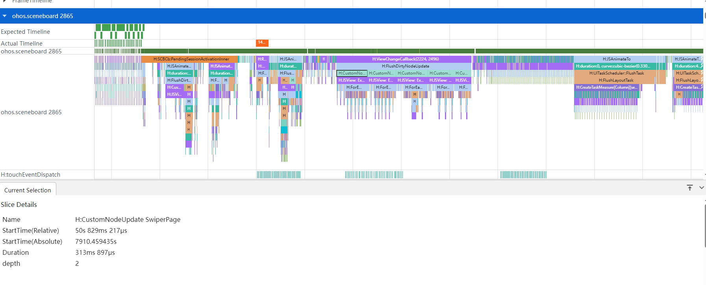

It shows that the SCB main thread is fully occupied. The **CustomNodeUpdate SwiperPage** task takes a longer time. Therefore, you need to check why this component keeps refreshing.

It is found that **themeStyle** is added to the **key** on **swiperPage**. When the **key** value changes, a new component is created.

When the theme or icon style is switched, all components on the home screen are created. As a result, the main thread is busy and cannot respond the input event.

#### Solution

Trigger the home screen component refresh only when the home screen component style is switched, and narrow down the refresh scope.

```ts
+ if (!CheckEmptyUtils.isEmpty(themeStyleInfo.iconResourcePath) &&
+     themeStyleInfo.iconResourcePath !== this.themeStyle.iconResourcePath) {
+     this.isStyleChanged = true;
+     this.themeStyle.iconResourcePath = themeStyleInfo.iconResourcePath; --> themeStyle is associated with iconResourcePath.
+ }
```

#### Suggestions

Minimize the scope of page refresh triggered by a click event. Avoid scenarios where a large number of components need to be refreshed or a page needs to be refreshed frequently.

### Typical Case of **LIFECYCLE_TIMEOUT** - Loading a Cloud Image

#### Background

When a user opens a cloud note, the application freezes and then crashes.

#### Error Codes

The cloud image is obtained synchronously in a loop.

```ts
public static xxxFunction(fileUris: string[]): void {
    //...
    for (const fileuril of fileUrils) {
        let file = fs.openSync(fileUri, fs.OpenMode.READ_ONLY);
        //...
    }
    //...
}
```

#### Impact

The application freezes and crashes when it is started or switched to the foreground.

#### Fault Locating

Extract the key fault logs of **LIFECYCLE_TIMEOUT** that occurs in notepad.

```
sysfreeze: LIFECYCLE_TIMEOUT LIFECYCLE_TIMEOUT at 20240201100459
```

Check the **MSG** information, which indicates that the timeout occurs in the foreground, and the duration is 5s.

```
MSG = 
Fault time:2024/02/01-10:04:57
ability:MainAbility foreground timeout.
server:
312522; AbilityRecord::ForegroundAbility; the ForegroundAbility lifecycle starts.
client:
312522; AbilityThread::ScheduleAbilityTransaction; the foreground lifecycle.
```

Check the report times of the **LIFECYCLE_HALF_TIMEOUT** 
and **LIFECYCLE_TIMEOUT** events, which are **10:04:57:538** and **10:04:59:965** respectively. The interval is about 2.5s, which meets the expectation.

```
>>>>>>>>>>>>>>>>>>>>>>>>>>>>>>>>>>>>>>>>>>>
DOMAIN:AAFWK
STRINGID:LIFECYCLE_TIMEOUT
TIMESTAMP:2024/02/01-10:04:59:965
PID:18083
UID:20020041
PACKAGE_NAME:com.example.notepad
PROCESS_NAME:com.example.notepad
*******************************************
start time: 2024/02/01-10:04:57:555
DOMAIN = AAFWK
EVENTNAME = LIFECYCLE_HALF_TIMEOUT
TIMESTAMP = 2024/02/01-10:04:57:538
PID = 18083
UID = 20020041
TID = 17286
PACKAGE_NAME = com.example.notepad
PROCESS_NAME = com.example.notepad
```

Check the task start time, which is **10:04:54.798**. The interval between the task start time and **LIFECYCLE_HALF_TIMEOUT** is about 2.5s, which meets the expectation.

```
mainHandler dump is:
 EventHandler dump begin curTime: 2024-02-01 10:04:57.306
 Event runner (Thread name = , Thread ID = 18083) is running
 Current Running: start at 2024-02-01 10:04:54.798, Event { send thread = 18132, send time = 2024-02-01 10:04:54.778, handle time = 2024-02-01 10:04:54.778, task name = UIAbilityThread:SendResult }
 History event queue information:
 No. 0 : Event { send thread = 18083, send time = 2024-02-01 10:04:46.481, handle time = 2024-02-01 10:04:46.981, trigger time = 2024-02-01 10:04:46.982, completeTime time = 2024-02-01 10:04:46.982, task name =  }
 No. 1 : Event { send thread = 18132, send time = 2024-02-01 10:04:47.149, handle time = 2024-02-01 10:04:47.149, trigger time = 2024-02-01 10:04:47.149, completeTime time = 2024-02-01 10:04:47.197, task name = MainThread:BackgroundApplication }
 No. 2 : Event { send thread = 18083, send time = 2024-02-01 10:04:44.329, handle time = 2024-02-01 10:04:47.329, trigger time = 2024-02-01 10:04:47.329, completeTime time = 2024-02-01 10:04:47.329, task name =  }
 No. 3 : Event { send thread = 18087, send time = 2024-02-01 10:04:48.091, handle time = 2024-02-01 10:04:48.091, trigger time = 2024-02-01 10:04:48.091, completeTime time = 2024-02-01 10:04:48.091, task name =  }
 No. 4 : Event { send thread = 18087, send time = 2024-02-01 10:04:51.047, handle time = 2024-02-01 10:04:51.047, trigger time = 2024-02-01 10:04:51.048, completeTime time = 2024-02-01 10:04:51.048, task name =  }
 No. 5 : Event { send thread = 18087, send time = 2024-02-01 10:04:54.067, handle time = 2024-02-01 10:04:54.067, trigger time = 2024-02-01 10:04:54.067, completeTime time = 2024-02-01 10:04:54.067, task name =  }
 ...
```

Check the stack information at **libfs.z.so > libdatashare_consumer.z.so > libipc_core.z.so**.

```
Tid:18083, Name:ei.example.notepad
# 00 pc 00000000001617a4 /system/lib/ld-musl-aarch64.so.1(ioctl+180)(4ca73cff61bea7c4a687eb0f71c9df69)
# 01 pc 000000000003e8a0 /system/lib64/platformsdk/libipc_core.z.so(OHOS::BinderConnector::WriteBinder(unsigned long, void*)+72)(3248fceb1fa676994734e0437430ce37)
# 02 pc 0000000000049f38 /system/lib64/platformsdk/libipc_core.z.so(OHOS::BinderInvoker::TransactWithDriver(bool)+296)(3248fceb1fa676994734e0437430ce37)
# 03 pc 00000000000496f8 /system/lib64/platformsdk/libipc_core.z.so(OHOS::BinderInvoker::WaitForCompletion(OHOS::MessageParcel*, int*)+116)(3248fceb1fa676994734e0437430ce37)
# 04 pc 00000000000490bc /system/lib64/platformsdk/libipc_core.z.so(OHOS::BinderInvoker::SendRequest(int, unsigned int, OHOS::MessageParcel&, OHOS::MessageParcel&, OHOS::MessageOption&)+312)(3248fceb1fa676994734e0437430ce37)
# 05 pc 0000000000027700 /system/lib64/platformsdk/libipc_core.z.so(OHOS::IPCObjectProxy::SendRequestInner(bool, unsigned int, OHOS::MessageParcel&, OHOS::MessageParcel&, OHOS::MessageOption&)+132)(3248fceb1fa676994734e0437430ce37)
# 06 pc 000000000002799c /system/lib64/platformsdk/libipc_core.z.so(OHOS::IPCObjectProxy::SendRequest(unsigned int, OHOS::MessageParcel&, OHOS::MessageParcel&, OHOS::MessageOption&)+140)(3248fceb1fa676994734e0437430ce37)
# 07 pc 000000000002640c /system/lib64/platformsdk/libdatashare_consumer.z.so(OHOS::DataShare::DataShareProxy::OpenFile(OHOS::Uri const&, std::__h::basic_string<char, std::__h::char_traits<char>, std::__h::allocator<char>> const&)+440)(e93b5085235269d4b7218ea7de64b69a)
# 08 pc 0000000000014b2c /system/lib64/platformsdk/libdatashare_consumer.z.so(OHOS::DataShare::ExtSpecialController::OpenFile(OHOS::Uri const&, std::__h::basic_string<char, std::__h::char_traits<char>, std::__h::allocator<char>> const&)+160)(e93b5085235269d4b7218ea7de64b69a)
# 09 pc 0000000000022c54 /system/lib64/platformsdk/libdatashare_consumer.z.so(OHOS::DataShare::DataShareHelperImpl::OpenFile(OHOS::Uri&, std::__h::basic_string<char, std::__h::char_traits<char>, std::__h::allocator<char>> const&)+96)(e93b5085235269d4b7218ea7de64b69a)
# 10 pc 0000000000108b34 /system/lib64/module/file/libfs.z.so(OHOS::FileManagement::ModuleFileIO::OpenFileByDatashare(std::__h::basic_string<char, std::__h::char_traits<char>, std::__h::allocator<char>> const&, unsigned int)+468)(152580bf9c379f11f29fdded278541bd)
# 11 pc 0000000000108264 /system/lib64/module/file/libfs.z.so(OHOS::FileManagement::ModuleFileIO::OpenFileByUri(std::__h::basic_string<char, std::__h::char_traits<char>, std::__h::allocator<char>> const&, unsigned int)+1760)(152580bf9c379f11f29fdded278541bd)
# 12 pc 00000000001077fc /system/lib64/module/file/libfs.z.so(OHOS::FileManagement::ModuleFileIO::Open::Sync(napi_env__*, napi_callback_info__*) (.cfi)+1036)(152580bf9c379f11f29fdded278541bd)
# 13 pc 000000000002bbf8 /system/lib64/platformsdk/libace_napi.z.so(ArkNativeFunctionCallBack(panda::JsiRuntimeCallInfo*)+168)(f5b81db475835ee752235c606b1c5e33)
# 14 pc 0000000000132e48 /system/lib64/module/arkcompiler/stub.an
```

The **BinderCatcher** information shows that the communication with process **5235** takes more than 2.5s, which is as expected.

```
PeerBinderCatcher -- pid==18083 layer_ == 1

BinderCatcher --

    18083:18083 to 5235:7437 code 2 wait:2.723147396 s,  ns:-1:-1 to -1:-1, debug:18083:18083 to 5235:7437, active_code:0 active_thread:0, pending_async_proc=0
    3462:3840 to 4956:4958 code 8 wait:261.213830169 s,  ns:-1:-1 to -1:-1, debug:3462:3840 to 4956:4958, active_code:0 active_thread:0, pending_async_proc=0
    3462:3621 to 4956:4981 code 8 wait:273.550283291 s,  ns:-1:-1 to -1:-1, debug:3462:3621 to 4956:4981, active_code:0 active_thread:0, pending_async_proc=0
```

The **5235** process is a media library process and the stack information is not necessary for analysis.

```
Binder catcher stacktrace, type is peer, pid : 5235
Result: 0 ( no error )
Timestamp:2024-02-01 10:04:57.000
Pid:5235
Uid:20020079
Process name:com.medialibrary.medialibrarydata
Tid:5235, Name:edialibrarydata
# 00 pc 0000000000142d1c /system/lib/ld-musl-aarch64.so.1(epoll_wait+84)(4ca73cff61bea7c4a687eb0f71c9df69)
# 01 pc 000000000000fb74 /system/lib64/chipset-pub-sdk/libeventhandler.z.so(OHOS::AppExecFwk::EpollIoWaiter::WaitFor(std::__h::unique_lock<std::__h::mutex>&, long)+224)(a4d21072c08fd3ac639d5cf5b8fb8b51)
# 02 pc 0000000000019df8 /system/lib64/chipset-pub-sdk/libeventhandler.z.so(OHOS::AppExecFwk::EventQueue::WaitUntilLocked(std::__h::chrono::time_point<std::__h::chrono::steady_clock, std::__h::chrono::duration<long long, std::__h::ratio<1l, 1000000000l>>> const&, std::__h::unique_lock<std::__h::mutex>&)+180)(a4d21072c08fd3ac639d5cf5b8fb8b51)
# 03 pc 0000000000019c6c /system/lib64/chipset-pub-sdk/libeventhandler.z.so(OHOS::AppExecFwk::EventQueue::GetEvent()+128)(a4d21072c08fd3ac639d5cf5b8fb8b51)
# 04 pc 00000000000202b8 /system/lib64/chipset-pub-sdk/libeventhandler.z.so(OHOS::AppExecFwk::(anonymous namespace)::EventRunnerImpl::Run()+1164)(a4d21072c08fd3ac639d5cf5b8fb8b51)
# 05 pc 0000000000022388 /system/lib64/chipset-pub-sdk/libeventhandler.z.so(OHOS::AppExecFwk::EventRunner::Run()+120)(a4d21072c08fd3ac639d5cf5b8fb8b51)
# 06 pc 000000000007ea08 /system/lib64/platformsdk/libappkit_native.z.so(OHOS::AppExecFwk::MainThread::Start()+772)(183fe2babcfdd3e1ea4bca16a0e26a5d)
# 07 pc 0000000000011ac8 /system/bin/appspawn(RunChildProcessor+236)(7b715884c45cfe57b22df46fdaeeca88)
# 08 pc 0000000000034684 /system/bin/appspawn(AppSpawnChild+264)(7b715884c45cfe57b22df46fdaeeca88)
# 09 pc 00000000000344f4 /system/bin/appspawn(AppSpawnProcessMsg+380)(7b715884c45cfe57b22df46fdaeeca88)
# 10 pc 00000000000305a0 /system/bin/appspawn(OnReceiveRequest+1820)(7b715884c45cfe57b22df46fdaeeca88)
# 11 pc 0000000000017c58 /system/lib64/chipset-pub-sdk/libbegetutil.z.so(HandleRecvMsg_+260)(22f33d1b0218f31bad0dcc75cf348b90)
# 12 pc 00000000000178fc /system/lib64/chipset-pub-sdk/libbegetutil.z.so(HandleStreamEvent_+148)(22f33d1b0218f31bad0dcc75cf348b90)
# 13 pc 0000000000015478 /system/lib64/chipset-pub-sdk/libbegetutil.z.so(ProcessEvent+112)(22f33d1b0218f31bad0dcc75cf348b90)
# 14 pc 0000000000015090 /system/lib64/chipset-pub-sdk/libbegetutil.z.so(RunLoop_+308)(22f33d1b0218f31bad0dcc75cf348b90)
# 15 pc 000000000002eff4 /system/bin/appspawn(AppSpawnRun+116)(7b715884c45cfe57b22df46fdaeeca88)
# 16 pc 000000000001f438 /system/bin/appspawn(main+724)(7b715884c45cfe57b22df46fdaeeca88)
# 17 pc 00000000000a0974 /system/lib/ld-musl-aarch64.so.1(libc_start_main_stage2+64)(4ca73cff61bea7c4a687eb0f71c9df69)
# 18 pc 000000000001106c /system/bin/appspawn(_start_c+76)(7b715884c45cfe57b22df46fdaeeca88)
```

The preceding information indicates that the application loads files synchronously using the URI through **Open::Sync** and calls **datashare()** to obtain media library file data.

The log information shows that the process is suspended when calling **datashare()** to load the cloud image, which is consistent with the stack information.

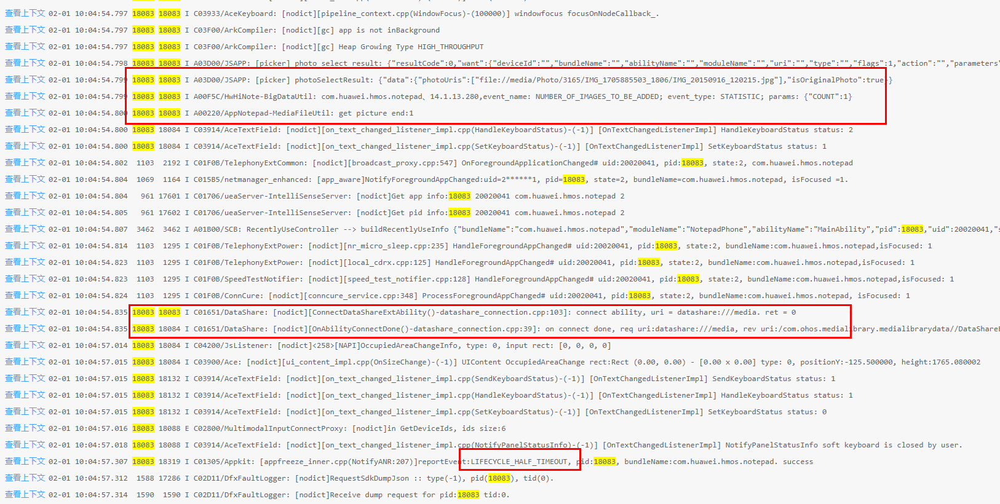

Check the code:

It is unreasonable to load file URI synchronously in a loop. When the network is weak or a large amount of data is loaded at the same time, the application tends to be suspended. In this case, you need to optimize the application.

#### Solution

Use asynchronous loading, use a flag to indicate whether the loading is complete and display the loading effect on the UI.

```ts
public static xxxFunction(fileUris: string[]): void {
    //...
    for (const fileuril of fileUrils) {
        let file = fs.openSync(fileUri, fs.OpenMode.READ_ONLY);
        //...
    }
    //...
}
```

Modify the preceding codes as follows:

```ts
public static async xxxFunction(fileUris: string[]): void {
    //...
    AppStorage.setOrCreate<boolean>('isLoadingPic', true); --> This function is used to display the page load effect.
    for (const fileuril of fileUrils) {
        let file = await fs.open(fileUri, fs.OpenMode.READ_ONLY);
        //...
    }
    //...
}
```

#### Suggestions

1. Verify the cloud data requests in scenarios where the network is available, weak, or unavailable. 
2. Do not perform time-consuming operations in the application lifecycle function.
