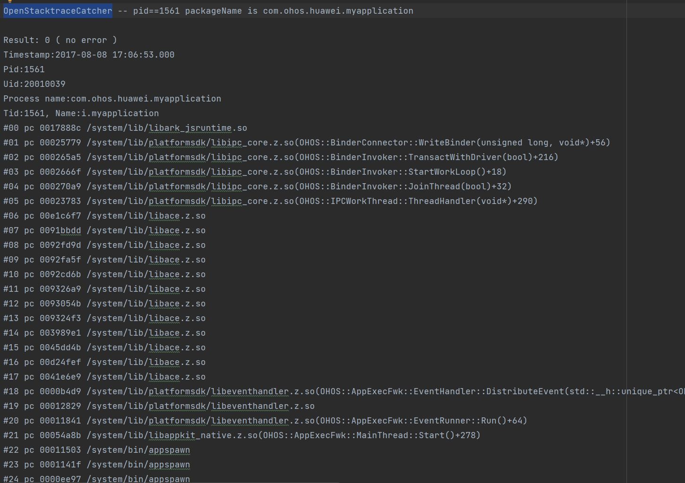
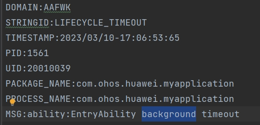

# Analyzing Application Freeze (appfreeze)

Application freeze (appfreeze) means that an application does not respond to user operations (for example, clicking) within a given period of time. OpenHarmony provides a mechanism for detecting appfreeze faults and generates appfreeze logs for fault analysis.

> **NOTE**
> This guide applies only to applications in the stage model. Before using this guide, you must have basic knowledge about the JS applications, C++ program stacks, and application-related subsystems.

## How to Obtain

The appfreeze log is a type of fault log managed together with the native process crash, JS application crash, and system process crash logs by the FaultLogger module. You can obtain the log in any of the following ways.

- Method 1: Shell

    appfreeze logs are stored in the device-specific **/data/log/faultlog/faultlogger/** directory. The log files are named in the format of **appfreeze-application package name-application UID-time (seconds level)**.

    

- Method 2: DevEco Studio

    DevEco Studio collects device fault logs and saves them to FaultLog.  

- Method 2: HiAppEvent APIs

    The HiAppEvent provides APIs for subscribing to freeze events. For details, see [Subscribing to System Events (Freeze Events)](hiappevent-watcher-freeze-events.md).

## appfreeze Detection

Currently, appfreeze detection supports the fault types listed in the following table.

| Fault Type| Description|
| -------- | -------- |
| THREAD_BLOCK_6S | The application main thread times out due to a suspension.|
| APP_INPUT_BLOCK | The user input response times out.|
| LIFECYCLE_TIMEOUT | Ability lifecycle switching times out.|

### Application Main Thread Timeout

If this fault occurs, the main thread of the current application is suspended or too many tasks are executed, affecting task execution smoothness and experience.

Such a fault can be detected as follows: The watchdog thread of the application periodically inserts an activation detection subthread to the main thread and inserts a timeout reporting subthread to its own thread. If activation detection is not executed within 3 seconds, the THREAD_BLOCK_3S event is reported; if activation detection is not executed within 6 seconds, the THREAD_BLOCK_6S event is reported. The two events together form an appfreeze log.

The following figure shows the working principle.

### User Input Response Timeout (APP_INPUT_BLOCK)

If this fault occurs, the system does not respond to a click event within a specific time frame.

Such a fault can be detected as follows: When a user clicks a button of the application, the input system sends a click event to the application. If the input system does not receive a response from the application within a specific time frame, a fault event is reported.

The following figure shows the working principle.

### Lifecycle Switching Timeout

This fault refers to an ability lifecycle switching timeout (LIFECYCLE_HALF_TIMEOUT) or an application lifecycle switching timeout (LIFECYCLE_TIMEOUT).

The fault occurs during lifecycle switching and affects the switchover between abilities in the current application or the switchover between applications.

Such a fault can be detected as follows: Upon the start of a lifecycle switchover process, the main thread inserts a timeout task to the watchdog thread, and then removes the timeout task when the lifecycle switchover is complete. If the timeout task is not removed within a specific time frame, a fault event is reported.

LIFECYCLE_HALF_TIMEOUT is a warning event of LIFECYCLE_TIMEOUT, capturing binder information.

The timeout duration varies according to the lifecycle.

| Lifecycle| Timeout Duration| 
| -------- | -------- |
| Load | 10s | 
| Terminate | 10s | 
| Connect | 3s | 
| Disconnect | 0.5s | 
| Foreground | 5s | 
| Background | 3s | 

## appfreeze Log Analysis

To identify the cause of appfreeze, analyze the appfreeze logs together with HiLog logs.

The following example uses main tread suspension as an example to illustrate how to conduct log analysis. You can treat other types of faults in a similar way.

appfreeze logs are divided into several parts, including header information, and general and specific information in the body.

### Log Header Information

| Field| Description| 
| -------- | -------- |
| Reason | Reason why the application does not respond. For details, see [appfreeze Detection](#appfreeze-detection).| 
| PID | PID of the failed process, which can be used to search for related process information in the log.| 
| PACKAGE_NAME | Application package name.| 

### General Information in the Log Body

General information is present in all the aforementioned logs. It contains the fields listed in the following table. You can search for these fields to locate the related information in the log.

| Field| Description| 
| -------- | -------- |
| EVENTNAME | One or more fault events that constitute the cause of main thread suspension.| 
| TIMESTAMP | Time when the fault event reported. You can narrow down the time range for viewing HiLog logs based on the timeout duration described in [appfreeze Detection](#appfreeze-detection).| 
| PID | PID of the failed process, which can be used with the timestamp and timeout duration to search for related process information in the log.| 
| PACKAGE_NAME | Application package name.| 
| MSG | Dump information or description of the fault.| 
| BinderCatcher | Information about IPC calls between a process and other system processes, such as the call waiting time.| 
| PeerBinder Stacktrace | Information about stack trace of the peer process.| 
| cpuusage | CPU usage of the device.| 
| memory | Memory usage of the process.| 

The **MSG** field stores information about the freeze cause and the task stacking in the main thread queue of the current application.

The task stacking information of the main thread queue includes:

- Current running task and task start time: If there is a large difference between the start time and the time reported in the log, the task is the main event leading to the freeze.

- Historical tasks and time: If there are too many historical tasks, each of which takes a certain period of time to execute, it may result in slow response of the current task.

- Tasks that are not yet executed

**Example of Process Stack**

View the stack trace of the target application based on the PID. In this example, when the window sends events through IPC, the process is stuck in the IPC communication phase.

**Example of BinderCatcher Information**

With the PID, find out the process with which the current process is communicating and the response time.

In this example, process 1561 sends an IPC request to process 685 but does not receive any response within 10 seconds.

**Example of PeerBinder Stacktrace**

The following example shows the stack information of process 685, which is suspended at the peer end.

**Example of CPU Usage Information**

The following example shows the CPU usage information of the device.

Example of Memory Usage Information

The following example shows the memory usage information of the process.

### Specific Information in the Log Body (Application Main Thread Timeout)

Examine the log in which **Reason** is **THREAD_BLOCK_6S**. According to [Application Main Thread Timeout](#application-main-thread-timeout), **THREAD_BLOCK** consists of two parts: **THREAD_BLOCK_3S** and **THREAD_BLOCK_6S**. By comparing the two parts, you can determine whether the appfreeze is due to a suspension or an excess number of tasks.

THREAD\_BLOCK\_3S is followed by THREAD\_BLOCK\_6S in the log. You can use the **EVENTNAME** field to search for the locations of the two events in the log.

Both events contain the **MSG** field, which stores information about the processing queue of the main thread when the suspension occurs. Hence, you can view the status of the event processing queue of the main thread at the two time points.

The example log shows that the event carrying **05:06:18.145** in the low-priority queue is being processed, and it is present in both the THREAD_BLOCK_3S and THREAD_BLOCK_6S. This indicates that the main thread suspension is not caused by an excess number of tasks.

Because THREAD_BLOCK_6S indicates a main thread suspension, you only need to analyze the stack information of the main thread (the ID of the main thread is the same as the process ID). In the example log, the main thread stack is run in the JS through ArkUI and therefore it can be concluded that the suspension occurs in the JS. Because stack is present in both **THREAD_BLOCK_3S** and **THREAD_BLOCK_6S** in the same position, the JS suspension is not caused by an excess number of tasks.

THREAD_BLOCK_3S:

THREAD_BLOCK_6S: 

Then, you can check for the code segment being executed on the application side based on the HiLog log.

Generally, you can view the [general information in the log body](#general-information-in-the-log-body) to check for the cause of the suspension, for example, IPC suspension, high CPU usage, memory leakage, or high memory usage.

### Specific Information in the Log Body (User Input Response Timeout)

If **Reason** is **APP_INPUT_BLOCK**, no response is received within 5 seconds after a user click.

You can find the event description in **MSG**.

For details, see [General Information in the Log Body](#general-information-in-the-log-body). Note that there is a high probability that the main thread is suspended in the case of no response to the user input. You can compare the stack and BinderCatcher information in two log records for further analysis. If there is no log record indicating a main thread suspension, a large number of other events may exist before the input event. This may not cause a main thread suspension but can probably result in no response to user input.

### Specific Information in the Log Body (Lifecycle Switching Timeout)

If **Reason** is **LIFECYCLE_TIMEOUT**, two events are involved: **LIFECYCLE_HALF_TIMEOUT** and **LIFECYCLE_TIMEOUT**.

MSG indicates the lifecycle that encounters a timeout.

In this example, **LIFECYCLE_TIMEOUT** indicates that the timeout occurs during switching of the ability to the background. You can locate related HiLog logs according to the timeout duration described in [Lifecycle Switching Timeout](#lifecycle-switching-timeout). 

LIFECYCLE_TIMEOUT:

For details about other log information, see [General Information in the Log Body](#general-information-in-the-log-body). Note that there is a high probability that the main thread is suspended during lifecycle switching. You can compare the stack and BinderCatcher information in two log records for further analysis.

## Application Exit

If any of the faults listed in the table below occurs, an application will be closed for fault recovery.

| Fault Type| Description|
| -------- | -------- |
| THREAD_BLOCK_6S | The application main thread times out due to a suspension.|
| APP_INPUT_BLOCK | The user input response times out.|
| LIFECYCLE_TIMEOUT | Ability lifecycle switching times out.|
