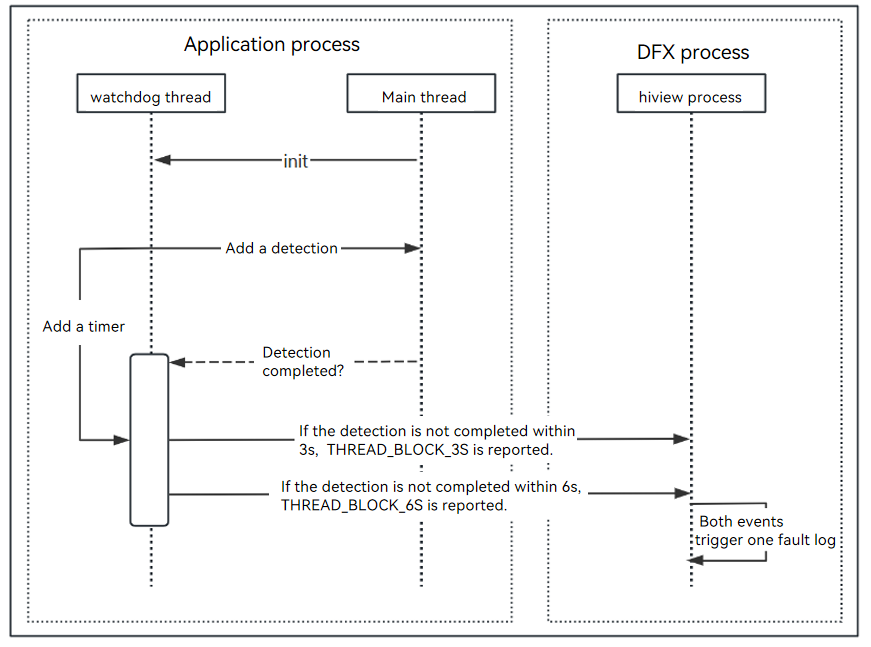
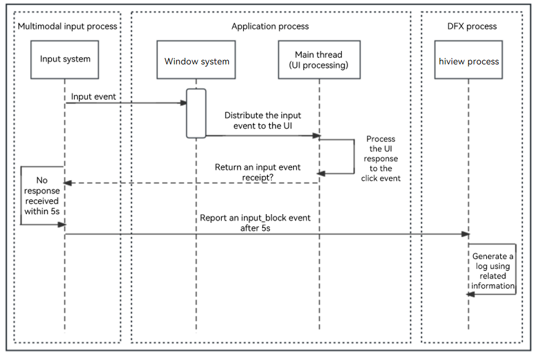
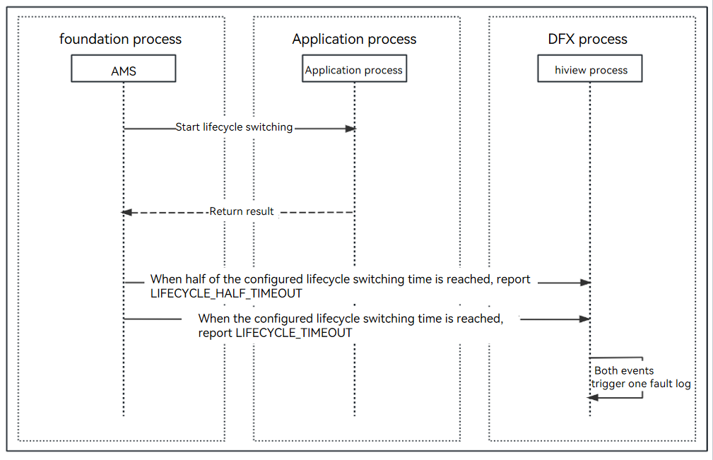

# Application Freeze Detection

<!--Kit: Performance Analysis Kit-->
<!--Subsystem: HiviewDFX-->
<!--Owner: @Chenyufan466765692-->
<!--Designer: @peterhuangyu-->
<!--Tester: @gcw_KuLfPSbe;@lipengpeng97-->
<!--Adviser: @jinqiuheng-->
<!-- md-trans-meta sourceCommit=903fa1e7788456f1328927a68af57d97fa343a93 translatedAt=2026-08-15T01:46:35.884Z pushedAt=2026-08-15T07:06:33.952Z -->

## Overview

AppFreeze (application freeze) means that an application does not respond to user operations (for example, clicking) for a specified period of time. In this case, the system detects AppFreeze faults and generates AppFreeze logs for fault analysis.

> **NOTE**
>
> This guide applies only to applications in the stage model. Before using this guide, you must have basic knowledge about the JS applications, C++ program stacks, and application-related subsystems.

## Detection Principles

Currently, AppFreeze detection supports the fault types listed in the following table.

> **NOTE**
>
> When you install and start an app by clicking the **Debug** button in DevEco Studio, the timeout detection mechanism of the current project is automatically disabled. This prevents timeout detection from interfering with your debugging process.

| Event Type | Description | Fault Type |
| -------- | -------- | -------- |
| THREAD_BLOCK_3S | App freeze alarm event, triggered when the app main thread executes a task for more than 3s.<br>**Note:** This type is supported since API version 26.0.0. | [THREAD_BLOCK_6S App Main Thread Freeze Timeout](#thread_block_6s-app-main-thread-freeze-timeout) |
| THREAD_BLOCK_6S | App freeze event, triggered when the app main thread executes a task for more than 6s. | [THREAD_BLOCK_6S App Main Thread Freeze Timeout](#thread_block_6s-app-main-thread-freeze-timeout) |
| APP_INPUT_BLOCK | App freeze event, triggered when the user input response times out. | [APP_INPUT_BLOCK User Input Response Timeout](#app_input_block-user-input-response-timeout) |
| LIFECYCLE_HALF_TIMEOUT | App freeze alarm event, triggered when the half-lifecycle threshold is exceeded during UIAbility lifecycle switching.<br>**Note:** This type is supported since API version 26.0.0. | [LIFECYCLE_TIMEOUT Lifecycle Switch Timeout](#lifecycle_timeout-lifecycle-switch-timeout) |
| LIFECYCLE_TIMEOUT | App freeze event, triggered when UIAbility lifecycle switching times out.<br>**Note:** This type is supported since API version 26.0.0. | [LIFECYCLE_TIMEOUT Lifecycle Switch Timeout](#lifecycle_timeout-lifecycle-switch-timeout) |

When the preceding alarm events are triggered, an app freeze alarm event is reported. You can subscribe to [App Freeze Warning Event Overview](hiappevent-watcher-appfreezewarning-events.md) through HiAppEvent.

When any of the preceding app freeze faults occurs, the system kills the app to ensure that it is recoverable and reports the app freeze event. You can subscribe to [Application Freeze Event Overview](hiappevent-watcher-freeze-events.md) through HiAppEvent.

### THREAD_BLOCK_6S App Main Thread Freeze Timeout

**Description**: This fault indicates that the main thread of this application is suspended or too many tasks are executed, affecting task execution smoothness and experience.

**Detection principle**: The watchdog thread of the application periodically inserts an activation detection to the main thread. If the activity detection is not executed within 3s, the **THREAD_BLOCK_3S** warning event is reported. If the activity detection is not executed within 6s, the **THREAD_BLOCK_6S** main thread timeout event is reported. The two events constitute an AppFreeze log.

The following figure shows the detection principle.

**Figure 1**



### APP_INPUT_BLOCK User Input Response Timeout

**Description**: This fault occurs when the tap event is not responded within 5 seconds.

> **NOTE**
>
> Since **API version 24**, the detection threshold has been extended from 5s to 8s.

**Detection principle**: When a user taps an application, the input system sends a tap event to the application. If the application response times out, this fault is reported.

The following figure shows the detection principle.

**Figure 2**



### LIFECYCLE_TIMEOUT Lifecycle Switch Timeout

**Overview**: Lifecycle switch timeout means that the [UIAbility lifecycle](../application-models/uiability-lifecycle.md) switching process is not completed within the specified time. Possible causes include: the app performs time-consuming operations during lifecycle switching, or background tasks have low priority and insufficient resource supply.

This fault occurs during lifecycle switching and affects the switching between Abilities within the app or between different PageAbilities.

Since **API version 26.0.0**, you can configure the following environment variables in the **AppScope/app.json5** file to retrieve fault logs. For details about how to retrieve logs, see [Obtaining Logs](#obtaining-logs).

> **NOTE**
>
> After log retrieval is configured, logs of this type are reported to third-party apps as the Appfreeze type, which increases Appfreeze fault statistics and is counted in Appfreeze fault metrics.

```text
"appEnvironments": [
  {
    "name": "DFX_APPFREEZE_LOG_OPTIONS",
    "value": "report_lifecycle_as_appfreeze:enable;"
  }
]
```

**Detection principle**: Ability Manager Service (AMS), as the system service that coordinates Ability running and lifecycle scheduling, sends lifecycle switch instructions to the app process and waits for the app to return the result. If the task is not completed within the specified time, a fault is reported.

Lifecycle switch timeout consists of two events: `LIFECYCLE_HALF_TIMEOUT` and `LIFECYCLE_TIMEOUT`. If the half-lifecycle threshold is exceeded during lifecycle switching without execution, a `LIFECYCLE_HALF_TIMEOUT` alarm event is reported. If the full lifecycle threshold is exceeded without execution, a `LIFECYCLE_TIMEOUT` deadlock event is reported. The two events are matched to generate an app not responding log. `LIFECYCLE_HALF_TIMEOUT` serves as the alarm event for `LIFECYCLE_TIMEOUT` and captures information such as `Binder`.

Different lifecycle timeouts have different timeout durations, as shown in the following table.

| Lifecycle | Timeout |
| -------- | -------- |
| Load | 10s |
| Foreground | 5s |

**Figure 3**



## Obtaining Logs

Both application freeze logs and process crash logs are managed by the FaultLogger module and can be obtained using any of the following methods:

**Method 1: DevEco Studio**

DevEco Studio collects process crash logs from **/data/log/faultlog/faultlogger/** to FaultLog, where logs are displayed by process name and fault time. For details about how to obtain logs, see [Fault Log](https://developer.huawei.com/consumer/en/doc/harmonyos-guides/ide-fault-log).

**Method 2: HiAppEvent APIs**

HiAppEvent provides APIs for subscribing to faults. For details, see [Introduction to HiAppEvent](hiappevent-intro.md). Subscribe to the application freeze event by referring to [Subscribing to Application Freeze Events (ArkTS)](hiappevent-watcher-freeze-events-arkts.md) or [Subscribing to Application Freeze Events (C/C++)](hiappevent-watcher-freeze-events-ndk.md), and read the fault log file content based on the [external_log](hiappevent-watcher-freeze-events.md#event-fields) field of the event.

**Method 3: hdc**

Enable **Developer options** and run the `hdc file recv /data/log/faultlog/faultlogger D:\` command to export fault logs to the local device. The fault log file name is in the format of **appfreeze-process name-process UID-millisecond-level timestamp.log**.

## Log Specifications

You need to analyze AppFreeze problems based on AppFreeze logs and HiLog logs.

A fault analysis example is provided below. Analyze the problem based on the module information in the log.

AppFreeze logs consist of the following information:

### Header Information

```text
Generated by HiviewDFX@OpenHarmony
================================================================
<!--RP2-->
Device info:OpenHarmony 3.2
Build info:OpenHarmony 6.1.0.125
<!--RP2End-->
DeviceDebuggable:No
Fingerprint:e18a33c12e1361173ec9ac1c93f2bd0c2daa88f03c7f76b228cca14bdc6a21b1
Module name:com.samples.freezedebug
ReleaseType:release
CpuAbi:arm64-v8a
Version:1.0.0
VersionCode:1000000
IsSystemApp:No
PreInstalled:No
Foreground:Yes
Pid:13680
Uid:20020177
App running unique id:124500628566978194
Process life time:18s
Process Memory(kB):163819(Rss)
Device Memory(kB):Total 11679272, Free 3697424, Available 5814272
Reason:THREAD_BLOCK_6S
appfreeze: com.samples.freezedebug THREAD_BLOCK_6S at 20250628140837
DisplayPowerInfo:powerState:UNKNOWN
HitraceIdInfo: hitrace_id: a92ab27238f409a, span_id: 1cd61c9, parent_span_id: 3072e, trace_flag: 0
Page switch history:
  14:08:30:327 /ets/pages/Index:Appfreeze
  14:08:28:986 /ets/pages/Index
  14:08:26:502 :enters foreground
  14:08:07:606 :leaves foreground
  14:08:06:246 /ets/pages/Index:Appfreeze
  14:08:01:955 :enters foreground
>>>>>>>>>>>>>>>>>>>>>>>>>>>>>>>>>>>>>>>>>>>
DOMAIN:AAFWK
STRINGID:THREAD_BLOCK_6S
TIMESTAMP:2025/06/28-14:08:37:360
PID:13680
UID:20020177
PACKAGE_NAME:com.samples.freezedebug
PROCESS_NAME:com.samples.freezedebug
NOTE: Current fault may be caused by the system's low memory or thermal throttling, you may ignore it and analysis other faults.Current process has encountered fd leak which may lead to appfreeze, you may refer to resource overlimit event from hiAppEvent for further analysis.
***
```

Since API version 20, when a device resource alarm is generated (for example, the device memory is low or thermal throttling is enabled), the system outputs a NOTE line. In this case, you can ignore the app freeze fault. In earlier API versions, the system does not output this NOTE line regardless of the device resource status.

Since API version 20, when a `THREAD_BLOCK_6S` fault occurs, [HiTraceId](../reference/apis-performance-analysis-kit/js-apis-hitracechain.md#hitraceid) information is added to the log. `HiTraceId` is a unique trace identifier provided by HiTraceChain, used to track the business process call chain. It can help you view the hilog logs of the fault process during the fault period and analyze the logs to check the execution status of the app.

Since API version 26.0.0, AppFreeze logs support associating [Resource Leak](https://developer.huawei.com/consumer/en/doc/harmonyos-guides/resource-leak-guidelines) detection event information. If the current process already has a memory leak before the freeze fault occurs, the fault log prompts the leak event and indicates that it may be the cause of the freeze.

The following table lists information in AppFreeze events (`THREAD_BLOCK_6S` and `APP_INPUT_BLOCK`).

| Field| Description|
| -------- | -------- |
| DeviceDebuggable | Whether the device system version is debuggable. This field is independent of developer options.<br>**Note:** Supported since API version 23. |
| ReleaseType | App version type. The value **release** indicates that the app is a [release-type app](https://developer.huawei.com/consumer/en/doc/harmonyos-guides/ide-hvigor-compilation-options-customizing-guide#section192461528194916), and the value **debug** indicates that the app is a [debug-type app](https://developer.huawei.com/consumer/en/doc/harmonyos-guides/ide-hvigor-compilation-options-customizing-guide#section192461528194916).<br>**Note:** Supported since API version 23. |
| CpuAbi | Binary interface type.<br>**Note:** Supported since API version 23. |
| IsSystemApp | Whether the app is a system app.<br>**Note:** Supported since API version 23. |
| Reason | Reason why the application freezes, corresponding to the application freeze detection capability.|
| PID | PID of the faulty process.|
| PACKAGE_NAME | Application process package name.|
|[Page switch history](./cppcrash-guidelines.md#faults-with-page-switching-history)| Starting from API version 20, the maintenance and debugging process records the app switch history. When an app fault occurs, the generated fault file includes the page switch history trace. This field is not included if the maintenance and debugging service process crashes or is terminated, or if the page switch history trace fails to be cached.|
| App running unique id | Unique ID associated with the app at runtime.<br>**Note:** Supported since API version 26.0.0.|
| Process life time | Survival time of the fault process. Unit: s.<br>**Note:** Supported since API version 22.|
| Process Memory(kB) | Memory usage of the fault process.<br>**Note:** Supported since API version 22.|
| Device Memory(kB) | Device memory information.<br>**Note:** Supported since API version 22.|

### General Information in the Log Body

```text
start time: 2025/06/28-14:08:34:318
DOMAIN = AAFWK
EVENTNAME = THREAD_BLOCK_3S
TIMESTAMP = 2025/06/28-14:08:34:310
PID = 13680
UID = 20020177
TID = 13680
PACKAGE_NAME = com.samples.freezedebug
PROCESS_NAME = com.samples.freezedebug
eventLog_action = ffrt,t,GpuStack,cmd:m,hot
eventLog_interval = 10
this thread has blocked 3000ms.
IS_FROZEN = 0
MSG =
Fault time:2025/06/28-14:08:34
App main thread is not response!
Main handler dump start time: 2025-06-28 14:08:34.067
mainHandler dump is:
 EventHandler dump begin curTime: 2025-06-28 14:08:34.067
 Event runner (Thread name = , Thread ID = 13680) is running
 Current Running: start at 2025-06-28 14:08:27.354, Event { send thread = 13680, send time = 2025-06-28 14:08:22.353, handle time = 2025-06-28 14:08:27.353, trigger time = 2025-06-28 14:08:27.354, task name = uv_timer_task, caller = [ohos_loop_handler.cpp(OnTriggered:72)] }
 History event queue information:
 No. 0 : Event { send thread = 13856, send time = 2025-06-28 14:08:22.336, handle time = 2025-06-28 14:08:22.336, trigger time = 2025-06-28 14:08:22.336, completeTime time = 2025-06-28 14:08:22.337, priority = VIP, task name = MMITask, caller = [deamon_io_waiter.cpp(HandleFileDescriptorEvent:225)] }
...
 No. 31 : Event { send thread = 13856, send time = 2025-06-28 14:08:22.330, handle time = 2025-06-28 14:08:22.380, trigger time = 2025-06-28 14:08:22.330, completeTime time = 2025-06-28 14:08:22.331, priority = VIP, task name = vSyncTask, caller = [deamon_io_waiter.cpp(PostTaskForVsync:159)] }
 VIP priority event queue information:
 No.1 : Event { send thread = 13843, send time = 2025-06-28 14:08:31.066, handle time = 2025-06-28 14:08:31.066, id = 1, caller = [watchdog.cpp(Timer:233)] }
 No.2 : Event { send thread = 13843, send time = 2025-06-28 14:08:34.067, handle time = 2025-06-28 14:08:34.067, id = 1, caller = [watchdog.cpp(Timer:233)] }
 Total size of VIP events : 2
 Immediate priority event queue information:
 Total size of Immediate events : 0
 High priority event queue information:
 Total size of High events : 0
 Low priority event queue information:
 Total size of Low events : 0
 Idle priority event queue information:
 Total size of Idle events : 0
 Total event size : 2
```

AppFreeze events `THREAD_BLOCK_6S` and `APP_INPUT_BLOCK` both contain the following information:

Since API version 26.0.0, AppFreeze events additionally support `LIFECYCLE_TIMEOUT`.

| Field | Description |
| -------- | -------- |
| EVENTNAME | Composes the freeze detection event. |
| TIMESTAMP | Time when the event is reported upon fault occurrence. You can narrow the log viewing time range in the corresponding hilog stream based on the timeout described in the application not responding detection capability. |
| PID | PID at the time of fault occurrence. |
| UID | UID at the time of fault occurrence. |
| TID | TID at the time of fault occurrence. |
| PACKAGE_NAME | App process package name. |
| PROCESS_NAME | App process name. |
| MSG | Fault occurrence time and EventHandler information. |
| IS_FROZEN | Process frozen state at the time of fault occurrence.<br/>- 0 indicates that the process is not frozen.<br/>- 1 indicates that the process is frozen.<br>**Note:** Supported since API version 26.0.0.|
| this thread has blocked 3000ms. | When a thread blocking fault occurs, the app thread task execution times out by 3 seconds (that is, the THREAD_BLOCK_3S threshold). The specific timeout is subject to the actual value in the log (3000ms in the example).<br>**Note:** Supported since API version 26.0.0.|

**EventHandler** information. The details are as follows:

The following table lists fields in the dump information.

| Field | Description |
| -------- | -------- |
| EventHandler dump begin curTime | Time when the dump information is obtained. |
| Event runner | Thread name and thread ID corresponding to the EventHandler. |
| Current Running | Complete information about the currently running task. |
| History event queue information | Information about historically executed tasks. |
| VIP priority event queue information | VIP-level task queue information. |
| Immediate priority event queue information | Immediate execution task queue information. |
| High priority event queue information | High-priority task queue information. |
| Low priority event queue information | Low-priority task queue information. |
| Idle priority event queue information | Suspended task queue information. |

The following table lists fields in the task information.

| Field | Description |
| -------- | -------- |
| send thread | Thread ID that submits the task. |
| send time | Time when the task is submitted. |
| task name | Task name in the task queue. |
| priority | Task priority. |
| caller | Task submission method. |
| handle time | Expected task execution time, which may deviate from the actual task execution time (trigger time). |
| trigger time | Task execution time. |
| completeTime time | Task execution completion time (if not printed, the task has not been executed to completion). |

> **NOTE**
>
> In the **EventHandler** information, you only need to pay attention to **EventHandler dump begin curTime**, **trigger time**, and **completeTime time**.
>
>  

### Stack Information

Stack information of the fault process.

```text
Tid:13680, Name:les.freezedebug
state=S, utime=0, stime=0, priority=0, nice=-20, clk=100
#00 pc 000000000000186c [shmm](__kernel_gettimeofday+72)
#01 pc 00000000001d887c /system/lib/ld-musl-aarch64.so.1(gettimeofday+40)(f1a940981720250b920ee26d2d76af5b)
#02 pc 000000000058fb5c /system/lib64/platformsdk/libark_jsruntime.so(panda::ecmascript::builtins::BuiltinsDate::Now(panda::ecmascript::EcmaRuntimeCallInfo*)+48)(0f1928b77d36d27edb5512bd89806a6f)
#03 pc 0000000000cff5dc /system/lib64/module/arkcompiler/stub.an(RTStub_PushCallArgsAndDispatchNative+40)
#04 pc 000000000036aaf4 /system/lib64/module/arkcompiler/stub.an(BCStub_HandleCallthis0Imm8V8StwCopy+380)
#05 at wait15s (entry/src/main/ets/pages/Index.ets:16:10)
#06 pc 000000000026b1dc /system/lib64/platformsdk/libark_jsruntime.so(panda::ecmascript::InterpreterAssembly::Execute(panda::ecmascript::EcmaRuntimeCallInfo*)+536)(0f1928b77d36d27edb5512bd89806a6f)
#07 pc 000000000096b188 /system/lib64/platformsdk/libark_jsruntime.so(panda::FunctionRef::CallForNapi(panda::ecmascript::EcmaVM const*, panda::JSValueRef*, panda::JSValueRef* const*, int)+1432)(0f1928b77d36d27edb5512bd89806a6f)
#08 pc 000000000006b7a4 /system/lib64/platformsdk/libace_napi.z.so(napi_call_function+212)(eaa639519e67e8495ca596293a0d33cd)
#09 pc 000000000000b17c /system/lib64/platformsdk/libtimer.z.so(OHOS::JsSysModule::Timer::TimerCallback(uv_timer_s*) (.cfi)+528)(764291289e89523cdbe9c3c78c1cca35)
#10 pc 0000000000013ea8 /system/lib64/platformsdk/libuv.so(uv__run_timers+68)(9e7eb59ca1a45f4230b641a7c940a20b)
#11 pc 000000000001a344 /system/lib64/platformsdk/libuv.so(uv_run+376)(9e7eb59ca1a45f4230b641a7c940a20b)
#12 pc 00000000000895a8 /system/lib64/platformsdk/libruntime.z.so(OHOS::AbilityRuntime::OHOSLoopHandler::OnTriggered()+140)(daf29e377c47e3e26282e745dd1b3488)
#13 pc 0000000000089b4c /system/lib64/platformsdk/libruntime.z.so(std::__h::__function::__func<OHOS::AbilityRuntime::OHOSLoopHandler::OnTriggered()::$_0, std::__h::allocator<OHOS::AbilityRuntime::OHOSLoopHandler::OnTriggered()::$_0>, void ()>::operator()() (.9efded9864dc55830f61b3b92d59beab)+52)(daf29e377c47e3e26282e745dd1b3488)
#14 pc 000000000001ff6c /system/lib64/chipset-sdk-sp/libeventhandler.z.so(OHOS::AppExecFwk::(anonymous namespace)::EventRunnerImpl::ExecuteEventHandler(std::__h::unique_ptr<OHOS::AppExecFwk::InnerEvent, void (*)(OHOS::AppExecFwk::InnerEvent*)>&)+2228)(475713336c2720d372d5aeb99dda5f9f)
#15 pc 000000000001a7d8 /system/lib64/chipset-sdk-sp/libeventhandler.z.so(OHOS::AppExecFwk::(anonymous namespace)::EventRunnerImpl::Run()+648)(475713336c2720d372d5aeb99dda5f9f)
#16 pc 000000000003f5f4 /system/lib64/chipset-sdk-sp/libeventhandler.z.so(OHOS::AppExecFwk::EventRunner::Run()+404)(475713336c2720d372d5aeb99dda5f9f)
#17 pc 00000000000a50f0 /system/lib64/platformsdk/libappkit_native.z.so(OHOS::AppExecFwk::MainThread::Start()+504)(e794b687fdf46631ae5144eba250f8c0)
#18 pc 0000000000005278 /system/lib64/appspawn/appspawn/libappspawn_ace.z.so(RunChildProcessor(AppSpawnContent*, AppSpawnClient*)+568)(143c05087e9460f0fd794b9dce5dec29)
#19 pc 000000000000baa8 /system/bin/appspawn(AppSpawnChild+648)(25ab88f6e04b1d2c8feb5d3eebfb4664)
#20 pc 0000000000016478 /system/bin/appspawn(ProcessSpawnReqMsg+3260)(25ab88f6e04b1d2c8feb5d3eebfb4664)
#21 pc 0000000000013aac /system/bin/appspawn(OnReceiveRequest+724)(25ab88f6e04b1d2c8feb5d3eebfb4664)
#22 pc 0000000000017844 /system/lib64/chipset-sdk-sp/libbegetutil.z.so(HandleRecvMsg_+384)(a9ddb8b84cc09183cc6bd2e5bb875f30)
#23 pc 000000000001715c /system/lib64/chipset-sdk-sp/libbegetutil.z.so(HandleStreamEvent_+152)(a9ddb8b84cc09183cc6bd2e5bb875f30)
#24 pc 000000000001444c /system/lib64/chipset-sdk-sp/libbegetutil.z.so(ProcessEvent+380)(a9ddb8b84cc09183cc6bd2e5bb875f30)
#25 pc 0000000000013edc /system/lib64/chipset-sdk-sp/libbegetutil.z.so(RunLoop_.llvm.16927440879641410339+656)(a9ddb8b84cc09183cc6bd2e5bb875f30)
#26 pc 0000000000010dcc /system/bin/appspawn(AppSpawnRun+212)(25ab88f6e04b1d2c8feb5d3eebfb4664)
#27 pc 000000000000eb90 /system/bin/appspawn(main+728)(25ab88f6e04b1d2c8feb5d3eebfb4664)
#28 pc 00000000000a9804 /system/lib/ld-musl-aarch64.so.1(libc_start_main_stage2+84)(f1a940981720250b920ee26d2d76af5b)
```

<!--RP4--><!--RP4End-->

In most cases, the stack information of `THREAD_BLOCK_6S`, `LIFECYCLE_TIMEOUT`, and `APP_INPUT_BLOCK` faults can help you locate the abnormal code.

In other cases (for example, in the instant stack), the stack information cannot be obtained immediately due to the busy main thread. As a result, the abnormal code segment cannot be captured in a timely manner, and the stack top information is not as expected.

To solve this problem, enhanced AppFreeze logs can be obtained since API version 21. For details, see [Implementation Principles](#implementation-principles).

If the stack content of the fault process is missing, the following log information may appear:

| Log Information | Description |
| ------------- | ----------------------------------------------------------------------------------------------------------------- |
| has been crashed | The target process has crashed. A stack capture request is received within 10s after the crash request of the target process is received. Refer to the crash logs near the fault time. Check whether the app uses signal handling functions correctly or uses non-signal-safe functions. |
| SIGDUMP error | The target process has already exited when the stack capture request is received.|
| is dumping | The target process is dumping. For consecutive requests within a short period, refer to other error logs of this process near the fault time.|
| State: S | The target process is sleeping.|
| errno(2) | The target process does not respond to signals. When no stack information is returned after a 1s timeout, the kernel stack and /proc/status are printed in the log.|

> **NOTE**
>
> When the system is heavily loaded (for example, high CPU load), the function name information may be lost if the call stack is obtained in low-overhead mode.
>
> Since API version 21, when the message "Failed to dump normal stacktrace" is displayed, the system uses the lightweight frame pointer backtracing mode. Stack backtracing may be interrupted in libraries that do not enable the frame pointer (when the **-fomit-frame-pointer** option is used during GCC compilation, the compilation product does not enable the frame pointer). In addition, the number of stack layers of a single thread may not exceed 50 due to lightweight restrictions.

Since API version 23, information such as the thread state is added under the thread ID to determine whether the problem is caused by system freeze. **state** indicates the thread running state, **priority** and **nice** indicate the scheduling priority, and **stime** and **utime** indicate the running time. If the stack running time of `THREAD_BLOCK_3S` and `THREAD_BLOCK_6S` shows no change, it indicates that the process is not scheduled. After analyzing the service code and confirming that there is no blocking call, you can determine that the problem is a system scheduling issue. When thread state information fails to be obtained, none of the following fields are displayed. The thread state information in the fault log is in the following format:

```text
state=S, utime=0, stime=0, priority=0, nice=-20, clk=100
```

The fields are described as follows:

| Field| Description|
| -------- | -------- |
| state | Thread running state, which is read from the value of **state** in **/proc/pid/stat**.|
| utime | Number of CPU ticks consumed by the thread in user mode, which is read from the value of **utime** in **/proc/pid/stat**.|
| stime | Number of CPU ticks consumed by the thread in kernel mode, which is read from the value of **stime** in **/proc/pid/stat**.|
| priority | Real-time priority, which is read from the value of **priority** in **/proc/pid/stat**.|
| nice | Static priority, which is read from the value of **nice** in **/proc/pid/stat**.|
| clk | Number of clock ticks per second, which is obtained through **sysconf(_SC_CLK_TCK)**. If the value fails to be obtained, the default value **100** is used. The running time (unit: second) can be calculated by dividing the number of clock ticks by this value.|

### Peer Information (Information About the Process That Communicates with the Faulty Process)

(1) **BinderCatcher**: Displays the IPC call information and cases where the waiting time is excessive.

```text
PeerBinderCatcher -- pid==13680
BinderCatcher --
    13840:14102 to 901:4079 code 16 wait:0.25653125 s frz_state:3,  ns:-1:-1 to -1:-1, debug:13840:14102 to 901:4079, active_code:0, active_thread=0, pending_async_proc=0
    3712:3712 to 13967:14076 code d2 wait:0.703385417 s frz_state:3,  ns:-1:-1 to -1:-1, debug:3712:3712 to 13967:14076, active_code:0, active_thread=0, pending_async_proc=0
    1733:2285 to 3712:3712 code b wait:1.365925521 s frz_state:3,  ns:-1:-1 to -1:-1, debug:1733:2285 to 3712:3712, active_code:0, active_thread=0, pending_async_proc=0
...
pid context     request started max ready   free_async_space
14072   binder  0   2   16  3   520192
14103   binder  0   4   16  6   520192
13967   binder  0   3   16  3   520192
13878   binder  0   2   16  3   520192
13840   binder  0   2   16  3   520192
13863   binder  0   1   16  3   520192
13680   binder  0   2   16  3   520192
13770   binder  0   3   16  5   520192
13749   binder  0   3   16  5   520192
...

```

The IPC information is described as follows.

| Field| Description|
| -------- | -------- |
| xxx:xxx to xxx:xxx | Client process ID and thread ID to server process ID and thread ID. **async** indicates asynchronous; no **async** indicates synchronous.|
| code | Service code agreed by the client and server.|
| wait | Communication waiting duration.|
| frz_state | Process freeze state.<br>**-1**: Unknown.<br>**1**: Default.<br>**2**: The binder status information is being sent to the user mode.<br>**3**: The binder receiving thread is reached.|
| ns | Client process ID and thread ID to server process ID and thread ID. |
| debug | Supplementary information about the IPC parties.|
| active_code | Code of the asynchronous message that is being processed.|
| active_thread | Thread that processes the asynchronous message.|
| pending_async_proc | Process blocked by the asynchronous message.|
| pid | Process ID.|
| context | Communication mode.|
| request | Number of IPC threads requested.|
| started | Number of started IPC threads.|
| max | Maximum number of IPC threads that can be requested.|
| ready | Idle IPC thread.|
| free_async_space | Free asynchronous space, which is used to observe asynchronous information blocking.|

(2) **PeerBinder Stacktrace**: Stack traces of unresponsive peer processes communicating with the faulty process.

```text
Tid:48841, Name:xxx
#00 pc 000000000016adf4 /system/lib/ld-musl-aarch64.so.1
#01 pc 000000000001c0d4 /system/lib64/chipset-sdk-sp/libeventhandler.z.so
#02 pc 000000000001a7f4 /system/lib64/chipset-sdk-sp/libeventhandler.z.so
#03 pc 000000000003f5f4 /system/lib64/chipset-sdk-sp/libeventhandler.z.so
#04 pc 00000000000a50f0 /system/lib64/platformsdk/libappkit_native.z.so
#05 pc 0000000000005278 /system/lib64/appspawn/appspawn/libappspawn_ace.z.so
#06 pc 000000000000baa8 /system/bin/appspawn
#07 pc 0000000000016478 /system/bin/appspawn
#08 pc 0000000000013aac /system/bin/appspawn
#09 pc 0000000000017844 /system/lib64/chipset-sdk-sp/libbegetutil.z.so
#10 pc 000000000001715c /system/lib64/chipset-sdk-sp/libbegetutil.z.so
#11 pc 000000000001444c /system/lib64/chipset-sdk-sp/libbegetutil.z.so
#12 pc 0000000000013edc /system/lib64/chipset-sdk-sp/libbegetutil.z.so
#13 pc 0000000000010dcc /system/bin/appspawn
#14 pc 000000000000eb90 /system/bin/appspawn
#15 pc 00000000000a9804 /system/lib/ld-musl-aarch64.so.1
#16 pc 000000000000b754 /system/bin/appspawn
```

### CPU Information

The system CPU information is as follows:

```text
Load average: 14.3 / 12.9 / 11.4; the cpu load average in 1 min, 5 min and 15 min
CPU usage from 2025-06-28 14:08:36 to 2025-06-28 14:08:37
Total: 22.45%; User Space: 13.64%; Kernel Space: 8.81%; iowait: 0.33%; irq: 0.07%; idle: 77.15%
Details of Processes:
    PID   Total Usage      User Space    Kernel Space    Page Fault Minor    Page Fault Major    Name
    13680      8.86%           8.31%          0.55%            4711                6637            com.samples.freezedebug
    644        2.55%           1.40%          1.15%          210104                7391            hiview
    600        0.89%           0.78%          0.10%           60192                 514            hilogd
    1685       0.53%           0.31%          0.22%          879838               59636            foundation
```

| Field| Description|
| -------- | -------- |
| PID | Process ID.|
| Total Usage | CPU usage. **Total Usage** = **User Space** + **Kernel Space**.|
| User Space | CPU usage in user mode.|
| Kernel Space | CPU usage in kernel mode.|
| Page Fault Minor | Minor page fault.|
| Page Fault Major | Major page fault.|
| Name | Name of the process.|

### Memory Information

```text
Get freeze memory start time: 2025-06-28 14:08:37.112
some avg10=56.81 avg60=56.81 avg300=56.81 total=56
full avg10=56.81 avg60=56.81 avg300=56.81 total=56
...
ReclaimAvailBuffer:                    4676608 kB
...
```

The preceding shows the system memory information. **ReclaimAvailBuffer** indicates the remaining available system memory, which is used to check whether the memory is low.

## Log Differences

**Lifecycle Timeout Event**

The following is an example of lifecycle timeout log difference content:

```text
DOMAIN:AAFWK
STRINGID:LIFECYCLE_TIMEOUT
TIMEOUT TIMESTAMP:2025/02/10-21:40:59:113
PID:1561
UID:20010039
PACKAGE_NAME:com.example.myapplication
PROCESS_NAME:com.example.myapplication
MSG:ability:EntryAbility background timeout
server actions for ability:
2025-02-10 21:40:56.376; AbilityRecord::ProcessForegroundAbility; the ProcessForegroundAbility lifecycle starts.
2025-02-10 21:40:56.377; ServiceInner::UpdateAbilityState
server actions for app:
2025-02-10 21:40:56.397; AppRunningRecord::OnWindowVisibilityChanged
2025-02-10 21:40:56.851; AppRunningRecord::OnWindowVisibilityChanged
2025-02-10 21:40:58.668; AppRunningRecord::OnWindowVisibilityChanged
client actions for ability:
2025-02-10 21:40:56.378; AbilityThread::ScheduleAbilityTransaction
2025-02-10 21:40:56.378; AbilityThread::HandleAbilityTransaction
2025-02-10 21:40:56.382; JsUIAbility::OnStart begin
2025-02-10 21:40:56.382; JsUIAbility::OnStart end
2025-02-10 21:40:56.387; JsUIAbility::OnSceneCreated begin
2025-02-10 21:40:56.388; JsUIAbility::OnSceneCreated end
2025-02-10 21:40:56.388; JsUIAbility::WindowScene::GoForeground begin
2025-02-10 21:40:56.389; UIAbilityImpl::WindowLifeCycleImpl::AfterForeground
2025-02-10 21:40:56.392; JsUIAbility::IntentForeground execute start begin
2025-02-10 21:40:56.397; JsUIAbility::IntentForeground end
2025-02-10 21:40:56.397; JsUIAbility::OnForeground begin
client actions for app:
```

The following table uses **two complete lifecycle switches** as an example to explain the information in MSG.

> **NOTE**
>
> Each record carries a timestamp. The time-consuming step can be located by the timestamp difference between adjacent records.
>
> The "Failure Cause" column describes the possible cause of timeout for this step.
>
> The "Requires App Handling" column indicates whether app handling is required and how to handle it.
>
> Records marked with "(Exception Scenario)" appear only when the corresponding exception occurs. Records marked with "([InsightIntent](../application-models/insight-intent-overview.md) Scenario)" appear only when the intent framework is involved.

1. Load phase events, using the case where the app process is not created as an example.

   | server | client | Description | Failure Cause | Requires App Handling |
   | ------------------------------------------------------------- | ---------------------------------------- | --------------------------------------------------------------- | --------------------------------------------------------------- | --------------------------------------------------------------- |
   | AbilityRecord::LoadAbility; the LoadAbility lifecycle starts. | - | The Ability load lifecycle starts. The system prepares the resources and process required for loading the Ability. Marks the start of the load phase. | - | No, system-side scheduling. |
   | AppMgrServiceInner::LoadAbility | - | Before creating the app process, the server starts processing the Ability load request and checks the process status. | - | No, system-side scheduling. |
   | AppMgrService::AttachApplication | - | After the app process is created successfully, the process initiates an attach request to the server to establish a communication channel. | - | No, system-side scheduling. |
   | ServiceInner::AttachApplication | - | The server processes the process attach, records process information, and prepares for subsequent scheduling. | - | No, system-side scheduling. |
   | ServiceInner::LaunchApplication | - | The server schedules the app to execute the load process and notifies the app process to perform initialization. | - | No, system-side scheduling. |
   | AppRunningRecord::LaunchApplication | - | Schedules the app to execute the load process. | - | No, system-side scheduling. |
   | AppRunningRecord::LaunchApplication; null scheduler (Exception Scenario) | - | The scheduler is null when scheduling the app load process. Exception information is recorded. | - | No, system-side scheduling issue. |
   | AppScheduler::ScheduleLaunchApplication | - | Sends the ScheduleLaunchApplication scheduling request to the app process through IPC. | - | No, system-side IPC. |
   | write launchData fail (Exception Scenario) | - | Failed to serialize launchData. | - | No, system-side data issue. |
   | write config fail (Exception Scenario) | - | Failed to serialize config. | - | No, system-side data issue. |
   | ScheduleLaunchApplication ipc error * (Exception Scenario) | - | ScheduleLaunchApplication IPC call failed. The IPC error code is recorded. | IPC communication exception. | No, system-side IPC issue. |
   | - | ScheduleLaunchApplication | The app process receives the app load scheduling request and starts preparing the load environment. | The main thread is blocked and does not process the IPC request in time. | Yes, check whether the main thread has time-consuming tasks or blocking calls. |
   | - | HandleLaunchApplication begin | The app starts executing the load logic. | The Application initialization logic is time-consuming. | Yes, check whether the app has abnormal time consumption. |
   | - | HandleLaunchApplication end | The app load logic execution ends. The load time can be calculated by comparing with begin. | - | Yes, check whether the app has abnormal time consumption. |
   | AppRunningRecord::LaunchPendingAbilities | - | Schedules the pending abilities in the app and triggers specific Ability loading. | - | No, system-side scheduling. |
   | AppLifeCycleDeal::LaunchAbility | - | The server schedules the app to load a specific Ability through IPC. | IPC communication failed, or serialization of [Want](../application-models/want-overview.md) failed. | No, system-side IPC issue. |
   | AppLifeCycleDeal::LaunchAbility; write want fail (Exception Scenario) | - | Failed to serialize want data. Exception information is recorded. | The want parameter is too large or contains non-serializable objects. | Yes, check whether the want parameter contains excessively large or non-serializable data. |
   | AppLifeCycleDeal::LaunchAbility; ipc error * (Exception Scenario) | - | ScheduleLaunchAbility IPC call failed. The IPC error code is recorded. | IPC communication exception. | No, system-side IPC issue. |
   | - | MainThread::ScheduleLaunchAbility | The app process receives the request to load the Ability and prepares to execute the Ability creation process. | The main thread is blocked. | Yes, check whether the main thread has time-consuming tasks. |
   | - | MainThread::HandleLaunchAbility | The app main thread processes the Ability load request. | - | No, system-side load process. |
   | - | JsAbilityStage::Create | Loads [AbilityStage](../application-models/abilitystage.md). | - | No, system-side load process. |
   | - | JsAbilityStage::OnCreate begin | The AbilityStage [onCreate](../reference/apis-ability-kit/js-apis-app-ability-abilityStage.md#oncreate) lifecycle starts. | Time-consuming operations are executed in AbilityStage onCreate. | Yes, avoid executing time-consuming operations in AbilityStage onCreate. |
   | - | JsAbilityStage::OnCreate end | The AbilityStage onCreate lifecycle ends, and AbilityStage initialization is complete. The time can be calculated by comparing with begin. | AbilityStage onCreate takes too long. | Yes, optimize the AbilityStage onCreate logic. |
   | - | JsAbilityStage::OnAboutToCreateAbility begin (InsightIntent Scenario) | AbilityStage is about to create an Ability callback). | Time-consuming operations are executed in onAboutToCreateAbility. | Yes, avoid executing time-consuming operations in onAboutToCreateAbility. |
   | - | JsAbilityStage::OnAboutToCreateAbility end (InsightIntent Scenario) | The onAboutToCreateAbility callback ends. The time can be calculated by comparing with begin. | onAboutToCreateAbility takes too long. | Yes, optimize the onAboutToCreateAbility logic. |
   | - | JsAbilityStage::OnAboutToCreateAbilityAsync begin (InsightIntent Scenario) | Asynchronously creates an Ability (onAboutToCreateAbilityAsync callback). | The asynchronous Promise is not resolved in time. | Yes, ensure that the Promise returned by onAboutToCreateAbilityAsync is resolved in time. |
   | - | JsAbilityStage::OnAboutToCreateAbilityAsync end (InsightIntent Scenario) | The onAboutToCreateAbilityAsync callback ends. | The asynchronous Promise is not resolved in time. | Yes, ensure that the Promise returned by onAboutToCreateAbilityAsync is resolved in time. |
   | - | AbilityThread::CreateObjError (Exception Scenario) | Failed to create the Ability JS object. Exception information is recorded. | The Ability class is not registered, or JS engine initialization failed. | Yes, check whether the Ability class is correctly registered and exported. |
   | - | AbilityThread::Attach | The Ability binder is attached to the server side to establish communication. | - | No, system-side IPC. |
   | - | AbilityThread::Attach; error * (Exception Scenario) | AttachAbilityThread IPC call failed. The error code is recorded. | IPC communication exception. | No, system-side IPC issue. |
   | AbilityManagerService::AttachAbilityThread; the end of load lifecycle. | - | The server confirms that AbilityThread attachment is complete, and the load lifecycle ends. | - | No, system-side scheduling. |

2. Foreground phase events, with cold start of the app.

   | server | client | Description | Failure Cause | Requires App Handling |
   | ------------------------------------------------------------- | ---------------------------------------- | --------------------------------------------------------------- | --------------------------------------------------------------- | --------------------------------------------------------------- |
   | AbilityRecord::ProcessForegroundAbility; the ProcessForegroundAbility lifecycle starts. | - | The start phase of the Ability entering the foreground lifecycle. Marks the start of the foreground phase. | - | No, system-side scheduling. |
   | ServiceInner::UpdateAbilityState | - | Schedules the app to the foreground first. | - | No, system-side scheduling. |
   | AppRunningRecord::ScheduleForegroundRunning | - | Schedules the app to the foreground and notifies the app process to enter the foreground running mode. | - | No, system-side scheduling. |
   | AppRunningRecord::ScheduleForegroundRunning; null scheduler (Exception Scenario) | - | The scheduler is null when scheduling the app to the foreground. Exception information is recorded. | - | No, system-side scheduling issue. |
   | ScheduleForegroundRunning fail (Exception Scenario) | - | ScheduleForegroundRunning scheduling failed. Exception information is recorded. | - | No, system-side scheduling issue. |
   | AppScheduler::ScheduleForegroundApplication | - | Sends the ScheduleForegroundApplication scheduling request to the app through IPC. | - | No, system-side IPC. |
   | ScheduleForegroundApplication ipc error * (Exception Scenario) | - | ScheduleForegroundApplication IPC call failed. The IPC error code is recorded. | IPC communication exception. | No, system-side IPC issue. |
   | - | ScheduleForegroundApplication | The app process receives the scheduling instruction and starts processing the app foreground switch. | The main thread is blocked. | Yes, check whether the main thread has time-consuming tasks. |
   | - | HandleForegroundApplication | The main thread executes scheduling and distributes app foreground tasks to specific modules. | - | Yes, check whether Application onForeground is time-consuming. |
   | - | HandleForegroundApplication; fail (Exception Scenario) | PerformForeground execution failed. Exception information is recorded. | - | No, system-side scheduling issue. |
   | AppMgrService::AppForegrounded | - | The app foreground is complete. The server records that the app state has switched to foreground. | - | No, system-side scheduling. |
   | ServiceInner::AppForegrounded | - | The app foreground is complete. | - | No, system-side scheduling. |
   | AppRunningRecord::OnWindowVisibilityChanged | - | Window visibility changes. | - | No, system-side window scheduling. |
   | write want failed (Exception Scenario) | - | When the server schedules the Ability foreground transaction through ScheduleAbilityTransaction, serialization of [Want](../application-models/want-overview.md) failed. | The want parameter is too large or contains non-serializable objects. | Yes, check whether the want parameter contains excessively large or non-serializable data. |
   | write sessionInfo failed (Exception Scenario) | - | Failed to serialize sessionInfo. | - | No, system-side data issue. |
   | ScheduleAbilityTransaction ipc error * (Exception Scenario) | - | ScheduleAbilityTransaction IPC call failed. The IPC error code is recorded. | IPC communication exception. | No, system-side IPC issue. |
   | - | AbilityThread::ScheduleAbilityTransaction | The app receives the Ability foreground scheduling and prepares to perform transaction processing on the specific Ability. | The main thread is blocked. | Yes, check whether the main thread has time-consuming tasks. |
   | - | AbilityThread::HandleAbilityTransaction | The main thread executes Ability foreground scheduling and triggers the Ability lifecycle callback. | - | No, system-side recording. |
   | - | JsUIAbility::OnStart begin | The [onCreate](../reference/apis-ability-kit/js-apis-app-ability-uiAbility.md#oncreate) lifecycle starts. The Ability performs initialization. | Time-consuming operations are executed in onCreate. | Yes, avoid executing time-consuming operations in onCreate. |
   | - | JsUIAbility::OnStart end | The onCreate lifecycle ends, and the initial resources of the Ability are ready. The time can be calculated by comparing with begin. | onCreate takes too long. | Yes, avoid executing time-consuming operations in onCreate. |
   | - | JsUIAbility::OnSceneCreated begin | Window scene creation starts. | Time-consuming operations are executed in [onWindowStageCreate](../reference/apis-ability-kit/js-apis-app-ability-uiAbility.md#onwindowstagecreate). | Yes, avoid executing time-consuming operations in onWindowStageCreate. |
   | - | JsUIAbility::OnSceneCreated end | Window scene creation ends. The time can be calculated by comparing with begin. | onWindowStageCreate takes too long. | Yes, avoid executing time-consuming operations in onWindowStageCreate. |
   | - | JsUIAbility::OnWillForeground begin | The [onWillForeground](../reference/apis-ability-kit/js-apis-app-ability-uiAbility.md#onwillforeground20) callback starts. | Time-consuming operations are executed in onWillForeground. | Yes, avoid executing time-consuming operations in onWillForeground. |
   | - | JsUIAbility::OnWillForeground end | The onWillForeground callback ends. The time can be calculated by comparing with begin. | onWillForeground takes too long. | Yes, avoid executing time-consuming operations in onWillForeground. |
   | - | JsUIAbility::WindowScene::GoForeground begin | Calling the window interface to execute GoForeground starts. | Window scene initialization failed, or the window system responds slowly. | No, window system issue. |
   | - | JsUIAbility::DoOnForegroundForSceneIsNull; error * (Exception Scenario) | Window scene initialization failed. The error code is recorded. | Window scene creation failed, or displayId acquisition failed. | No, window system issue. |
   | - | UIAbilityImpl::WindowLifeCycleImpl::AfterForeground | Callback after the window goes to the foreground. | Window GoForeground did not call back in time. | No, window system issue. |
   | - | UIAbilityImpl::WindowLifeCycleImpl::ForegroundFailed; GoForeground failed (Exception Scenario) | Window GoForeground failed. Exception information is recorded. | - | No, window system issue. |
   | - | JsUIAbility::IntentForeground execute start begin (InsightIntent Scenario) | Execution of app foreground-related [intent](../application-models/insight-intent-overview.md) operations starts, processing Intent tasks triggered by the foreground switch. | The InsightIntent executor did not return in time. | Yes, ensure that the Intent executor completes in time. |
   | - | JsUIAbility::IntentForeground end (InsightIntent Scenario) | Execution of app foreground-related intent operations ends, and Intent-related logic has been processed. The time can be calculated by comparing with start. | The InsightIntent executor takes too long. | Yes, ensure that the Intent executor completes in time. |
   | - | JsUIAbility::IntentRepeat execute start (InsightIntent Scenario) | Intent repeat execution mode starts. | The InsightIntent executor did not return in time. | Yes, ensure that the Intent executor completes in time. |
   | - | JsUIAbility::IntentRepeat execute end (InsightIntent Scenario) | Intent repeat execution mode ends. The time can be calculated by comparing with start. | The InsightIntent executor takes too long. | Yes, ensure that the Intent executor completes in time. |
   | - | JsUIAbility::IntentPage execute start (InsightIntent Scenario) | Intent page execution mode starts. | The InsightIntent executor did not return in time. | Yes, ensure that the Intent executor completes in time. |
   | - | JsUIAbility::IntentPage execute end (InsightIntent Scenario) | Intent page execution mode ends. The time can be calculated by comparing with start. | The InsightIntent executor takes too long. | Yes, ensure that the Intent executor completes in time. |
   | - | UIAbilityImpl::HandleExecuteInsightIntentForeground (InsightIntent Scenario) | Processes foreground intent execution. | InsightIntent parameter generation failed. | Yes, check the InsightIntent parameter configuration. |
   | - | JsUIAbility::OnForeground begin | The [onForeground](../reference/apis-ability-kit/js-apis-app-ability-uiAbility.md#onforeground) lifecycle starts, notifying you that the Ability is displayed in the foreground. | Time-consuming operations are executed in onForeground. | Yes, avoid executing time-consuming operations in onForeground. |
   | - | JsUIAbility::OnForeground end | The onForeground lifecycle ends, and the foreground lifecycle callback of the Ability is complete. The time can be calculated by comparing with begin. | onForeground takes too long. | Yes, avoid executing time-consuming operations in onForeground. |
   | - | JsUIAbility::OnDidForeground begin | The [onDidForeground](../reference/apis-ability-kit/js-apis-app-ability-uiAbility.md#ondidforeground20) callback starts. | Time-consuming operations are executed in onDidForeground. | Yes, avoid executing time-consuming operations in onDidForeground. |
   | - | JsUIAbility::OnDidForeground end | The onDidForeground callback ends. The time can be calculated by comparing with begin. | onDidForeground takes too long. | Yes, avoid executing time-consuming operations in onDidForeground. |
   | - | AbilityManagerClient::AbilityTransitionDone | The client notifies AMS that the foreground switch is complete. | AbilityTransitionDone IPC call failed. | No, system-side IPC issue. |
   | - | AbilityTransitionDone; write saveData failed (Exception Scenario) | The client failed to serialize saveData. Exception information is recorded. | - | No, system-side data issue. |
   | - | AbilityTransitionDone; ipc error * (Exception Scenario) | AbilityTransitionDone IPC call failed. The IPC error code is recorded. | IPC communication exception. | No, system-side IPC issue. |
   | AbilityManagerService::AbilityTransitionDone; the end of foreground lifecycle. | - | The server confirms that the foreground switch is complete, and the foreground lifecycle ends. | The client did not call AbilityTransitionDone in time. | No, system-side scheduling. |

See [Log Specifications](#log-specifications) to analyze other log information. Note: If the main thread deadlocks during lifecycle switching, compare and analyze the stacks and `BinderCatcher` information from the two adjacent logs to locate the problem.

**APP_INPUT_BLOCK** User Input Response Timeout

```text
Generated by HiviewDFX@OpenHarmony
================================================================
...
Reason:APP_INPUT_BLOCK
appfreeze: com.samples.freezedebug APP_INPUT_BLOCK at 20251129123745
Wait Event(430) to be marked exceed 8000ms, lastDispatchEvent(430), lastProcessEvent(429), lastMarkedEvent(428)
DisplayPowerInfo:powerState:AWAKE
...
```

Since API version 22, when an **APP_INPUT_BLOCK** fault occurs, the log will output a timeout event (**Wait Event**) for multi-mode input (including mouse, keyboard, touchpad, and touchscreen). The event information includes the event ID, event detection timeout threshold, and previous event ID.

Event detection timeout threshold: 8000 ms for the log version and 5000 ms for the nolog version. Since **API version 24**, the `APP_INPUT_BLOCK` detection threshold is 8000 ms regardless of the version.

Previous events: **lastDispatchEvent** indicates the event dispatched last time; **lastProcessEvent** indicates the event processed last time; **lastMarkedEvent** indicates the event marked last time.

In the preceding example, the last dispatched event is **430**, the last processed event is **429**, and the last marked event is **428**, indicating that the event 430 has been dispatched and the processing times out for 8000 ms. This log can be used to determine the **APP_INPUT_BLOCK** event and help analyze the problem.

## AppFreeze Enhanced Log Information (Sampling Stack)

Since API version 21, enhanced AppFreeze logs can be obtained. In these logs, the running loads of the device and main thread are collected, and multiple call stacks of the main thread are captured to help you analyze the cause. Compared with the original logs, the enhanced AppFreeze logs address the following issues:

1. It is difficult to locate the main thread hotspot during the fault.

2. The resource layer analysis on the busy or blocked main thread is unavailable.

### Implementation Principles

The process of generating enhanced AppFreeze logs is as follows:

1. When `THREAD_BLOCK_3S` or `LIFECYCLE_HALF_TIMEOUT` occurs during app process running, the main thread call stack collection process is started, and some CPU information at the current moment is recorded.

2. When `THREAD_BLOCK_6S`, `LIFECYCLE_TIMEOUT`, or `APP_INPUT_BLOCK` occurs during app process running, the main thread call stack collection process described above is stopped, and the CPU information within the period is calculated. Generally, 1 to 10 stack logs are captured.

   > **NOTE**
   >
   > Since the sampling stack of app freeze events conflicts with [main thread timeout detection](apptask-timeout-guidelines.md#main-thread-timeout-detection), if the app accesses the setEventConfig API of `MAIN_THREAD_JANK` to customize the number of collected stacks, the number of stacks collected for app freeze events is the same as the number of stacks currently configured for the app.
   >
   > The prerequisite for `APP_INPUT_BLOCK` faults to have enhanced logs is that `THREAD_BLOCK_3S` or `LIFECYCLE_HALF_TIMEOUT` occurs first.

### Obtaining Logs

You can obtain the path of the enhanced AppFreeze logs using any of the following methods:

**Method 1: HiAppEvent APIs**

Starting from system versions <!--RP3-->OpenHarmony 6.1.0.125<!--RP3End--> and later, the system merges the AppFreeze enhanced log content into the end of the log pointed to by [external_log](hiappevent-watcher-freeze-events.md#params) of the `APP_FREEZE` event by default.

If you need a separate AppFreeze enhanced log file, configure the following environment variables in the **AppScope/app.json5** file:

   ```text
   "appEnvironments": [
     {
       "name": "DFX_APPFREEZE_LOG_OPTIONS",
       "value": "mainthread_sampling:enable"
     }
   ]
   ```

Use the fault subscription APIs provided by HiAppEvent to listen for the application freeze event and obtain the file content. For details, see [Application Freeze Event Overview](hiappevent-watcher-freeze-events.md). Subscribe to the application freeze event by referring to [Subscribing to Application Freeze Events (ArkTS)](hiappevent-watcher-freeze-events-arkts.md) or [Subscribing to Application Freeze Events (C/C++)](hiappevent-watcher-freeze-events-ndk.md).

You can read the fault file and enhanced log file generated by the application freeze event using the [external_log](hiappevent-watcher-freeze-events.md#event-fields) field. The name format of the enhanced log file is the same as that of the fault file.

**external_log** is a string array whose first element is the path to the fault file and whose second element is the path to the enhanced log file.

**Method 2: hdc**

Enable **Developer options** and run the `hdc file recv /data/log/faultlog/freeze_ext D:\` command to export fault logs to the local device. The fault log file name is in the format of **freeze-cpuinfo-ext-process name-process UID-millisecond-level timestamp**.

### Log Specifications

The enhanced log header contains the following fields:

|Field|Description|Initial API Version|
|---|---|---|
| TimeStamp | Log generation time.| 21 |
| Module name | Name of the faulty module.| 21 |

The following table lists the fields of the total CPU time consumption information in enhanced logs.

|Field|Description|Initial API Version|
|---|---|---|
| ProcessCpuTime | Process running time in a statistical period.| 21 |
| DeviceRuntime | Running time of all CPUs on the device in a statistical period.| 21 |
| Tid | Thread ID.| 21 |
| StartTime | Start time for statistics.| 21 |
| EndTime | End time for statistics.| 21 |
| StaticsDuration | Duration of statistics.| 21 |
| CpuTime | Running time of the main thread in a statistical period.| 21 |
| SyncWaitTime | Waiting time of the main thread.| 21 |
| OptimalCpuTime | Running time of the main thread with the optimal load in a statistical period (using the maximum computing power of the maximum number of cores).| 21 |
| SupplyAvailableTime | Time that can be optimized by scheduling. If the value is small, the main thread is busy. In this case, you need to optimize the main thread tasks.| 21 |

The main thread stack information fields in enhanced logs are as follows:

|Field|Description|Initial API Version|
|---|---|---|
| SnapshotTime | Time when the main thread stack is captured.| 21 |
| ThreadInfos Tid | Thread ID.| 21 |
| Name | Thread name.| 21 |
| Stack | Main thread call stack.| 21 |
| SubmitterStacktrace | Task submitter call stack.| 21 | 

### Enhanced Log Specifications

This section mainly describes the general log specifications of enhanced logs. The following is the core content of an AppFreeze enhanced log. You can use the [clustering rules](#enhanced-log-information-clustering) to extract key information of the main thread stack, improving the efficiency and accuracy of problem locating.

```text
Generated by HiviewDFX @OpenHarmony
===============================================================
TimeStamp: 2021-01-01 20:06:01.175  <- Log generation time.
Module name: com.example.freeze   <- Module name.

#Basic Concepts   <- CPU time comment.
T1:  StaticsDuration, EndTime - StartTime.
T2:  CpuTime              --Time that spend on CPU.
T3:  SyncWaitTime         --SleepingTime + Runnable Time, etc.
T4:  OptimalCpuTime       --run the thread at the max Core's max cpu capacity.
T5:  SupplyAvailableTime  --T2 - T4. Time can be optimized by scheduling.
Equation:  T1 = T2 + T3. T2 = T4 + T5.
|-----------------------------------StaticsDuration-----------------------------------|.
|-------------------------CpuTime----------------------|--------SyncWaitTime----------|.
|----OptimalCpuTime----|------SupplyAvailableTime------|--------SyncWaitTime----------|.

#Basic Statistical Infomation  <- Basic CPU statistics.
ProcessCpuTime: 0 ms  <- Running time of the process in a statistical period.
DeviceRuntime: 0 ms  <- Running time of all CPUs in a statistical period.
Tid: 2320  <- ID of the faulty main thread.
StartTime: 2021-01-01 20:05:58:177  <- Start time for statistics.
EndTime: 2021-01-01 20:06:01:172  <- End time for statistics.
StaticsDuration: 2995 ms  <- Duration of statistics.
CpuTime: 0 ms  <- Running time of the main thread in the statistical period.
SyncWaitTime: 2995 ms  <- Waiting time of the main thread.
OptimalCpuTime: 0 ms  <- Running time of the main thread with the optimal load in a statistical period (using the maximum computing power of the maximum number of cores).
SupplyAvailableTime: 0 ms  <- Time that can be optimized by scheduling.

#CpuFreq Usage (usage >=1%)  <- If the usage of a single CPU frequency is greater than or equal to 1%, the frequency and its usage are listed.
start time: 2021-01-01 20:06:00:888  <- Start time for calculating the CPU usage.
cpu0 Usage 23.5%, 1430MHZ 21.04%  <- Total usage of cpu0, and usage of a single frequency (1430 MHZ) of cpu0.
cpu1 Usage 23.5%, 1430MHZ 21.04%
cpu2 Usage 23.5%, 1430MHZ 21.04%
cpu3 Usage 23.5%, 1430MHZ 21.04%
.......
end time: 2021-01-01 20:06:00:888  <- End time for calculating the CPU usage.
#ThreadInfos Tid: 2204, Name: com.example.freeze  <- Faulty thread ID, and thread name.
SnapshotTime:2021-01-01-20-05-58.292875  <- Time when the main thread is captured.
#00 pc 00000000000015b8 [shmm](__kernel_gettimeofday+72) <- Main thread call stack
#01 pc 00000000001d7e44 /system/lib64/ld-musl-aarck64.so.1(clock_gettime+48)(f8a0616c89b184992d0e8883cc78f638)
#02 pc 00000000001d9f20 /system/lib64/ld-musl-aarck64.so.1(time+32)(f8a0616c89b184992d0e8883cc78f638)
#03 pc 0000000000007e2c /data/storage/el1/bundle/libs/arm64/libsample.so(WaitSomeTime()+76)(8b74cdc906ea6b2eba95d891bc91c72a)
#04 pc 0000000000009b2c /data/storage/el1/bundle/libs/arm64/libsample.so(8b74cdc906ea6b2eba95d891bc91c72a)
#05 pc 00000000000a0500 /system/lib64/platformsdk/libruntime.z.so(c2f75213ee12fdf08da323fe546923ff)
#06 pc 0000000000017b04 /system/lib64/chipset-sdk-sp/libeventhandler.z.so(366b4d7f2eba693ad06f14469b08943b)
#07 pc 0000000000016f38 /system/lib64/chipset-sdk-sp/libeventhandler.z.so(366b4d7f2eba693ad06f14469b08943b)
#08 pc 000000000003e160 /system/lib64/chipset-sdk-sp/libeventhandler.z.so(OHOS::AppExecFwk::EventRunner::Run()+396)(366b4d7f2eba693ad06f14469b08943b)
.......
========SubmitterStacktrace======== <- Task submitter call stack (up to 16 layers).
#00 pc 0000000000013108 /system/lib64/platformsdk/libuv.so(uv_queue_work+292)(366b4d7f2eba693ad06f14469b08943b)
#01 pc 0000000000008cdc /data/storage/el1bundle/libs/arm64/libsample.so(8b74cdc906ea6b2eba95d891bc91c72a)
#02 pc 000000000005ae00 /system/lib64/platformsdk/libace_napi.z.so(panda::JSValueRef ArkNativeFunctionCallBack<true>(panda::JsiRuntimeCallInfo*)+272)(bc1c64aabbe5c7d4db2282a6137443e1)
#03 pc 0000000000de3efc /system/lib64/module/arkcompiler/stub.an(RTStub_PushCallArgsAndDispatchNative+44)
#04 pc 0000000000448dd4 /system/lib64/module/arkcompiler/stub.an(BCStub_HandleCallthis0Imm8V8StwCopy+372)
#05 at anonymous (sample|sample|1.0.0|src/main/ets/pages/Index.ts:381:36)
#06 pc 00000000001e5c8c /system/lib64/platformsdk/libark_jsruntime.so(ce0b05d90b9fae02e7abf8e9f1e5a0f3)
.......

SnapshotTime: 2021-01-01-20-05-58.549685
#00 pc 00000000000015b8 [shmm](__kernel_gettimeofday+72)
#01 pc 00000000001d7e44 /system/lib64/ld-musl-aarck64.so.1(clock_gettime+48)(f8a0616c89b184992d0e8883cc78f638)
#02 pc 00000000001d9f20 /system/lib64/ld-musl-aarck64.so.1(time+32)(f8a0616c89b184992d0e8883cc78f638)
#03 pc 0000000000007e2c /data/storage/el1/bundle/libs/arm64/libsample.so(WaitSomeTime()+76)(8b74cdc906ea6b2eba95d891bc91c72a)
#04 pc 0000000000009b2c /data/storage/el1/bundle/libs/arm64/libsample.so(8b74cdc906ea6b2eba95d891bc91c72a)
#05 pc 00000000000a0500 /system/lib64/platformsdk/libruntime.z.so(c2f75213ee12fdf08da323fe546923ff)
.......
========SubmitterStacktrace========
#00 pc 0000000000013108 /system/lib64/platformsdk/libuv.so(uv_queue_work+292)(366b4d7f2eba693ad06f14469b08943b)
#01 pc 0000000000008cdc /data/storage/el1bundle/libs/arm64/libsample.so(8b74cdc906ea6b2eba95d891bc91c72a)
#02 pc 000000000005ae00 /system/lib64/platformsdk/libace_napi.z.so(panda::JSValueRef ArkNativeFunctionCallBack<true>(panda::JsiRuntimeCallInfo*)+272)(bc1c64aabbe5c7d4db2282a6137443e1)
#03 pc 0000000000de3efc /system/lib64/module/arkcompiler/stub.an(RTStub_PushCallArgsAndDispatchNative+44)
#04 pc 0000000000448dd4 /system/lib64/module/arkcompiler/stub.an(BCStub_HandleCallthis0Imm8V8StwCopy+372)
#05 at anonymous (sample|sample|1.0.0|src/main/ets/pages/Index.ts:381:36)
.......
```

## AppFreeze Clustering

### Clustering Introduction

AppFreeze issues generated by an app in different versions or at different times within the same version may have the same root cause. However, most information generated in AppFreeze fault logs varies depending on factors such as version and occurrence time, making it difficult to quickly determine whether multiple issues are duplicates.

AppFreeze fault information contains call stacks from both the system side and the app side, which makes it difficult for app developers to quickly troubleshoot app-side issues.

Therefore, to avoid repeatedly analyzing multiple fault reports and improve the efficiency of app fault analysis, AppFreeze fault information needs to be clustered.

Clustering also helps you classify and collect statistics on issues with different causes.

### Clustering Scope

The fault thread information in AppFreeze fault logs represents the code call information when a business thread encounters a fault. The same fault thread call stack information necessarily indicates the same fault cause.

Therefore, using fault thread information as the clustering scope is the most accurate approach. You can add other fault log information based on service-specific clustering requirements.

For details about fault thread information, see [Stack Information](#stack-information).

### AppFreeze Fault Information Clustering

The clustering method for AppFreeze fault information is the same as that for Cpp Crash. For details, see [CppCrash Clustering](cppcrash-guidelines.md#cppcrash-clustering).

> **NOTE**
>
> If IPC stack frames exist in the fault thread stack, [binder](#peer-information-information-about-the-process-that-communicates-with-the-faulty-process) stack information can be obtained for clustering.

### Enhanced Log Information Clustering

The clustering specifications for enhanced log information are consistent with those for extracting stack information from AppFreeze fault information. Enhanced log information is mainly included in clustering to address cases where AppFreeze fault stack information is insufficient for clustering.

You can obtain clustering features for enhanced log information by referring to [AppFreeze Fault Information Clustering](#appfreeze-fault-information-clustering) and use these features for clustering enhanced log information.

## Disabling AppFreeze Detection

During development and debugging, you can disable AppFreeze detection by using the following commands to prevent timeout detection from affecting your development and debugging.

### Environment Requirements

Before using the disabling command, obtain the [hdc tool](hdc.md#environment-setup) and run `hdc shell` to enter the device shell.

### Constraints

- **App type restriction**: Only debug-type apps support disabling detection. Release-type apps do not support this feature.

- **Execution timing restriction**: Run the disabling command after the app is started.

### How to Use

**Enter debug mode**

```shell
aa attach -b <bundleName>
```

Examples:

```shell
aa attach -b com.example.appfreeze
```

When the app successfully enters debug mode, the following is returned:

```text
attach app debug successfully.
```

When the given `<bundleName>` parameter is invalid or does not exist, the following content is returned. For more details, see [attach](../tools/aa-tool.md#attach).

```text
error: failed to attach app debug.
```

**Exit debug mode**

After debugging is complete, run the `aa detach` command to exit debug mode and restore the AppFreeze detection capability, ensuring that fault detection is not affected during normal app running.

```shell
aa detach -b <bundleName>
```

Examples:

```shell
aa detach -b com.example.appfreeze
```

When the app exits debug mode, the following is returned:

```text
detach app debug successfully.
```

When the given `<bundleName>` parameter is invalid or does not exist, the following content is returned. For more details, see [detach](../tools/aa-tool.md#detach).

```text
error: failed to detach app debug.
```

