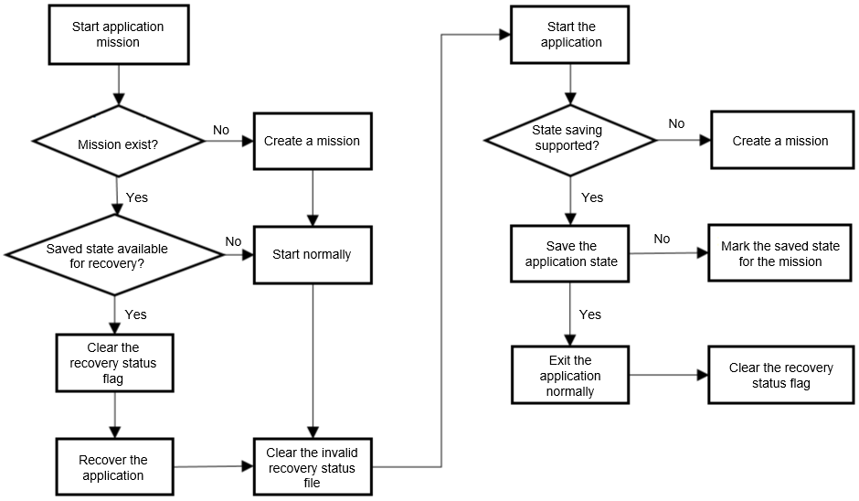
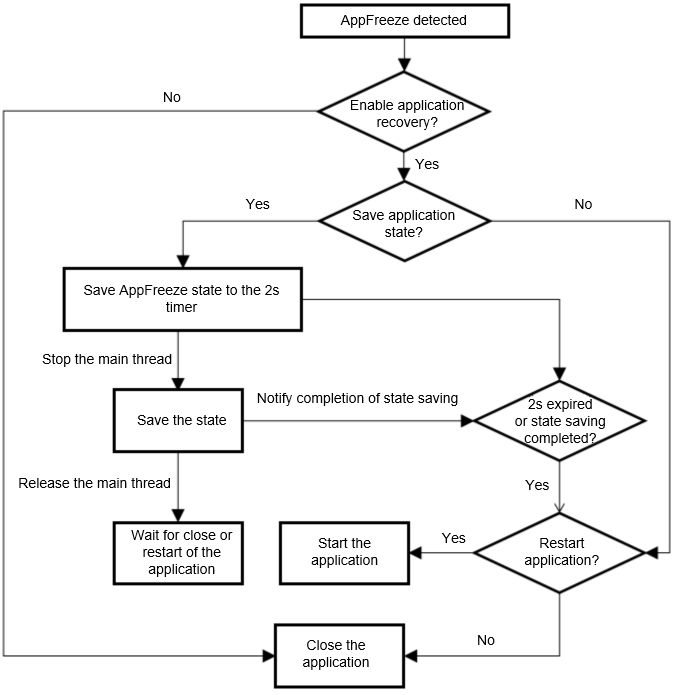
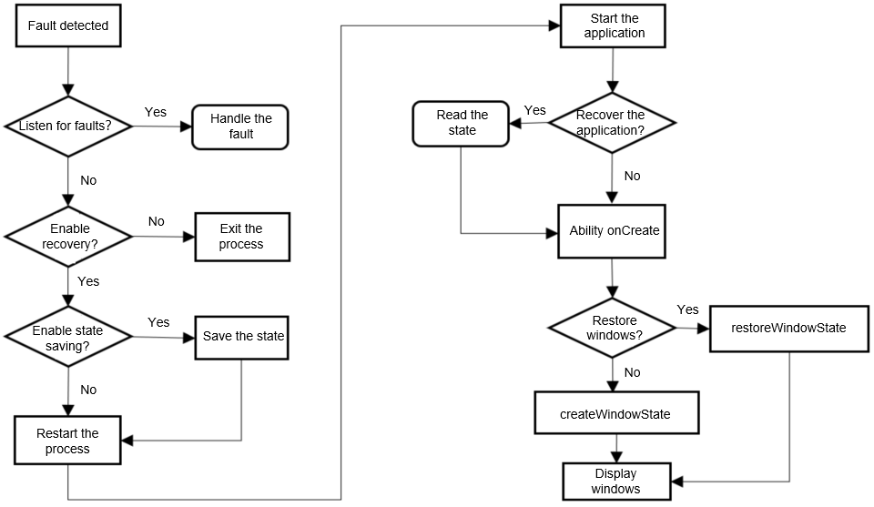

# Development of Application Recovery

## Overview

During application running, some unexpected behaviors are inevitable. For example, unprocessed exceptions and errors are thrown, and the call or running constraints of the recovery framework are violated.

Process exit is treated as the default exception handling method. However, if user data is generated during application use, process exit may interrupt user operations and cause data loss.
If the [application recovery](#available-apis) function is enabled in [AbilityStage](../reference/apis-ability-kit/js-apis-app-ability-abilityStage.md) and temporary data is saved, the previous application state and data will be restored upon next startup in the case of an abnormal exit, providing more consistent user experience. The application state includes two parts, namely, the page stack and the data saved in **onSaveState**.

In API version 9, application recovery is supported only for a single ability of the application developed using the stage model. Application state saving and automatic restart are performed when a JsError occurs.

In API version 10, application recovery is applicable to multiple abilities of an application developed using the stage model. Application state storage and restore are performed when an AppFreeze occurs. If an application is killed in control mode, the application state will be restored upon next startup.

## Available APIs

The application recovery APIs are provided by the **appRecovery** module, which can be imported via **import**. For details, see [Development Example](#development-example).

### Available APIs

| API                                                      | Description                                                |
| ------------------------------------------------------------ | ---------------------------------------------------- |
| enableAppRecovery(restart?: RestartFlag, saveOccasion?: SaveOccasionFlag, saveMode?: SaveModeFlag) : void;<sup>9+</sup> | Enables application recovery. After this API is called, the first ability that is displayed when the application is started from the initiator can be restored.|
| saveAppState(): boolean;<sup>9+</sup> | Saves the state of the ability that supports recovery in the current application. |
| restartApp(): void;<sup>9+</sup> | Restarts the current process and starts the ability specified by **setRestartWant**. If no ability is specified, a foreground ability that supports recovery is restarted. |
| saveAppState(context?: UIAbilityContext): boolean;<sup>10+</sup> | Saves the ability state specified by **Context**. |
| setRestartWant(want: Want): void;<sup>10+</sup> | Sets the abilities to restart when **restartApp** is actively called and **RestartFlag** is not **NO_RESTART**. The abilities must be under the same bundle name and must be a **UIAbility**. |

No error will be thrown if the preceding APIs are used in the troubleshooting scenario. The following are some notes on API usage:

**enableAppRecovery**: This API should be called during application initialization. For example, you can call this API in **onCreate** of **AbilityStage**. For details, see [Parameter Description](../reference/apis-ability-kit/js-apis-app-ability-appRecovery.md).

**saveAppState**: After this API is called, the recovery framework invokes **onSaveState** for all abilities that support recovery in the current process. If you choose to save data in **onSaveState**, the related data and ability page stack are persistently stored in the local cache of the application. To save data of the specified ability, you need to specify the context corresponding to that ability.

**setRestartWant**: This API specifies the ability to be restarted by **appRecovery**.

**restartApp**: After this API is called, the recovery framework kills the current process and restarts the ability specified by **setRestartWant**, with **APP_RECOVERY** set as the startup cause. In API version 9 and scenarios where an ability is not specified by **setRestartWant**, the last foreground ability that supports recovery is started. If the no foreground ability supports recovery, the application crashes. If a saved state is available for the restarted ability, the saved state is passed as the **wantParam** attribute in the **want** parameter of the ability's **onCreate** callback. The interval between two restarts must be greater than 1 minute. If this API is called repeatedly within 1 minute, the application exits but does not restart. The behavior of automatic restart is the same as that of proactive restart.

### Application State Management
Since API version 10, application recovery is not limited to automatic restart in the case of an exception. Therefore, you need to understand when the application will load the saved state.
If the last exit of an application is not initiated by a user and a saved state is available for recovery, the startup reason is set to **APP_RECOVERY** when the application is started by the user next time, and the recovery state of the application is cleared.
The application recovery status flag is set when **saveAppState** is actively or passively called. The flag is cleared when the application exits normally or the saved state is consumed. (A normal exit is usually triggered by pressing the back key or clearing recent tasks.)



### Application State Saving and Restore
API version 10 or later supports saving of the application state when an application is suspended. If a JsError occurs, **onSaveState** is called in the main thread. If an AppFreeze occurs, however, the main thread may be suspended, and therefore **onSaveState** is called in a non-main thread. The following figure shows the main service flow.


When the application is suspended, the callback is not executed in the JS thread. Therefore, you are advised not to use the imported dynamic Native library or access the **thread_local** object created by the main thread in the code of the **onSaveState** callback.

### Framework Fault Management

Fault management is an important way for applications to deliver a better user experience. The application framework offers three methods for application fault management: fault listening, fault rectification, and fault query.

- Fault listening refers to the process of registering an [ErrorObserver](../reference/apis-ability-kit/js-apis-inner-application-errorObserver.md) via [errorManager](../reference/apis-ability-kit/js-apis-app-ability-errorManager.md), listening for faults, and notifying the listener of the faults.

- Fault rectification refers to the process of restoring the application state and data through [appRecovery](../reference/apis-ability-kit/js-apis-app-ability-appRecovery.md).

- Fault query is the process of calling APIs of [faultLogger](../reference/apis-performance-analysis-kit/js-apis-faultLogger.md) to obtain the fault information.

The figure below does not illustrate the time when [faultLogger](../reference/apis-performance-analysis-kit/js-apis-faultLogger.md) is called. You can refer to the [LastExitReason](../reference/apis-ability-kit/js-apis-app-ability-abilityConstant.md#abilityconstantlastexitreason) passed during application initialization to determine whether to call [faultLogger](../reference/apis-performance-analysis-kit/js-apis-faultLogger.md) to query information about the previous fault.

It is recommended that you call [errorManager](../reference/apis-ability-kit/js-apis-app-ability-errorManager.md) to handle the exception. After the processing is complete, you can call the **saveAppState** API and restart the application.
If you do not register an [ErrorObserver](../reference/apis-ability-kit/js-apis-inner-application-errorObserver.md) instance or enable application recovery, the application process will exit according to the default processing logic of the system. Users can restart the application from the home screen.
If you have enabled application recovery, the recovery framework first checks whether application state saving is supported and whether the application state saving is enabled. If so, the recovery framework invokes [onSaveState](../reference/apis-ability-kit/js-apis-app-ability-uiAbility.md#uiabilityonsavestate) of the [ability](../reference/apis-ability-kit/js-apis-app-ability-uiAbility.md). Finally, the application is restarted.

### Supported Application Recovery Scenarios

Common fault types include JavaScript application crash, application freezing, and C++ application crash. Generally, an application is closed when a crash occurs. Application freezing occurs when the application does not respond. The fault type can be ignored for the upper layer of an application. The recovery framework implements fault management in different scenarios based on the fault type.

| Fault  | Fault Listening | State Saving | Automatic Restart | Log Query |
| ----------|--------- |--------- |--------- |--------- |
| [JS_CRASH](../reference/apis-performance-analysis-kit/js-apis-faultLogger.md#faulttype) | Supported|Supported|Supported|Supported|
| [APP_FREEZE](../reference/apis-performance-analysis-kit/js-apis-faultLogger.md#faulttype) | Not supported|Supported|Supported|Supported|
| [CPP_CRASH](../reference/apis-performance-analysis-kit/js-apis-faultLogger.md#faulttype) | Not supported|Not supported|Not supported|Supported|

**State Saving** in the table header means saving of the application state when a fault occurs. To protect user data as much as possible when an AppFreeze occurs, you can adopt either the periodic or automatic way, and the latter will save user data when an ability is switched to the background.


## Development Example

### Enabling Application Recovery

   Enable **appRecovery** during application initialization. The following is an example of **AbilityStage**:

```ts
import { AbilityStage, appRecovery } from '@kit.AbilityKit';

export default class MyAbilityStage extends AbilityStage {
    onCreate() {
        console.info("[Demo] MyAbilityStage onCreate");
        appRecovery.enableAppRecovery(appRecovery.RestartFlag.ALWAYS_RESTART,
            appRecovery.SaveOccasionFlag.SAVE_WHEN_ERROR | appRecovery.SaveOccasionFlag.SAVE_WHEN_BACKGROUND,
            appRecovery.SaveModeFlag.SAVE_WITH_FILE);
    }
}
```
### Enabling Application Recovery for the Specified Abilities
Generally, the ability configuration list is named **module.json5**.
```json
{
    "abilities": [
      {
        "name": "EntryAbility",
        "recoverable": true,
      }]
}

```

### Saving and Restoring Data

After enabling **appRecovery**, you can use this function by either actively or passively saving the application state and restoring data in the ability.
The following is an example of **EntryAbility**:

#### Importing the Service Package

```ts
import { AbilityConstant, appRecovery, errorManager } from '@kit.AbilityKit';
```

#### Actively Saving the Application State and Restoring Data

- Define and register the [ErrorObserver](../reference/apis-ability-kit/js-apis-inner-application-errorObserver.md) callback. For details about its usage, see [errorManager](../reference/apis-ability-kit/js-apis-app-ability-errorManager.md).

```ts
import { appRecovery, errorManager, UIAbility } from '@kit.AbilityKit';
import { window } from '@kit.ArkUI';

let registerId = -1;
let callback: errorManager.ErrorObserver = {
    onUnhandledException(errMsg) {
    console.log(errMsg);
    appRecovery.saveAppState();
    appRecovery.restartApp();
    }
}

export default class EntryAbility extends UIAbility {
    onWindowStageCreate(windowStage: window.WindowStage) {
    // Main window is created, set main page for this ability
    console.log("[Demo] EntryAbility onWindowStageCreate");
    registerId = errorManager.on('error', callback);

    windowStage.loadContent("pages/index", (err, data) => {
        if (err.code) {
        console.error('Failed to load the content. Cause:' + JSON.stringify(err));
        return;
        }
        console.info('Succeeded in loading the content. Data: ' + JSON.stringify(data));
    })
    }
}
```

- Save data.

After the callback triggers **appRecovery.saveAppState()**, **onSaveState(state, wantParams)** of **EntryAbility** is triggered.

```ts
import { AbilityConstant, UIAbility } from '@kit.AbilityKit';

export default class EntryAbility extends UIAbility {
    onSaveState(state:AbilityConstant.StateType, wantParams: Record<string, Object>) {
        // Ability has called to save app data
        console.log("[Demo] EntryAbility onSaveState");
        wantParams["myData"] = "my1234567";
        return AbilityConstant.OnSaveResult.ALL_AGREE;
    }
}
```

- Restore data.

After the callback triggers **appRecovery.restartApp()**, the application is restarted. After the restart, **onCreate(want, launchParam)** of **EntryAbility** is called, and the saved data is stored in **parameters** of **want**.

```ts
import { AbilityConstant, UIAbility, Want } from '@kit.AbilityKit';

let abilityWant: Want;

export default class EntryAbility extends UIAbility {
    storage: LocalStorage | undefined = undefined;

    onCreate(want: Want, launchParam: AbilityConstant.LaunchParam) {
        console.log("[Demo] EntryAbility onCreate");
        abilityWant = want;
        if (launchParam.launchReason == AbilityConstant.LaunchReason.APP_RECOVERY) {
            this.storage = new LocalStorage();
            if (want.parameters) {
                let recoveryData = want.parameters["myData"];
                this.storage.setOrCreate("myData", recoveryData);
                this.context.restoreWindowStage(this.storage);
            }
        }
    }
}
```

- Unregister the **ErrorObserver** callback.

```ts
import { errorManager, UIAbility } from '@kit.AbilityKit';

let registerId = -1;

export default class EntryAbility extends UIAbility {
    onWindowStageDestroy() {
        // Main window is destroyed, release UI related resources
        console.log("[Demo] EntryAbility onWindowStageDestroy");

        errorManager.off('error', registerId, (err) => {
            console.error("[Demo] err:", err);
        });
    }
}
```

#### Passively Saving the Application State and Restoring Data

This is triggered by the recovery framework. You do not need to register an **ErrorObserver** callback. You only need to implement **onSaveState** for application state saving and **onCreate** for data restore.

```ts
import { AbilityConstant, UIAbility, Want } from '@kit.AbilityKit';

let abilityWant: Want;

export default class EntryAbility extends UIAbility {
    storage: LocalStorage | undefined = undefined
    onCreate(want: Want, launchParam: AbilityConstant.LaunchParam) {
    console.log("[Demo] EntryAbility onCreate");
        abilityWant = want;
        if (launchParam.launchReason == AbilityConstant.LaunchReason.APP_RECOVERY) {
            this.storage = new LocalStorage();
            if (want.parameters) {
                let recoveryData = want.parameters["myData"];
                this.storage.setOrCreate("myData", recoveryData);
                this.context.restoreWindowStage(this.storage);
            }
        }
    }

    onSaveState(state:AbilityConstant.StateType, wantParams: Record<string, Object>) {
        // Ability has called to save app data
        console.log("[Demo] EntryAbility onSaveState");
        wantParams["myData"] = "my1234567";
        return AbilityConstant.OnSaveResult.ALL_AGREE;
    }
}
```

#### Restart Flag for the Failed Ability

If the failed ability is restarted again, the [ABILITY_RECOVERY_RESTART](../reference/apis-ability-kit/js-apis-app-ability-wantConstant.md#wantconstantparams) flag will be added as a **parameters** member for the **want** parameter in **onCreate** and its value is **true**.

```ts
import { AbilityConstant, UIAbility, Want, wantConstant } from '@kit.AbilityKit';

export default class EntryAbility extends UIAbility {
    onCreate(want: Want, launchParam: AbilityConstant.LaunchParam) {
        if (want.parameters === undefined) {
            return;
        }
        if (want.parameters[wantConstant.Params.ABILITY_RECOVERY_RESTART] != undefined &&
            want.parameters[wantConstant.Params.ABILITY_RECOVERY_RESTART] == true) {
            console.log("This ability need to recovery");
        }
    }
}
```
