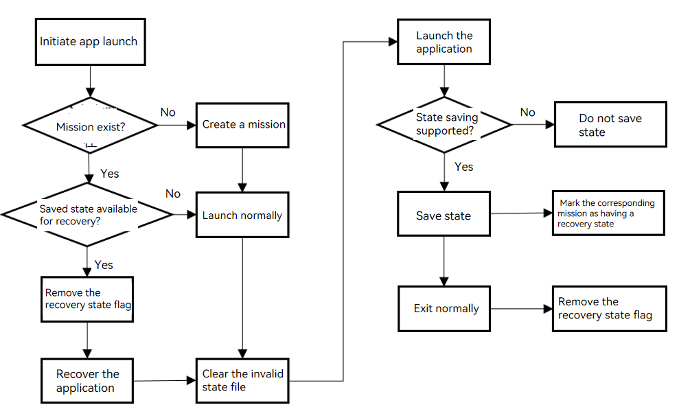
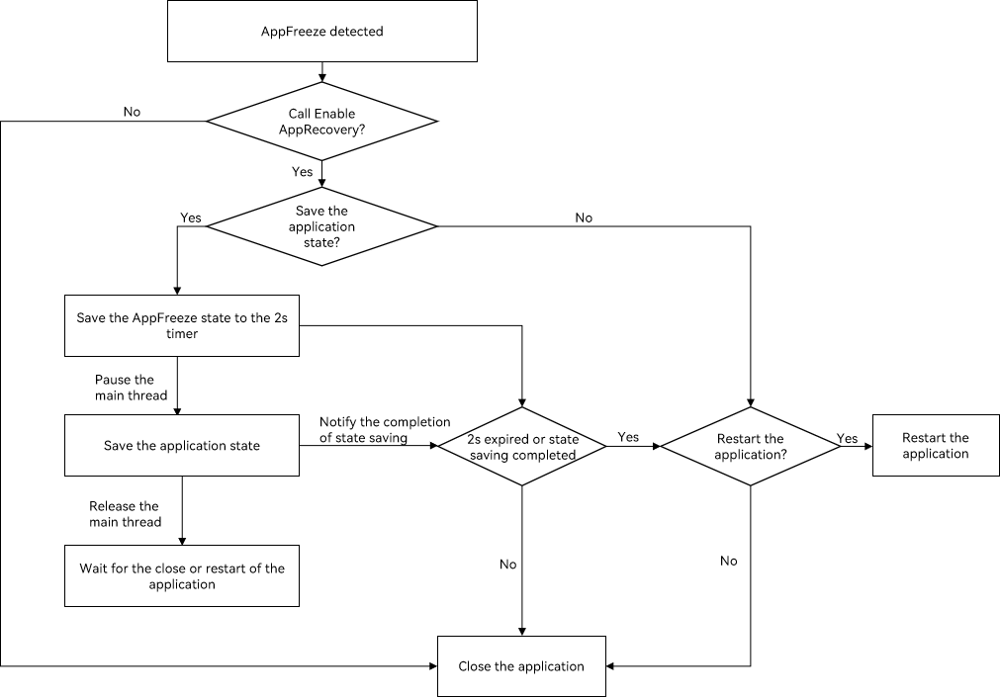
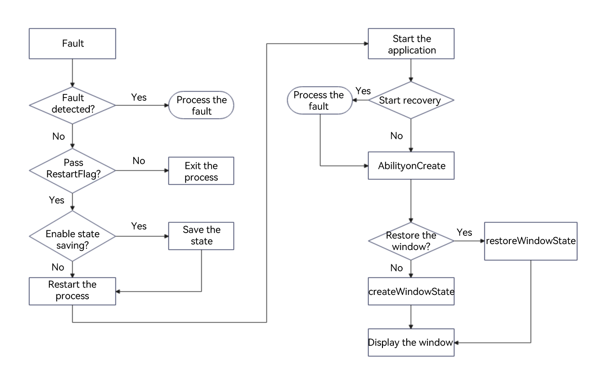

# Development of Application Recovery

<!--Kit: Performance Analysis Kit-->
<!--Subsystem: HiviewDFX-->
<!--Owner: @Chenyufan466765692-->
<!--Designer: @peterhuangyu-->
<!--Tester: @gcw_KuLfPSbe-->
<!--Adviser: @jinqiuheng-->
<!-- md-trans-meta sourceCommit=6bafd7bb37af23db4f6f83a5e90138b583afaab9 translatedAt=2026-07-29T04:08:27.902Z pushedAt=2026-07-29T06:45:28.126Z -->

## Overview

During application running, some unexpected behaviors are inevitable. For example, unprocessed exceptions and errors are thrown, and the call or running constraints of the recovery framework are violated.

Process exit is treated as the default exception handling method. However, if user data is generated during application use, process exit may interrupt user operations and cause data loss.

If the [application recovery](#available-apis) functionality is enabled in [AbilityStage](../reference/apis-ability-kit/js-apis-app-ability-abilityStage.md#abilitystage) and temporary data is saved, the previous application state and data will be restored upon next startup in the case of an abnormal exit, providing more consistent user experience. The application state includes two parts, namely, the page stack and the data saved in **onSaveState**.

In API version 9, application recovery is supported only for single-UIAbility applications developed using the stage model. Application state saving and automatic restart are performed when a JsError occurs.

In API version 10, application recovery is supported for multi-UIAbility applications developed using the stage model. Application state storage and restore are performed when an AppFreeze occurs. If an application is killed in control mode, the application state will be restored upon next startup.

## Available APIs

The application recovery APIs are provided by the appRecovery module, which can be imported via **import**. For details, see [How to Develop](#how-to-develop).

### Application Recovery APIs

| API| Description|
| -------- | -------- |
| enableAppRecovery(restart?: RestartFlag, saveOccasion?: SaveOccasionFlag, saveMode?: SaveModeFlag) : void | Enables the application recovery functionality.|
| saveAppState(): boolean | Saves the state of the UIAbility that supports recovery in the current application.|
| restartApp(): void | Restarts the current process and starts the UIAbility specified by **setRestartWant**. If no UIAbility is specified, a foreground UIAbility that supports recovery is restarted.|
| saveAppState(context?: UIAbilityContext): boolean | Saves the UIAbility state specified by **Context**.|
| setRestartWant(want: Want): void | Sets the UIAbility to be restarted when **restartApp** is called and **RestartFlag** is not set to **NO_RESTART**. (**abilityName** of **want** can be set to the name of the UIAbility.) The UIAbility must be under the same bundle name.|

As the preceding APIs may be used during fault handling, they do not return exceptions. You need to be familiar with the usage scenarios. For details about the parameter definitions, see [@ohos.app.ability.appRecovery (Application Recovery)](../reference/apis-ability-kit/js-apis-app-ability-appRecovery.md).

**enableAppRecovery**: This API should be called during application initialization. For example, you can call this API in **onCreate** of **AbilityStage**. After this API is called, the application will be recovered based on the first UIAbility that supports recovery.

**saveAppState**: After this API is called, the recovery framework invokes **onSaveState** for all UIAbilities that support recovery in the current process. If you choose to save data in **onSaveState**, the related data and UIAbility page stack are persistently stored in the local cache of the application. To save data of the specified UIAbility, you need to specify the context corresponding to that UIAbility.

**setRestartWant**: This API specifies the UIAbility to be restarted by **appRecovery**.

**restartApp**: After this API is called, the recovery framework kills the current process and restarts the UIAbility specified by **setRestartWant**, with **APP_RECOVERY** set as the startup cause.

In API version 9 and scenarios where a UIAbility is not specified by **setRestartWant**, the last foreground UIAbility that supports recovery is started. If the current foreground UIAbility does not support recovery, the application crashes.

If the restarted UIAbility has saved state data, this data is passed in as the **wantParam** property in the **want** parameter of the UIAbility's **onCreate** lifecycle callback. The interval between two restarts must be greater than one minute. Calling this API repeatedly within one minute only exits the app without restarting it. The behavior of automatic restart is the same as that of manual restart.

### Application State Management

Since API version 10, application recovery is not limited to automatic restart in the case of an exception. Therefore, you need to understand when the application will load the saved state.

If the last exit of an application is not initiated by a user and a saved state is available for recovery, the startup reason is set to **APP_RECOVERY** when the application is started by the user next time, and the recovery state of the application is cleared.

The application recovery state flag is set when **saveAppState** is actively or passively called. The flag is cleared when the application exits normally or restarts after an abnormal exit. (A normal exit is usually triggered by pressing the back key or clearing recent tasks.)



### Application State Saving and Restore

API version 10 or later supports saving of the application state when an application is suspended. If a JsError occurs, **onSaveState** is called in the main thread. If an AppFreeze occurs, however, the main thread may be suspended, and therefore **onSaveState** is called in a non-main thread. The following figure shows the main service flow.



When the application is frozen, the callback is not executed in the JS thread. Therefore, you are advised not to use the imported dynamic Native library or access the **thread_local** object created by the main thread in the code of the **onSaveState** callback.

### Framework Fault Management

Fault management is an important way for applications to deliver a better user experience. The application framework offers three methods for application fault management: fault listening, fault rectification, and fault query.

- Fault listening refers to the process of registering an [ErrorObserver](../reference/apis-ability-kit/js-apis-inner-application-errorObserver.md) via [errorManager](../reference/apis-ability-kit/js-apis-app-ability-errorManager.md), listening for faults, and notifying the listener of the faults.

- Fault recovery refers to [appRecovery](../reference/apis-ability-kit/js-apis-app-ability-appRecovery.md), which restarts the app and restores it to the state before the fault occurred.

- Fault query is the process of calling APIs of [faultLogger](../reference/apis-performance-analysis-kit/js-apis-faultLogger.md) to obtain the fault information.

The figure below does not illustrate the time when faultLogger is called. You can refer to the [LastExitReason](../reference/apis-ability-kit/js-apis-app-ability-abilityConstant.md#lastexitreason) passed during application initialization to determine whether to call faultLogger to query information about the previous fault.



You are advised to handle application exceptions using errorManager. After the exceptions are fixed, you can call **saveAppState** and restart the application.

If you do not register ErrorObserver or enable application recovery, the process exits according to the default system logic. Users can restart the application from the home screen.

If you have enabled application recovery, the recovery framework first checks whether application state saving is supported and whether the application state saving is enabled. If so, the recovery framework calls [onSaveState](../reference/apis-ability-kit/js-apis-app-ability-uiAbility.md#onsavestate) of the UIAbility. Finally, the application is restarted.

### Supported Application Recovery Scenarios

Common fault types include JavaScript application crash, application freezing, and C++ application crash. Generally, an application is closed when a crash occurs. Application freezing occurs when the application does not respond. The fault type can be ignored for the upper layer of an application. The recovery framework implements fault management in different scenarios based on the fault type.

| Fault| Fault Listening| State Saving| Automatic Restart| Log Query|
| -------- | -------- | -------- | -------- | -------- |
| [JS_CRASH](../reference/apis-performance-analysis-kit/js-apis-faultLogger.md#faulttype) | Supported| Supported| Supported| Supported|
| [APP_FREEZE](../reference/apis-performance-analysis-kit/js-apis-faultLogger.md#faulttype) | This fault is supported since API version 18.| Supported| Supported| Supported|
| [CPP_CRASH](../reference/apis-performance-analysis-kit/js-apis-faultLogger.md#faulttype) | Not supported | Not supported | Supported at API 24 and later | Supported |

Here, state saving refers to state saving upon a fault. For app freeze scenarios, you can periodically save the state or automatically save the state when the UIAbility switches to the background, so as to protect user data to the greatest extent possible.

## How to Develop

### Enabling Application Recovery

Enable **appRecovery** during application initialization. The following is an example of **AbilityStage**:

```ts
import { AbilityStage, appRecovery } from '@kit.AbilityKit';

export default class MyAbilityStage extends AbilityStage {
    onCreate() {
        console.info("[Demo] MyAbilityStage onCreate");
        appRecovery.enableAppRecovery(appRecovery.RestartFlag.ALWAYS_RESTART,
            appRecovery.SaveOccasionFlag.SAVE_WHEN_ERROR | appRecovery.SaveOccasionFlag.SAVE_WHEN_BACKGROUND,
            appRecovery.SaveModeFlag.SAVE_WITH_FILE);
    }
}
```

### Configuring the Recoverable UIAbility

Generally, the UIAbility configuration list is named **module.json5**.

```ts
{
    "abilities": [
      {
        "name": "EntryAbility",
        "recoverable": true,
      }]
}
```

### Saving and Restoring Data

After enabling **appRecovery**, you can use this functionality by either actively or passively saving the status and restoring data in a UIAbility.

The following is an example of **EntryAbility**:

**Importing modules**

```ts
import { AbilityConstant, appRecovery, errorManager } from '@kit.AbilityKit';
```

**Actively saving state and restoring data**

- Define and register the [ErrorObserver](../reference/apis-ability-kit/js-apis-inner-application-errorObserver.md) callback. For details about its usage, see [errorManager](../reference/apis-ability-kit/js-apis-app-ability-errorManager.md).

```ts
import { appRecovery, errorManager, UIAbility } from '@kit.AbilityKit';
import { window } from '@kit.ArkUI';

let registerId = -1;
let callback: errorManager.ErrorObserver = {
    onUnhandledException(errMsg) {
    console.error(errMsg);
    appRecovery.saveAppState();
    appRecovery.restartApp();
    }
}

export default class EntryAbility extends UIAbility {
    onWindowStageCreate(windowStage: window.WindowStage) {
    // Set the main page for the created main window.
    console.info("[Demo] EntryAbility onWindowStageCreate");
    registerId = errorManager.on('error', callback);

    windowStage.loadContent("pages/index", (err, data) => {
        if (err.code) {
            console.error('Failed to load the content. Cause:' + JSON.stringify(err));
            return;
        }
        console.info('Succeeded in loading the content. Data: ' + JSON.stringify(data));
    })
    }
}
```

- Save data.

After the callback triggers **appRecovery.saveAppState()**, **onSaveState(state, wantParams)** of **EntryAbility** is triggered.

```ts
import { AbilityConstant, UIAbility } from '@kit.AbilityKit';

export default class EntryAbility extends UIAbility {
    onSaveState(state:AbilityConstant.StateType, wantParams: Record<string, Object>) {
        // The UIAbility is called to save application data.
        console.info("[Demo] EntryAbility onSaveState");
        wantParams["myData"] = "my1234567";
        return AbilityConstant.OnSaveResult.ALL_AGREE;
    }
}
```

- Restore data.

After the callback triggers **appRecovery.restartApp()**, the application is restarted. After the restart, **onCreate(want, launchParam)** of **EntryAbility** is called, and the saved data is stored in **parameters** of **want**.

```ts
import { AbilityConstant, UIAbility, Want } from '@kit.AbilityKit';

let abilityWant: Want;

export default class EntryAbility extends UIAbility {
    storage: LocalStorage | undefined = undefined;

    onCreate(want: Want, launchParam: AbilityConstant.LaunchParam) {
        console.info("[Demo] EntryAbility onCreate");
        abilityWant = want;
        if (launchParam.launchReason == AbilityConstant.LaunchReason.APP_RECOVERY) {
            this.storage = new LocalStorage();
            if (want.parameters) {
                let recoveryData = want.parameters["myData"];
                this.storage.setOrCreate("myData", recoveryData);
                this.context.restoreWindowStage(this.storage);
            }
        }
    }
}
```

- Unregister the **ErrorObserver** callback.

```ts
import { errorManager, UIAbility } from '@kit.AbilityKit';

let registerId = -1;

export default class EntryAbility extends UIAbility {
    onWindowStageDestroy() {
        // Destroy the main window and release related UI resources.
        console.info("[Demo] EntryAbility onWindowStageDestroy");

        errorManager.off('error', registerId, (err) => {
            console.error("[Demo] err:", err);
        });
    }
}
```

**Passively saving state and restoring data**

This is triggered by the recovery framework. You do not need to register an **ErrorObserver** callback. You only need to implement **onSaveState** for application state saving and **onCreate** for data restore.

```ts
import { AbilityConstant, UIAbility, Want } from '@kit.AbilityKit';

let abilityWant: Want;

export default class EntryAbility extends UIAbility {
    storage: LocalStorage | undefined = undefined
    onCreate(want: Want, launchParam: AbilityConstant.LaunchParam) {
    console.info("[Demo] EntryAbility onCreate");
        abilityWant = want;
        if (launchParam.launchReason == AbilityConstant.LaunchReason.APP_RECOVERY) {
            this.storage = new LocalStorage();
            if (want.parameters) {
                let recoveryData = want.parameters["myData"];
                this.storage.setOrCreate("myData", recoveryData);
                this.context.restoreWindowStage(this.storage);
            }
        }
    }

    onSaveState(state:AbilityConstant.StateType, wantParams: Record<string, Object>) {
        // The UIAbility is called to save application data.
        console.info("[Demo] EntryAbility onSaveState");
        wantParams["myData"] = "my1234567";
        return AbilityConstant.OnSaveResult.ALL_AGREE;
    }
}
```

**Restart flag for the failed UIAbility**

When the faulty UIAbility is restarted, the **parameters** member of the **want** parameter in the **onCreate** lifecycle callback contains the [ABILITY_RECOVERY_RESTART](../reference/apis-ability-kit/js-apis-app-ability-wantConstant.md#params) flag, with the value **true**.

```ts
import { AbilityConstant, UIAbility, Want, wantConstant } from '@kit.AbilityKit';

export default class EntryAbility extends UIAbility {
    onCreate(want: Want, launchParam: AbilityConstant.LaunchParam) {
        if (want.parameters === undefined) {
            return;
        }
        if (want.parameters[wantConstant.Params.ABILITY_RECOVERY_RESTART] != undefined &&
            want.parameters[wantConstant.Params.ABILITY_RECOVERY_RESTART] == true) {
            console.info("This ability need to recovery");
        }
    }
}
```