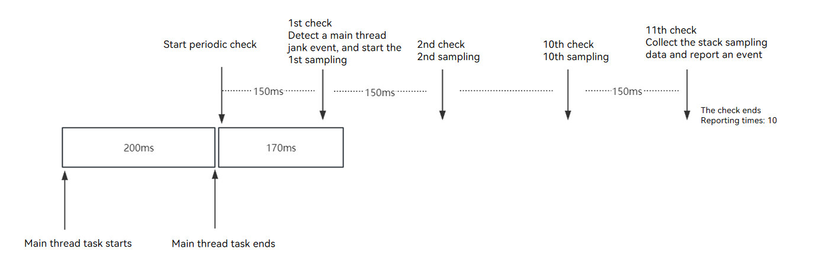
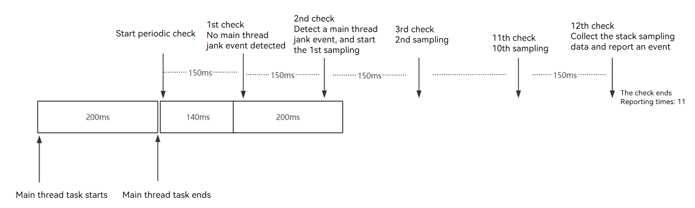
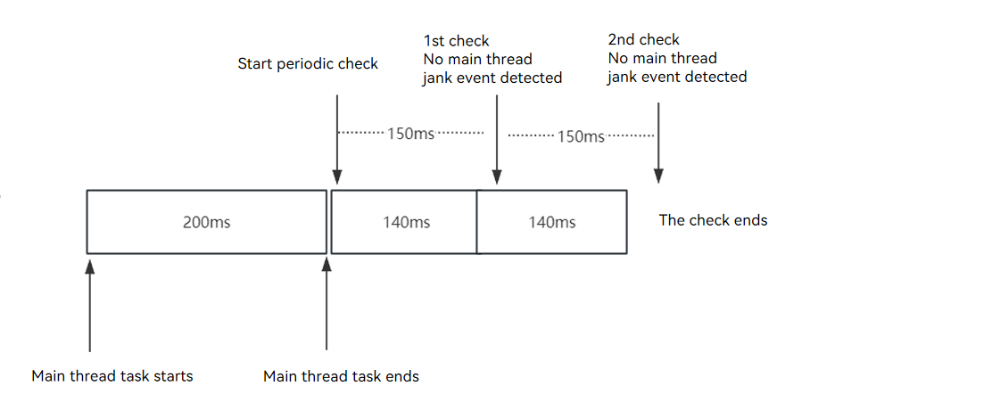
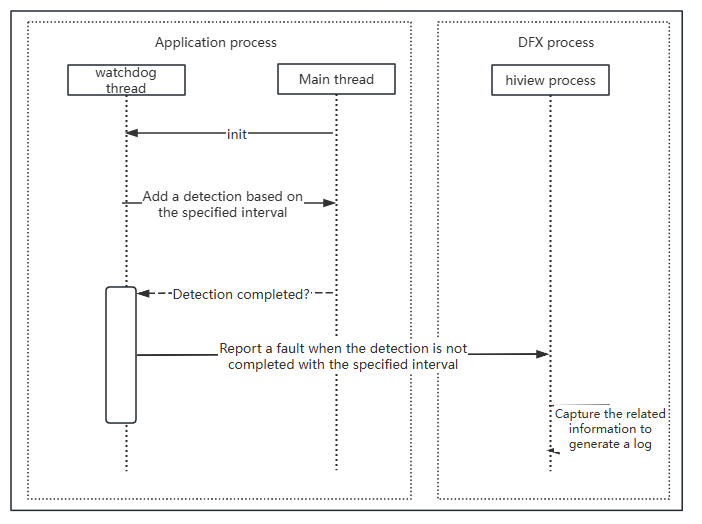

# Task Timeout Detection

<!--Kit: Performance Analysis Kit-->
<!--Subsystem: HiviewDFX-->
<!--Owner: @rr_cn-->
<!--SE: @peterhuangyu-->
<!--TSE: @gcw_KuLfPSbe-->

## Overview

Task timeout occurs when the execution duration of a service logic exceeds the expected duration.

Task timeout detection includes main thread timeout detection and task execution timeout detection. You can use HiCollie to customize the timeout threshold to proactively detect the service logic. The main thread timeout detection also has the default timeout threshold. For details, see [Using HiCollie to Detect Service Thread Stuck and Jank Events](hicollie-guidelines-ndk.md).

> **NOTE**
>
> Unlike task timeout detection, [application freeze detection](appfreeze-guidelines.md) is a periodic detection logic provided by the system, which does not need to be perceived or adapted.

## Main Thread Timeout Detection

### Detection Principles

1. Triggering process:
   When the main thread experiences a timeout between 150 ms and 450 ms, it triggers a call stack sampling. If the timeout exceeds 450 ms, it triggers a trace sampling. 

   150 ms < Main thread processing time < 450 ms: stack sampling is triggered by main thread timeout. For the processes with the same PID, the call stack sampling for a main thread timeout event can be triggered only once. If **Developer Options** is enabled, call stack sampling can be triggered once an hour. No timeout check is performed within 10s after the application starts.

   Main thread processing time > 450 ms: trace sampling is triggered by main thread timeout. For the processes with the same PID, the trace sampling for a main thread timeout event can be triggered only once in a day. 

   Main thread processing time = 450 ms: no sampling is triggered.

   > **NOTE**
   >
   > To enable the main thread checker to collect tracing data when a task times out, ensure that the nolog version is used and **Developer Options** is disabled
   >
   > You can go to **Settings** > **About phone** to check the software version. The log version ends with **log**.
   >
   > When **Developer Options** is disabled, DevEco Studio may be unavailable. Therefore, you are advised to install the application before disabling **Developer Options**.

2. Stack capture time:
   When the main thread timeout event occurs, the main thread checker starts to check whether the timeout event occurs again every 150 ms (1 ≤ number of check times ≤ 2). There are three cases:

   (1) If a timeout event is detected during the first check, the main thread checker starts stack sampling every 150 ms for 10 times. The stack sampling data is collected and an event is reported at the next interval. Then the check ends.

   

   (2) If a timeout event is detected during the second check, the main thread checker starts stack sampling every 150 ms for 10 times. The stack sampling data is collected and an event is reported at the next interval. Then the check ends.

   

   (3) If no timeout event is detected in the two checks, the check ends.

   

3. Trace collection time:

   After the function is called to capture tracing data, the main thread checker checks for a main thread timeout event every 150 ms for 20 times. If a main thread timeout event occurs in any of the 20 checks, the check ends in 3s and the tracing data is stored.

   (1) If no main thread timeout event occurs in any of the 20 checks, no trace file is generated.

   

   (2) If a main thread timeout event occurs in any of the 20 checks, a trace file is generated.

### Obtaining Logs

Main thread timeout logs are stored in the application sandbox directory. You can obtain the logs in any of the following ways:

**Method 1: HiAppEvent APIs**

HiAppEvent provides APIs for subscribing to faults. For details, see [Introduction to HiAppEvent](hiappevent-intro.md). You can subscribe to the address sanitizer event by referring to [Subscribing to Main Thread Jank Events (ArkTS)](hiappevent-watcher-mainthreadjank-events-arkts.md) or [Subscribing to Main Thread Jank Events (C/C++)](hiappevent-watcher-mainthreadjank-events-ndk.md), and read the fault log file using the [external_log](hiappevent-watcher-crash-events.md#params) field in the event.

### Log Specifications 

1. Log aging:
   Generally, the size of a stack file is 7 KB to 10 KB, and the size of a trace file is 1 MB to 5 MB. The **watchdog** directory in the application sandbox can store a maximum of 10 MB data. If the total file size exceeds 10 MB, the directory aging mechanism is automatically triggered to delete a maximum of 100 files based on the file name sequence. The path to **watchdog** is **/data/storage/el2/log/watchdog/**.

2. Sampling stack specifications
   Currently, stack capturing supports only the ARM64 architecture. The stack capture result contains both native frames and JS frames parsed.

   An example of the stack capture result is as follows:

   ```text
   9 #00 pc 0000757c /system/bin/appspawn(55679d09bcdea35bb1e0d4e1d9a3e58f)
       9 #01 pc 000731c0 /system/lib/ld-musl-aarch64.so.1(add9e521e4eaf5cb009d4260f3b69ccd)
           9 #02 pc 000090a9 /system/bin/appspawn(main+396)(55679d09bcdea35bb1e0d4e1d9a3e58f)
               9 #03 pc 0000ab5d /system/bin/appspawn(AppSpawnRun+100)(55679d09bcdea35bb1e0d4e1d9a3e58f)
                   9 #04 pc 0000e7f1 /system/lib/chipset-pub-sdk/libbegetutil.z.so(RunLoop_+200)(52ace27d827ad482439bf32cc75bb17b)
                   ......
                                           9 #21 pc 00107aec /system/lib/ld-musl-aarch64.so.1(__pthread_cond_timedwait+628)(add9e521e4eaf5cb009d4260f3b69ccd)
   1 #00 pc 00032e67 /system/lib/platformsdk/libmmi-util.z.so(OHOS::MMI::UDSSocket::OnReadPackets(OHOS::MMI::CircleStreamBuffer&, std::__h::function<void (OHOS::MMI::NetPacket&)>)+158)(99e56bc765f9208f7b7ba8b268886a59)
       1 #01 pc 0000312e5 /system/lib/platformsdk/libmmi-client.z.so(OHOS::MMI::ClientMsgHandler::OnMsgHandler(OHOS::MMI::UDSClient const&, OHOS::MMI::NetPacket&)+340)(66ac85e964777ae89f0c26c339093cd1)
           1 #02 pc 0003016b /system/lib/platformsdk/libmmi-client.z.so(OHOS::MMI::ClientMsgHandler::OnPointerEvent(OHOS::MMI::UDSClient const&, OHOS::MMI::NetPacket&)+1222)(66ac85e964777ae89f0c26c339093cd1)
               1 #03 pc 0003b96b /system/lib/platformsdk/libmmi-client.z.so(OHOS::MMI::InputManagerImpl::OnPointerEvent(std::__h::shared_ptr<OHOS::MMI::PointerEvent>)+1370)(66ac85e964777ae89f0c26c339093cd1)
                   1 #04 pc 00095903 /system/lib/platformsdk/libwm.z.so(OHOS::Rosen::InputEventListener::OnInputEvent(std::__h::shared_ptr<OHOS::MMI::PointerEvent>) const+478)(9c40c5f416d6f830435126998fbcad42)
                   ......
                                           1 #21 pc 003f5c55 /system/lib/platformsdk/libark_jsruntime.so(4e6a2651ec80a7f639233f414d6486fe)
                                               1 #22 at anonymous (/entry/build/default/cache/default/default@CompileArkTS/esmodule/debug/entry/src/main/ets/pages/Index.js:67:17)
                                                   1 #23 at wait2 (/entry/build/default/cache/default/default@CompileArkTS/esmodule/debug/entry/src/main/ets/pages/Index.js:16:12)
                                                   ......
   ```

   Each stack capture records 16 KB call stack information of the main thread for stack unwinding. Therefore, each stack capture result contains a maximum of 16 KB invocation information of the process for 10 times. The captured data is displayed in a tree view, with repeated stack frames aggregated and different call layers distinguished by line indentation. If the stack fails to be captured (for example, the main thread is blocked in the kernel or signals are masked), the content of the **/proc/self/wchan** file is output.

   In the result, each row indicates a piece of stack information. The meaning of a row of stack frame information can be interpreted as follows:

   Native frame:

   ```text
   9 #02 pc 000090a9 /system/bin/appspawn(main+396)(55679d09bcdea35bb1e0d4e1d9a3e58f)
   ^  ^       ^               ^              ^                   ^ 
   1  2       3               4              5                   6
   
   1 indicates the number of times that the frame is sampled.
   2 indicates the invoking level of the frame. The line indentation size corresponds to this level. The number of sampling times of all frames at the same level cannot be greater than 10. The number of sampling times of #00 is 10 (set the sampling times).
   3 indicates the Program Counter (PC) value of the native frame.
   4 indicates the path of the called file.
   5 indicates the name of the called function and the code line offset.
   6 indicates the MD5 value of the .so file.
   ```

   JS frame:

   ```text
   1 #23 at wait2 (/entry/build/default/cache/default/XXX/entry/src/main/ets/pages/Index.js:16:12)
   ^  ^    ^               ^
   1  2    3               4
   
   1 indicates the number of times that the frame is sampled. The maximum value is the sampling times.
   2 indicates the invoking level of the frame, which is the same as that of the native frame.
   3 indicates the name of the called function, which is **wait2**.
   4 indicates the path, file, row number, and column number of the called function.
   ```

3. Sampling trace specifications:
   The size of the trace file is 1 MB to 5 MB. You can visually analyze the trace file using [SmartPerf](https://gitee.com/openharmony/developtools_smartperf_host). You can download the tool from [developtools_smartperf_host Release](https://gitee.com/openharmony/developtools_smartperf_host/releases).

   For details about the trace file, see [Loading Trace Files on the Web Client](https://gitee.com/openharmony/developtools_smartperf_host/blob/master/smartperf_host/ide/src/doc/md/quickstart_systemtrace.md).

## Task Execution Timeout Detection

### Detection Principles

**Overview**: Task timeout occurs when the service logic execution time exceeds the expected time.

**Principles**: If the service logic execution time exceeds the specified timeout threshold, the task execution times out.

The following figure shows the detection principles.



### Obtaining Logs

Task execution timeout logs are stored in the application sandbox directory. You can obtain the logs in any of the following ways:

**Method 1: HiAppEvent APIs**

HiAppEvent provides APIs for subscribing to faults. For details, see [Introduction to HiAppEvent](hiappevent-intro.md). You can subscribe to the main thread timeout event by referring to [Subscribing to Main Thread Jank Events (ArkTS)](hiappevent-watcher-mainthreadjank-events-arkts.md) or [Subscribing to Main Thread Jank Events (C/C++)](hiappevent-watcher-mainthreadjank-events-ndk.md), and read the fault log file using the [external_log](hiappevent-watcher-crash-events.md#params) field in the event.

### Log Specifications

For details, see [Log Specifications](appfreeze-guidelines.md#log-specifications).
