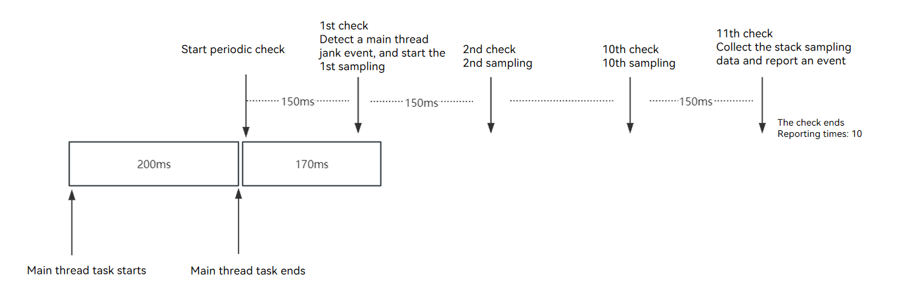
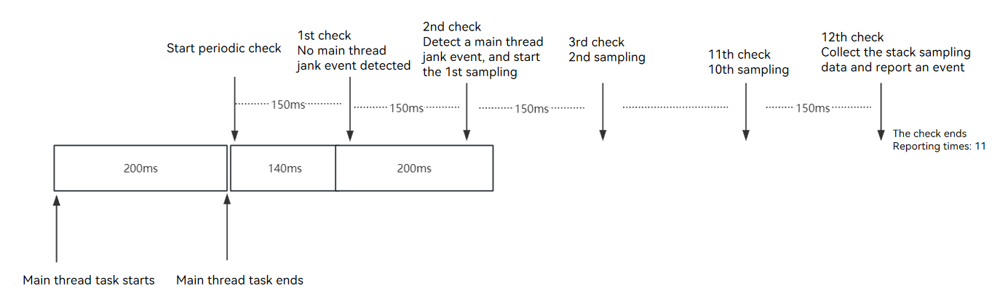
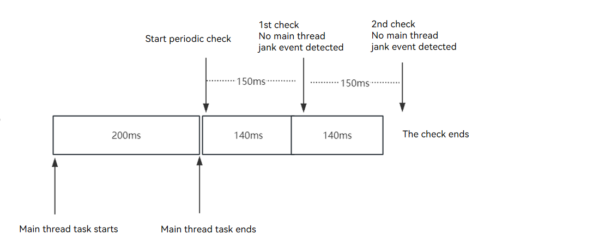
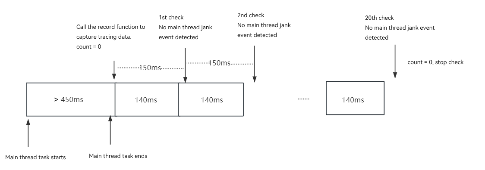
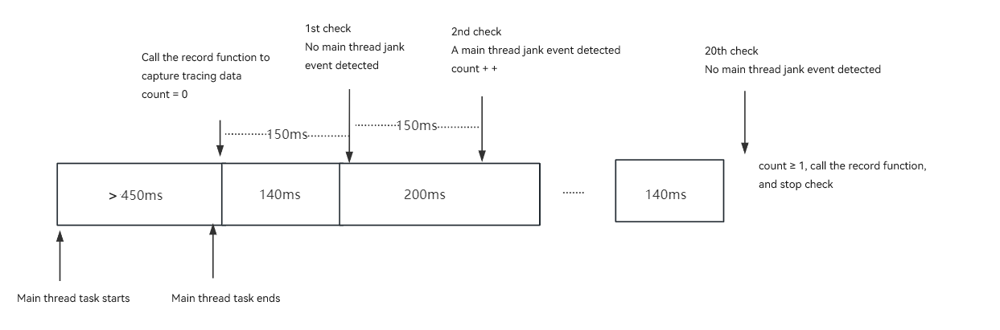

# Task Timeout Detection

<!--Kit: Performance Analysis Kit-->
<!--Subsystem: HiviewDFX-->
<!--Owner: @Chenyufan466765692-->
<!--Designer: @peterhuangyu-->
<!--Tester: @gcw_KuLfPSbe-->
<!--Adviser: @jinqiuheng-->
<!-- md-trans-meta sourceCommit=f319e3e62d6356bf78f31e2e8f7ba3927caddf1e translatedAt=2026-07-29T04:08:36.828Z pushedAt=2026-07-29T06:52:12.827Z -->

## Overview

Task timeout occurs when the execution duration of a service logic exceeds the expected duration.

Task timeout detection includes main thread timeout detection and task execution timeout detection. You can use HiCollie to customize the timeout threshold to proactively detect the service logic. The main thread timeout detection also has the default timeout threshold. For details, see [Using HiCollie to Detect Service Thread Stuck and Jank Events](hicollie-guidelines-ndk.md).

> **NOTE**
>
> Unlike task timeout detection, [application freeze detection](appfreeze-guidelines.md) is a periodic detection logic provided by the system, which does not need to be perceived or adapted.

## Main Thread Timeout Detection

### Detection Principles

The main thread event processing duration is checked. When the task duration exceeds the threshold, the log collection process is triggered, including stack collection and trace collection. The triggering conditions of the two collections are mutually exclusive. Only one collection is triggered upon a timeout.

Which of the collection processes is triggered depends on the processing duration of a single event in the main thread. The triggering conditions, log collection formats, and frequency restrictions are as follows:

| Collection Process| Triggering Condition| Log Collection Format| Prerequisites and Restrictions|
| -------- | -------- | -------- | -------- |
| Stack collection| 150 ms < Main thread processing duration < 450 ms| File name format: **MAIN_THREAD_JANK_Second-level time_PID.txt**.<br>For example, **MAIN_THREAD_JANK_20240613211739_40986.txt**.| - The application is not detected within 10s after being started.<br> - When [Developer options](https://developer.huawei.com/consumer/en/doc/harmonyos-guides/ide-developer-mode#section0736139111917) is disabled, the main thread timeout event stack collection process can be triggered at most once a day within a lifecycle of an application.<br> - When [Developer options](https://developer.huawei.com/consumer/en/doc/harmonyos-guides/ide-developer-mode#section530763213432) is enabled, the main thread timeout event stack collection process can be triggered at most once an hour within a lifecycle of an application.|
| Trace collection| Main thread processing duration > 450 ms| File name format: **MAIN_THREAD_JANK_unix timestamp_PID.trace**.<br>For example, **MAIN_THREAD_JANK_1762064185461_40986.trace**.| - To trigger trace collection, you need to use the [nolog](performance-analysis-kit-terminology.md#nolog-version) version and disable [Developer options](https://developer.huawei.com/consumer/en/doc/harmonyos-guides/ide-developer-mode#section530763213432).<br> - Only one trace collection process can be triggered for the main thread timeout event within a day.|

> **NOTE**
>
> If the main thread processing duration is equal to 450 ms, no collection process is triggered.
>
> When **Developer Options** is disabled, DevEco Studio may be unavailable. Therefore, you are advised to install the application before disabling **Developer Options**.

1. Stack collection process:

   When the main thread processing times out (150 ms < main thread processing duration < 450 ms), a periodic detection task is started and executed every 150 ms. A stack file is generated only when the main thread processing duration exceeds 150 ms in at least one of the first two rounds of detection. The possible cases are as follows:

   (1) If a main thread timeout event (main thread processing duration > 150 ms) is detected during the first check, the stack collection starts and is performed every 150 ms for 10 times. The stack data is collected and an event is reported at the next interval. Then the check ends.

   

   (2) If a main thread timeout event (main thread processing duration > 150 ms) is detected during the second check, the stack collection starts and is performed every 150 ms for 10 times. The stack data is collected and an event is reported at the next interval. Then the check ends.

   

   (3) If no main thread timeout event (main thread processing duration > 150 ms) is detected during the first two checks, the check ends.

   

2. Trace collection process

   When the main thread processing times out (main thread processing duration > 450 ms), the API for enabling trace collection is invoked to check every 150 ms for 20 times whether the duration exceeds 150 ms. The possible cases are as follows:

   (1) If no main thread timeout event (main thread processing duration > 150 ms) is detected during the 20 checks, no trace file is generated, and the check ends.

   

   (2) If a main thread timeout event (main thread processing duration > 150 ms) is detected during any of the 20 checks, a trace file is generated, and an event is reported. Then the check ends.

   

### Obtaining Logs

Main thread timeout logs are saved in the app sandbox directory and can be obtained in the following ways.

**Subscribing to Main Thread Jank Events using HiAppEvent APIs**

HiAppEvent provides APIs for subscribing to faults. For details, see [Introduction to HiAppEvent](hiappevent-intro.md). You can subscribe to the main thread timeout event by referring to [Subscribing to Main Thread Jank Events (ArkTS)](hiappevent-watcher-mainthreadjank-events-arkts.md) or [Subscribing to Main Thread Jank Events (C/C++)](hiappevent-watcher-mainthreadjank-events-ndk.md), and read the fault log file using the [external_log](hiappevent-watcher-mainthreadjank-events.md#event-fields) field in the event.

### Log Specifications

1. Log aging specifications of main thread timeout detection

   Generally, the stack file size is 7–10 KB, and the trace file size is 1–5 MB. The watchdog directory in the app sandbox can store a maximum of 10 MB of content. When this limit is exceeded, the directory aging mechanism is automatically triggered, which deletes up to 100 files in filename order. Directory path: `/data/storage/el2/log/watchdog/`.

2. Stack specifications of main thread timeout detection

   Currently, stack capturing supports only the ARM64 architecture. The stack capture result contains both native frames and JS frames parsed.

   An example of the stack capture result is as follows:

   ```text
   9 #00 pc 0000757c /system/bin/appspawn(55679d09bcdea35bb1e0d4e1d9a3e58f)
       9 #01 pc 000731c0 /system/lib/ld-musl-aarch64.so.1(add9e521e4eaf5cb009d4260f3b69ccd)
           9 #02 pc 000090a9 /system/bin/appspawn(main+396)(55679d09bcdea35bb1e0d4e1d9a3e58f)
               9 #03 pc 0000ab5d /system/bin/appspawn(AppSpawnRun+100)(55679d09bcdea35bb1e0d4e1d9a3e58f)
                   9 #04 pc 0000e7f1 /system/lib/chipset-pub-sdk/libbegetutil.z.so(RunLoop_+200)(52ace27d827ad482439bf32cc75bb17b)
                   ......
                                           9 #21 pc 00107aec /system/lib/ld-musl-aarch64.so.1(__pthread_cond_timedwait+628)(add9e521e4eaf5cb009d4260f3b69ccd)
   1 #00 pc 00032e67 /system/lib/platformsdk/libmmi-util.z.so(OHOS::MMI::UDSSocket::OnReadPackets(OHOS::MMI::CircleStreamBuffer&, std::__h::function<void (OHOS::MMI::NetPacket&)>)+158)(99e56bc765f9208f7b7ba8b268886a59)
       1 #01 pc 0000312e5 /system/lib/platformsdk/libmmi-client.z.so(OHOS::MMI::ClientMsgHandler::OnMsgHandler(OHOS::MMI::UDSClient const&, OHOS::MMI::NetPacket&)+340)(66ac85e964777ae89f0c26c339093cd1)
           1 #02 pc 0003016b /system/lib/platformsdk/libmmi-client.z.so(OHOS::MMI::ClientMsgHandler::OnPointerEvent(OHOS::MMI::UDSClient const&, OHOS::MMI::NetPacket&)+1222)(66ac85e964777ae89f0c26c339093cd1)
               1 #03 pc 0003b96b /system/lib/platformsdk/libmmi-client.z.so(OHOS::MMI::InputManagerImpl::OnPointerEvent(std::__h::shared_ptr<OHOS::MMI::PointerEvent>)+1370)(66ac85e964777ae89f0c26c339093cd1)
                   1 #04 pc 00095903 /system/lib/platformsdk/libwm.z.so(OHOS::Rosen::InputEventListener::OnInputEvent(std::__h::shared_ptr<OHOS::MMI::PointerEvent>) const+478)(9c40c5f416d6f830435126998fbcad42)
                   ......
                                           1 #21 pc 003f5c55 /system/lib/platformsdk/libark_jsruntime.so(4e6a2651ec80a7f639233f414d6486fe)
                                               1 #22 at anonymous (/entry/build/default/cache/default/default@CompileArkTS/esmodule/debug/entry/src/main/ets/pages/Index.js:67:17)
                                                   1 #23 at wait2 (/entry/build/default/cache/default/default@CompileArkTS/esmodule/debug/entry/src/main/ets/pages/Index.js:16:12)
                                                   ......
   ```

   Each stack capture records 16 KB call stack information of the main thread for stack unwinding. Therefore, each stack capture result contains a maximum of 16 KB invocation information of the process for 10 times. The captured data is displayed in a tree view, with repeated stack frames aggregated and different call layers distinguished by line indentation. If the stack fails to be captured (for example, the main thread is blocked in the kernel or signals are masked), the content of the **/proc/self/wchan** file is output.

   In the result, each row indicates a piece of stack information. The meaning of a row of stack frame information can be interpreted as follows:

   Native frame:

   ```text
   9 #02 pc 000090a9 /system/bin/appspawn(main+396)(55679d09bcdea35bb1e0d4e1d9a3e58f)
   ^  ^       ^               ^              ^                   ^ 
   1  2       3               4              5                   6
   
   1 indicates the number of times that the frame is sampled.
   2 indicates the invoking level of the frame. The line indentation size corresponds to this level. The number of sampling times of all frames at the same level cannot be greater than 10. The number of sampling times of #00 is 10 (set the sampling times).
   3 indicates the Program Counter (PC) value of the native frame.
   4 indicates the path of the called file.
   5 indicates the name of the called function and the code line offset.
   6 indicates the MD5 value of the .so file.
   ```

   JS frame:

   ```text
   1 #23 at wait2 (/entry/build/default/cache/default/XXX/entry/src/main/ets/pages/Index.js:16:12)
   ^  ^    ^               ^
   1  2    3               4
   
   1 indicates the number of times that the frame is sampled. The maximum value is the sampling times.
   2 indicates the invoking level of the frame, which is the same as that of the native frame.
   3 indicates the name of the called function, which is **wait2**.
   4 indicates the path, file, row number, and column number of the called function.
   ```

3. Trace specifications of main thread timeout detection

   The size of the trace file is 1 MB to 5 MB. You can visually analyze the trace file using [SmartPerf](https://gitcode.com/openharmony/developtools_smartperf_host). You can download the tool from [developtools_smartperf_host Release](https://gitcode.com/openharmony/developtools_smartperf_host/releases).

   For details about the trace file, see [Loading Trace Files on the Web Client](https://gitcode.com/openharmony/developtools_smartperf_host/blob/master/smartperf_host/ide/src/doc/md/quickstart_systemtrace.md).

### Collection Limitations

1. Trace collection

   Trace collection limitation: A trace can be triggered at most once per app per day.

   You can view trace collection logs in either of the following ways:

   - In DevEco Studio, switch to the **Log** window at the bottom and filter for the **open trace result** keyword.

   - Use the `hdc shell` command in a command-line window to view logs online:

     ```shell
     PS D:\xxx\xxx> hdc shell
     $ hilog | grep "open trace result"
     ```

   Trace collection result:

   - A result of 0 indicates that the trace was triggered successfully. **After a trace is successfully collected, no further logs will be printed upon subsequent triggers**.

   - A result of 1203 indicates that the trace failed to trigger because the trigger count limit has been exceeded.

2. Stack collection

    Default behavior: An app can trigger the main thread timeout event stack collection process at most once per day within one lifecycle.

    You can configure the collection count through custom parameter APIs:

    - `report_times_per_app` parameter in [Parameters of setEventConfig](hiappevent-watcher-mainthreadjank-events.md#parameters-of-seteventconfig), with a value range of [1, 3]

    - `reportTimesPerApp` parameter in [Parameters of configEventPolicy](hiappevent-watcher-mainthreadjank-events.md#parameters-of-configeventpolicy), with a value range of [1, 3]

## Task Execution Timeout Detection

### Detection Principles

**Overview**: Task timeout occurs when the service logic execution time exceeds the expected time.

**Principles**: If the service logic execution time exceeds the specified timeout threshold, the task execution times out.

The following figure shows the detection principles.


### Obtaining Logs

You can obtain task execution timeout logs in any of the following ways:

**Subscribing to Task Execution Timeout Events using HiAppEvent APIs**

HiAppEvent provides APIs for subscribing to faults. For details, see [Introduction to HiAppEvent](hiappevent-intro.md). You can subscribe to the task execution timeout event by referring to [Subscribing to Task Execution Timeout Events (ArkTS)](hiappevent-watcher-apphicollie-events-arkts.md) or [Subscribing to Task Execution Timeout Events (C/C++)](hiappevent-watcher-apphicollie-events-ndk.md), and read the fault log file using the [external_log](hiappevent-watcher-apphicollie-events.md#event-fields) field in the event.

### Log Specifications

The log specifications of task execution timeout events are the same as those of application freeze events. For details, see [Application Freeze Log Specifications](appfreeze-guidelines.md#log-specifications).