# Analyzing CPP Crash

A cpp crash refers to a process crash in C/C++ application. The FaultLogger module provides capabilities such as process crash detection, log collection, log storage, and log reporting, helping you to locate faults more effectively.

The following introduces cpp crash detection, crash fault locating and analysis, and typical cases. To use this guideline, you need to have basic knowledge about stack and heap in C/C++.

## Cpp Crash Detection

Process crash detection is based on the posix signal mechanism. Currently, the exception signals that can be processed are as follows:

| Signo| Signal| Description| Trigger Cause|
| -------- | -------- | -------- | -------- |
| 4 | SIGILL | Invalid instruction| An invalid, incorrectly formatted, unknown, or privileged instruction is executed.|
| 5 | SIGTRAP | Breakpoint or trap| An exception occurs or a trap instruction is executed.|
| 6 | SIGABRT | Process abort| The process is aborted abnormally. Generally, this exception occurs when the process calls **abort()** in the Standard Function Library.|
| 7 | SIGBUS | Illegal memory access| The process accesses an aligned or nonexistent physical address.|
| 8 | SIGFPE | Floating-point exception| An incorrect arithmetic operation is executed, for example, a 0 divisor, floating point overflow, or integer overflow.|
| 11 | SIGSEGV | Invalid memory access| The process accesses an invalid memory region.|
| 16 | SIGSTKFLT | Stack error| The processor performs an incorrect stack operation, such as a pop when the stack is empty or a push when the stack is full.|
| 31 | SIGSYS | Incorrect system call| An incorrect or invalid parameter is used in a system call.|

Some of the preceding fault signals are classified into codes based on specific scenarios.
**SIGILL** occurs in Unix and Unix-like operating systems. It indicates an invalid instruction exception. The **SIGILL** signal is usually triggered by the following causes:
| No.| Code| Description| Trigger Cause|
| -------- | -------- | -------- | -------- |
| 1 | ILL_ILLOPC | Illegal operation code| A privileged instruction or an instruction that is unsupported by the CPU is executed.|
| 2 | ILL_ILLOPN | Illegal operand| An incorrect operand or improper operand type is used.|
| 3 | ILL_ILLADR | Illegal address| A program accesses an invalid memory address or an unaligned memory address.|
| 4 | ILL_ILLTRP | Illegal trap| A program performs an illegal trap instruction or an undefined operation.|
| 5 | ILL_PRVOPC | Illegal privileged operation code| A common user executes a privileged instruction.|
| 6 | ILL_PRVREG | Illegal privileged register| A common user accesses a privileged register.|
| 7 | ILL_COPROC | Illegal coprocessor| A program performs an undefined coprocessor instruction.|
| 8 | ILL_BADSTK | Illegal stack| A program performs an operation at an invalid stack address, or when the stack overflows.|

**SIGTRAP** usually occurs in debugging and tracking. The four scenarios of the **SIGTRAP** signal are described as follows.
| No.| Code| Description| Trigger Cause|
| -------- | -------- | -------- | -------- |
| 1 | TRAP_BRKPT | Software breakpoint| The software breakpoint is reached in a program. When debugging a program, a software breakpoint at the key position can be used to pause the program execution and check information such as variable values.|
| 2 | TRAP_TRACE | Single-step debugging| A single instruction is executed in a program. Single instruction can be used to check the execution result of each instruction.|
| 3 | TRAP_BRANCH | Branch Tracing| A branch instruction is executed in a program. Branch instruction can be used to control the execution process of a program, such as if statements and loop statements.|
| 4 | TRAP_HWBKPT | Hardware breakpoint| The hardware breakpoint is reached in a program. When debugging a program, a hardware breakpoint at the key position can be used to pause the program execution and check information such as variable values. Different from a software breakpoint, a hardware breakpoint is implemented in CPU hardware. Therefore, whether a hardware breakpoint is triggered can be detected in real time during program execution.|

The **SIGBUS** signal is sent by the operating system to a process. It usually indicates a memory access error. The codes of the **SIGBUS** signal are described as follows:

| No.| Code| Description| Trigger Cause|
| -------- | -------- | -------- | -------- |
| 1 | BUS_ADRALN | Unaligned memory address| A program accesses an unaligned memory address, for example, a non-even address of a 4-byte integer.|
| 2 | BUS_ADRERR | Invalid memory address| A program accesses a memory address that does not exist in the Process Address Space, such as a null pointer.|
| 3 | BUS_OBJERR | Invalid object access| A program accesses an object that is deleted or not initialized.|
| 4 | BUS_MCEERR_AR | Invalid hardware memory check| A checksum error is detected when the hardware memory is accessed.|
| 5 | BUS_MCEERR_AO | Invalid hardware memory check| An address check error is detected when the hardware memory is accessed.|

The **SIGFPE** signal indicates a floating-point exception or an arithmetic exception. The codes of the **SIGFPE** signal are described as follows:

| No.| Code| Description| Trigger Cause|
| -------- | -------- | -------- | -------- |
| 1 | FPE_INTDIV | Invalid integer division| The divisor in an integer division is zero.  |
| 2 | FPE_INTOVF | Integer overflow| The divisor in an integer division is negative.  |
| 3 | FPE_FLTDIV | Invalid floating-point division| The divisor in a floating-point division is zero.  |
| 4 | FPE_FLTOVF | Floating-point overflow| The divisor in a floating-point division is negative.  |
| 5 | FPE_FLTUND | Floating-point underflow| The divisor in a floating-point division is zero.  |
| 6 | FPE_FLTRES | Invalid floating-point result| The divisor in a floating-point division is positive.  |
| 7 | FPE_FLTINV | Invalid floating-point operation| The divisor in a floating-point division is negative.  |
| 8 | FPE_FLTSUB | Floating-point trap| The divisor in a floating-point division is zero.  |

The **SIGSEGV** signal occurs when a process accesses a non-existent memory address or an inaccessible address. The codes of the **SIGSEGV** signal are described as follows:

| No.| Code| Description| Trigger Cause|
| -------- | -------- | -------- | -------- |
| 1 | SEGV_MAPERR | Non-existent memory address| A process accesses a memory address that does not exist or that is not mapped to the Process Address Space. This exception is usually caused by pointer errors or memory leaks.|
| 2 | SEGV_ACCERR | Inaccessible memory address| A process accesses an inaccessible memory address marked by the operating system, such as a read-only memory address or a memory address without execution permission. This exception is usually caused by buffer overflow or modifying read-only memory.|

The classification of codes cannot only be based on **signo**, but also be based on the causes of the signal. The preceding describes the codes classified based on the **signo** of each signal, while the following describes the codes classified based on causes of all signals:

| No.| Code| Description| Trigger Cause|
| -------- | -------- | -------- | -------- |
| 0 | SI_USER | User space signal|This signal is sent by a process in user space to another process, usually using the **kill()**. For example, when a user presses **Ctrl+C** on the terminal, a **SIGINT** signal is sent to all foreground processes.|
| 0x80 | SI_KERNEL | Kernel signal|This signal is sent by the kernel to the process. It is usually sent when the kernel detects some errors or exceptions. For example, when a process accesses an invalid memory address or executes an invalid instruction, the kernel sends a **SIGSEGV** signal to the process.|
| -1 | SI_QUEUE | **sigqueue()** signal|This signal is sent by **sigqueue()**, and an additional integer value and a pointer can be carried. It is usually used for advanced communication between processes, such as transferring data or notifying a process that an event occurs.|
| -2 | SI_TIMER | Timer signal|This signal is sent by a timer and is usually used to execute a scheduled task or a periodic task. For example, when a timer expires, the kernel sends a **SIGALRM** signal to the process.|
| -3 | SI_MESGQ | Message queue signal|This signal is sent by a message queue and is usually used for communication across processes. For example, when a process sends a message to a message queue, the kernel sends a **SIGIO** signal to the receiving process.|
| -4 | SI_ASYNCIO | Asynchronous I/O signal|This signal is sent by an asynchronous I/O and is usually used for a non-blocking I/O. For example, when an I/O operation on a file descriptor is complete, the kernel sends a **SIGIO** signal to the process.|
| -5 | SI_SIGIO | Synchronous I/O signal|This signal is sent by a synchronous I/O and is usually used for a non-blocking I/O. For example, when an I/O operation on a file descriptor is complete, the kernel sends a **SIGIO** signal to the process.|
| -6 | SI_TKILL | **tkill()** signal|This signal is sent by the function **tkill()**, which is similar to the function **kill()**. In addition, you can specify the ID of the thread that sends the signal. It is usually used to send a signal to a specified thread in a multithreaded program.|

## Fault Analysis

### Crash Log Collection

The process crash log is managed together with the app freeze and JS crash logs by the FaultLogger module. You can obtain process crash logs using any of the following methods:

- Method 1: DevEco Studio

    DevEco Studio collects process crash logs from **/data/log/faultlog/faultlogger/** to FaultLog, where logs are displayed by process name, fault, and time. For details about how to obtain logs, see <!--RP1-->[DevEco Studio User Guide-FaultLog](https://developer.huawei.com/consumer/cn/doc/harmonyos-guides-V5/ide-fault-log-V5)<!--RP1End-->.

- Method 2: hiAppEvent APIs

    hiAppEvent provides APIs to subscribe to various fault logs. For details, see [Introduction to HiAppEvent](hiappevent-intro.md).

<!--Del-->
- Method 3: Shell

    - When a process crashes, you can find fault logs in **/data/log/faultlog/temp/** on the device. The log files are named in the format of **cppcrash-process PID-timestamp (millisecond)**. They contain information such as the process crash call stack, process crash register, stack memory, maps, and process file handle list.

        

        The fault logs obtained using Shell in **/data/log/faultlog/temp** is as follows:

        ```text
        Timestamp:2024-05-06 20:10:51.000  <- Timestamp when the fault occurs
        Pid:9623                           <- Process ID
        Uid:0                              <- User ID
        Process name:./crasher_cpp         <- Process name
        Process life time:1s               <- Process life time
        Reason:Signal:SIGSEGV(SEGV_MAPERR)@0x00000004 probably caused by NULL pointer dereference  <- Fault cause and null pointer prompt
        Fault thread info:
        Tid:9623, Name:crasher_cpp         <- Thread ID, thread name
        #00 pc 00008d22 /system/bin/crasher_cpp(TestNullPointerDereferenceCrash0()+22)(adfc673300571d2da1e47d1d12f48b44)  <- Call stack
        #01 pc 000064d1 /system/bin/crasher_cpp(DfxCrasher::ParseAndDoCrash(char const*) const+160)(adfc673300571d2da1e47d1d12f48b44)
        #02 pc 00006569 /system/bin/crasher_cpp(main+92)(adfc673300571d2da1e47d1d12f48b44)
        #03 pc 00072b98 /system/lib/ld-musl-arm.so.1(libc_start_main_stage2+56)(d820b1827e57855d4f9ed03ba5dfea83)
        #04 pc 00004e28 /system/bin/crasher_cpp(_start_c+84)(adfc673300571d2da1e47d1d12f48b44)
        #05 pc 00004dcc /system/bin/crasher_cpp(adfc673300571d2da1e47d1d12f48b44)
        Registers:   <- Fault registers
        r0:ffffafd2 r1:00000004 r2:00000001 r3:00000000
        r4:ffd27e39 r5:0096e000 r6:00000a40 r7:0096fdfc
        r8:f7ba58d5 r9:f7baea86 r10:f7cadd38
        fp:ffd27308 ip:f7cb2078 sp:ffd272a0 lr:f7c7ab98 pc:0096ad22
        Memory near registers:  <- Memory near fault registers
        r4([stack]):
            ffd27e30 72656873
            ffd27e34 7070635f
            ...
            ffd27eac 3d73746f
        r5(/system/bin/crasher_cpp):
            0096dff8 00000000
            0096dffc 0096717d
            ...
            0096e074 00000000
        r7(/system/lib/ld-musl-arm.so.1):
            f7cabb58 00000000
            f7cabb5c 0034ba00
            ...
            f7cabbd4 00000000
        r8(/system/lib/ld-musl-arm.so.1):
            f7ba58cc 63637573
            f7ba58d0 2e737365
            ...
            f7ba5948 70206269
        r9(/system/lib/ld-musl-arm.so.1):
            f7baea7c 20746f6e
            f7baea80 6e756f66
            ...
            f7baeaf8 25206e69
        r10([anon:ld-musl-arm.so.1.bss]):
            f7cadd30 00000000
            f7cadd34 00000000
            ...
            f7caddac 00000000
        r12([anon:ld-musl-arm.so.1.bss]):
            f7cb2070 56726562
            f7cb2074 65756c61
            ...
            f7cb20ec 00000000
        sp([stack]):
            ffd27328 00000000
            ffd2732c 00966dd0
            ...
            ffd273a4 00000004
        pc(/system/bin/crasher_cpp):
            00966dc8 e1a0d00c
            00966dcc eb000000
            ...
            00966e44 e5907008
        pc(/system/bin/crasher_cpp):
            00966dc8 e1a0d00c
            00966dcc eb000000
            ...
            00966e44 e5907008
        FaultStack:  <- Stack of the crashed thread
            ffd27260 00000000
            ffd27264 f7cac628
            ...
            ffd2729c 0096ad1f
        sp0:ffd272a0 0096fdfc <- #00Stack top
            ffd272a4 009684d3
        sp1:ffd272a8 00000001
            ffd272ac 73657408
            ffd272b0 f7590074
            ...
            ffd272dc 0096856d
        sp2:ffd272e0 ffd27334
            ffd272e4 ffd27334
            ffd272e8 00000002
            ....
            ffd272f4 f7bfbb9c
        sp3:ffd272f8 00000000
            ffd272fc ffd27334

        Maps:   <- Process maps files when the fault occurs
        962000-966000 r--p 00000000 /system/bin/crasher_cpp
        966000-96c000 r-xp 00003000 /system/bin/crasher_cpp
        96c000-96f000 r--p 00008000 /system/bin/crasher_cpp
        96f000-970000 rw-p 0000a000 /system/bin/crasher_cpp
        149f000-14a0000 ---p 00000000 [heap]
        14a0000-14a2000 rw-p 00000000 [heap]
        ...
        f7b89000-f7be1000 r--p 00000000 /system/lib/ld-musl-arm.so.1
        f7be1000-f7ca9000 r-xp 00057000 /system/lib/ld-musl-arm.so.1
        f7ca9000-f7cab000 r--p 0011e000 /system/lib/ld-musl-arm.so.1
        f7cab000-f7cad000 rw-p 0011f000 /system/lib/ld-musl-arm.so.1
        f7cad000-f7cbc000 rw-p 00000000 [anon:ld-musl-arm.so.1.bss]
        ffd07000-ffd28000 rw-p 00000000 [stack]
        ffff0000-ffff1000 r-xp 00000000 [vectors]
        OpenFiles:   <- FD information of the file opened by the process when the fault occurs
        0->/dev/pts/1 native object of unknown type 0
        1->/dev/pts/1 native object of unknown type 0
        2->/dev/pts/1 native object of unknown type 0
        3->socket:[67214] native object of unknown type 0
        ...
        11->pipe:[67219] native object of unknown type 0
        12->socket:[29074] native object of unknown type 0
        25->/dev/ptmx native object of unknown type 0
        26->/dev/ptmx native object of unknown type 0
        ```

    - You can find more comprehensive fault logs in **/data/log/faultlog/faultlogger/**, which include information such as device name, system version and process logs. The log files are named in the format of **cppcrash-process name-process UID-time (millisecond).log**.

        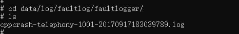
<!--DelEnd-->

**Fault Logs of Null Pointer**

In this scenario, a message is printed in the log, indicating that the fault may be caused by a null pointer dereference. The following is an example process crash log archived by DevEco Studio in FaultLog:

```text
Generated by HiviewDFX@OpenHarmony
================================================================
Device info:OpenHarmony 3.2        <- Device information
Build info:OpenHarmony 5.0.0.23    <- Build information
Fingerprint:cdf52fd0cc328fc432459928f3ed8edfe8a72a92ee7316445143bed179138073 <- Fingerprint
Module name:crasher_cpp            <-Module name
Timestamp:2024-05-06 20:10:51.000  <- Timestamp when the fault occurs
Pid:9623   <- Process ID
Uid:0         <- User ID
Process name:./crasher_cpp         <- Process name
Process life time:1s               <- Process life time
Reason:Signal:SIGSEGV(SEGV_MAPERR)@0x00000004 probably caused by NULL pointer dereference  <- Fault cause and null pointer prompt
Fault thread info:
Tid:9623, Name:crasher_cpp         <- Thread ID, thread name
#00 pc 00008d22 /system/bin/crasher_cpp(TestNullPointerDereferenceCrash0()+22)(adfc673300571d2da1e47d1d12f48b44)  <- Call stack
#01 pc 000064d1 /system/bin/crasher_cpp(DfxCrasher::ParseAndDoCrash(char const*) const+160)(adfc673300571d2da1e47d1d12f48b44)
#02 pc 00006569 /system/bin/crasher_cpp(main+92)(adfc673300571d2da1e47d1d12f48b44)
#03 pc 00072b98 /system/lib/ld-musl-arm.so.1(libc_start_main_stage2+56)(d820b1827e57855d4f9ed03ba5dfea83)
#04 pc 00004e28 /system/bin/crasher_cpp(_start_c+84)(adfc673300571d2da1e47d1d12f48b44)
#05 pc 00004dcc /system/bin/crasher_cpp(adfc673300571d2da1e47d1d12f48b44)
Registers:   <- Fault registers
r0:ffffafd2 r1:00000004 r2:00000001 r3:00000000
r4:ffd27e39 r5:0096e000 r6:00000a40 r7:0096fdfc
r8:f7ba58d5 r9:f7baea86 r10:f7cadd38
fp:ffd27308 ip:f7cb2078 sp:ffd272a0 lr:f7c7ab98 pc:0096ad22
Memory near registers:  <- Memory near fault registers
r4([stack]):
    ffd27e30 72656873
    ffd27e34 7070635f
    ...
    ffd27eac 3d73746f
r5(/system/bin/crasher_cpp):
    0096dff8 00000000
    0096dffc 0096717d
    ...
    0096e074 00000000
r7(/system/lib/ld-musl-arm.so.1):
    f7cabb58 00000000
    f7cabb5c 0034ba00
    ...
    f7cabbd4 00000000
r8(/system/lib/ld-musl-arm.so.1):
    f7ba58cc 63637573
    f7ba58d0 2e737365
    ...
    f7ba5948 70206269
r9(/system/lib/ld-musl-arm.so.1):
    f7baea7c 20746f6e
    f7baea80 6e756f66
    ...
    f7baeaf8 25206e69
r10([anon:ld-musl-arm.so.1.bss]):
    f7cadd30 00000000
    f7cadd34 00000000
    ...
    f7caddac 00000000
r12([anon:ld-musl-arm.so.1.bss]):
    f7cb2070 56726562
    f7cb2074 65756c61
    ...
    f7cb20ec 00000000
sp([stack]):
    ffd27328 00000000
    ffd2732c 00966dd0
    ...
    ffd273a4 00000004
pc(/system/bin/crasher_cpp):
    00966dc8 e1a0d00c
    00966dcc eb000000
    ...
    00966e44 e5907008
pc(/system/bin/crasher_cpp):
    00966dc8 e1a0d00c
    00966dcc eb000000
    ...
    00966e44 e5907008
FaultStack:  <- Stack of the crashed thread
    ffd27260 00000000
    ffd27264 f7cac628
    ...
    ffd2729c 0096ad1f
sp0:ffd272a0 0096fdfc <- #00Stack top
    ffd272a4 009684d3
sp1:ffd272a8 00000001
    ffd272ac 73657408
    ffd272b0 f7590074
    ...
    ffd272dc 0096856d
sp2:ffd272e0 ffd27334
    ffd272e4 ffd27334
    ffd272e8 00000002
    ....
    ffd272f4 f7bfbb9c
sp3:ffd272f8 00000000
    ffd272fc ffd27334

Maps:   <- Process maps files when the fault occurs
962000-966000 r--p 00000000 /system/bin/crasher_cpp
966000-96c000 r-xp 00003000 /system/bin/crasher_cpp
96c000-96f000 r--p 00008000 /system/bin/crasher_cpp
96f000-970000 rw-p 0000a000 /system/bin/crasher_cpp
149f000-14a0000 ---p 00000000 [heap]
14a0000-14a2000 rw-p 00000000 [heap]
...
f7b89000-f7be1000 r--p 00000000 /system/lib/ld-musl-arm.so.1
f7be1000-f7ca9000 r-xp 00057000 /system/lib/ld-musl-arm.so.1
f7ca9000-f7cab000 r--p 0011e000 /system/lib/ld-musl-arm.so.1
f7cab000-f7cad000 rw-p 0011f000 /system/lib/ld-musl-arm.so.1
f7cad000-f7cbc000 rw-p 00000000 [anon:ld-musl-arm.so.1.bss]
ffd07000-ffd28000 rw-p 00000000 [stack]
ffff0000-ffff1000 r-xp 00000000 [vectors]
OpenFiles:   <- FD information of the file opened by the process when the fault occurs
0->/dev/pts/1 native object of unknown type 0
1->/dev/pts/1 native object of unknown type 0
2->/dev/pts/1 native object of unknown type 0
3->socket:[67214] native object of unknown type 0
...
11->pipe:[67219] native object of unknown type 0
12->socket:[29074] native object of unknown type 0
25->/dev/ptmx native object of unknown type 0
26->/dev/ptmx native object of unknown type 0

HiLog:   <- Hilog logs when the fault occurs
05-06 20:10:51.301  9623  9623 E C03f00/MUSL-SIGCHAIN: signal_chain_handler call 2 rd sigchain action for signal: 11
05-06 20:10:51.306  9623  9623 I C02d11/DfxSignalHandler: DFX_SigchainHandler :: sig(11), pid(9623), tid(9623).
05-06 20:10:51.307  9623  9623 I C02d11/DfxSignalHandler: DFX_SigchainHandler :: sig(11), pid(9623), processName(./crasher_cpp), threadName(crasher_cpp).
05-06 20:10:51.389  9623  9623 I C02d11/DfxSignalHandler: processdump have get all resgs

```

**Fault Logs of Stack Overflow**

If the following prompt information is printed in logs, it indicates that the fault may be caused by stack overflow. The following is an example process crash log archived by DevEco Studio in FaultLog:

```text
Generated by HiviewDFX@OpenHarmony
================================================================
Device info:OpenHarmony 3.2            <- Device information
Build info:OpenHarmony 5.0.0.23        <- Build information
Fingerprint:8bc3343f50024204e258b8dce86f41f8fcc50c4d25d56b24e71fe26c0a23e321  <- Fingerprint
Module name:crasher_cpp                <- Module name
Timestamp:2024-05-06 20:18:24.000      <- Timestamp when the fault occurs
Pid:9838                               <- Process ID
Uid:0                                  <- User ID
Process name:./crasher_cpp             <- Process name
Process life time:2s                   <- Process life time
Reason:Signal:SIGSEGV(SEGV_ACCERR)@0xf76b7ffc current thread stack low address = 0xf76b8000, probably caused by stack-buffer-overflow <- Fault cause and stack overflow prompt
...
```

**Fault Logs of Stack Coverage**

In the stack coverage scenario, the stack frame cannot be traced because the stack memory is illegally accessed. A message is displayed in the log, indicating that the stack fails to be returned and the system attempts to parse the thread stack to obtain an unreliable call stack. The information is provided for problem analysis. The following is an example process crash log archived by DevEco Studio in FaultLog:

```text
Generated by HiviewDFX@OpenHarmony
================================================================
Device info:OpenHarmony 3.2               <- Device information
Build info:OpenHarmony 5.0.0.23           <- Build information
Fingerprint:79b6d47b87495edf27135a83dda8b1b4f9b13d37bda2560d43f2cf65358cd528    <- Fingerprint
Module name:crasher_cpp                   <- Module name
Timestamp:2024-05-06 20:27:23.2035266415  <- Timestamp when the fault occurs
Pid:10026                                 <- Process ID
Uid:0                                     <- User ID
Process name:./crasher_cpp                <- Process name
Process life time:1s                      <- Process life time
Reason:Signal:SIGSEGV(SEGV_MAPERR)@0000000000 probably caused by NULL pointer dereference  <- Fault cause
Fault thread info:
Tid:10026, Name:crasher_cpp               <- Thread ID, thread name
#00 pc 00000000 Not mapped
#01 pc 00008d22 /system/bin/crasher_cpp(TestNullPointerDereferenceCrash0()+22)(adfc673300571d2da1e47d1d12f48b44)  <- Call stack
#02 pc 000064d1 /system/bin/crasher_cpp(DfxCrasher::ParseAndDoCrash(char const*) const+160)(adfc673300571d2da1e47d1d12f48b44)
#03 pc 00006569 /system/bin/crasher_cpp(main+92)(adfc673300571d2da1e47d1d12f48b44)
#04 pc 00072b98 /system/lib/ld-musl-arm.so.1(libc_start_main_stage2+56)(d820b1827e57855d4f9ed03ba5dfea83)
Registers:   <- Fault registers
r0:ffffafd2 r1:00000004 r2:00000001 r3:00000000
r4:ffd27e39 r5:0096e000 r6:00000a40 r7:0096fdfc
r8:f7ba58d5 r9:f7baea86 r10:f7cadd38
fp:ffd27308 ip:f7cb2078 sp:ffd272a0 lr:f7c7ab98 pc:0096ad22
ExtraCrashInfo(Unwindstack):   <- Print the custom stack information about the system framework service.
Failed to unwind stack, try to get unreliable call stack from #02 by reparsing thread stack   <- Attempt to obtain an unreliable stack from the thread stack
...
```

**Fault Logs of Asynchronous Thread**

When an asynchronous thread crashes, the stack of the thread that submits the asynchronous task is also printed to help locate the crash. Currently, the ARM64 architecture is supported on the debugging application (**HAP_DEBUGGABLE**). The **SubmitterStacktrace** is used to differentiate the call stack of the crash thread and that of the submitting thread. The following is an example process crash log archived by DevEco Studio in FaultLog:

```text
Generated by HiviewDFX@OpenHarmony
================================================================
Device info:OpenHarmony 3.2                 <- Device information
Build info:OpenHarmony 5.0.0.23             <- Build information
Fingerprint:8bc3343f50024204e258b8dce86f41f8fcc50c4d25d56b24e71fe26c0a23e321  <- Fingerprint
Module name:crasher_cpp                     <- Module name
Timestamp:2024-05-06 20:28:24.000           <- Timestamp when the fault occurs
Pid:9838                                    <- Process ID
Uid:0                                       <- User ID
Process name:./crasher_cpp                  <- Process name
Process life time:2s                        <- Process life time
Reason:Signal:SIGSEGV(SI_TKILL)@0x000000000004750 from:18256:0   <- Fault Cause
Fault thread info:
Tid:18257, Name:crasher_cpp                 <- Thread ID, thread name
#00 pc 000054e6 /system/bin/ld-musl-aarch64.so.l(raise+228)(adfc673300571d2da1e47d1d12f48b44) <- Call stack
#01 pc 000054f9 /system/bin/crasher_cpp(CrashInSubThread(void*)+56)(adfc673300571d2da1e47d1d12f48b50)
#02 pc 000054f9 /system/bin/ld-musl-aarch64.so.l(start+236)(adfc673300571d2da1e47d1d12f48b44)
========SubmitterStacktrace========       <- The call stack used to print submitting thread
#00 pc 000094dc /system/bin/crasher_cpp(DfxCrasher::AsyncStacktrace()+36)(adfc673300571d2da1e47d1d12f48b50)
#01 pc 00009a58 /system/bin/crasher_cpp(DfxCrasher::ParseAndDoCrash(char const*) const+232)(adfc673300571d2da1e47d1d12f48b50)
#02 pc 00009b40 /system/bin/crasher_cpp(main+140)(adfc673300571d2da1e47d1d12f48b50)
#03 pc 0000a4e1c /system/bin/ld-musl-aarch64.so.l(libc_start_main_stage2+68)(adfc673300571d2da1e47d1d12f48b44)
...
```

**Logs of Custom Information About System Framework Services**

When a process crashes, the custom maintenance and test information of the system framework service can be printed to help you locate faults. The information can be the string, memory, callback, or stack type. Currently, the ARM64 architecture is supported. Since API 16, the **LastFatalMessage** field carries only the last fatal-level log printed by using HiLog or the last message set by using the **set_fatal_memssage** API of libc before the process crashes. The callback type information and stack type information are moved from the **LastFatalMessage** field to the **ExtraCrashInfo** (Callback) and **ExtraCrashInfo** (Unwindstack) fields, respectively. The following is the core content of the process crash logs archived by DevEco Studio in FaultLog, which contains four types of custom information about system framework services.

- String information:

    ```text
    Generated by HiviewDFX@OpenHarmony
    ================================================================
    Device info:OpenHarmony 3.2        <- Device information
    Build info:OpenHarmony 5.0.0.23    <- Build information
    Fingerprint:cdf52fd0cc328fc432459928f3ed8edfe8a72a92ee7316445143bed179138073 <- Fingerprint
    Module name:crasher_cpp            <-Module name
    Timestamp:2024-05-06 20:10:51.000  <- Timestamp when the fault occurs
    Pid:9623   <- Process ID
    Uid:0         <- User ID
    Process name:./crasher_cpp         <- Process name
    Process life time:1s               <- Process life time
    Reason:Signal:SIGSEGV(SEGV_MAPERR)@0x00000004 probably caused by NULL pointer dereference  <- Fault cause and null pointer prompt
    Fault thread info:
    Tid:9623, Name:crasher_cpp         <- Thread ID, thread name
    #00 pc 00008d22 /system/bin/crasher_cpp(TestNullPointerDereferenceCrash0()+22)(adfc673300571d2da1e47d1d12f48b44)  <- Call stack
    #01 pc 000064d1 /system/bin/crasher_cpp(DfxCrasher::ParseAndDoCrash(char const*) const+160)(adfc673300571d2da1e47d1d12f48b44)
    #02 pc 00006569 /system/bin/crasher_cpp(main+92)(adfc673300571d2da1e47d1d12f48b44)
    #03 pc 00072b98 /system/lib/ld-musl-arm.so.1(libc_start_main_stage2+56)(d820b1827e57855d4f9ed03ba5dfea83)
    #04 pc 00004e28 /system/bin/crasher_cpp(_start_c+84)(adfc673300571d2da1e47d1d12f48b44)
    #05 pc 00004dcc /system/bin/crasher_cpp(adfc673300571d2da1e47d1d12f48b44)
    Registers:   <- Fault registers
    r0:ffffafd2 r1:00000004 r2:00000001 r3:00000000
    r4:ffd27e39 r5:0096e000 r6:00000a40 r7:0096fdfc
    r8:f7ba58d5 r9:f7baea86 r10:f7cadd38
    fp:ffd27308 ip:f7cb2078 sp:ffd272a0 lr:f7c7ab98 pc:0096ad22
    ExtraCrashInfo(String):   <- Print custom string information about the system framework service
    test get CrashObject.
    ...
    ```

- Memory information:

    ```text
    ...
    ExtraCrashInfo(Memory start address 0000xxxx):   <- Print custom memory information about the system framework service
    +0x000: xxxxx   xxxxx    xxxxx     xxxxx         <- Print the memory value from 0x000 to 0x018.
    +0x020: xxxxx   xxxxx    xxxxx     xxxxx         <- Print the memory value from 0x020 to 0x038.
    ...
    ```

3. Callback information:

    From API 16, the callback information is moved from the **LastFatalMessage** field to the **ExtraCrashInfo(Callback)** field.

    ```text
    ...
    ExtraCrashInfo(Callback):   <- Print custom callback information about the system framework service.
    test get callback information.
    ...
    ```

4. Stack information:

    From API 16, the stack information is moved from the **LastFatalMessage** field to the **ExtraCrashInfo(Unwindstack)** field.

    ```text
    ...
    ExtraCrashInfo(Unwindstack):   <- Print the custom stack information about the system framework service.
    Failed to unwind stack, try to get unreliable call stack from #02 by reparsing thread stack
    ...
    ```

> **NOTE**
>
> The omitted information is similar to the example of the string information.

### Locating the Problematic Code Based on the Crash Stack

#### Method 1: DevEco Studio

In application development, you can locate the problematic code in the cppcrash stack of the dynamic library. Both native stack frames and JS stack frames are supported. For some stack frames that fail to be parsed and located in DevEco Studio, refer to Method 2.


#### Method 2: SDK llvm-addr2line

- Obtain the symbol list
    Obtain the .so file with symbols in the crash stack, which should be the same as that of the application or system.
    Compiled and built in DevEco Studio, the .so file of dynamic library is generated with symbols by default in **/build/default/intermediates/libs**. You can run the **Linux file** command to check whether the BuildID of two .so files match. Generated by a compiler, BuildID is the unique identifier of a binary file, in which "not stripped" indicates that a symbol table is included.

    ```text
    $ file libbabel.so
    libbabel.so: ELF 64-bit LSB shared object, ARM aarch64, version 1 (SYSV), dynamically linked, BuildID[sha1]=fdb1b5432b9ea4e2a3d29780c3abf30e2a22da9d, with debug_info, not stripped
    ```

    Note: The symbol table of the system dynamic library is archived with the version.

- Locate the line number using llvm-addr2line
    You can find llvm-addr2line in **[SDK DIR PATH]\OpenHarmony\11\native\llvm\bin**, or you need to search for the path as it varies based on the SDK version. 
    The sample stack is as follows (part are omitted):

    ```text
    Generated by HiviewDFX@OpenHarmony
    ================================================================
    Device info:OpenHarmony 3.2
    Build info:OpenHarmony 5.0.0.22
    Fingerprint:50577c0a1a1b5644ac030ba8f08c241cca0092026b59f29e7b142d5d4d5bb934
    Module name:com.samples.recovery
    Version:1.0.0
    VersionCode:1000000
    PreInstalled:No
    Foreground:No
    Timestamp:2017-08-05 17:03:40.000
    Pid:2396
    Uid:20010044
    Process name:com.samples.recovery
    Process life time:7s
    Reason:Signal:SIGSEGV(SEGV_MAPERR)@0000000000  probably caused by NULL pointer dereference
    Tid:2396, Name:amples.recovery
    # 00 pc 00003510 /data/storage/el1/bundle/libs/arm/libentry.so(TriggerCrash(napi_env__*, napi_callback_info__*)+24)(446ff75d3f6a518172cc52e8f8055650b02b0e54)
    # 01 pc 0002b0c5 /system/lib/platformsdk/libace_napi.z.so(panda::JSValueRef ArkNativeFunctionCallBack<true>(panda::JsiRuntimeCallInfo*)+448)(a84fbb767fd826946623779c608395bf)
    # 02 pc 001e7597 /system/lib/platformsdk/libark_jsruntime.so(panda::ecmascript::EcmaInterpreter::RunInternal(panda::ecmascript::JSThread*, unsigned char const*, unsigned long long*)+14710)(106c552f6ce4420b9feac95e8b21b792)
    # 03 pc 001e0439 /system/lib/platformsdk/libark_jsruntime.so(panda::ecmascript::EcmaInterpreter::Execute(panda::ecmascript::EcmaRuntimeCallInfo*)+984)(106c552f6ce4420b9feac95e8b21b792)
    ...
    # 39 pc 00072998 /system/lib/ld-musl-arm.so.1(libc_start_main_stage2+56)(5b1e036c4f1369ecfdbb7a96aec31155)
    # 40 pc 00005b48 /system/bin/appspawn(_start_c+84)(cb0631260fa74df0bc9b0323e30ca03d)
    # 41 pc 00005aec /system/bin/appspawn(cb0631260fa74df0bc9b0323e30ca03d)
    Registers:
    r0:00000000 r1:ffc47af8 r2:00000001 r3:f6555c94
    r4:00000000 r5:f4d90f64 r6:bd8434f8 r7:00000000
    r8:00000000 r9:ffc48808 r10:ffc47b70
    fp:f7d8a5a0 ip:00000000 sp:ffc47aac lr:f4d6b0c7 pc:bd843510
    ```

    Parsed by SDK llvm-addr2line, the row number of problematic code is as follows:

    ```text
    [SDK DIR PATH]\OpenHarmony\11\native\llvm\bin> .\llvm-addr2line.exe -Cfie libentry.so 3150
    TrggerCrash(napi_env__*, napi_callback_info__*)
    D:/code/apprecovery-demo/entry/src/main/cpp/hello.cpp:48
    ```

    You can use the **llvm-addr2line.exe -fCpie libutils.z.so offset** command to parse the stack line by line. If there are multiple offsets, you can parse them together using the **llvm-addr2line.exe -fCpie libxxx.so 0x1bc868 0x1be28c xxx** command. If the obtained row number does not seem correct, you can change the address (for example, subtract 1) or disable some compilation optimization.

#### Method 3: DevEco Studio hstack

hstack is a tool provided by DevEco Studio for you to restore the crash stack of an obfuscated release app to the source code stack. It runs on Windows, macOS, and Linux. For details, see [DevEco Studio hstack User Guide](https://developer.huawei.com/consumer/cn/doc/harmonyos-guides-V5/ide-command-line-hstack-V5).

### Reviewing Code Based on Services

Review the context after the row number of the stack top is obtained. As shown in the following figure, line 48 in the **hello.cpp** file indicates a null pointer dereference.

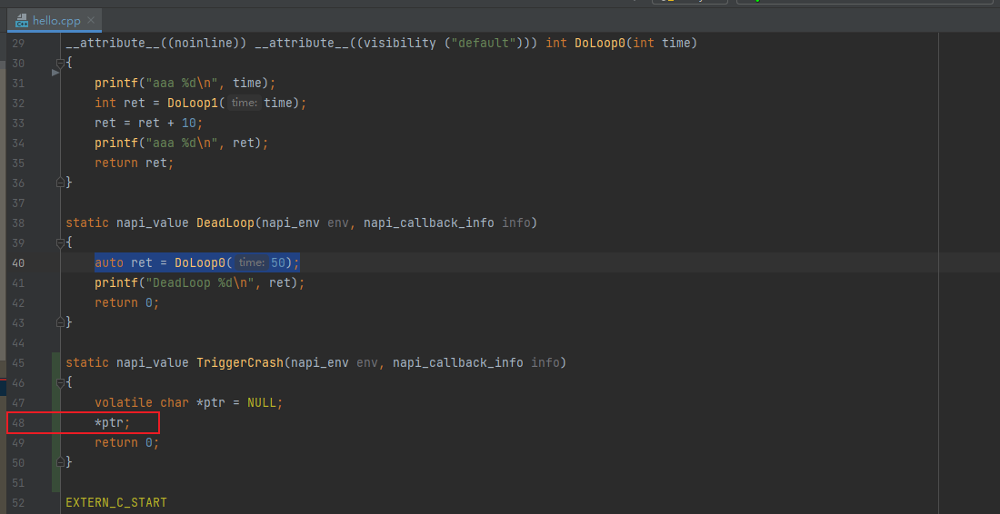

This example is constructed, and actual scenario is usually more complicate and needs to be analyzed based on services.

### Disassembling (optional)

Generally, if the problem is clear, you can locate the problem by decompiling the code line. In a few cases, if the method called in a line contains multiple parameters and the parameters involve structs, you need to use disassembly for further analysis.

Case

The header information of the CPPCRASH log is as follows:

```text
Process name:com.ohos.medialibrary.medialibrarydata

Process life time:13402s

Reason:SIGSEGV(SEGV_MAPERR)@0x0000005b3b46c000

Fault thread info:

Tid:48552, Name:UpradeTask

#00 pc 00000000000a87e4 /system/lib/ld-musl-aarch64.so.1(memcpy+356)(3c3e7fb27680dc2ee99aa08dd0f81e85)

...
```

Procedure:

- Obtain the corresponding assembly instruction based on the PC register address and obtain the current operation based on the assembly instruction.

    Obtain the PC address at the top of the stack from the CPPCRASH log file and disassemble the corresponding ELF file (using the unstrip .so file and the **llvm-objdump -d -l xxx.so** command).

    For example, when a **data_abort** issue occurs during the execution of the instruction corresponding to the **00000000000a87e4** address, decompile the libc.so file corresponding to the buildId (**3c3e7fb27680dc2ee99aa08dd0f81e85**).

    Disassemble the code to view the information displayed in the **a87e4** offset address:

    ```text
    xxx/../../third_party/optimized-routines/string/aarch64/memcpy.S:175

    a87e4:   a94371aa         ldp x10, x11, [x1, #48]
    ```

    Check the code of the **memcpy.S** source file corresponding to line 175:

    ```text
    L(loop64):

    line 170   stp A_l, A_h, [dst, 16]

    line 171   ldp A_l, A_h, [src, 16]

    line 172   stp B_l, B_h, [dst, 32]

    line 173   ldp B_l, B_h, [src, 32]

    line 174   stp C_l, C_h, [dst, 48]

    line 175   ldp C_l, C_h, [src, 48]      ---->  Instruction in the crash

    line 176   stp D_l, D_h, [dst, 64]

    line 177   ldp D_l, D_h, [src, 64]

    line 178   subs count, count, 64

    line 179   b.hi L(loop64)
    ```

- Infer the code object of the current operation based on the register value and context.

    Generally, register **x0** is the first parameter of the function, **x1** is the second parameter, **x2** is the third parameter, and so on. If the method is a class method, **x0** is the address pointer of the object, and **x1**, **x2**, and **x3** are deduced by analogy. Note that if there are more than five function parameters, they will be pushed into the stack.

    In **void* memcpy(void* restrict dest, void* restrict src, size_t n)** at the stack top, **x0** indicates the destination address **dest**, **x1** indicates the source address, and **x2** indicates the number of copied bytes.

    Obtain the corresponding three register values in the CPPCRASH log file. Based on the error access address **0x0000005b3b46c000**, it is determined that the faulty parameter is the **src** parameter corresponding to **x1**.

    ```text
    Register:

    x0:000005b50c3e3c4 x1:000005b3b46bfcc x2:0000000000007e88 x3:000005b50c42380

    ...
    ```

3. Determine the fault type of the code object.

    Check the memory address near the register in **Memory near registers** in the CPPCRASH log.

    ```text
    x1(/data/medialibrary/database/kvdb/3ddb6fb8b2fcb38d2f431e86bfb806dab771637860d6e86bb9430fa15df04248/single_ver/main/gen_natural_st):

        0000005b21bb1fb8 8067d0f2e727f00a

        0000005b21bb1fc0 1b10e1e9a1079f7a

        0000005b21bb1fc8 83906d9c18cdb9c1

        0000005b21bb1fd0 627dd75ab9335eb0

        0000005b21bb1fd8 aabe2bb1b00f2c03

        0000005b21bb1fe0 f981e4acb716cbc1

        0000005b21bb1fe8 806b3d5730d281ee

        0000005b21bb1ff0 3e99fedbc0a9b5e9

        0000005b21bb1ff8 a91ab9d327969682

        0000005b21bb2000 ffffffffffffffff       -----> Out-of-bounds read

        0000005b21bb2008 ffffffffffffffff

        0000005b21bb2010 ffffffffffffffff

        0000005b21bb2018 ffffffffffffffff

        0000005b21bb2020 ffffffffffffffff

        0000005b21bb2028 ffffffffffffffff

        0000005b21bb2030 ffffffffffffffff
    ```

    According to the log, an out-of-bound read problem occurs. The faulty parameters are **buf** and **bufSize** of **memcpy**.

    In this case, you only need to analyze the parameter logic passed in when **memcpy** is called in the code.

4. Track the parameter source of the problematic object and locate the problem based on the code and logs.

    Method 1: Check whether the parameter object and range are valid. For example, check whether the **buf** size is the same as the input **bufSize**.

    Method 2: Check whether the lifecycle of the parameter object is valid. For example, check whether **buf** has been released and whether memory corruption occurs due to multi-thread operations.

    Method 3: Use the parameter object to access the function context and check the improper operation logic of the parameter. For example, trace the operation logic of **buf** and **bufsize**, add debugging information, and locate the improper operation logic.

    Code snippet:

    ```text
    static StatusInter xxxFunc(..., const uint8_t *buf, uint32_t bufSize)

    ...

    uint32_t srcSize = bufSize;

    uint32_t srcOffset = cache->appendOffset - bufSize;

    errno_t ret = memcpy_s(cache->buffer + srcOffset, srcSize, buf, bufSize); 

    if (ret != EOK) {

        return MEMORY_OPERATE_FAILED_INTER;

    }

    ...
    ```

    By continuously tracing the sources of **buf** and **bufSize**, it is found that after continuous copy, **bufSize** is greater than **buf**, causing out-of-bounds read.

### Common CppCrash Faults and Causes

- Null pointer dereference
    When a crash log is in format **SIGSEGV(SEGV_MAPERR)@0x00000000** or the values of the input parameter registers such as **r0** and **r1** printed in the **Register** are **0**, check whether a null pointer is input when invoking a method.
    When a crash log is in format **SIGSEGV(SEGV_MAPERR)@0x0000000c** or the value of the input parameter register such as **r1** printed in the **Register** is small, check whether the called structs contain a null pointer.
- SIGABRT
    Generally, this fault is triggered by the user, framework, or C library, and you can locate the problematic code in the first frame of the framework library. In this case, check whether resources such as thread and file descriptor are properly used, and whether the invoking sequence of APIs is correct.
- SIGSEGV
  - Multithreading operation collection in STD library is not thread-safe. If the collection is added or deleted on multiple threads, the **SIGSEGV** crash occurs. If **llvm-addr2line** is used and the result code involve operations on collections, this could be the reason for the crash.
  - If the pointer does not match the lifecycle of an object, for example, using a raw pointer to store the **sptr** type and **shared_ptr** type, can lead to memory leak and dangling pointer. A raw pointer is a pointer that does not have features such as encapsulation and automatic memory management. It is only a simple pointer to the memory address. The memory to which the pointer points is not protected or managed. A raw pointer can directly access the pointed memory, but problems such as memory leak and null pointer reference may also occur. Therefore, when using a raw pointer, pay attention to potential security problems. You are advised to use smart pointers to manage memory.
- Use after free
    This fault occurs when the reference of a released stack variable is not set to null and the access continues.

    ```text
    # include <iostream>

    int& getStackReference() {
        int x = 5;
        return x; // Return the reference to x.
    }

    int main() {
        int& ref = getStackReference (); // Obtain the reference to x.
        // x is released when getStackReference() returns.
        // ref is now a dangling reference. If you continue to access it, undefined behavior occurs.
        std::cout << ref << std::endl; // Outputting the value of x is an undefined behavior.
        return 0;
    }
    ```

- Stack overflow occurs in recursive invocation, mutual invocation of destructors, and the use of large stack memory blocks in special stacks (signal stacks).
    ```text
    # include <iostream>

    class RecursiveClass {
    public:
        RecursiveClass() {
            std::cout << "Constructing RecursiveClass" << std::endl;
        }

        ~RecursiveClass() {
            std::cout << "Destructing RecursiveClass" << std::endl;
            // Recursive invocation of a destructor.
            RecursiveClass obj;
        }
    };

    int main() {
        RecursiveClass obj;
        return 0;
    }
    ```

    When a **RecursiveClass** object is created, its constructor is called. When this object is destroyed, its destructor is called. In the destructor, a new **RecursiveClass** object is created, which causes recursive calls until the stack overflows. Recursive calls are infinite. As a result, the stack space is used up and the application crashes.
- Binary mismatch usually indicates the mismatch of the Application Binary Interface (ABI). For example, when a compiled binary interface or its data structure definition does not match the ABI, a random crash stack is generated.
- Memory corruption occurs when the memory of a valid wild pointer is changed to an invalid value, which results in out-of-bounds access and data overwrite. In this case, a random crash stack is generated.
- SIGBUS (Aligment) occurs when the address is in the unaligned state after the pointer is forcibly converted.
- When the length of a function name exceeds 256 bytes, the stack frame does not contain the function name.
- If the ELF file does not contain **.note.gnu.build-id**, the stack frame does not contain the **build-id** information.

## Case Study

The following analyzes the typical CppCrash cases based on signals, scenarios, and tools respectively.
The analysis based on signals introduces common crash signals and provides a typical case for each type of signal.
The analysis based on scenarios concludes a common scenario for frequent problems, and provides a typical case for each scenario.
The analysis based on tools describes how to use various maintenance and debugging tools, and provides a typical case for each tool.

### Analyzing CppCrash Based on Signals

#### Type 1: SIGSEGV Crash

The **SIGSEGV** signal indicates a Segmentation Fault of the program. This fault occurs when a program accesses a memory area outside its bounds (for example, writes a memory in the operating system), or accesses a memory area without correct permission (for example, writes to read-only memory). The details are as follows:

- **SIGSEGV** is a type of memory management fault.
- **SIGSEGV** is generated in a user-mode program. 
- **SIGSEGV** occurs when a user-mode program accesses a memory area outside its bound.
- **SIGSEGV** also occurs when a user-mode program accesses a memory without correct permission.

In most cases, **SIGSEGV** is caused by pointer overwriting. However, not all pointer overwriting causes **SIGSEGV**. The **SIGSEGV** crash would not be triggered unless an out-of-bounds pointer is dereferenced. In addition, even if an out-of-bounds pointer is dereferenced, the **SIGSEGV** crash may not be caused. The **SIGSEGV** crash involves the operating system, C library, compiler, and linker. The examples are as follows:

- The memory area is read-only memory.
    The sample code is as follows:

    ```text
    static napi_value TriggerCrash(napi_env env, napi_callback_info info)
    {
        char *s = "hello world";
        s[1] = 'H';
        return 0;
    }
    ```

    This is one of the most common examples. In this case, "hello world" is a constant string and is placed in **.rodata section** of GCC. When the target program is generated, **.rodata section** is merged into the **text segment** and placed together with the **code segment**. Therefore, the memory area where the **.rodata section** is located is read-only. This is the **SIGSEGV(SEGV_ACCERR)** crash caused by writing to read-only memory area.

    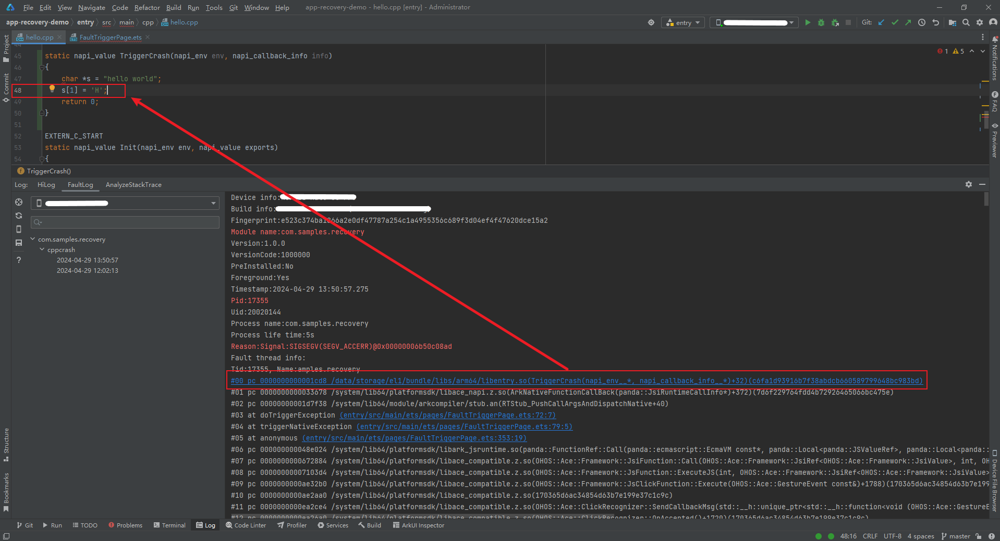

- The memory area is out of the process address space.

    The sample code is as follows:

    ```text
    static napi_value TriggerCrash(napi_env env, napi_callback_info info)
    {
        uint64_t* p = (uint64_t*)0xffffffcfc42ae6f4;
        *p = 10;
        return 0;
    }
    ```

    In this example, the program accesses a memory address in the kernel. The **SIGSEGV(SEGV_MAPERR)@0xffffffcfc42ae6f4** crash is usually triggered by the program by accident. The key logs of this cpp crash are as follows:

    ```text
    Device info:xxxxxx xxxx xx xxx
    Build info:xxxxxxx
    Fingerprint:73a5dcdf3e509605563aa11ac8cb4f3d7f99b9946dc142212246b53b741c4129
    Module name:com.samples.recovery
    Version:1.0.0
    VersionCode:1000000
    PreInstalled:No
    Foreground:Yes
    Timestamp:2024-04-29 14:07:12.082
    Pid:21374
    Uid:20020144
    Process name:com.samples.recovery
    Process life time:8s
    Reason:Signal:SIGSEGV(SEGV_MAPERR)@0xffffffcfc42ae6f4 
    Fault thread info:
    Tid:21374, Name:amples.recovery
    # 00 pc 0000000000001ccc /data/storage/el1/bundle/libs/arm64/libentry.so(TriggerCrash(napi_env__*, napi_callback_info__*)+36)(4dd115fa8b8c1b3f37bdb5b7b67fc70f31f0dbac)
    # 01 pc 0000000000033678 /system/lib64/platformsdk/libace_napi.z.so(ArkNativeFunctionCallBack(panda::JsiRuntimeCallInfo*)+372)(7d6f229764fdd4b72926465066bc475e)
    # 02 pc 00000000001d7f38 /system/lib64/module/arkcompiler/stub.an(RTStub_PushCallArgsAndDispatchNative+40)
    # 03 at doTriggerException entry (entry/src/main/ets/pages/FaultTriggerPage.ets:72:7)
    # 04 at triggerNativeException entry (entry/src/main/ets/pages/FaultTriggerPage.ets:79:5)
    # 05 at anonymous entry (entry/src/main/ets/pages/FaultTriggerPage.ets:353:19)
    # 06 pc 000000000048e024 /system/lib64/platformsdk/libark_jsruntime.so(panda::FunctionRef::Call(panda::ecmascript::EcmaVM const*, panda::Local<panda::JSValueRef>, panda::Local<panda::JSValueRef> const*, int)+1040)(9fa942a1d42bd4ae607257975fbc1b77)
    ...
    # 38 pc 00000000000324b0 /system/bin/appspawn(AppSpawnRun+172)(c992404f8d1cf03c84c067fbf3e1dff9)
    # 39 pc 00000000000213a8 /system/bin/appspawn(main+956)(c992404f8d1cf03c84c067fbf3e1dff9)
    # 40 pc 00000000000a4b98 /system/lib/ld-musl-aarch64.so.1(libc_start_main_stage2+64)(ff4c94d996663814715bedb2032b2bbc)
    ```

3. The memory does not exist.
    The sample code is as follows:

    ```text
    static napi_value TriggerCrash(napi_env env, napi_callback_info info)
    {
        int *a = NULL;
        *a = 1;
        return 0;
    }
    ```

    In practice, the most common null pointer dereference occurs when the user-mode address to which the null pointer points does not exist. The inference information "Reason:Signal:SIGSEGV(SEGV_MAPERR)@000000000000000000 probably caused by NULL pointer dereference" is printed in the **Reason** of CppCrash logs, as shown in the following figure.

    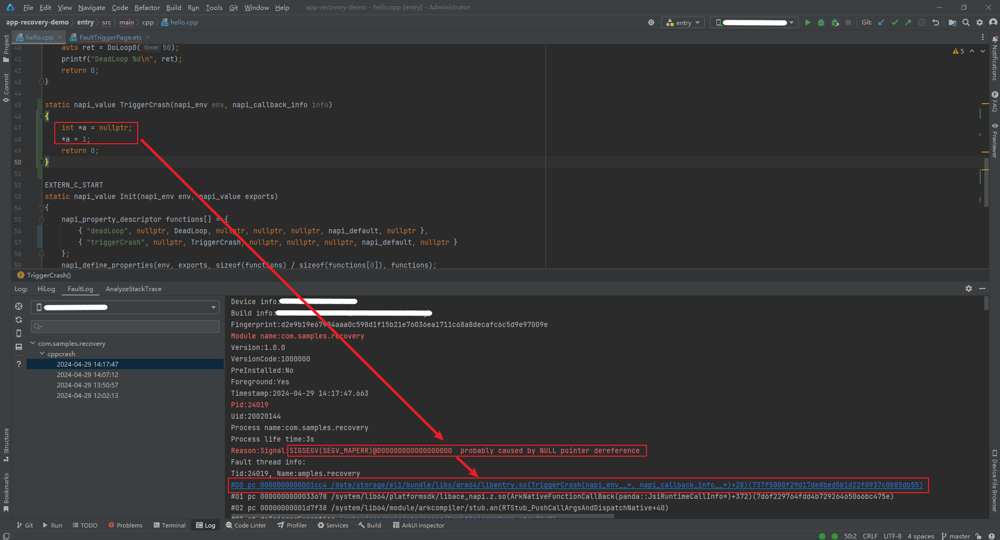

4. Double free.
    The sample code is as follows:

    ```text
    static napi_value TriggerCrash(napi_env env, napi_callback_info info)
    {
        void *pc = malloc(1024);
        free(pc);
        free (pc); // Double free
        printf("free ok!\n");
        return 0;
    }
    ```

    In the double-free memory scenario, the system throws a **SIGSEGV(SI_TKILL)** fault indicating an illegal memory operation, as shown below

    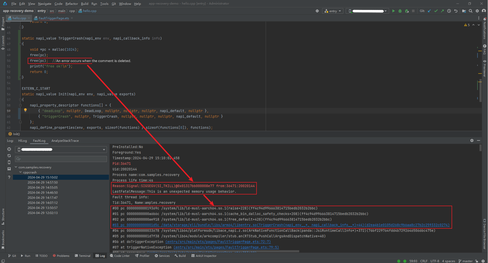

    The preceding are common causes for **SIGSEGV** crashes. Other scenarios may also trigger **SIGSEGV** crashes, which include stack overflow memory access, heap overflow memory access, global wild pointer access, execution on an invalid address, and invalid parameter invocation. The **SIGSEGV** crash is associated to the stack allocation and recovery of the operating system and the compiler. 

#### Type 2: SIGABRT Crash

The **SIGABRT** signal is sent to abort the process. This signal can be called by the process executing **abort()** in C standard library, or it can be sent to the process from outside like other signals. 

- Executing the **abort()** function.
    The sample code is as follows:

    ```text
    static napi_value TriggerCrash(napi_env env, napi_callback_info info)
    {
        OH_LOG_FATAL(LOG_APP, "test fatal log.");
        abort();
        return 0;
    }
    ```

    In this scenario, the **abort()** function is proactively called when a process is identified as not safe in checks from basic libraries. The last fatal log before the process exits is printed in the crash log, as shown in the following figure:

    

- Executing the **assert()** function.
    The sample code is as follows:

    ```text
    static napi_value TriggerCrash(napi_env env, napi_callback_info info)
    {
    # if 0 // If the value is 0, an error is reported. If the value is 1, it is normal.
        void *pc = malloc(1024);
    # else
        void *pc = nullptr;
    # endif
        assert(pc != nullptr);
        return 0;
    }
    ```

    In addition to the **abort()** function, other exception handling mechanisms in C++ include the **assert()** function, **exit()** function, exception capture mechanism (**try-catch**), and **exception** class. The **assert()** function is used to check some data in the function execution. If the check fails, the process aborts. The corresponding fault scenario is shown below. 

    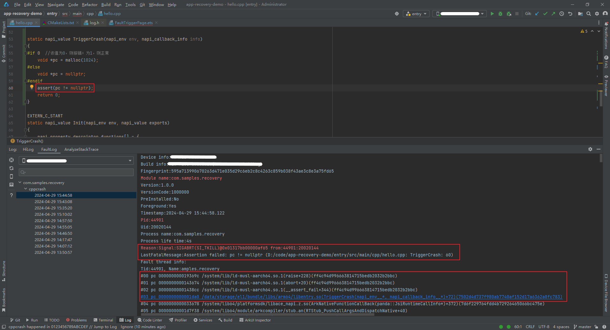

### Analyzing CppCrash Based on Scenarios

#### Type 1: Memory Access Crash

**Background**

The crash address **0x7f82764b70** is in the readable and executable segment of **libace_napi_ark.z.so**. The cause is that the address needs to be written, but the corresponding **maps** segment has only the read and execute permissions. In other words, when a process attempts to access a memory area that is not allowed to be accessed, the process crashes.

```text
7f82740000-7f8275c000 r--p 00000000 /system/lib64/libace_napi_ark.z.so
7f8275c000-7f8276e000 r-xp 0001b000 /system/lib64/libace_napi_ark.z.so <- The crash address locates within this address range.
7f8276e000-7f82773000 r--p 0002c000 /system/lib64/libace_napi_ark.z.so
7f82773000-7f82774000 rw-p 00030000 /system/lib64/libace_napi_ark.z.so
```

The following figure shows the crash call stack.


**Fault Analysis**

This address error is regular, but it is abnormal that the node address fall in **libace_napi_ark.z.so**. In this case, this may be memory corruption error. You can use [ASan Check](https://developer.huawei.com/consumer/cn/doc/harmonyos-guides-V5/ide-asan-V5) to locate the memory corruption error. By performing stress tests to reproduce the problem, ASan can also be used to find the regular crash scenario. The fault detected by ASan is the same as that in the crash stack above. The stack reports **heap-use-after-free**, which was actually a double free of the same address. During the second free operation, the address is used to access to its object member, resulting in a UAF fault. 
The key logs of ASan are as follows:

```text
=================================================================
==appspawn==2029==ERROR: AddressSanitizer: heap-use-after-free on address 0x003a375eb724 at pc 0x002029ba8514 bp 0x007fd8175710 sp 0x007fd8175708
READ of size 1 at 0x003a375eb724 thread T0 (thread name)
    # 0 0x2029ba8510  (/system/asan/lib64/platformsdk/libark_jsruntime.so+0xca8510) panda::ecmascript::Node::IsUsing() const at arkcompiler/ets_runtime/ecmascript/ecma_global_storage.h:82:16
(inlined by) panda::JSNApi::DisposeGlobalHandleAddr(panda::ecmascript::EcmaVM const*, unsigned long) at arkcompiler/ets_runtime/ecmascript/napi/jsnapi.cpp:749:67 BuildID[md5/uuid]=9a18e2ec0dc8a83216800b2f0dd7b76a
    # 1 0x403ee94d30  (/system/asan/lib64/libace.z.so+0x6194d30) panda::CopyableGlobal<panda::ObjectRef>::Free() at arkcompiler/ets_runtime/ecmascript/napi/include/jsnapi.h:1520:9
(inlined by) panda::CopyableGlobal<panda::ObjectRef>::Reset() at arkcompiler/ets_runtime/ecmascript/napi/include/jsnapi.h:189:9
(inlined by) OHOS::Ace::Framework::JsiType<panda::ObjectRef>::Reset() at foundation/arkui/ace_engine/frameworks/bridge/declarative_frontend/engine/jsi/jsi_types.inl:112:13
(inlined by) OHOS::Ace::Framework::JsiWeak<OHOS::Ace::Framework::JsiObject>::~JsiWeak() at foundation/arkui/ace_engine/frameworks/bridge/declarative_frontend/engine/jsi/jsi_ref.h:167:16
(inlined by) OHOS::Ace::Framework::ViewFunctions::~ViewFunctions() at foundation/arkui/ace_engine/frameworks/bridge/declarative_frontend/jsview/js_view_functions.h:44:5 BuildID[md5/uuid]=1330f8b9be73bdb76ae18107c2a60ca1
    # 2 0x403ee9296c  (/system/asan/lib64/libace.z.so+0x619296c) OHOS::Ace::Framework::ViewFunctions::~ViewFunctions() at foundation/arkui/ace_engine/frameworks/bridge/declarative_frontend/jsview/js_view_functions.h:42:5
(inlined by) OHOS::Ace::Framework::ViewFunctions::~ViewFunctions() at foundation/arkui/ace_engine/frameworks/bridge/declarative_frontend/jsview/js_view_functions.h:42:5 BuildID[md5/uuid]=1330f8b9be73bdb76ae18107c2a60ca1
    # 3 0x403ed9b130  (/system/asan/lib64/libace.z.so+0x609b130) OHOS::Ace::Referenced::DecRefCount() at foundation/arkui/ace_engine/frameworks/base/memory/referenced.h:76:13
(inlined by) OHOS::Ace::RefPtr<OHOS::Ace::Framework::ViewFunctions>::~RefPtr() at foundation/arkui/ace_engine/frameworks/base/memory/referenced.h:148:22 BuildID[md5/uuid]=1330f8b9be73bdb76ae18107c2a60ca1
    # 4 0x403ed9b838  (/system/asan/lib64/libace.z.so+0x609b838) OHOS::Ace::RefPtr<OHOS::Ace::Framework::ViewFunctions>::Reset() at foundation/arkui/ace_engine/frameworks/base/memory/referenced.h:163:9
(inlined by) OHOS::Ace::Framework::JSViewFullUpdate::~JSViewFullUpdate() at foundation/arkui/ace_engine/frameworks/bridge/declarative_frontend/jsview/js_view.cpp:159:21 BuildID[md5/uuid]=1330f8b9be73bdb76ae18107c2a60ca1
    # 5 0x403ed9bf24  (/system/asan/lib64/libace.z.so+0x609bf24) OHOS::Ace::Framework::JSViewFullUpdate::~JSViewFullUpdate() at foundation/arkui/ace_engine/frameworks/bridge/declarative_frontend/jsview/js_view.cpp:157:1
(inlined by) OHOS::Ace::Framework::JSViewFullUpdate::~JSViewFullUpdate() at foundation/arkui/ace_engine/frameworks/bridge/declarative_frontend/jsview/js_view.cpp:157:1 BuildID[md5/uuid]=1330f8b9be73bdb76ae18107c2a60ca1
...
freed by thread T0 (thread name) here:
    # 0 0x2024ed3abc  (/system/asan/lib64/libclang_rt.asan.so+0xd3abc)
    # 1 0x2029ba8424  (/system/asan/lib64/platformsdk/libark_jsruntime.so+0xca8424) std::__h::__function::__value_func<void (unsigned long)>::operator()[abi:v15004](unsigned long&&) const at prebuilts/clang/ohos/linux-x86_64/llvm/bin/../include/libcxx-ohos/include/c++/v1/__functional/function.h:512:16
(inlined by) std::__h::function<void (unsigned long)>::operator()(unsigned long) const at prebuilts/clang/ohos/linux-x86_64/llvm/bin/../include/libcxx-ohos/include/c++/v1/__functional/function.h:1197:12
(inlined by) panda::ecmascript::JSThread::DisposeGlobalHandle(unsigned long) at arkcompiler/ets_runtime/ecmascript/js_thread.h:604:9
(inlined by) panda::JSNApi::DisposeGlobalHandleAddr(panda::ecmascript::EcmaVM const*, unsigned long) at arkcompiler/ets_runtime/ecmascript/napi/jsnapi.cpp:752:24 BuildID[md5/uuid]=9a18e2ec0dc8a83216800b2f0dd7b76a
    # 2 0x403ee94b68  (/system/asan/lib64/libace.z.so+0x6194b68) panda::CopyableGlobal<panda::FunctionRef>::Free() at arkcompiler/ets_runtime/ecmascript/napi/include/jsnapi.h:1520:9
(inlined by) panda::CopyableGlobal<panda::FunctionRef>::Reset() at arkcompiler/ets_runtime/ecmascript/napi/include/jsnapi.h:189:9
(inlined by) OHOS::Ace::Framework::JsiType<panda::FunctionRef>::Reset() at foundation/arkui/ace_engine/frameworks/bridge/declarative_frontend/engine/jsi/jsi_types.inl:112:13
(inlined by) OHOS::Ace::Framework::JsiWeak<OHOS::Ace::Framework::JsiFunction>::~JsiWeak() at foundation/arkui/ace_engine/frameworks/bridge/declarative_frontend/engine/jsi/jsi_ref.h:167:16
(inlined by) OHOS::Ace::Framework::ViewFunctions::~ViewFunctions() at foundation/arkui/ace_engine/frameworks/bridge/declarative_frontend/jsview/js_view_functions.h:44:5 BuildID[md5/uuid]=1330f8b9be73bdb76ae18107c2a60ca1
    # 3 0x403ee9296c  (/system/asan/lib64/libace.z.so+0x619296c) OHOS::Ace::Framework::ViewFunctions::~ViewFunctions() at foundation/arkui/ace_engine/frameworks/bridge/declarative_frontend/jsview/js_view_functions.h:42:5
(inlined by) OHOS::Ace::Framework::ViewFunctions::~ViewFunctions() at foundation/arkui/ace_engine/frameworks/bridge/declarative_frontend/jsview/js_view_functions.h:42:5 BuildID[md5/uuid]=1330f8b9be73bdb76ae18107c2a60ca1
    # 4 0x403ed9b130  (/system/asan/lib64/libace.z.so+0x609b130) OHOS::Ace::Referenced::DecRefCount() at foundation/arkui/ace_engine/frameworks/base/memory/referenced.h:76:13
(inlined by) OHOS::Ace::RefPtr<OHOS::Ace::Framework::ViewFunctions>::~RefPtr() at foundation/arkui/ace_engine/frameworks/base/memory/referenced.h:148:22 BuildID[md5/uuid]=1330f8b9be73bdb76ae18107c2a60ca1
...
previously allocated by thread T0 (thread name) here:
    # 0 0x2024ed3be4  (/system/asan/lib64/libclang_rt.asan.so+0xd3be4)
    # 1 0x2029ade778  (/system/asan/lib64/platformsdk/libark_jsruntime.so+0xbde778) panda::ecmascript::NativeAreaAllocator::AllocateBuffer(unsigned long) at arkcompiler/ets_runtime/ecmascript/mem/native_area_allocator.cpp:98:17 BuildID[md5/uuid]=9a18e2ec0dc8a83216800b2f0dd7b76a
    # 2 0x2029a39064  (/system/asan/lib64/platformsdk/libark_jsruntime.so+0xb39064) std::__h::enable_if<!std::is_array_v<panda::ecmascript::NodeList<panda::ecmascript::WeakNode>>, panda::ecmascript::NodeList<panda::ecmascript::WeakNode>*>::type panda::ecmascript::NativeAreaAllocator::New<panda::ecmascript::NodeList<panda::ecmascript::WeakNode>>() at arkcompiler/ets_runtime/ecmascript/mem/native_area_allocator.h:61:19
(inlined by) unsigned long panda::ecmascript::EcmaGlobalStorage<panda::ecmascript::Node>::NewGlobalHandleImplement<panda::ecmascript::WeakNode>(panda::ecmascript::NodeList<panda::ecmascript::WeakNode>**, panda::ecmascript::NodeList<panda::ecmascript::WeakNode>**, unsigned long) at arkcompiler/ets_runtime/ecmascript/ecma_global_storage.h:565:34
(inlined by) panda::ecmascript::EcmaGlobalStorage<panda::ecmascript::Node>::SetWeak(unsigned long, void*, void (*)(void*), void (*)(void*)) at arkcompiler/ets_runtime/ecmascript/ecma_global_storage.h:455:26 BuildID[md5/uuid]=9a18e2ec0dc8a83216800b2f0dd7b76a
    # 3 0x2029ba5620  (/system/asan/lib64/platformsdk/libark_jsruntime.so+0xca5620) std::__h::__function::__value_func<unsigned long (unsigned long, void*, void (*)(void*), void (*)(void*))>::operator()[abi:v15004](unsigned long&&, void*&&, void (*&&)(void*), void (*&&)(void*)) const at prebuilts/clang/ohos/linux-x86_64/llvm/bin/../include/libcxx-ohos/include/c++/v1/__functional/function.h:512:16
(inlined by) std::__h::function<unsigned long (unsigned long, void*, void (*)(void*), void (*)(void*))>::operator()(unsigned long, void*, void (*)(void*), void (*)(void*)) const at prebuilts/clang/ohos/linux-x86_64/llvm/bin/../include/libcxx-ohos/include/c++/v1/__functional/function.h:1197:12
(inlined by) panda::ecmascript::JSThread::SetWeak(unsigned long, void*, void (*)(void*), void (*)(void*)) at arkcompiler/ets_runtime/ecmascript/js_thread.h:610:16
(inlined by) panda::JSNApi::SetWeak(panda::ecmascript::EcmaVM const*, unsigned long) at arkcompiler/ets_runtime/ecmascript/napi/jsnapi.cpp:711:31 BuildID[md5/uuid]=9a18e2ec0dc8a83216800b2f0dd7b76a
...
```

Continue the analysis based on the stack.
When **JsiWeak** is destructed or reset, **CopyableGlobal** in the parent class **JsiType** of its member (**JsiObject**/**JsiValue**/**JsiFunction**) is released, as shown in the following figure.

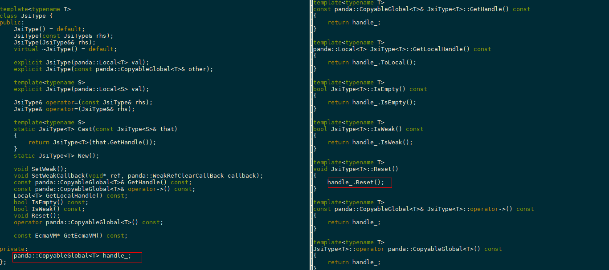

During Garbage Collection (GC), **IterateWeakEcmaGlobalStorage** calls **DisposeGlobalHandle** on **WeakNode** without a callback, and releases it, as shown in the following figure.

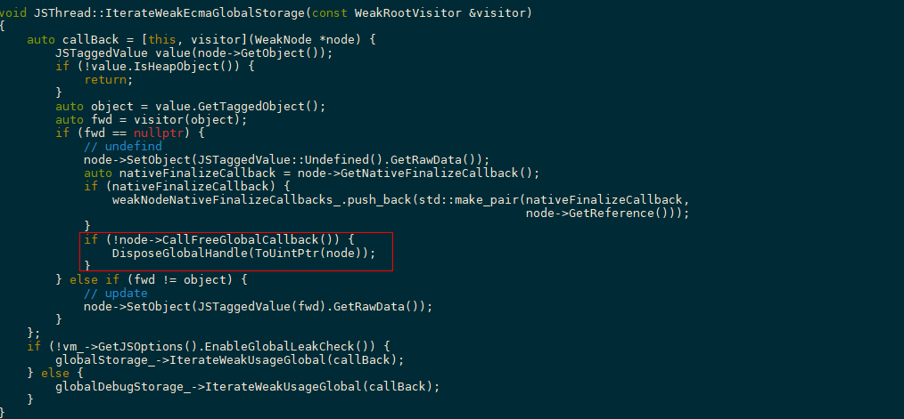

Therefore, for the same **WeakNode**, there may be two functions for release. If **IterateWeakEcmaGlobalStorage** releases it first during GC, without a callback notification to **JsiWeak** for cleanup, **JsiWeak** still retains a reference **CopyableGlobal** to the released **WeakNode**. When the **NodeList** containing the **WeakNode** is released and returned to the operating system, the retained **CopyableGlobal** in **JsiWeak** is released again, leading to a double-free error. 

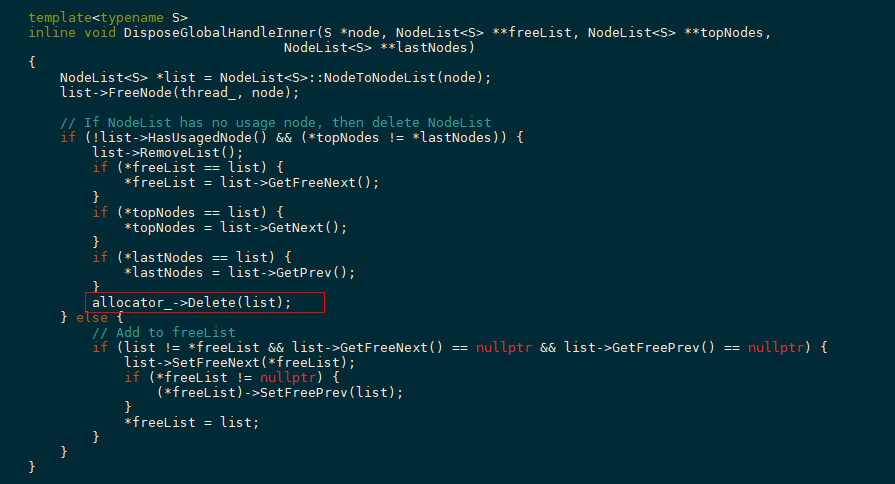

**Solutions**

Invoke a callback when **JsiWeak** calls **SetWeakCallback**. Therefore, the callback can notify **JsiWeak** to reset **CopyableGlobal** when **IterateWeakEcmaGlobalStorage** releases the **WeakNode**, ensuring the same address is not double-freed.

**Suggestions**

When using memory, consider whether the memory is double-freed or not freed. Additionally, when locating memory access crashes (usually **SIGSEGV** crashes), run the ASan to reproduce the fault if there is no clue based on the crash stack analysis.

#### Type 2: Multi-thread Crash

**Background**

**napi_env** is still used after being released.

**Symptom**

The **env** of a **napi** API is invalid. The crash stack is mounted to **NativeEngineInterface::ClearLastError()**. Based on the log of **env** address, it is found that the **env** is used after being released.

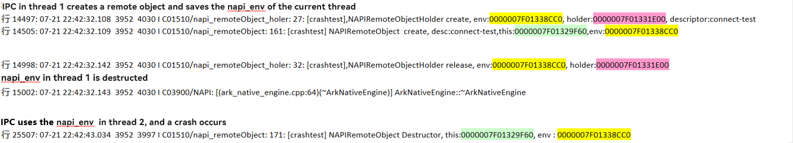

The key crash stack is as follows.

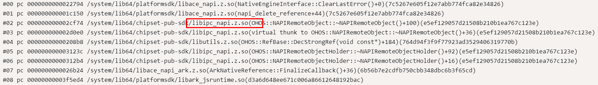

**Solutions**

The **env** created by a thread should not be transferred to another thread.

**Suggestions**

You can select the **Multi Thread Check** option to locate multi thread faults. For details, see "Ark Multi Thread Check" in guideline.

Note: **env** in the **napi** interface is the **arkNativeEngine** when the engine is created.

#### Type 3: Lifecycle Crash

**Background**

When you create a native **napi_value**, it needs to be used with **napi_handle_scope**. The **napi_handle_scope** is used to manage the lifecycle of **napi_value**. **napi_value** can be used only within **napi_handle_scope**, otherwise, the lifecycle of **napi_value** and its JS objects is no longer protected. If the reference count is 0, **napi_value** is collected by GC. Using **napi_value** at this point indicates accessing freed memory, which results in faults. 

**Symptom**

**napi_value** is a raw pointer (a struct pointer). It is used to hold JS objects and maintain the lifecycle of JS objects to ensure that JS objects are not collected by GC. **napi_handle_scope** is used to manage **napi_value**. Once out of **napi_handle_scope**, **napi_value** is collected by GC, and **napi_value** no longer holds the JS object (no longer protects the JS object's lifecycle)

**Fault Analysis**

By decompiling the crash stack, the upper-level interface of the problematic **napi** interface can be located, in which the problematic **napi_value** can be found. In this case, you need to check if the **napi_value** is used out of **napi_handle_scope**. 

**Cases**

The **napi_value** is used out of the scope of the NAPI framework.

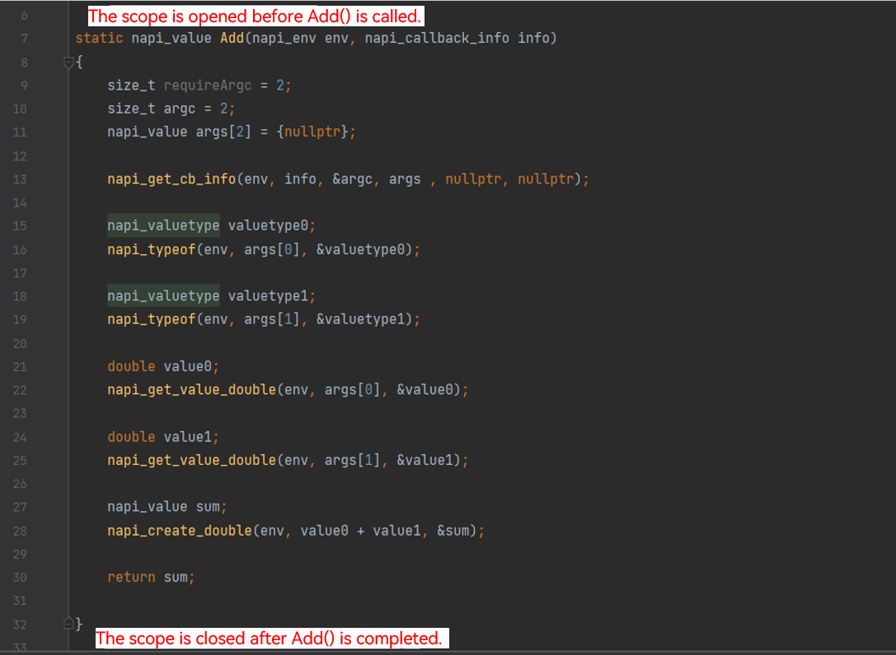

On the JS side, data is added using the **Add()**, and on the native side, **napi_value** is saved to a **vector**. On the JS side, data is obtained using the **get** API, and on the native side, the saved **napi_value** is returned as an array. The JS side then reads the properties of the data. The error message "Can not get Prototype on non ECMA Object" is displayed. The **native_value** across **napi** is not saved using **napi_ref**. As a result, the **native_value** is invalid.
Note: The scope of the NAPI framework is **napi_handle_scope**. You can use **napi_handle_scope** to manage the lifecycle of **napi_value**. The scope of the framework layer is embedded in the end-to-end process of the JS call native. That is, the scope is opened when the native method is entered, and the scope is closed when the native method ends.

#### Type 4: Pointer Crash

**Background**

Smart pointers are used without null checks, causing null pointer dereference crashes during process execution. 

**Impact**

The process crashes, causing unexpected exit.

**Fault Analysis**


Null pointer crashes can be identified based on the fault cause. Run the llvm-addr2line command to parse the line number. It is found that the service code does not check whether the smart pointer is null before using it. As a result, the service code accesses the null address, causing the crash.

**Solution**

Add protective null checks for the pointer. 

**Suggestions**

Pointers should be null-checked before using it to prevent null pointers and process crashes and exits.

### Analyzing CppCrash Based on Tools

#### Tool 1: ASAN

[ASan Check](https://developer.huawei.com/consumer/cn/doc/harmonyos-guides-V5/ide-asan-V5)

#### Tool 2: Ark Multi Thread Check

**Fundamentals**

JS is single-threaded. Operations on JS objects can be performed only on the JS thread. Otherwise, multi-thread security problems may occur. (JS objects created on the main thread can be operated only on the main thread, and JS objects created on the worker thread can be operated only on the worker thread.) The napi APIs involve object operations. Therefore, 95% napi APIs can be used only on the JS thread. The multi-thread detection mechanism checks whether the **JS thread ID** of the calling thread is the same as that of the used **VM/Env**. If they are different, the **VM/Env** is used across threads, causing multi-thread security problems. Common problems: 1. Napi APIs are used in non-JS threads. 2. **env** of other threads are used in napi APIs.

**How to Use**


Select **Multi Thread Check** on DevEco to enable Ark multi-thread detection.

**Scenario**

If the stack of crash logs is difficult to analyze and the probability of this problem is high, you need to enable multi-thread detection. When the multi-thread detection is enabled, if the fatal information in the **cpp_crash** log is "Fatal: ecma_vm cannot run in multi-thread! thread:3096 currentThread:3550", it indicates that a multi-thread security problem occurs. That is, the calling thread ID is **3550**, but the JS thread is created by thread **3096**. The **vm** is used across threads.

**Cases**

After the function is enabled, the crash is triggered again. If the problem is caused by multiple threads, fatal information is displayed. The following is an example:

```text
Fatal: ecma_vm cannot run in multi-thread! thread:xxx currentThread:yyy
```

The preceding information indicates that the calling thread ID is **17585**, but the JS thread is created by thread **17688**. The **vm** is used across threads. The **vm** is the **napi_env__*** of the JS thread. It is the environment for running thread code. One thread uses one **vm**.
The key crash log is as follows:

```text
Reason:Signal:SIGABRT(SI_TKILL)@0x01317b9f000044b1 from:17585: 20020127
LastFatalMessage: [default] CheckThread:177 Fatal: ecma_vm cannot run in multi-thread! thread:17688 currentThread:17585
Fault thread Info:
Tid:17585, Name:xxxxx
# 00 pc 00000000000f157c /system/lib/ld-musl-aarch64-asan.so.1(__restore_sigs+52)(38eb4ca904ae601d4b4dca502e948960)
# 01 pc 00000000000f1800 /system/lib/ld-musl-aarch64-asan.so.1(raise+112) (38eb4ca904ae¨®01d4b4dca502e948960)
# 02 pc 00000000000adc74 /system/lib/ld-musl-aarch64-asan.so.1(abort.+20) (38eb4ca904ae601d4b4dca502e948960)
# 03 pc 0000000000844fdc /system/asan/lib¨®4/platformsdk/libark_jsruntime.so(panda::ecmascript::EcmaVM::CheckThread() const+2712)(1df055932338c14060b864435aec88ab)
# 04 pc 0000000000f3d930 /system/asan/lib¨®4/platformsdk/libark_jsruntime.so(panda::0bjectRef:: New(panda::ecmascript::EcmaVM const*)+908)(1df055932338c14060b864435aec88
# 05 pC 0000000000095048 /sYstem/asan/lib64/platformsdk/libace_napi.z.so(napi_create_object+80)(efc1b3d1378f56b4b800489fb30dcded)
# 06 pc 00000000005d9770 /data/ storage/el1/bundle/libs/arm64/xxxxx.so (c0f1735eada49fadc5197745f5afOc0a52246270)
```

To analyze the multi-thread problem, perform the following steps:
i. Check the first stack frame under **libace_napi.z.so**. The preceding figure shows **xxxxx.so**. Check whether the **napi_env** of thread **17688** is transferred to thread **17585**.
ii. If the stack frame under **libace_napi.z.so** does not transfer the **napi_env** parameter, check whether the parameter is transferred as a struct member variable.

#### Tool 3: objdump

**How to Use**

objdump binary is a system tool. You must have the OpenHarmony compilation environment, whose project code can be obtained from Gitee. The command is as follows:

```text
repo init -u git@gitee.com:openharmony/manifest.git -b master --no-repo-verify --no-clone-bundle --depth=1
repo sync -c
./build/prebuilts_download.sh
```

You can obtain the tool in `prebuilts/clang/ohos/linux-x86_64/llvm/bin/llvm-objdump` of the project. The command is as follows:

```text
prebuilts/clang/ohos/linux-x86_64/llvm/bin/llvm-objdump -d libark_jsruntime.so > dump.txt
```

**Scenario**

In some cases, addr2line can only be used to check whether a line of the code is faulty but cannot determine which variable is abnormal. In this case, you can use objdump to disassemble the code and combine the information from the cppcrash register to further determine the crash cause.

**Cases**

The log is as follows:

```text
Tid:6655, Name:GC_WorkerThread
# 00 pc 00000000004492d4 /system/lib64/platformsdk/libark_jsruntime.so(panda::ecmascript::NonMovableMarker::MarkObject(unsigned int, panda::ecmascript::TaggedObject*)+124)(21cf5411626d5986a4ba6383e959b3cc)
# 01 pc 000000000044b580 /system/lib64/platformsdk/libark_jsruntime.so(panda::ecmascript::NonMovableMarker::MarkValue(unsigned int, panda::ecmascript::ObjectSlot&, panda::ecmascript::Region*, bool)+72)(21cf5411626d5986a4ba6383e959b3cc)
# 02 pc 000000000044b4e8 /system/lib64/platformsdk/libark_jsruntime.so(std::__h::__function::__func<panda::ecmascript::NonMovableMarker::ProcessMarkStack(unsigned int)::$_2, std::__h::allocator<panda::ecmascript::NonMovableMarker::ProcessMarkStack(unsigned int)::$_2>, void (panda::ecmascript::TaggedObject*, panda::ecmascript::ObjectSlot, panda::ecmascript::ObjectSlot, panda::ecmascript::VisitObjectArea)>::operator()(panda::ecmascript::TaggedObject*&&, panda::ecmascript::ObjectSlot&&, panda::ecmascript::ObjectSlot&&, panda::ecmascript::VisitObjectArea&&)+256)(21cf5411626d5986a4ba6383e959b3cc)
# 03 pc 0000000000442ac0 /system/lib64/platformsdk/libark_jsruntime.so(void panda::ecmascript::ObjectXRay::VisitObjectBody<(panda::ecmascript::VisitType)1>(panda::ecmascript::TaggedObject*, panda::ecmascript::JSHClass*, std::__h::function<void (panda::ecmascript::TaggedObject*, panda::ecmascript::ObjectSlot, panda::ecmascript::ObjectSlot, panda::ecmascript::VisitObjectArea)> const&)+216)(21cf5411626d5986a4ba6383e959b3cc)
# 04 pc 0000000000447ccc /system/lib64/platformsdk/libark_jsruntime.so(panda::ecmascript::NonMovableMarker::ProcessMarkStack(unsigned int)+248)(21cf5411626d5986a4ba6383e959b3cc)
# 05 pc 0000000000438588 /system/lib64/platformsdk/libark_jsruntime.so(panda::ecmascript::Heap::ParallelGCTask::Run(unsigned int)+148)(21cf5411626d5986a4ba6383e959b3cc)
# 06 pc 00000000004e31c8 /system/lib64/platformsdk/libark_jsruntime.so(panda::ecmascript::Runner::Run(unsigned int)+144)(21cf5411626d5986a4ba6383e959b3cc)
# 07 pc 00000000004e3780 /system/lib64/platformsdk/libark_jsruntime.so(void* std::__h::__thread_proxy[abi:v15004]<std::__h::tuple<std::__h::unique_ptr<std::__h::__thread_struct, std::__h::default_delete<std::__h::__thread_struct>>, void (panda::ecmascript::Runner::*)(unsigned int), panda::ecmascript::Runner*, unsigned int>>(void*)+64)(21cf5411626d5986a4ba6383e959b3cc)
# 08 pc 000000000014d894 /system/lib/ld-musl-aarch64.so.1
# 09 pc 0000000000085d04 /system/lib/ld-musl-aarch64.so.1
```

Run the addr2line command to locate the error line.

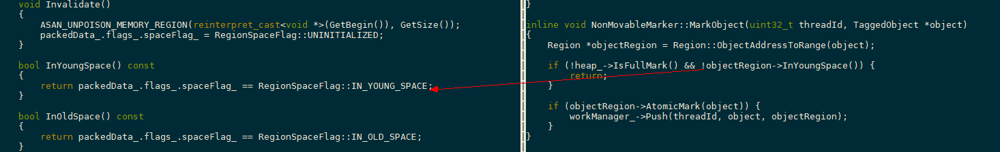

The preceding information indicates that a null pointer is accessed and the process is suspended when **InYoungSpace** is accessed. Therefore, it can be suspected that the **Region** is a null pointer.
Use objdump to disassemble and search for the error address **4492d4**. The command is as follows:

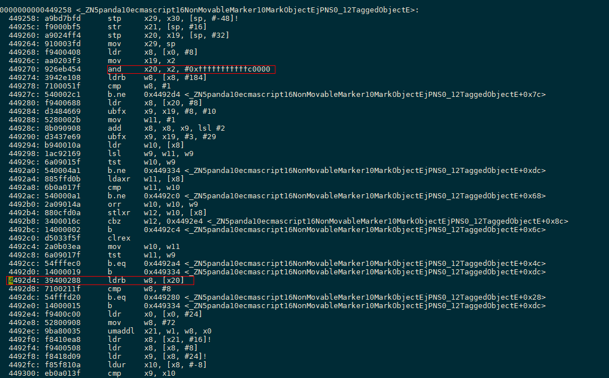

Check the **x20** register, and the value is **0x000000000000000**. The preceding information shows that **x20** performs bitwise operation based on **x2** (the last 18 bits are cleared, which is a typical **Region::ObjectAddressToRange** operation). The analysis shows that **x2** is the second parameter object of the **MarkObject** function, and **x20** is the variable **objectRegion**.

```text
Registers: x0:0000007f0fe31560 x1:0000000000000003 x2:0000000000000000 x3:0000005593100000
        x4:0000000000000000 x5:0000000000000000 x6:0000000000000000 x7:0000005596374fa0
        x8:0000000000000000 x9:0000000000000000 x10:0000000000000000 x11:0000007f9cb42bb8
        x12:000000000000005e x13:000000000061f59e x14:00000005d73d60fb x15:0000000000000000
        x16:0000007f9cc5f200 x17:0000007f9f201f68 x18:0000000000000000 x19:0000000000000000
        x20:0000000000000000 x21:0000000000000000 x22:0000000000000000 x23:000000559313f860
        x24:000000559313f868 x25:0000000000000003 x26:00000055a0e19960 x27:0000007f9cc57b38
        x28:0000007f9f21a1c0 x29:00000055a0e19700 lr:0000007f9cb4b584 sp:00000055a0e19700 pc:0000007f9cb492d4
```

**ldrb w8, [x20]** corresponds to **packedData_.flags_.spaceFlag_** because **packedData_** is the first field of **region**, **flags_** is the first field of **packedData_**, and **spaceFlag_** is the first field of **flags_**. Therefore, the first byte corresponding to the **objectRegion** address is used.
To view assembly code, you need to be familiar with common assembly instructions and parameter transfer rules. For example, the non-inline member function **r0** in C++ stores the **this** pointer. In addition, due to compiler optimization, the mapping between source code and assembly code may not be clear. The mapping can be quickly obtained based on some feature values (constants) in the code.
